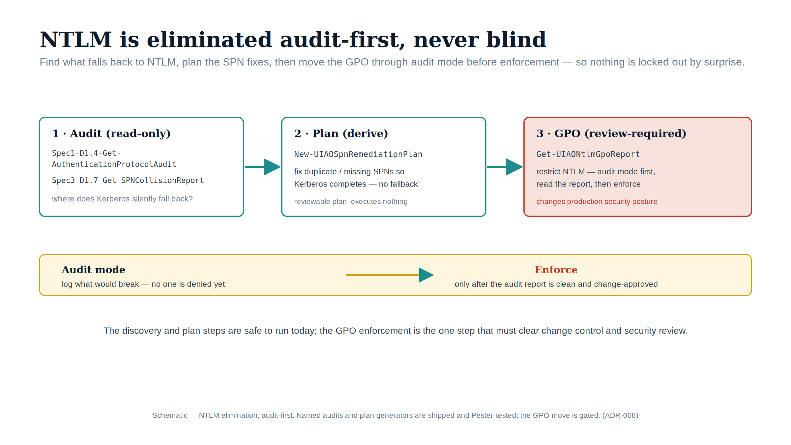

::: {.content-visible when-format="docx"}
# Implementation Book 06 — NTLM Detection & Remediation
:::

{#fig-impl-book06 fig-alt="A schematic on a white background. Three stages flow left to right under teal arrows: '1 · Audit (read-only)' listing Spec1-D1.4-Get-AuthenticationProtocolAudit and Spec3-D1.7-Get-SPNCollisionReport; '2 · Plan (derive)' showing New-UIAOSpnRemediationPlan; and a red-bordered '3 · GPO (review-required)' showing Get-UIAONtlmGpoReport. Below, an amber band runs from 'Audit mode — log what would break' to a red 'Enforce — only after the audit report is clean and change-approved'. Federal navy, teal, amber and red palette; no photographs." width="100%"}

::: {.callout-tip}
## Download this book
**[Book_06.docx](Book_06.docx)** — this entire book as a single Word document, images included. Regenerated on every site deploy.
:::

::: {.callout-note}
Companion to **narrative Book 06**. The narrative explains why NTLM is a protocol and not a switch; this book is the detect-then-remediate runbook. **Detection is read-only and backed by shipped scripts. Remediation changes production** — SPNs, linked servers, and Group Policy — and is marked review-required throughout. (ADR-068, UIAO_135 §3.2)
:::

## The shape of the problem

SQL Server falls back to NTLM whenever Kerberos cannot complete: a missing or duplicated `MSSQLSvc` SPN, a client that cannot reach a KDC, linked-server passthrough, or a non-domain-joined host. You cannot remediate what you have not detected, so this book is two phases: **detect** (run-first, read-only) then **remediate** (review-required, audit/`-WhatIf` first).

## Phase 1 — Detection (read-only)

### `Spec1-D1.5-Get-KerberosSPNInventory.ps1` — the SPN map

Catalogs every SPN, flags duplicates and orphans, and assigns a per-service-class migration target. For SQL the relevant service class is `MSSQLSvc`.

| Parameter | Type | Default | Purpose |
|---|---|---|---|
| `-OutputPath` | string | `.\output` | Output directory |
| `-DomainController` | string | — | Target a specific DC |
| `-SearchBase` | string | — | Optional AD search base (DN) |
| `-D4InputFile` | string | — | Spec1-D1.4 audit JSON, for delegation cross-reference |
| `-ResolveDNS` | switch | off | Resolve each SPN hostname (slow on large estates) |

Output: `*.json` (`Summary`, `SPNs[]`, `Duplicates[]`, `Orphans[]`) plus `*.csv` and, when duplicates exist, `*_duplicates.csv`. Each SPN record includes `IsOrphan`, `DaysSinceLogon`, `HasDelegation`, and a `MigrationTarget` (`MSSQLSvc` → *"Entra ID auth for SQL 2022+ via Arc"*). A **missing** `MSSQLSvc` SPN is the most common silent-NTLM root cause; a **duplicate** is the second.

### `Spec3-D1.7-Get-SPNCollisionReport.ps1` — what breaks Kerberos

Consumes the D1.5 inventory (or queries live) and classifies collisions that force NTLM fallback.

| Parameter | Type | Default | Purpose |
|---|---|---|---|
| `-OutputPath` | string | `.\output` | Output directory |
| `-D5InputFile` | string | — | The Spec1-D1.5 SPN-inventory JSON (omit to query AD live) |
| `-DomainController` / `-SearchBase` | string | — | Live-query targeting |
| `-ResolveDNS` | switch | off | Detect DNS-alias collisions |
| `-IncludeForestWide` | switch | off | Cross-domain collisions across the forest |

It detects five collision types — **exact duplicate**, **case-insensitive**, **port-variant**, **cross-object-type** (same SPN on a computer *and* a user object), and **DNS alias** — and emits `*_collisions.csv` plus a `*_remediation.csv` action plan. Severity is **CRITICAL** when two or more *enabled* accounts hold the same SPN, or for a cross-object-type collision.

### `Spec1-D1.4-Get-AuthenticationProtocolAudit.ps1` — NTLM indicators & delegation

Finds the delegation configurations (unconstrained, KCD, RBCD) and NTLM dependency indicators (Protected Users membership, Authentication Policies / Silos) that shape what can move to Kerberos. Output: `*_findings.csv` and `*_chains.csv`, each finding carrying a `Risk` and a `Remediation`.

```powershell
# Detection pass for SQL NTLM — run in order, read-only
./Spec1-D1.5-Get-KerberosSPNInventory.ps1 -OutputPath .\output
./Spec3-D1.7-Get-SPNCollisionReport.ps1 -D5InputFile .\output\*KerberosSPNInventory.json -OutputPath .\output
./Spec1-D1.4-Get-AuthenticationProtocolAudit.ps1 -OutputPath .\output
```

## Phase 2 — Remediation (review-required patterns)

::: {.callout-warning}
## These change production
SPN edits, linked-server reconfiguration, and Group Policy changes alter live authentication. The remediation **planning** is now shipped and **audit-first**: `New-UIAOSpnRemediationPlan` and `Get-UIAONtlmGpoReport` (`tools/powershell/UIAOSqlServerMigration/`) emit reviewable plans and posture reports but enforce **nothing** — they run no `setspn` and set no GPO. The `setspn` and Group Policy patterns below remain the verified actions, to be run in a change window after the plan is reviewed. Validate each in audit mode, capture the planned change, and route it through change control and security review before enforcement.
:::

### Register a missing `MSSQLSvc` SPN

Use `-S` (not `-A`) so the registration is **rejected if it would collide** — this is the safe form:

```powershell
# host-based and FQDN, for the service account running the SQL service
setspn -S MSSQLSvc/sqlhost:1433 CONTOSO\svc-sql
setspn -S MSSQLSvc/sqlhost.contoso.gov:1433 CONTOSO\svc-sql
```

### Repair a collision

From the `*_remediation.csv`, remove the SPN from the **disabled or wrong** account, leaving exactly one enabled owner:

```powershell
setspn -D MSSQLSvc/sqlhost:1433 CONTOSO\old-or-disabled-account
```

A cross-object-type or 2+-enabled-account collision (severity CRITICAL) must be reduced to a single enabled owner before Kerberos will succeed.

**Available** — `New-UIAOSpnRemediationPlan` (`tools/powershell/UIAOSqlServerMigration/`) consumes the Spec3-D1.7 collision report and derives this minimal action set per collision: a `setspn -D` for each disabled/shadowing account, and — for a cross-object-type collision — a `setspn -D` of the user-object SPN plus a workload-identity migration recommendation (ADR-004). It can scope to `MSSQLSvc` with `-ServiceClassFilter` and emit the safe `setspn -S` registration preview for a **missing** SPN. Every action carries `mutating=true` / `requires_review=true` and a `command_preview`; the plan is the deliverable — it runs no `setspn`. (Canon: ADR-068, ADR-004, UIAO_135 §3.2.)

### Linked-server passthrough

Replace passthrough/impersonated security with a defined security context (or migrate the linked server to its own Entra-authenticated path) so the hop does not silently negotiate NTLM. Re-audit with D1.8 (`LinkedServers`) afterward.

### Phased Group Policy block (ties to ADR-068)

NTLM elimination is sequenced, not a single cutover:

- **Phase B — block NTLMv1.** Set *"Network security: LAN Manager authentication level"* to **"Send NTLMv2 response only. Refuse LM & NTLM."** This is the program's own deterministic block; it runs ahead of Microsoft's own NTLMv1-SSO enforcement default (which flips via Windows Update in October 2026), so the estate does not wait on the platform default.
- **Phase B — restrict NTLMv2** to documented exception groups via Group Policy.
- **Phase C — full block** at the program's **2027-04-01** backstop (the program's own planning date — *not* an external FedRAMP or Microsoft mandate; see narrative Book 06 and ADR-068).

**Available** — `Get-UIAONtlmGpoReport` (`tools/powershell/UIAOSqlServerMigration/`) reports each in-scope GPO's NTLM-reduction posture against this phased plan — classifying it `unconfigured` / `below_target` / `phase_b_ntlmv2_only` / `phase_c_full_block` from the LAN Manager authentication level and the Restrict NTLM settings — and records the 2027-04-01 date explicitly as the program backstop, not an external mandate. It is **read-only**: it audits posture and never calls `Set-GPRegistryValue` / `Set-GPO`, so the phased enforcement stays a reviewed change.

## Verification & rollback

- **Verify Kerberos** after SPN work: `klist purge` then connect, and `klist` to confirm a `MSSQLSvc` ticket was issued (no NTLM).
- **Re-run detection**: D1.7 should report zero CRITICAL collisions; D1.8's audit should show no NTLM fallback for the instance.
- **Rollback**: SPNs are reversible (`setspn -D` / re-add); GPO changes revert by restoring the prior LAN Manager level. Because the GPO block is the *last* step, the earlier Kerberos fixes can be validated long before anything is refused.

---

*Companion to [narrative Book 06](../sql-server-narrative/Book_06.qmd). Detection scripts: `tools/discovery/Spec1-D1.5`, `Spec3-D1.7`, `Spec1-D1.4`. Remediation planning (shipped, audit-first, enforces nothing): `tools/powershell/UIAOSqlServerMigration/` (`New-UIAOSpnRemediationPlan`, `Get-UIAONtlmGpoReport`); the `setspn` / GPO changes themselves stay review-required. Canon: ADR-068, ADR-004, UIAO_135 §3.2.*
