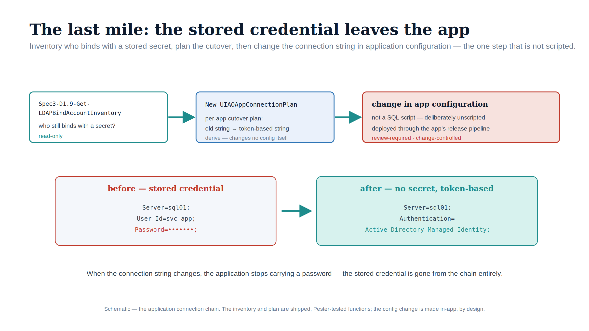

::: {.content-visible when-format="docx"}
# Implementation Book 08 — The Application Chain & Connection-String Migration
:::

{#fig-impl-book08 fig-alt="A schematic on a white background. A top row flows left to right under teal arrows: Spec3-D1.9-Get-LDAPBindAccountInventory (read-only), New-UIAOAppConnectionPlan (derive), and a red-bordered 'change in app configuration' box (not a SQL script; review-required). Below, a red 'before — stored credential' connection string (Server, User Id, Password) flows by teal arrow to a teal 'after — no secret, token-based' string (Server, Authentication=Active Directory Managed Identity). Federal navy, teal and red palette; no photographs." width="90%"}

::: {.callout-tip}
## Download this book
**[Book_08.docx](Book_08.docx)** — this entire book as a single Word document, images included. Regenerated on every site deploy.
:::

::: {.callout-note}
Companion to **narrative Book 08**. The narrative explains why an application that migrated its user auth to Entra but still reaches SQL with a stored service-account credential has not finished; this book is the runbook. **The LDAP-bind inventory is read-only and script-backed. The connection-string change touches production** and is review-required — tested against a production-equivalent stack first, then cut over through change control. (ADR-069, ADR-004)
:::

## The chain has two tracks

Every SQL-consuming application carries two independent migration tracks: the **user-authentication** track (how the user proves identity to the application) and the **SQL-connection** track (how the application proves identity to the database). This book is the SQL-connection track — the last mile — with the application classification that determines how it is sequenced.

## Phase 1 — Inventory the LDAP-bind dependency (read-only, script-backed)

### `Spec3-D1.9-Get-LDAPBindAccountInventory.ps1`

The shipped audit ([`tools/discovery/`](https://github.com/WhalerMike/uiao/tree/main/tools/discovery)) discovers the accounts performing LDAP binds against Active Directory — the hidden dependency layer invisible to SPN-based discovery. It is read-only.

| Parameter | Type | Default | Purpose |
|---|---|---|---|
| `-OutputPath` | string | `.\output` | JSON + CSV output directory |
| `-DomainController` | string | — | Target a specific DC for event-log queries; auto-discovery if omitted |
| `-SearchBase` | string | — | Optional AD search base (DN) |
| `-D1InputFile` | string | — | Spec3-D1.1 service-account scan JSON, for cross-reference/enrichment |
| `-EventLogHours` | int | `168` | Hours of event-log history to analyze (7 days) |
| `-IncludeDCLogs` | switch | off | Query Security event logs on DCs for LDAP bind events (4624 logon-type-8, 2889 unsigned bind, 2887 signing stats) |
| `-FirewallLogPath` | string | — | Optional firewall/netflow CSV for network-based discovery (DC ports 389/636/3268/3269) |

**Discovery methods:** account-attribute heuristics (password-never-expires + no SPN; name/description patterns `ldap`/`bind`/`svc`/`app`/`connector`; service-account OUs with no computer object), AD audit-log analysis (the event IDs above), optional netflow/firewall parsing, and optional DC LDAP diagnostic logging — cross-referenced against the D1.1 service-account scan.

### Output schema

Under `-OutputPath`: a `*_LDAPBindAccountInventory*.json` (`Summary` + the account array) and `*_accounts.csv`. Each account record carries `SamAccountName`, `DistinguishedName`, `DisplayName`, `Description`, `Enabled`, `PasswordNeverExpires`, `PasswordAgeDays`, `DaysSinceLogon`, `DiscoveryMethod`, **`LDAPBindConfidence`** (0–100), **`RiskClassification`** (Critical / High / Medium / Low), **`BindType`** (Simple / SASL / Anonymous; cleartext vs unsigned where event logs are available), `BindSecurity`, `SourceApplication`, **`MigrationTarget`**, and `RemediationPriority`. The `MigrationTarget` is computed toward ADR-003/ADR-004 destinations (API-driven provisioning via Graph, Managed Identity, or Service Principal) — the same workload-identity end state the SQL-connection track lands on.

```powershell
# Read-only LDAP-bind inventory — heuristics + DC event logs over 30 days
./Spec3-D1.9-Get-LDAPBindAccountInventory.ps1 -IncludeDCLogs -EventLogHours 720 -OutputPath .\output
# Enriched with the service-account scan
./Spec3-D1.9-Get-LDAPBindAccountInventory.ps1 -D1InputFile .\output\*D1.1*.json -OutputPath .\output
```

### What D1.9 does and does not give you

D1.9 inventories the **LDAP-bind accounts** and their risk and Graph-migration target. It does **not** record which SQL Server instance/database each application connects to, nor does it assign an ADR-069 class — those require correlation with the Book 03 `Spec3-D1.8` instance audit and with per-application modernization signals (SAML metadata URLs, OIDC discovery endpoints, vendor docs).

**`New-UIAOAppConnectionPlan`** (`tools/powershell/UIAOSqlServerMigration/`) is the correlation-and-classification pass. It joins the D1.9 bind-account inventory to the Book 03 `Spec3-D1.8` instance audit (matching each bind account to the SQL login it maps to, so the plan names the exact `correlated_sql_instances`), assigns each application an ADR-069 class — preferring the cleanest end-state, OIDC > SAML > App Proxy > Domain Services — from a supplied `-CapabilityMap` of observable signals (oidc / saml / reverse_proxy / vendor_locked), falling back to the D1.9 `MigrationTarget`, and for any app correlated to a SQL login emits the connection-string transformation that removes the stored credential. Apps with no capability signal and no `MigrationTarget` land in `review` rather than being mis-classified.

```powershell
Import-Module ./tools/powershell/UIAOSqlServerMigration
New-UIAOAppConnectionPlan `
    -LdapBindInventoryPath .\output\*LDAPBindAccountInventory*.json `
    -AuthAuditPath         .\output\sqlserver-auth-audit.json `
    -CapabilityMap         .\config\app-capabilities.json `
    -OutputPath            .\output\app-connection-plan.json
```

It is **read-only derivation** — every record is `mutating` + `requires_review`, and the function changes nothing; the connection-string change itself (Phase 2) stays the gated, in-config step below.

## The ADR-069 four-class triage

Each SQL-consuming application is classified into one of four classes, in strict preference order, and each class carries the same SQL-connection track (the user-auth track differs):

| Class | User-auth track | SQL-connection track | Note |
|---|---|---|---|
| **Class 3 — OIDC** (preferred) | Entra as OIDC IdP; full LDAP elimination | Managed Identity / service principal | target architecture — no AD, no LDAP, no stored secret |
| **Class 2 — SAML** | Entra as SAML IdP (ADR-051) | Managed Identity / service principal | eliminates LDAP, ranks below OIDC |
| **Class 1 — App Proxy** | Entra Application Proxy fronts the app (no code change) | Managed Identity / service principal | cannot modernize auth directly |
| **Class 4 — Entra Domain Services** (last resort) | managed AD-compatible domain | **blocked** — preserves AD dependency | host instance carries a documented exception with a sunset date |

The two tracks are independent and can sequence separately — but **both** must complete before the application's contribution to the transformation is fulfilled. A Class 4 application on an instance forces that instance to keep accepting Windows Authentication, which blocks the Entra-only posture UIAO_135 Transformation #7 requires; each such instance needs an exception with a sunset date reconciled against the 2027-04-01 block (Book 09).

## Phase 2 — Connection-string migration (review-required, the last mile)

::: {.callout-warning}
## The simplest change, the most gated
Technically the connection-string change is one keyword; operationally it is the most gate-controlled step in the program. `New-UIAOAppConnectionPlan` emits the per-application *plan* (which app, which instances, which target keyword), but the change itself is made in **application configuration** by deliberate choice — there is no script that rewrites a production connection string. Three gate conditions must hold first, and the cutover runs in a change window.
:::

### The change

The stored credential disappears. Windows Integrated Security or SQL Authentication becomes an Entra ID authentication keyword:

```text
# Before — credential invisible to the identity plane
Data Source=sqlhost;Initial Catalog=AppDb;Integrated Security=True
Data Source=sqlhost;Initial Catalog=AppDb;User ID=svc-app;Password=<stored>

# After — no stored secret
Data Source=sqlhost;Initial Catalog=AppDb;Authentication=Active Directory Managed Identity
Data Source=sqlhost;Initial Catalog=AppDb;Authentication=Active Directory Service Principal   # client id + Key Vault ref
Data Source=sqlhost;Initial Catalog=AppDb;Authentication=Active Directory Default             # preferred for new config
```

For an application on an Arc-enabled host with a system-assigned Managed Identity (Book 04), `Authentication=Active Directory Managed Identity` tells the driver to mint a token from the local IMDS endpoint rather than negotiate a Windows credential. For a service principal, supply the client ID and a credential **through an Azure Key Vault reference, not inline**.

### The three gate conditions

All three must hold before cutover:

1. The Entra ID **login already exists** on the target instance — the `FROM EXTERNAL PROVIDER` login from Book 05 (or the group-login from Book 07). A connection string naming an Entra identity with no corresponding login fails at connection time.
2. The application's Managed Identity / service principal **holds the appropriate database role**, so authentication succeeds and authorization follows.
3. The change has been **tested in a non-production environment whose Arc + SQL extension configuration matches production** — token acquisition and validation depend on that infrastructure. A change that works against a laptop but was never exercised against a production-equivalent Arc/extension stack is not a tested change.

### DefaultAzureCredential for .NET

For .NET applications, the `Azure.Identity` SDK's `DefaultAzureCredential` implements an ordered credential chain — Managed Identity via IMDS first (on the Arc-enabled host), then Azure CLI, Visual Studio, and environment-variable service-principal credentials. One credential code path then works unchanged across production (Managed Identity) and a developer's machine (Azure CLI). `Authentication=Active Directory Default` in `Microsoft.Data.SqlClient` 2.0+ delegates to this chain automatically and is the preferred form for new configurations — one keyword replaces an entire credential-management system, realizing the ADR-004 workload-identity model.

```csharp
// Equivalent explicit form when the keyword cannot be used
var cred = new DefaultAzureCredential();
var token = cred.GetToken(new TokenRequestContext(
    new[] { "https://database.usgovcloudapi.net/.default" }));   // GCC data-plane audience
using var conn = new SqlConnection("Data Source=sqlhost;Initial Catalog=AppDb");
conn.AccessToken = token.Token;
```

Note the **data-plane audience** (`https://database.usgovcloudapi.net/` in Azure Government) — the same audience-correctness point Book 04 makes about IMDS tokens; a management-plane token is refused by the SQL data plane.

## Verification & rollback

- **Verify** the application connects with `auth_scheme = AAD` (the same `sys.dm_exec_connections` / `sys.dm_exec_sessions` query Book 05 uses for the parallel-run window) and that **no** NTLM rows remain for it.
- **Rollback** is the prior connection string — keep the previous configuration and (per Book 05) the legacy login *disabled, not dropped*, so reverting is immediate. Cut over only after the gate conditions are met and the parallel observation is clean.

---

*Companion to [narrative Book 08](../sql-server-narrative/Book_08.qmd). Inventory script-backed: `tools/discovery/Spec3-D1.9`. Correlation + ADR-069 classification + connection-string plan: `tools/powershell/UIAOSqlServerMigration` (`New-UIAOAppConnectionPlan`). The connection-string change itself is a review-required, in-config step. Canon: ADR-069, ADR-051, ADR-004, UIAO_135 §3.2.*
