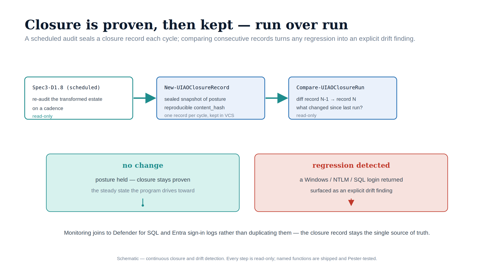

::: {.content-visible when-format="docx"}
# Implementation Book 09 — Continuous Monitoring & the CCM-BIR Closure Record
:::

{#fig-impl-book09 fig-alt="A schematic on a white background. A top row flows left to right under teal arrows: 'Spec3-D1.8 (scheduled)' (read-only), New-UIAOClosureRecord (sealed snapshot, reproducible content_hash), and Compare-UIAOClosureRun (diff record N-1 → record N). Below, two outcome panels: a teal 'no change — posture held, closure stays proven' and a red 'regression detected — a Windows / NTLM / SQL login returned, surfaced as an explicit drift finding'. Federal navy, teal and red palette; no photographs." width="100%"}

::: {.callout-tip}
## Download this book
**[Book_09.docx](Book_09.docx)** — this entire book as a single Word document, images included. Regenerated on every site deploy.
:::

::: {.callout-note}
Companion to **narrative Book 09**. The narrative explains that a transformation achieves a *posture*, not a completion; this book is how you keep proving it. **The audit that produces the evidence is read-only and shipped**, and so are the two derivations over it: `New-UIAOClosureRecord` projects each run onto the ADR-091 §5 closure field set, and `Compare-UIAOClosureRun` diffs two runs into drift events. The behavioral/MFA fields are reported as **external joins** (Entra sign-in logs, Defender for SQL) by design — the structural record points at that telemetry rather than duplicating it. (ADR-091 §5, ADR-068 Phase C, UIAO_135 Transformation #7)
:::

## Closure is a continuously-verified posture

A migrated instance can be reconfigured to Mixed Mode by any administrator with sufficient permission; new SQL-auth or Windows logins can be created. The transformed posture is therefore not a state you reach and stop watching — it is a condition maintained by continuous monitoring and a governance process that treats regression as a compliance violation. The instrument is the same audit you have run since Book 03, now on a recurring schedule.

## Step 1 — Run Spec3-D1.8 in continuous-monitoring mode (read-only)

`Spec3-D1.8-Get-SQLServerAuthAudit.ps1` is the discovery baseline and the closure-verification instrument; ADR-091 §3 names it the producer of the per-instance posture record the CCM-BIR pipeline consumes. Run its **deep** form (`-QueryInstances`) on a schedule against the **retain/target** estate (Book 02), keeping every run's JSON under version control so successive runs are diffable:

```powershell
# Scheduled deep audit of the surviving estate — read-only inventory queries
./Spec3-D1.8-Get-SQLServerAuthAudit.ps1 `
    -TargetServers (Get-Content .\retain-and-target.txt) `
    -QueryInstances -TestConnectivity `
    -OutputPath .\output\$(Get-Date -Format yyyy-MM-dd)
```

The audit JSON's `InstanceAudits[]` already carries the raw closure signals: `AuthenticationMode` (the `LoginMode` source), the `SQLLogins` / `WindowsLogins` / `OrphanedLogins` arrays (login-type counts), the `sa` flag and `PasswordLastSet` in the per-login `*_logins.csv`, and the service-identity / `EntraIDReady` fields (Arc + extension state). This is the same output Book 03 documented — continuous monitoring is not a different script, only a different cadence.

## Step 2 — Assemble the CCM-BIR per-instance closure record (ADR-091 §5)

ADR-091 §5 defines the closure artifact. Transformation #7 is closed for an instance when its CCM-BIR record **simultaneously** shows all of:

| Closure field (ADR-091 §5) | Source in the D1.8 output |
|---|---|
| `LoginMode = 1` (Windows Authentication Only) | `AuthenticationMode` |
| zero active **type-S** logins outside the exception registry | `SQLLogins` (type-S) cross-referenced to the exception registry |
| zero active **type-W / type-G** logins | `WindowsLogins` array |
| `sa` **disabled and renamed** | per-login `Disabled` + `sa` flag in `*_logins.csv` |
| Arc Connected Machine agent **enrolled and healthy** | service-identity / Arc fields (Book 04 `azcmagent show`) |
| Azure extension for SQL Server **deployed, Managed Identity active** | `EntraIDReady` + extension state |
| **MFA via Conditional Access** for human SQL sign-ins over a validation period | Entra sign-in logs + Conditional Access reports (external join) |

**`New-UIAOClosureRecord`** (`tools/powershell/UIAOSqlServerMigration/`) is the ingestion-and-projection step. It reads one scheduled D1.8 JSON and, per instance, projects it onto the §5 field set — Windows-only, zero active type-S outside the exception registry, zero active type-W/G, `sa` disabled, Arc enrolled/healthy, Managed Identity active — emitting a sealed closure record with a `verdict` (`closed` / `closed_excepted` / `open`) and the `failing_fields` for any open instance. An optional `-ExceptionRegistryPath` tolerates an excepted instance's type-S login (verdict `closed_excepted`). The MFA-via-Conditional-Access field is reported as `external` — the record points at the Entra sign-in logs and `Export-UIAOConditionalAccess` output (Book 07) rather than asserting it from the structural audit.

```powershell
Import-Module ./tools/powershell/UIAOSqlServerMigration
New-UIAOClosureRecord `
    -AuditPath             .\output\2027-03-01\sqlserver-auth-audit.json `
    -ExceptionRegistryPath .\config\sql-exception-registry.json `
    -OutputPath            .\output\2027-03-01\ccm-bir-closure.json
```

## Step 3 — Detect drift as a compliance violation

ADR-091 §5 records specific transitions as **compliance violations**, not advisory signals. The diff between two scheduled D1.8 runs surfaces each one:

- `LoginMode` changing **1 → 2** (Windows-Only → Mixed Mode) — Mixed Mode enabled without authorization.
- A **new type-S** login present this run but not last — a SQL-auth login created.
- A **new type-W / type-G** login on a previously Entra-only instance — Windows-backed identity reintroduced.
- The **Arc agent offline** or the SQL extension unavailable — Managed-Identity engine auth interrupted.

**`Compare-UIAOClosureRun`** (`tools/powershell/UIAOSqlServerMigration/`) is the mechanical diff. It indexes a baseline and a current D1.8 run by instance and emits one event per regression — `mixed_mode_enabled`, `new_sql_auth_login`, `new_windows_login`, `arc_agent_offline` (each flagged `violation = true`) — plus informational `instance_appeared` / `instance_disappeared` events (an appeared instance is a possible discovery gap; re-run Book 02). The envelope's `compliance_violation` is true whenever any violation event is present.

```powershell
Compare-UIAOClosureRun `
    -BaselinePath .\output\2027-02-01\sqlserver-auth-audit.json `
    -CurrentPath  .\output\2027-03-01\sqlserver-auth-audit.json `
    -OutputPath   .\output\2027-03-01\closure-drift.json
```

Each drift event triggers the program's remediation workflow. Because the audit is read-only and the diff is mechanical, drift is caught at the next scheduled run rather than at incident time.

## Step 4 — The behavioral layer (Defender for SQL)

CCM-BIR monitors the **configuration** state (is `LoginMode` correct, are the login types correct). Microsoft Defender for SQL monitors the **behavioral** state — who connects, from where, when, with what mechanism — against the Entra-only baseline. In the transformed posture every connection produces an Entra sign-in event, so **any NTLM or Kerberos event in Defender for SQL telemetry should be zero** and is an immediate alert. An NTLM event means one of three things, all requiring investigation: an instance regressed to Mixed Mode (CCM-BIR should already have caught it), an instance was outside the original audit scope (a discovery gap — re-run Book 02 estate discovery), or a novel connection pattern the plan did not anticipate.

By design, the closure record keeps the **behavioral** layer as an external join rather than copying Defender for SQL alerts and Entra sign-in logs into the structural record: `New-UIAOClosureRecord` marks the MFA/Conditional-Access field `external` and points at that telemetry. The two layers stay authoritative in their own consoles — the structural record (configuration) here, the behavioral record (who connected, how) in Defender/Entra — and the closure decision reads both. Collapsing them into one artifact would duplicate a source of truth, which the SSOT principle forbids.

## The six live evidence artifact sets

Narrative Book 09 Chapter 2 names six artifact sets that close Transformation #7 — each a **live output** of the monitoring above, satisfying continuously across a validation period, not assembled once:

1. **CCM-BIR records** — one per production instance, all §5 fields satisfied (Step 2).
2. **Entra sign-in logs** — zero failed token requests attributable to NTLM/Kerberos fallback for SQL resource-audience tokens over the validation period.
3. **Defender for SQL telemetry** — zero NTLM events over the same period (Step 4).
4. **`sa`-disabled report** — `sa` disabled on all instances (from the D1.8 `*_logins.csv`).
5. **Conditional Access MFA report** — MFA satisfied for 100% of human SQL-resource sign-ins (Book 07 `Export-UIAOConditionalAccess` + sign-in logs).
6. **Exception registry** — every excepted instance with justification, sunset date, and its own CCM-BIR tracking record.

When all six are simultaneously satisfying and the monitoring confirms they have been for the validation period, Transformation #7 is closed.

## Reading the 2027-04-01 date correctly

2027-04-01 is the date the **network-level NTLM block** is applied (ADR-068 Phase C, ADR-091 §5) — it is a **consequence, not a migration completion date**, and it does not honor engine-layer exception status. Read as a consequence it reorganizes the schedule: migration activity (the three-phase parallel-run and cutover of Book 05, `sa` disablement, type-S elimination) must conclude **well before** the block, and the final months are the continuous-audit **validation period**, not the migration period. A posture confirmed only on the last day before the block is a posture nobody has had time to prove. The exception long-tail — pre-2022 instances and deferred-class applications — must carry CBA as the authorized interim posture (Book 10) with a sunset date reconciled against the block. When the migration is done, the audit has validated the posture continuously, and the six artifact sets are live and satisfying, the block arrives as a non-event.

## Safety

Everything in this book is **read-only**: scheduled `Spec3-D1.8` runs in inventory mode, log reads, and diffs. Continuous monitoring changes nothing on the instances it watches — its only output is evidence and drift events. Remediation of a drift event is performed through the relevant earlier book's review-required runbook (Book 05 for logins, Book 06 for NTLM/SPNs), not here.

---

*Companion to [narrative Book 09](../sql-server-narrative/Book_09.qmd) and ADR-091 §5. Audit script-backed: `tools/discovery/Spec3-D1.8` (continuous mode). CCM-BIR ingestion + diff: `tools/powershell/UIAOSqlServerMigration` (`New-UIAOClosureRecord`, `Compare-UIAOClosureRun`). The behavioral/MFA layer (Defender for SQL, Entra sign-in logs) is referenced as an external join by design. Canon: ADR-091 §5, ADR-068 Phase C, UIAO_135 Transformation #7.*
