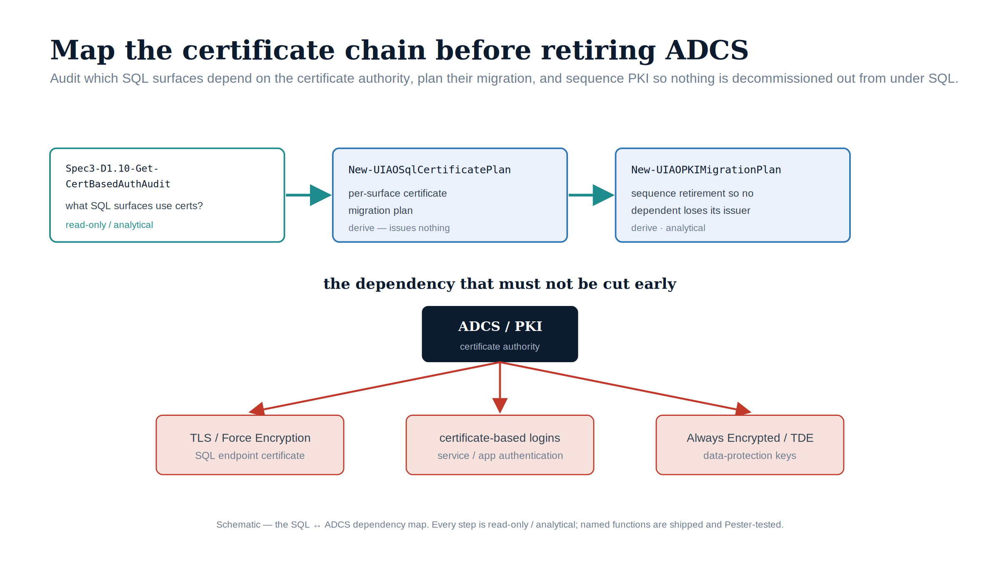

::: {.content-visible when-format="docx"}
# Implementation Book 10 — Certificate Discovery for SQL Server's ADCS Dependencies
:::

{#fig-impl-book10 fig-alt="A schematic on a white background. A top row flows left to right under teal arrows: Spec3-D1.10-Get-CertBasedAuthAudit (read-only / analytical), New-UIAOSqlCertificatePlan (derive), and New-UIAOPKIMigrationPlan (sequence retirement). Below, a navy 'ADCS / PKI certificate authority' node fans out by red arrows to three red-bordered dependent boxes: 'TLS / Force Encryption — SQL endpoint certificate', 'certificate-based logins — service / app authentication', and 'Always Encrypted / TDE — data-protection keys'. Federal navy, teal and red palette; no photographs." width="100%"}

::: {.callout-tip}
## Download this book
**[Book_10.docx](Book_10.docx)** — this entire book as a single Word document, images included. Regenerated on every site deploy.
:::

::: {.callout-warning}
Companion to **narrative Book 10**, which documents a **"Not Yet Defined"** gap from UIAO_135 §3.3. **No normative ADR governs the ADCS-to-Cloud-PKI transformation** — the replacement CA, the enrollment mechanism, and the ADCS-decommission sequencing have not been decided. This book is therefore **discovery and analysis**, not prescriptive provisioning: it runs the real audit, names what breaks, and orders the CA-migration dependencies. Do not cite it as normative governance for ADCS-migration decisions. (UIAO_135 §3.3, ADR-068)
:::

## Why discovery comes long before any decommission date

SQL Server has certificate dependencies that are invisible to most teams planning an ADCS decommission. If ADCS is removed before these are migrated, three SQL Server capabilities fail. The only safe move available today — with no governing ADR — is to **discover the dependencies and order them**, so the as-yet-unwritten ADCS-migration ADR is written against real data rather than guesses. That discovery is fully script-backed.

## Step 1 — Run the certificate audit (read-only)

### `Spec3-D1.10-Get-CertBasedAuthAudit.ps1`

The shipped audit ([`tools/discovery/`](https://github.com/WhalerMike/uiao/tree/main/tools/discovery)) inventories certificate-based authentication dependencies across the AD environment. It is read-only.

| Parameter | Type | Default | Purpose |
|---|---|---|---|
| `-OutputPath` | string | `.\output` | JSON + CSV output directory |
| `-DomainController` | string | — | Target a specific DC; auto-discovery if omitted |
| `-SearchBase` | string | — | Optional AD search base (DN) |
| `-D1InputFile` | string | — | Spec3-D1.1 service-account scan JSON, for cross-reference |
| `-IncludePKIAudit` | switch | off | Query Enterprise CA configuration via `certutil` |
| `-IncludeTemplateAudit` | switch | off | Enumerate all published certificate templates from AD |

It runs six analysis sections: PKI infrastructure inventory (Enterprise root/sub CAs, CRL/OCSP distribution points, NTAuth certs, auto-enrollment GPOs), machine-certificate audit, user-certificate audit, service/application certificate dependencies (ADFS, **LDAPS on DCs**, RADIUS/NPS, web TLS client certs), Entra ID CBA readiness, and migration paths.

```powershell
# Full read-only certificate audit including PKI infra + templates (needs certutil; Enterprise Admin for full templates)
./Spec3-D1.10-Get-CertBasedAuthAudit.ps1 -IncludePKIAudit -IncludeTemplateAudit -OutputPath .\output
```

### Output schema

Under `-OutputPath`: `UIAO_Spec3_D1.10_CertBasedAuthAudit_<domain>_<timestamp>.json` (summary + PKI infra + the certificate arrays), plus `*_machines.csv` and `*_users.csv`. Machine records carry the `userCertificate` EKU set (Client Auth, Server Auth, IPsec, 802.1X), issuer, template, and expiration. User records carry `AuthenticationType`, **`SmartCardRequired`** (from the UAC `SMARTCARD_REQUIRED` bit), `AltSecIdentityCount` (the `altSecurityIdentities` cert-to-user binding), `HasSmartCardLogon`, and a `MigrationPath` (smart card → Entra CBA / FIDO2 / Windows Hello). The summary counts smart-card-required and certificate-based users and the smart-card-capable templates.

### What D1.10 does and does not give you

D1.10 is an **AD-wide** certificate audit — machine and user certificates, smart cards, PKI infrastructure, LDAPS on DCs. It captures the issuing CA for each certificate, which is exactly the signal needed to know *what depends on ADCS*. It does **not** reach into a SQL Server instance to enumerate the engine's bound TLS certificate or its type-C certificate-mapped logins — those live in the instance's certificate store and in `master`, not in AD.

**`New-UIAOSqlCertificatePlan`** (`tools/powershell/UIAOSqlServerMigration/`) is the SQL-specific extraction. It reads the D1.10 output and isolates the three dependencies SQL Server has on ADCS — `tls_server_cert` (scoped to SQL hosts via `-SqlHostFilter`), `certificate_mapped_login`, and `cba_posture` (the NTLM-replacement readiness) — then derives the dependency-ordered CA-replacement sequence (roots before issuing CAs), the CBA-issuance bridge. Every record is `requires_review`; the function is analytical and changes nothing.

```powershell
Import-Module ./tools/powershell/UIAOSqlServerMigration
New-UIAOSqlCertificatePlan -CertAuditPath .\output\*CertBasedAuthAudit*.json -SqlHostFilter 'SQL' -OutputPath .\output\sql-cert-plan.json
```

Reading the engine's *bound* TLS certificate and its type-C certificate-mapped logins requires a live connection into the instance, which this module deliberately never opens (the same no-SQL-connection doctrine as Books 05 and 07). Those remain a read-only, in-engine step — capture their output and feed it alongside the D1.10 audit:

```sql
-- Engine TLS certificate currently bound (read-only)
SELECT * FROM sys.dm_server_registry
WHERE   registry_key LIKE N'%SuperSocketNetLib%' AND value_name = N'Certificate';
-- Certificate-mapped (type-C) logins and the certificate backing each
SELECT  sp.name AS login_name, sp.type_desc, c.name AS cert_name, c.subject, c.expiry_date
FROM    sys.server_principals AS sp
JOIN    sys.certificates      AS c ON c.principal_id = sp.principal_id   -- type-C linkage
WHERE   sp.type = 'C';
```

## Step 2 — Map the audit to SQL Server's three dependencies

Narrative Book 10 Chapter 1 names three distinct SQL Server capabilities that depend on ADCS-issued certificates. `New-UIAOSqlCertificatePlan` classifies the D1.10 output (the issuing CA on every certificate) into these three, with the in-engine reads above supplying the bound-certificate detail:

| Dependency | What it is | What breaks if ADCS is decommissioned first | Migration direction |
|---|---|---|---|
| **TLS / SSL engine certificate** | the server cert the engine presents for connection encryption (required under FedRAMP-Moderate) | no CA left to renew it; on expiry, validating clients reject the connection — encryption becomes the thing that breaks the connection | new CA issues + binds a replacement **before** the ADCS cert expires or ADCS goes offline |
| **Certificate-mapped login (type-C)** | `CREATE LOGIN [x] FROM CERTIFICATE [c]`; client presents a cert as the credential | login fails when the backing cert expires with no renewal | preferred: replace with a **type-E** service-principal login (Book 05); else re-issue from the new CA |
| **CBA — NTLM-replacement interim posture** | ADR-068's authorized fallback for connections that cannot reach Kerberos / Entra OAuth before the deadline | the program loses its interim posture at the moment it is most needed | the replacement CA must be **issuing CBA certificates before ADCS retires** |

## Step 3 — Order the CA-migration dependencies

CAs carry parent/child trust edges — an issuing CA depends on its root. The shipped **`New-UIAOPKIMigrationPlan`** (in [`tools/powershell/UIAOPlanGenerators/`](https://github.com/WhalerMike/uiao/tree/main/tools/powershell/UIAOPlanGenerators)) derives a deterministic, dependency-ordered migration sequence from a PKI assessment envelope:

| Parameter | Purpose |
|---|---|
| `-AssessmentPath` (required) | Path to the PKI assessment envelope (the CA inventory) |
| `-OutputPath` | Where the sealed plan envelope is written |

It topologically orders the CAs (**root before issuing**) and **flags cycles and cross-domain dependencies as blockers** — exactly the cross-domain entanglement Book 02 surfaces. The plan it emits is a sequence of `migrate_ca` steps plus a blocker list, sealed as a derived-from-assessment envelope.

```powershell
Import-Module ./tools/powershell/UIAOPlanGenerators
New-UIAOPKIMigrationPlan -AssessmentPath .\output\pki-assessment.json -OutputPath .\output
```

This plan is the CA-sequencing skeleton; it does not decide the replacement CA or the enrollment mechanism — that is the decision the missing ADCS-migration ADR must make.

## The sequencing finding

The three dependencies converge on one question the audit makes concrete: **does the ADCS-decommission timeline run earlier than the replacement-CA and CBA-deployment timeline?** If it does, the program loses the CBA interim posture ADR-068 depends on at precisely the moment connections that could not reach Entra auth need it. TLS certs must be re-issued before they expire; type-C logins must migrate to type-E before their certs lapse; and CBA must have a CA issuing its certificates before ADCS retires. The sequencing of ADCS decommission against the **2027-04-01** NTLM block (Book 06, Book 09) is therefore a critical dependency — and the central deliverable of this book is the discovered, ordered evidence the as-yet-unwritten ADCS-migration ADR must resolve **before any decommission date is set**.

## Safety

This entire book is **read-only**: the D1.10 audit reads AD and (with `-IncludePKIAudit`) CA configuration; the in-engine queries are inventory reads; `New-UIAOSqlCertificatePlan` and `New-UIAOPKIMigrationPlan` derive over captured output and emit plans. Nothing here issues, binds, or revokes a certificate, and nothing decommissions a CA — those are governed actions awaiting the ADCS-migration ADR.

---

*Companion to [narrative Book 10](../sql-server-narrative/Book_10.qmd). Discovery script-backed: `tools/discovery/Spec3-D1.10`; SQL-specific extraction + CA-replacement sequence via `tools/powershell/UIAOSqlServerMigration` (`New-UIAOSqlCertificatePlan`); general PKI sequencing via `tools/powershell/UIAOPlanGenerators` (`New-UIAOPKIMigrationPlan`). Analytical — no normative ADCS-migration ADR exists, so every emitted action is review-required. Canon: UIAO_135 §3.3, ADR-068.*
