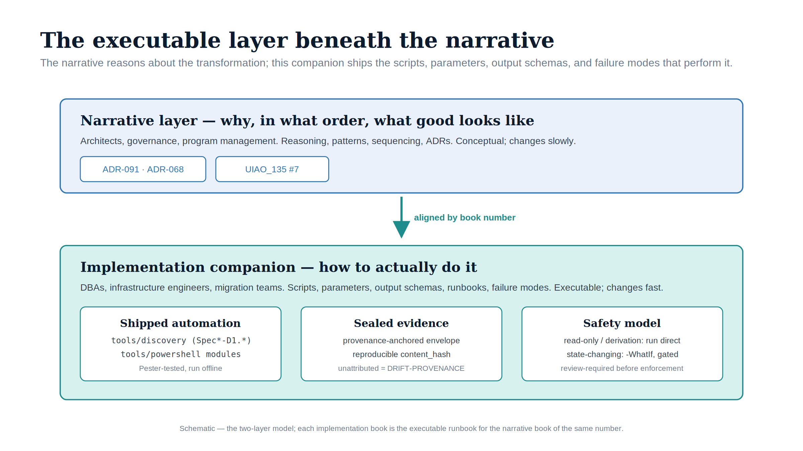

# SQL Server Identity Transformation — Implementation Companion {.unnumbered}

{#fig-impl-index fig-alt="A schematic on a white background. A blue-bordered 'Narrative layer — why, in what order, what good looks like' panel (ADR-091 · ADR-068, UIAO_135 #7) sits above a teal arrow labelled 'aligned by book number', which points down to a teal 'Implementation companion — how to actually do it' panel. The lower panel holds three white cards: 'Shipped automation' (tools/discovery Spec family, tools/powershell modules), 'Sealed evidence' (provenance-anchored envelope, reproducible content_hash), and 'Safety model' (read-only run direct; state-changing -WhatIf, gated). Federal navy, teal and ice-blue palette; no photographs." width="92%"}

::: {.callout-tip}
## Download the complete companion
**[sql-server-implementation-bundle.docx](sql-server-implementation-bundle.docx)** — every book in this companion concatenated into one Word document, images and all. Regenerated on every site deploy. (Each book is also downloadable on its own page.)
:::

::: {.callout-note appearance="default"}
## Companion series — the narrative layer
This is the executable *how*. Its book-for-book companion, the **[SQL Server Identity Transformation narrative](../sql-server-narrative/index.qmd)**, is the *why*: the architecture, sequencing, and governance reasoning each implementation book operationalizes.
:::

::: {.callout-note appearance="default"}
## The executable companion
This is the **executable companion** to the [SQL Server Identity Transformation
narrative](../sql-server-narrative/index.qmd). The narrative is the
architectural and governance layer — *why this must happen, in what order, and
what good looks like*. This companion is the implementation layer — *how to
actually do it*: the scripts, their parameters, their output schemas, and their
failure modes. Every book is backed by shipped automation (the `tools/discovery/`
Spec family and the `tools/powershell/` modules); start at
[Book 01](Book_01.qmd) for the toolchain, the evidence model, and the run order.
The companion operationalizes
[ADR-091](../../adr/adr-091-sql-server-authentication-transformation.qmd) and
[ADR-068](../../adr/adr-068-kerberos-ntlm-elimination.qmd), which remain
**PROPOSED** — treat the *decisions* they record as not-yet-ratified even though
the *automation* that implements them is shipped and tested.
:::

## The two-layer model

The narrative deliberately stays conceptual so it remains readable by architects,
program leads, and governance bodies. It does not embed large scripts, because
code and prose have different audiences and different update cadences:
architectural decisions change slowly; scripts, Microsoft APIs, and edge cases
change fast. This companion is where the executable detail lives.

| | Narrative layer | Implementation companion (this) |
|---|---|---|
| **Audience** | Architects, governance, program management | DBAs, infrastructure engineers, migration teams |
| **Content** | Reasoning, patterns, sequencing, ADRs | Scripts, parameters, output schemas, runbooks, failure modes |
| **Cadence** | Slow (decisions change rarely) | Fast (scripts and APIs evolve) |
| **Form** | Conceptual | Executable |

The two layers are kept aligned by **book number**: Implementation Book 03 is the
how-to for the audit the narrative's Book 03 reasons about, and so on. Where the
narrative says *"the audit identifies every authentication event"*, the companion
gives you the script that produces it, the parameters it takes, the columns it
emits, and what it does when a domain controller is unreachable.

## How this companion is built

- **The scripts are the source of truth; the books are the runbook over them.**
  The audit and discovery scripts live under
  [`tools/discovery/`](https://github.com/WhalerMike/uiao/tree/main/tools/discovery)
  (the `Spec*-D1.*` family) and the assessment/derivation/plan modules under
  [`tools/powershell/`](https://github.com/WhalerMike/uiao/tree/main/tools/powershell)
  (`UIAOSqlServerMigration`, `UIAOIdentityAssessment`, `UIAOPlanGenerators`).
  Each book documents the real script — it does not paraphrase a fictional one.
- **Derived, provenance-anchored.** Every book traces to canon
  (`UIAO_135`, ADR-091, ADR-068) and to the specific `Spec` ID or function it
  documents. This companion introduces no new doctrine, so it needs no ADR — it
  is the operational rendering of decisions already recorded.
- **Every book has shipped automation.** Books 02–10 are each backed by a real,
  Pester-tested function in `UIAOSqlServerMigration` (or a sibling module) —
  the estate-inventory gate, the login and group emitters, the app-connection
  plan, the CCM-BIR closure record and drift diff, the certificate plan. Where a
  step is deliberately **not** scripted, the book says exactly why: the
  connection-string change (Book 08) is made in application configuration, and
  the behavioral/MFA telemetry (Book 09) is an external join to Defender for SQL
  and Entra sign-in logs rather than a duplicated source of truth.

::: {.callout-warning}
## Production safety (GCC-Moderate / FedRAMP)
Scripts in this companion that touch **service accounts, SQL logins, or the
domain** — SPN remediation, `CREATE LOGIN ... FROM EXTERNAL PROVIDER`, NTLM
Group Policy — change a production security posture. Treat every such snippet as
**review-required**: run it in audit/`-WhatIf` mode first, capture the planned
change, and route it through your environment's change-control and security
review before enforcement. The discovery/audit scripts are read-only and safe to
run first; the remediation scripts are not.
:::

## The books

Each book is a standalone runbook. Start with [Book 01](Book_01.qmd) for the
toolchain, the evidence model, and the run order; then [Book 02](Book_02.qmd),
which builds the estate inventory and the retain / consolidate / retire gate
every later step operates on.

## Microsoft how-to references

The [Microsoft How-To Implementation References appendix](appendix-microsoft-howto.qmd)
is the tactical companion to the books: for each capability — Arc enablement,
enabling Entra authentication, `CREATE LOGIN ... FROM EXTERNAL PROVIDER`,
connection-string migration, and NTLM elimination — it gives the authoritative
Microsoft Learn link and the core implementation steps, scoped to the
on-premises SQL Server engine enabled by Azure Arc.
