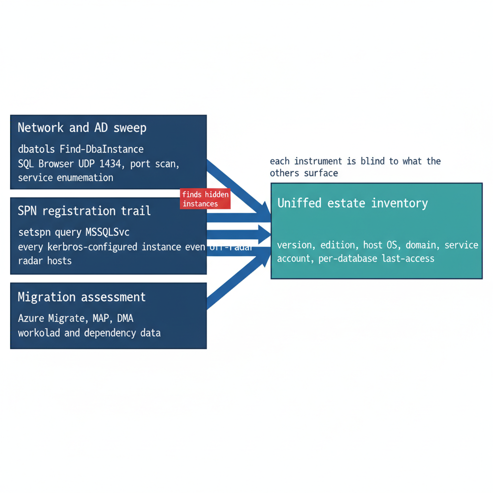

# Chapter 2 — The Estate Inventory

*Finding the instances and databases that no inventory already records.*

::: {.callout-note}
## In this chapter
What a complete estate inventory must capture before consolidation can begin, the discovery instruments that find the instances no one remembers — network and Active Directory sweeps, the SPN registration trail, and Microsoft's migration-assessment tooling — and why estate discovery is a broader exercise than the authentication audit that Book 03 describes.
:::

A consolidation assessment begins with an inventory, and the defining characteristic of a twenty-year estate is that the inventory does not already exist in complete form. The instances a DBA team manages deliberately are known. The instances that matter most to the assessment are the ones nobody is managing — and those must be discovered, not retrieved from a list.

This is the point at which estate discovery diverges from the authentication audit of Book 03. The authentication-audit script (`Get-SQLServerAuthAudit.ps1`) measures the *authentication posture* of instances that are already known: their login types, their authentication mode, their SPN status, their Arc eligibility. Estate discovery runs earlier and casts wider. Its job is to establish the denominator — the complete set of instances and databases that exist — so that the authentication audit has something complete to measure.

{#fig-book-02-cpt-02-diagram-01 fig-alt="An engineering convergence diagram on a white background. Three source boxes on the left, stacked vertically, each labeled and annotated with what it finds: Network and AD sweep — dbatools Find-DbaInstance, annotated SQL Browser UDP 1434, port scan, service enumeration; SPN registration trail — setspn query MSSQLSvc, annotated every Kerberos-configured instance even off-radar hosts; Migration assessment — Azure Migrate, MAP, DMA, annotated workload and dependency data. Each box emits an arrow rightward into a single large box labeled Unified estate inventory — version, edition, host OS, domain, service account, per-database last-access. A small note above the arrows reads each instrument is blind to what the others surface. Engineering blueprint style, white background, federal navy #1F3A5F for boxes and arrows, teal #1A9E8F for the unified-inventory box, red #C0392B for a small tag on the SPN box reading finds hidden instances, monospace labels, no human figures, 16:9 landscape." width="100%"}

## What the Inventory Must Capture

An estate inventory sufficient to drive a consolidation decision captures, for every instance it can find, a consistent set of facts. The version, edition, and build number establish the support and licensing posture. The host operating system version establishes the Arc and upgrade envelope. The domain-join state and the owning domain establish the forest-entanglement picture. The service-account identity and its source domain establish the credential dependencies. And, for every database on the instance, the size, the last-access timestamp, the recovery model, and the owning application establish the utilization and zombie picture that Chapter 3 turns into a rationalization decision.

The inventory is not a point-in-time spreadsheet. Like the authentication audit it precedes, it is designed to be re-run, because instances appear and disappear across a multi-month assessment, and the consolidation plan must track a moving estate rather than a single snapshot.

## Discovery Instruments

No single instrument finds every instance, because instances hide in different ways. A complete sweep combines several, each blind to what the others surface.

A network and directory sweep finds instances by listening for them. The SQL Server Browser service responds on UDP 1434, instances listen on TCP 1433 and dynamic ports, and Active Directory itself records instances indirectly. The open-source PowerShell module `dbatools` provides `Find-DbaInstance`, which combines these signals — service-principal-name lookups, SQL Browser responses, port scans, and Windows service enumeration — into a single discovery pass across a network range or an Active Directory domain. It is the most direct way to surface instances that no inventory records.

The SPN registration trail is a second, independent signal. Because every instance that successfully negotiates Kerberos must register an `MSSQLSvc` service principal name, a forest-wide query for those SPNs (`setspn -Q MSSQLSvc/*`, or the equivalent directory query) enumerates every instance that was ever configured for Kerberos — including instances on hosts that are otherwise off the radar. The SPN trail also feeds directly into the authentication audit, because a registered SPN that points at a decommissioned host, or an instance generating Kerberos traffic with no corresponding SPN, are both findings the later books act on.

Microsoft's migration-assessment tooling is the third instrument, and it captures what the first two cannot: workload and dependency data. Azure Migrate, with its dependency-analysis capability, and the Microsoft Assessment and Planning (MAP) Toolkit, enumerate instances and their resource consumption at fleet scale. The Data Migration Assistant (DMA) assesses individual databases for compatibility and feature blockers against a target version. These instruments are pedagogically useful here for what they reveal about the estate, independent of any decision to use Azure as a migration target — the dependency map and the version-compatibility findings are inputs to the consolidation decision regardless of where the consolidated estate ultimately lands.

## Why a Canonical Estate-Discovery Spec Does Not Yet Exist

The discovery instruments named above are real and well-understood, but they are not yet bound into a canonical discovery specification the way `Get-SQLServerAuthAudit.ps1`, the application-audit script, and the certificate-audit script bind the authentication, application, and certificate audits. The SQL Server engine-authentication decision names this as an explicit gap: the estate-consolidation inventory that produces the **retain / consolidate / retire** classification has no discovery script of its own. Authoring that instrument — a discovery script whose output feeds the same compliance-monitoring pipeline as the authentication audit — is identified in the implementation plan as Phase 0, the prerequisite to everything the later books describe.

Until that specification exists, the consolidation assessment is conducted with the general-purpose instruments above and recorded as a deliberate program artifact rather than a canonical telemetry record. Naming the gap is itself part of the assessment's value: an estate transformation that proceeds on an incomplete inventory will discover its missing instances at the worst possible moment, which is exactly the failure mode the discipline of this book exists to prevent.

::: {.callout-note title="What Book 02 establishes — Chapter 2"}
A consolidation assessment begins with a complete inventory the estate does not already possess. Discovery combines a network and directory sweep (`dbatools Find-DbaInstance`), the forest-wide `MSSQLSvc` SPN trail, and Microsoft's migration-assessment tooling (Azure Migrate, MAP, DMA) — each blind to what the others surface. This is broader than the Book 03 authentication audit and must precede it. No canonical estate-discovery script exists yet; the SQL Server engine-authentication decision names authoring it as Phase 0.
:::
