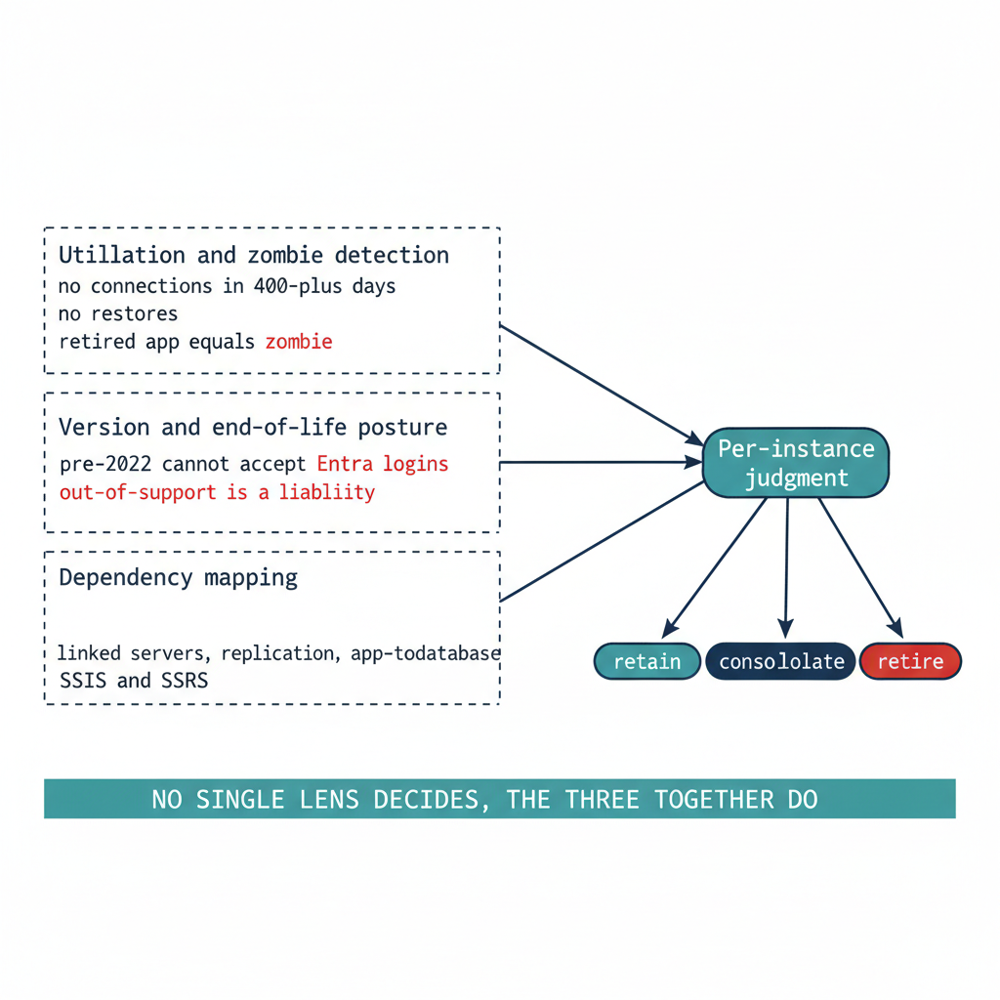

# Chapter 3 — Rationalization: Utilization, Versions, and Dependencies

*Turning a complete inventory into a defensible judgment about what each instance is worth.*

::: {.callout-note}
## In this chapter
The three analytical lenses that convert a raw inventory into a rationalization judgment — utilization and zombie detection, version and end-of-life posture, and dependency mapping — and why the dependency map in particular determines which instances can be consolidated and which are load-bearing in ways that are invisible until they are mapped.
:::

An inventory establishes what exists. Rationalization establishes what each item is worth keeping. The assessment applies three lenses to every instance and every database the inventory surfaced, and the combined picture drives the **retain / consolidate / retire** decision that Chapter 4 formalizes.

{#fig-book-02-cpt-03-diagram-01 fig-alt="An engineering diagram on a white background showing three lens panels on the left feeding a single judgment node on the right. Panel 1, Utilization and zombie detection, annotated no connections in 400-plus days, no restores, retired app equals zombie. Panel 2, Version and end-of-life posture, annotated pre-2022 cannot accept Entra logins and out-of-support is a liability. Panel 3, Dependency mapping, annotated linked servers, replication, app-to-database, SSIS and SSRS. Three arrows converge into a node labeled Per-instance judgment, which then points to three small outcome chips: a teal retain chip, a navy consolidate chip, and a red retire chip. A caption strip notes no single lens decides, the three together do. Engineering blueprint style, white background, federal navy #1F3A5F for panels and arrows, teal #1A9E8F for the retain chip and the convergence node, red #C0392B for the retire chip and the end-of-life annotation, monospace labels, no human figures, 16:9 landscape." width="85%"}

## Utilization and Zombie Detection

The first lens is utilization. An instance consumes CPU, memory, storage, and a licensing entitlement whether or not anyone is using it, and a twenty-year estate contains instances that consume all four while serving no current workload.

Utilization analysis rightsizes the survivors and identifies the candidates for retirement. For each instance, the assessment captures sustained and peak resource consumption, connection counts, and the workload profile — read-heavy reporting, transactional, batch, or idle. For each database, it captures the last-access timestamp, the recent query workload, and the backup-restore history.

A database with no connections in over a year, no restores consumed, and a retired owning application is a zombie, and zombies are the cleanest retirement candidates in the estate. Retiring them is the single most effective way to reduce the authentication migration surface, because every login they carry — including long-forgotten SQL Authentication service accounts with still-valid passwords — is removed from the migration pipeline before it ever enters it.

Utilization data also rightsizes the consolidation targets. An instance running at four percent of a sixteen-core Enterprise license is not a retain candidate at its current size; it is a consolidation source whose workload belongs on a shared modern target, freeing the license and the host.

## Version and End-of-Life Posture

The second lens is version posture, and it interacts directly with the authentication transformation. The `FROM EXTERNAL PROVIDER` login syntax that the entire transformation depends upon requires SQL Server 2022. An instance on any earlier version — 2019, 2017, 2016, or the out-of-support 2012 and 2008 — cannot accept Entra ID logins regardless of any other change, a constraint Book 03 formalizes as the Category 3 classification.

This makes version posture a primary input to the consolidation decision rather than a secondary one. An out-of-support instance on SQL Server 2012 is simultaneously a security-update liability, a licensing question, and an instance that cannot be migrated to Entra ID authentication without an engine upgrade. For most such instances, the right answer is not "upgrade in place to 2022 and then migrate" — it is "consolidate the surviving workload onto a modern target and retire the old engine." The version lens and the utilization lens converge on the same conclusion for the bulk of the aged estate: collapse it onto fewer modern instances rather than carrying each old engine forward.

The licensing posture rides alongside the version posture. Consolidation that reduces the instance count also reduces the core-license consumption, and an estate that can state its true core count before consolidation can quantify the licensing dividend that consolidation produces.

## Dependency Mapping

The third lens is the one that most often overturns a naive consolidation plan: dependency mapping. An instance that appears idle by connection count may be the silent target of a linked-server chain, a replication topology, an SSIS package, or a cross-database query that runs once a quarter and matters enormously when it runs.

Dependency mapping traces these relationships before any instance is moved. Linked-server definitions (`sys.servers`, `sys.linked_logins`) reveal the cross-instance — and frequently cross-domain — web that forest entanglement produced. Application-to-database mapping, drawn from connection telemetry and the application portfolio, reveals which databases are load-bearing for which systems. The SQL Server Agent job inventory, the replication configuration, and the SSIS/SSRS/SSAS footprint reveal the integration surface that a consolidation must preserve. Azure Migrate's dependency analysis and the Data Migration Assistant's compatibility findings supplement the in-engine views with workload-level dependency and feature-blocker data.

The dependency map is also the bridge to Book 08. The upstream applications that consume SQL Server — many of them LDAP-bound — are precisely the systems whose dependencies the map records, and the application-chain migration of Book 08 acts on the same relationships the rationalization lens surfaces here. An instance cannot be classified **retire** if a load-bearing application still depends on it, and the dependency map is what makes that judgment defensible rather than hopeful.

## The Combined Picture

No single lens produces the rationalization decision. An instance that is lightly utilized but load-bearing for a quarterly process is not a retirement candidate. An out-of-support instance with heavy utilization is an urgent consolidation target, not a leave-alone. A zombie database on an otherwise healthy instance is a local retirement that shrinks the migration surface without touching the host. The three lenses together produce, for each instance and each database, a defensible judgment — and that judgment is the input to the decision Chapter 4 records.

::: {.callout-note title="What Book 02 establishes — Chapter 3"}
Rationalization applies three lenses to the inventory: utilization and zombie detection (which retires idle instances and zombie databases, shrinking the migration surface), version and end-of-life posture (which interacts directly with the SQL Server 2022 requirement for Entra ID logins and usually argues for consolidation over in-place upgrade), and dependency mapping (which reveals the linked-server, replication, and application relationships that determine what can actually be consolidated). The three together produce the per-instance judgment that drives the retain / consolidate / retire decision.
:::
