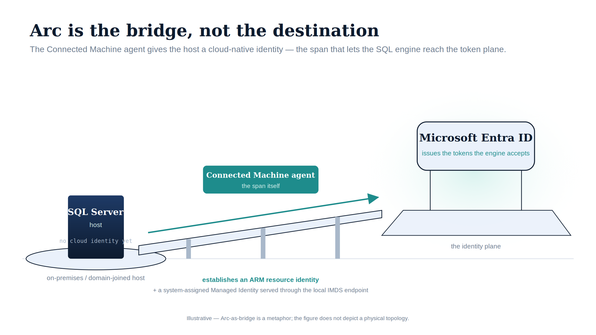

::: {.content-visible when-format="docx"}
# Book_04 — Arc as the Identity Bridge
:::

::: {.callout-note}
Without Arc, the SQL Server engine has no cloud-native identity; without that identity, there is no Managed Identity to replace the AD service account and no mechanism to accept Entra ID-issued tokens. This book explains exactly what Arc does and does not change — and why SQL engine Entra auth (Layer 1) must not be blocked on the domain unjoin that OS-level Entra login (Layer 2) requires.
:::

{#fig-book-04-image-01 fig-alt="An illustrative figure on a white background. On the left, a navy 'SQL Server host' box on a small island, annotated 'no cloud identity yet' and 'on-premises / domain-joined host'. A bridge deck on three piers rises to the right; a teal arrow runs up the span, and a teal box on the span reads 'Connected Machine agent — the span itself'. Captions beneath read 'establishes an ARM resource identity' and '+ a system-assigned Managed Identity served through the local IMDS endpoint'. On the right, a glowing 'identity plane' slab carries an ice-blue 'Microsoft Entra ID' card reading 'issues the tokens the engine accepts'. Illustrative register: navy (#0D1B2E), teal (#1E8C8C), ice-blue (#EAF1FB); no photographs; 16:9 landscape. A footer line notes the figure is illustrative — Arc-as-bridge is a metaphor, not a physical topology." width="90%"}

::: {.callout-tip}
## Download this book
**[Book_04-bundle.docx](Book_04-bundle.docx)** — every chapter of this book concatenated into one Word document. Regenerated on every site deploy.
:::

## Chapters

::: {#book-chapters}
:::

::: {.callout-tip}
## Continue the series
[← Previous: Book 03 — Discovery](Book_03.qmd) · [Index](index.qmd) · [Next: Book 05 — The Login Migration →](Book_05.qmd)
:::
