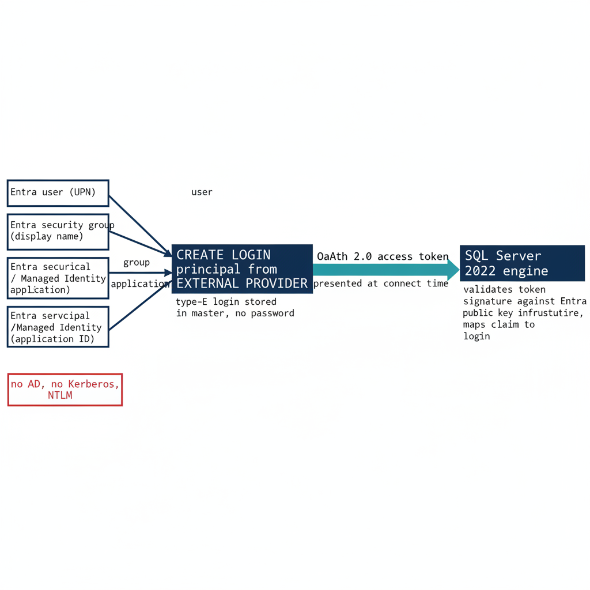

# Chapter 1 — Three Principal Types — User, Group, Service Principal

*The moment the engine stops accepting Kerberos and NTLM and starts accepting Entra-issued tokens.*

::: {.callout-note}
## In this chapter
The `FROM EXTERNAL PROVIDER` syntax that creates type-E logins validated by token at connect time, the three principal types those logins map to — Entra user, Entra security group, and Entra service principal — and the three-phase parallel-run pattern that creates and validates the new logins before disabling the old ones.
:::

This is the technical heart of the series. The login migration is the moment where the SQL Server engine stops accepting the authentication artifacts of the old world — AD-issued Kerberos service tickets, NTLM challenge-response exchanges, Windows Integrated Security — and starts accepting the artifacts of the new world: Entra ID-issued OAuth 2.0 access tokens, validated against Entra's public key infrastructure.

Those tokens carry claims about the principal's identity, group memberships, device compliance state, and MFA completion. Everything in Books 01 through 04 is prerequisite; everything in Books 06 through 10 is consequence. This chapter is the migration itself, and the SQL Server engine-authentication decision records the canonical sequence it follows.

{#fig-book-05-cpt-01-diagram-01 fig-alt="A mapping diagram on a white background. On the left, three navy source boxes stacked vertically labeled 'Entra user (UPN)', 'Entra security group (display name)', and 'Entra service principal / Managed Identity (application ID)'. Each connects by a labeled arrow to a central navy box 'CREATE LOGIN principal FROM EXTERNAL PROVIDER' annotated 'type-E login stored in master, no password'. From that central box a single teal arrow labeled 'OAuth 2.0 access token presented at connect time' flows to a right-hand box 'SQL Server 2022 engine' annotated 'validates token signature against Entra public key infrastructure, maps claim to login'. A small red side-note box reads 'no AD, no Kerberos, no NTLM'. Engineering blueprint style, white background, federal navy (#1F3A5F), red (#C0392B) for legacy/disabled, teal (#1A9E8F) for migrated/validated, monospace labels, no human figures, 16:9 landscape." width="100%"}

## The FROM EXTERNAL PROVIDER Syntax

SQL Server 2022 introduces a new login creation syntax that is the foundation for the entire migration: `CREATE LOGIN [principal] FROM EXTERNAL PROVIDER`. This statement maps an Entra ID principal — identified by its user principal name for users, its display name for groups, or its application ID for service principals — to a SQL Server login without any Active Directory involvement at login creation time.

The login is stored in the `master` database as a type-E login, an external principal. It has no password stored in SQL Server. Authentication for a type-E login is performed by the client presenting a valid Entra ID OAuth 2.0 access token, scoped to the SQL Server's Azure resource audience, at connection time.

The engine validates the token's cryptographic signature against Entra ID's public key infrastructure, extracts the claims from the token payload, and maps the principal identity in those claims to the corresponding `FROM EXTERNAL PROVIDER` login in `master`. If the mapping succeeds and the login is enabled, the connection is accepted, and the principal is granted the permissions associated with the login and any database user roles.

The syntax requires that the Azure extension for SQL Server is installed on the host — which provides the Managed Identity and the Entra ID token validation infrastructure — and that the instance has been registered with the Azure Arc SQL resource plane. The `CREATE LOGIN` statement itself does not call out to Entra ID at execution time. It stores the principal identifier in `master` and relies on token validation at connection time.

This means the login can be created even if the principal does not yet exist in Entra ID, though a connection attempt with a non-existent principal will fail at token issuance — Entra will not issue a token for a principal that does not exist. The best practice is to verify that the Entra principal exists before creating the SQL Server login, to avoid orphaned type-E logins in `master` that map to deleted or renamed Entra principals.

## Type 1 — Entra User Login

The Entra user login is for human database administrators and developers. The migration pattern for a Windows login derived from an individual AD user account — `CREATE LOGIN [DOMAIN\username] FROM WINDOWS` — is to create a corresponding type-E login for the same principal's Entra UPN: `CREATE LOGIN [username@tenant.onmicrosoft.com] FROM EXTERNAL PROVIDER`.

The user's UPN in Entra ID may differ from their SAM account name in AD, particularly in environments where UPN synchronization has not been standardized. The audit must capture the UPN-to-SAMAccountName mapping for all Windows logins before the migration begins, so that the Entra principal is correctly identified for each type-E login. After the login is created, the user authenticates to Entra ID using their normal credentials — password plus MFA, FIDO2, or Windows Hello for Business depending on the Conditional Access policy targeting. Entra issues an access token scoped to the SQL Server resource audience, carrying the user's UPN and object ID as claims; the engine validates the token and maps the UPN to the type-E login.

Multi-factor authentication enforcement is handled entirely by the Conditional Access policy targeting the user and the SQL Server application registration. The SQL Server engine itself does not implement MFA logic and has no awareness of whether MFA was completed. This is the correct architectural division of responsibility: the Conditional Access policy in the Entra ID plane enforces the MFA requirement before the token is issued, and the engine trusts the token because it was issued by the Entra ID service the engine trusts, consistent with the Conditional Access policy design.

If MFA was not completed, the Conditional Access policy denies the token request, and the SQL Server connection never opens. There is no SQL Server-level MFA prompt and no SQL Server-level MFA bypass. The Conditional Access policy also evaluates device compliance, network location through Named Locations, and sign-in risk level before issuing the token. All of these controls apply to SQL Server connections using type-E logins, and none of them apply to connections using Windows Authentication or NTLM.

## Type 2 — Entra Group Login

A SQL Server login can be created for an Entra ID security group rather than an individual user: `CREATE LOGIN [GroupDisplayName] FROM EXTERNAL PROVIDER`. When a user whose Entra access token includes a claim asserting membership in the named group connects to SQL Server, the engine maps the group claim to the group login and grants the user the permissions associated with that login.

This is the group-based access control pattern familiar from AD group-based SQL Server access, but it operates entirely through Entra ID group membership and OAuth 2.0 claims rather than through AD SID resolution and Kerberos PAC group membership. The shift from SID-and-PAC to claim is the whole difference between the old plane and the new one.

The significance of group-based type-E logins for this program is substantial. An Entra dynamic security group — a group whose membership is defined by a membership rule rather than by manual assignment — whose rule references OrgPath `extensionAttributes` can drive SQL Server access without any manual DBA provisioning action. The DBA team for an organizational boundary is the set of users whose OrgPath attributes match the dynamic group's membership rule, and that set is computed continuously by Entra ID's group membership engine as OrgPath values change with HR data, consistent with the dynamic-group provisioning model.

A user who joins the DBA team gains SQL Server access when their OrgPath attributes are updated to reflect the new role — without any DBA issuing a `CREATE USER` statement. A user who leaves loses access when those attributes are updated — without any DBA issuing a `DROP USER`. The dynamic group is the policy; OrgPath is the data; Entra ID is the engine; and SQL Server consumes the result. This is the architectural connection between the OrgPath Narrative and this series, now expressed at the SQL Server engineering layer.

## Type 3 — Entra Service Principal Login

For application service accounts and automated processes that connect to SQL Server — ETL pipelines, reporting services, API backends, monitoring agents — the migration pattern replaces the SQL Authentication service account, a type-S login with a stored password, with an Entra service principal login: `CREATE LOGIN [ApplicationDisplayName] FROM EXTERNAL PROVIDER`, where the display name corresponds to the Entra ID application registration for the connecting application.

The application authenticates to Entra ID using its client credentials — which should be a client certificate rather than a client secret, or preferably no credential at all if the application runs on an Azure resource or an Arc-enabled server with a Managed Identity. The Managed Identity authenticates to Entra ID without any credential, obtains an access token scoped to the SQL Server resource audience, and presents that token at connection time.

The service principal pattern eliminates the SQL Authentication service account entirely: no username and password in connection strings, no credential rotation process, no risk of credential exposure in configuration files, log outputs, or code repositories. For applications running on Arc-enabled servers, the Managed Identity is available at the IMDS endpoint, and the `Azure.Identity` SDK's `DefaultAzureCredential` chain will automatically use it, consistent with the Managed Identity credential model.

For applications running in Azure virtual machines, Azure Container Instances, or Azure App Service, the platform-provided Managed Identity is used. For applications that cannot use a Managed Identity and must use a service principal with a credential, a client certificate is preferred over a client secret, and the certificate must be stored in Azure Key Vault rather than in any file system location.

## The Parallel-Run Migration Pattern

Existing Windows logins must not be dropped until their Entra equivalents have been validated. The migration follows the three-phase parallel-run pattern that the SQL Server engine-authentication decision makes required for production instances, ensuring no access is disrupted during the transition. In Phase 1, type-E equivalents are created for every migrating login. For each Windows login — whether derived from an individual AD user account or an AD security group — a corresponding `FROM EXTERNAL PROVIDER` login is created using the Entra principal that corresponds to the AD principal.

The Entra-to-AD principal mapping must be verified before each login creation, and any principal for which no Entra equivalent can be confirmed is flagged as a blocking finding requiring resolution before the login can be created. This mapping verification is the most operationally intensive part of the migration: the authentication-audit script (`Get-SQLServerAuthAudit.ps1`) output provides the AD principal inventory, and the Entra ID directory provides the UPN and group display name data needed for the mapping.

In Phase 2, each type-E login is validated by executing a test authentication using the real Entra credential for the corresponding principal. The test authentication must succeed before any legacy login is modified. In Phase 3, legacy Windows and SQL Authentication logins are disabled — not dropped — after successful validation of their Entra equivalents. The disabled logins are retained for a 30-day observation window during which connection monitoring confirms that no application or user still depends on them.

After the 30-day window, the disabled logins are dropped, and the type-E logins become the sole authentication mechanism for those principals. The SQL Server engine-authentication decision permits non-production instances to compress the observation window with documented owner sign-off, but the create-validate-disable-observe-drop sequence itself is the canonical pattern, and the next chapter records the four further decisions that decision makes around it.

::: {.callout-note title="What Book 05 establishes — Chapter 1"}
The `FROM EXTERNAL PROVIDER` syntax creates type-E logins that carry no password and authenticate by Entra-issued OAuth 2.0 token validated at connect time. The three principal types are the Entra user (UPN-mapped, MFA enforced by Conditional Access in the Entra plane per the Conditional Access policy design), the Entra security group (OrgPath-driven dynamic groups provision access without DBA action, per the dynamic-group provisioning model), and the Entra service principal or Managed Identity (no credential in connection strings, per the Managed Identity credential model). The canonical migration is the three-phase parallel run the SQL Server engine-authentication decision requires: create, validate, then disable — not drop — the legacy login, observe for 30 days, and only then drop it.
:::
