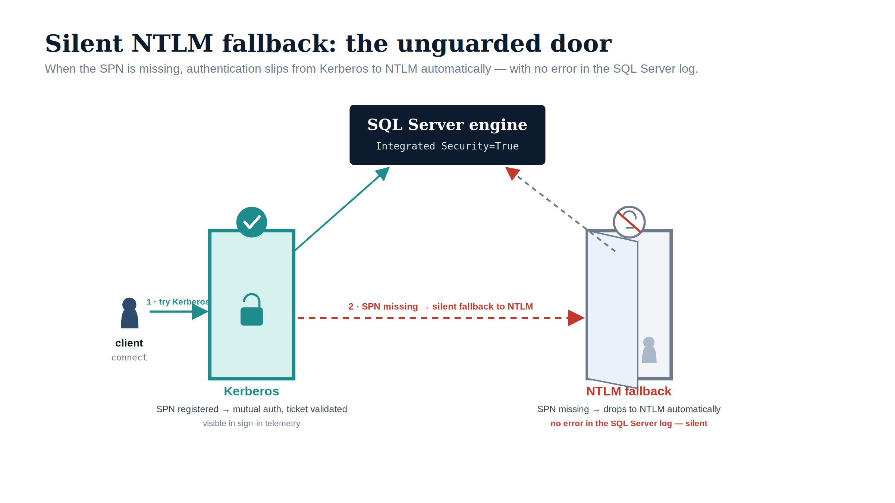
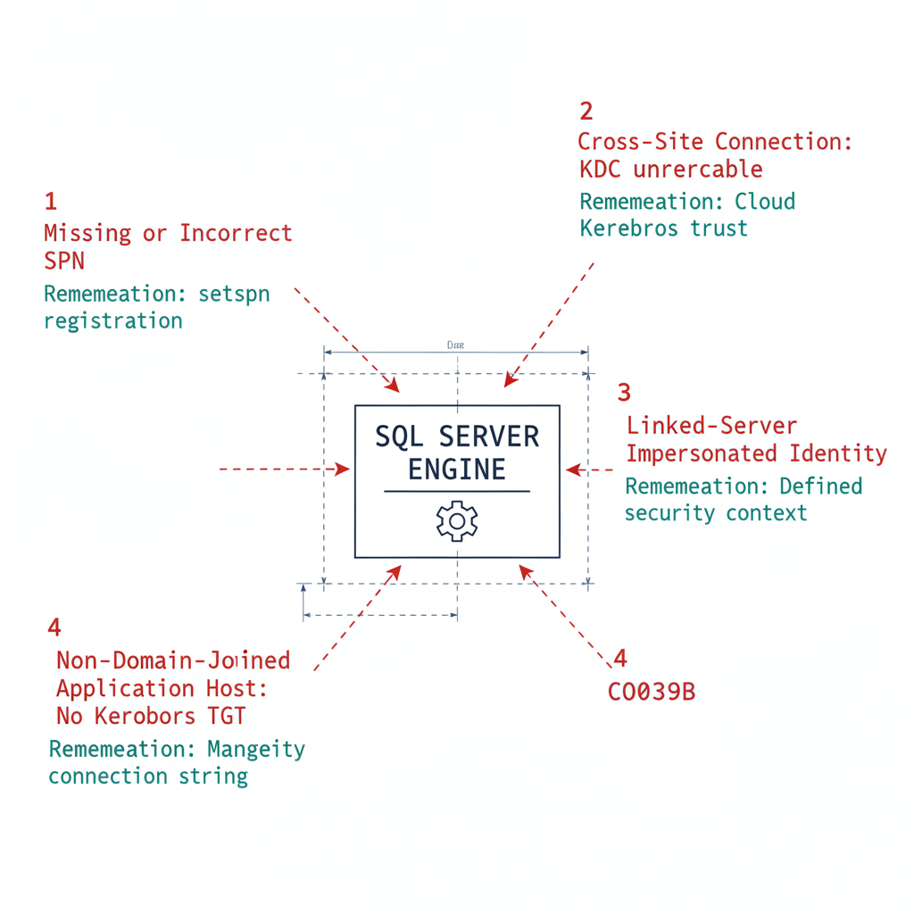

# Chapter 1 — NTLMv1, NTLMv2, and the Patterns That Generate NTLM

*NTLM is a protocol, not a setting — so eliminating it means naming every connection pattern that produces it.*

::: {.callout-note}
## In this chapter
Why NTLMv1 is blocked early — in the Kerberos/NTLM-elimination program's Phase B, by default upon completion of the Phase A assessment (targeted 2026-Q3) — through the LAN Manager Authentication Level policy, while NTLMv2 carries a phased deadline of 2027-04-01, and the four distinct SQL Server connection patterns that generate NTLM traffic — a missing or incorrect SPN, cross-site connections where the KDC is unreachable, linked-server passthrough authentication, and non-domain-joined application hosts created by the server transformation.
:::

NTLM is a protocol, not a configuration setting, and that distinction governs everything in this book. There is no single switch to flip and no single Group Policy change that removes NTLM from SQL Server connections. Eliminating NTLM at the SQL layer requires identifying every connection pattern that generates NTLM traffic, and there are more such patterns than most database teams expect.

The most obvious is the missing-SPN case described in Book 01, where Kerberos negotiation fails because no SPN is registered and SSPI falls back to NTLM. But other patterns exist: cross-site connections, linked-server definitions using passthrough authentication, and application connections from hosts that have already been migrated to a non-domain-joined state. Each pattern has a different root cause and a different remediation path, and none of them can be addressed until it has been detected.

{#fig-book-06-cpt-01-image-02 fig-alt="An illustrative figure on a white background using two doors as a metaphor. A stylised client silhouette on the left first tries Kerberos (teal arrow, '1, try Kerberos'); a red dashed arrow then shows '2, SPN missing, silent fallback to NTLM'. The left door is teal and guarded — a check badge and a padlock — labelled 'Kerberos: SPN registered, mutual auth, ticket validated, visible in sign-in telemetry'. The right door is grey and ajar with a muted-bell icon and a faint silhouette slipping through, labelled 'NTLM fallback: SPN missing, drops to NTLM automatically; no error in the SQL Server log — silent'. Both doors lead up to a navy 'SQL Server engine' box. Illustrative register: navy (#0D1B2E), teal (#1E8C8C) for the guarded path, red (#C0392B) and grey for the silent path; 16:9 landscape." width="100%"}

{#fig-book-06-cpt-01-diagram-01 fig-alt="An engineering blueprint diagram on a white background showing a central SQL Server engine box in federal navy, with four labeled inbound connection arrows in red converging on it, each annotated with its root cause and a teal remediation note. Arrow one, missing or incorrect SPN, annotated setspn registration. Arrow two, cross-site connection, annotated KDC unreachable, remediation Cloud Kerberos trust. Arrow three, linked-server passthrough, annotated impersonated identity, remediation defined security context. Arrow four, non-domain-joined application host, annotated no Kerberos TGT, remediation Managed Identity connection string. Engineering blueprint style, white background, federal navy (#1F3A5F), red (#C0392B) for NTLM-generating arrows, teal (#1A9E8F) for Kerberos and remediation annotations, monospace labels, no human figures, 16:9 landscape." width="100%"}

## NTLMv1: Blocked First, in Phase B

NTLMv1 is the older of the two NTLM variants, and it carries well-documented cryptographic weaknesses that make it unsuitable for any authenticated environment. The NTLMv1 challenge-response uses an MD4 hash of the user's password as the response key, which is vulnerable to pass-the-hash attacks.

An attacker who captures the NTLMv1 response can mount an offline dictionary attack against the MD4 hash, and can replay the captured hash to authenticate as the victim without ever learning the plaintext password. NTLMv1 also provides no session signing, so a network attacker positioned between the client and the server can modify data in transit without detection.

The Kerberos/NTLM-elimination program blocks NTLMv1 in its Phase B "block-where-safe" stage — by default immediately upon completion of the Phase A assessment, with the implementation plan targeting 2026-Q3 — implemented through Group Policy. The "Network Security: LAN Manager Authentication Level" policy is set to "Send NTLMv2 response only; refuse LM and NTLM." Once that policy is in force, any connection attempt that generates LM or NTLMv1 authentication traffic is refused inside the Windows security subsystem — the Local Security Authority (LSA) negotiates only NTLMv2, and the server rejects the weaker protocols. This puts the program slightly ahead of Microsoft's own NTLMv1 enforcement, which flips the `BlockNTLMv1SSO` default from Audit to Enforce via Windows Update in October 2026 for devices without an explicit policy; the program's Group Policy makes the block deterministic rather than waiting for the platform default.

In a modern SQL Server environment, NTLMv1 should not appear in any connection. SQL Server clients and servers running on Windows Server 2016 or later, with default security configuration, do not generate NTLMv1 traffic. It surfaces only in environments with very old clients — Windows 7 and earlier — or with applications that have explicitly configured LM or NTLM rather than NTLMv2 as the authentication protocol.

If the authentication-audit script or the Phase A network-traffic analysis reveals NTLMv1 in SQL Server connection traffic, it is a critical finding that requires immediate remediation regardless of the broader migration timeline. NTLMv1 in a production SQL Server connection stream is a significant security vulnerability and a compliance violation under the elimination program, and it cannot be treated as a routine migration item.

## NTLMv2: The 2027-04-01 Deadline

NTLMv2 is the current NTLM variant, and it addresses the cryptographic weaknesses of its predecessor. It uses HMAC-MD5 rather than MD4, incorporates a client challenge in addition to the server challenge to prevent replay attacks, and supports session signing. NTLMv2 is the variant that most SQL Server NTLM traffic in a modern federal environment will be generating.

Unlike NTLMv1, NTLMv2 is not removed in Phase B. The Kerberos/NTLM-elimination program restricts it via Group Policy to documented exception groups during Phase B, but full disablement waits for the elimination phase — Phase C — which carries a hard cutover at 2027-04-01. The phased timeline exists to give programs the operational space to identify and remediate NTLMv2-generating connection patterns before the hard block is applied.

That space is not infinite, and the timeline is not flexible. The elimination program's enforcement phase sets 2027-04-01 as the date on which domain-wide NTLM restrictions take effect program-wide — the program's own NTLM-elimination backstop. SQL Server NTLMv2 connections must be migrated either to Kerberos as an interim posture — using Cloud Kerberos trust per the elimination program — or to Entra ID OAuth 2.0 authentication as the final destination, before that date.

## Pattern One: Missing or Incorrect SPN

The most common cause of NTLM fallback in SQL Server connections is a missing or incorrect SPN registration. When a client opens a connection using Windows Integrated Security, SSPI checks whether a valid SPN exists for the SQL Server endpoint. If the SPN is missing from the service account's AD object, SSPI cannot negotiate Kerberos and falls back to NTLM.

The SPN must take the form `MSSQLSvc/hostname.domain.com:port` and must be registered on the service account that the SQL Server engine process runs under. Named instances use the named-instance format, `MSSQLSvc/hostname.domain.com:instancename`, in addition to the port format.

If the service account has been changed without updating the SPN registration — a common occurrence during service-account migration — the SPN may exist but be registered on the wrong account, which produces the same NTLM fallback. SPN remediation is straightforward: `setspn -S MSSQLSvc/hostname.domain.com:port serviceaccount`. The authentication-audit script captures SPN registration status for every instance, and any instance with a missing or incorrect SPN is a discovery-phase finding that can be remediated independently of the broader login migration.

## Pattern Two: Cross-Site Connections

SQL Server connections that originate from a client in one Active Directory site and target a server in a different AD site can generate NTLM traffic if the client cannot reach the KDC in the server's site. Kerberos requires the client to obtain a service ticket from the KDC that is authoritative for the server's service-account domain.

If the client's network path to the server-site KDC is blocked or unreliable, SSPI falls back to NTLM. In a distributed federal environment with multiple AD sites across geographic locations and network boundaries, this pattern is not uncommon.

Cross-site NTLM is detectable from the Phase A audit output by correlating connection source and destination network topology. If the source host and the destination SQL Server host are in different AD sites, and the connection is generating NTLM traffic, the likely cause is KDC accessibility from the source site. The remediation is either to ensure KDC reachability from all client sites — adjusting firewall rules for Kerberos traffic on UDP and TCP port 88 — or to implement Cloud Kerberos trust, which satisfies Kerberos authentication through the Azure cloud KDC rather than the on-premises AD site KDC, per the Kerberos/NTLM-elimination program.

## Pattern Three: Linked-Server Passthrough Authentication

Linked-server definitions in SQL Server — which allow one instance to query another using `OPENQUERY` or four-part name syntax — frequently use Windows passthrough authentication as the mechanism for the linked-server connection. In the passthrough model, the originating instance impersonates the connecting client's Windows identity and presents that identity to the target SQL Server using NTLM.

This happens because the originating server, acting as an intermediary, typically cannot negotiate Kerberos for the impersonated identity without Kerberos delegation configured. Kerberos constrained delegation for linked-server passthrough is a known pattern but requires specific AD configuration; in its absence, linked-server passthrough generates NTLM traffic.

Linked-server NTLM is particularly insidious because it often appears in monitoring as "internal" database traffic and is not always visible in standard SQL Server connection audits. It requires examination of the `sys.linked_logins` and `sys.servers` views as well as network-traffic analysis between instances. Any linked-server definition that uses passthrough authentication must be identified during discovery and migrated to a defined security context — a specific login or Managed Identity — during the restriction phase.

## Pattern Four: Non-Domain-Joined Application Hosts

Any application running on a host that has been migrated to a non-domain-joined state — as part of the Arc non-domain-join requirement — but still connecting to SQL Server using Windows Integrated Security will generate NTLM traffic. A non-domain-joined host has no Kerberos TGT from the KDC and cannot negotiate Kerberos for SQL Server connections. SSPI falls back to NTLM using local credentials when the application host is in a workgroup.

This pattern becomes more prevalent as the Arc non-domain-join server migration progresses. As more application servers are domain-unjoined, the applications running on them that still use Windows Integrated Security become new NTLM sources. This is a strong operational argument for completing the SQL Server connection-string migration in parallel with, or before, the domain unjoin of application hosts.

An application host that has been domain-unjoined and whose connection string uses Managed Identity authentication generates no NTLM traffic and is fully compliant with both the Arc non-domain-join requirement and the Kerberos/NTLM-elimination program. An application host that has been domain-unjoined but whose connection string still uses Windows Integrated Security is now an NTLM source that did not exist before the domain unjoin.

::: {.callout-note title="What Book 06 establishes — Chapter 1"}
NTLM is a protocol, not a setting, so there is no single switch that removes it from SQL Server connections. NTLMv1 is blocked early — in the Kerberos/NTLM-elimination program's Phase B, through the LAN Manager Authentication Level policy — and should never appear in a modern estate; NTLMv2 is restricted to exception groups in Phase B and fully blocked at the enforcement phase cutover of 2027-04-01. Four connection patterns generate NTLM at the SQL layer — a missing or incorrect SPN, cross-site connections where the KDC is unreachable, linked-server passthrough authentication, and non-domain-joined application hosts created by the Arc non-domain-join server migration — and each must be detected before it can be remediated.
:::
