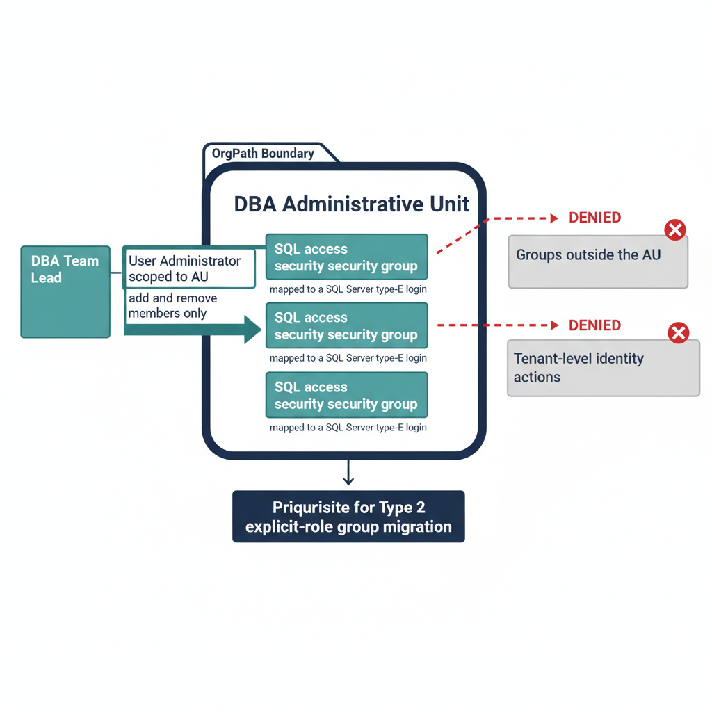

# Chapter 2 — Administrative Unit Delegation for SQL Server DBA Teams

*Scoped authority over the groups that control SQL access, without tenant-wide rights.*

::: {.callout-note}
## In this chapter
How the Entra Administrative Unit provides the scoped delegation a DBA team needs to manage the Entra groups behind SQL Server access without holding tenant-wide identity rights, why the AU boundary should be aligned to OrgPath so the delegation boundary and the access boundary stay coherent, and why provisioning the AU is a prerequisite for the explicit role-assignment group migration of Chapter 1.
:::

Chapter 1 left an open question. The explicit role-assignment groups — the Type 2 groups that grant named SQL Server roles — move their maintenance model from a helpdesk ticket against Active Directory to an Entra role assignment. But granting a DBA team lead tenant-wide User Administrator rights to manage a handful of SQL access groups would trade one governance problem for a worse one. The Administrative Unit is the mechanism that resolves it.

The Entra Administrative Unit, governed by the Administrative Unit provisioning model, is a management boundary that scopes a role assignment to a subset of Entra objects rather than the whole tenant. A DBA team's AU contains the Entra security groups mapped to the SQL Server roles within that team's scope of ownership, and a role assignment — User Administrator scoped to that AU — lets the team lead add and remove members of those groups and nothing else.

{#fig-book-07-cpt-02-diagram-01 fig-alt="An engineering blueprint diagram on a white background. Center: a navy rounded rectangle labeled DBA Administrative Unit, aligned to an OrgPath boundary tag at its top edge. Inside the rectangle sit three teal boxes labeled SQL access security group, each annotated mapped to a SQL Server type-E login. A DBA team lead box on the left connects via a teal arrow labeled User Administrator scoped to AU into the rectangle, with a small tag reading add and remove members only. Outside the rectangle, to the right, sit two grey boxes labeled groups outside the AU and tenant-level identity actions, each reached by a red dashed arrow from the team lead marked with a red X labeled denied. Below the AU a thin navy arrow points to a box labeled prerequisite for Type 2 explicit-role group migration. Engineering blueprint style, white background, federal navy (#1F3A5F) for the AU boundary and structure, teal (#1A9E8F) for the granted delegation and access groups, red (#C0392B) for the denied tenant-wide paths, monospace labels, no human figures, 16:9 landscape." width="100%"}

The value of the AU is precisely that it confers no other power. The role-eligible assignment scoped to the DBA AU carries no ability to modify groups outside the AU and no ability to perform any tenant-level identity action. Least privilege stops being an aspiration the DBA team is trusted to honor and becomes a boundary the directory enforces.

## Aligning the AU Boundary to OrgPath

The SQL Server DBA AU boundary should be aligned to OrgPath. The AU contains the groups whose dynamic membership rules or explicit assignments correspond to the organizational boundary the DBA team owns, so the delegation boundary and the access boundary describe the same scope rather than drifting apart.

If a DBA team owns a specific application portfolio, its AU contains the groups governing access to the SQL Server instances that support that portfolio. If the team is organized geographically, the AU corresponds to the geographic OrgPath dimension. Either way, the AU is drawn from the same OrgPath model that drives the dynamic groups of Chapter 1, not invented as a separate management construct.

This alignment is what keeps the model coherent. The DBA team that manages access to a set of SQL Server instances also manages the Entra groups that control that access, and those groups are scoped to the AU that matches the team's organizational position. The authority a team holds and the systems it is responsible for are, by construction, the same set. The Administrative Unit provisioning model enforces this through its cross-canon integrity checks, which reject an AU whose referenced groups or OrgPath values do not resolve to live canon.

## AU Provisioning as a Migration Prerequisite

Administrative Unit provisioning for DBA teams is not an optional refinement layered on after the group migration; it is a prerequisite for the Type 2 explicit role-assignment migration described in Chapter 1. A Type 2 group can only be managed under appropriate delegation after the AU is provisioned and the scoped role assignment is in place.

The sequencing follows from that dependency. The AU is created and confirmed restricted — the Administrative Unit provisioning model pins the restricted-management invariant so the AU cannot be created in a form that lets a Global Admin bypass the division-level delegation. The scoped role assignment is then established for the DBA team lead. Only then can the explicit role-assignment groups be created, populated, and bound to their SQL Server type-E logins under the delegated authority rather than under tenant-wide rights.

Provisioning the AU before the groups it will hold also avoids a transitional window in which the new Entra groups exist but can only be managed by a tenant-wide administrator — the precise concentration of privilege the whole exercise is meant to remove. The AU comes first; the Type 2 groups land inside an already-scoped boundary.

::: {.callout-note title="What Book 07 establishes — Chapter 2"}
The Entra Administrative Unit (governed by the Administrative Unit provisioning model) gives DBA teams scoped authority over the Entra security groups that control SQL Server access without tenant-wide User Administrator rights: a role assignment scoped to the AU lets a team lead manage members of the groups inside it and nothing else. The AU boundary should be aligned to OrgPath so the delegation boundary and the access boundary describe the same scope, and the Administrative Unit provisioning model's restricted-management invariant and cross-canon integrity checks keep that alignment enforced. Provisioning the AU is a prerequisite for the Chapter 1 explicit role-assignment group migration — the AU and its scoped delegation must exist before those groups can be managed under least privilege rather than tenant-wide rights.
:::
