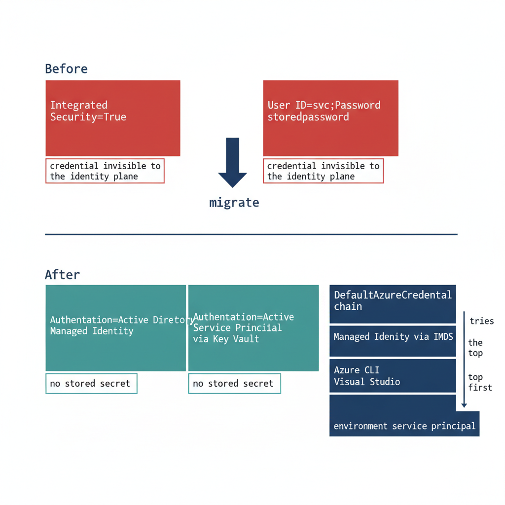

# Chapter 2 — Connection String Migration: The Last Mile

*The simplest change in the entire program, and the most gate-controlled.*

::: {.callout-note}
## In this chapter
The connection-string change that ends the application-chain migration — from Integrated Security or SQL Authentication to Entra ID authentication keywords — the gate conditions that must hold before it can be executed, and how the `Azure.Identity` SDK's `DefaultAzureCredential` chain lets a .NET application use one credential code path across production and development without modification.
:::

The final step in the application-chain migration is the SQL Server connection-string change. It is the moment the engine sees the Entra ID identity plane in the application connection rather than a SQL Authentication credential or a Windows Integrated Security token. Technically it is the simplest step in the entire migration. Operationally it is the most gate-controlled, and the two facts together are why it is treated as a distinct step rather than folded into the work that precedes it.

{#fig-book-08-cpt-02-diagram-01 fig-alt="An engineering before-and-after diagram on a white background, divided into an upper half and a lower half. The upper half, labeled Before, shows two red connection-string cards: Integrated Security=True, and User ID=svc with Password=storedpassword, each tagged credential invisible to the identity plane. A central arrow labeled migrate points downward. The lower half, labeled After, shows three teal connection-string cards: Authentication=Active Directory Managed Identity, Authentication=Active Directory Service Principal via Key Vault, and Authentication=Active Directory Default, all tagged no stored secret. To the right, a vertical stack titled DefaultAzureCredential chain lists ordered steps top to bottom: Managed Identity via IMDS, Azure CLI, Visual Studio, environment service principal, with an arrow indicating it tries the top first. Engineering blueprint style, white background, federal navy #1F3A5F for the chain and arrows, red #C0392B for the Before cards, teal #1A9E8F for the After cards, monospace labels, no human figures, 16:9 landscape." width="100%"}

## The Connection String Change

For an application using Windows Integrated Security — `Data Source=sqlserver;Initial Catalog=database;Integrated Security=True` — the connection string changes to use Entra ID authentication. For an application running on an Arc-enabled server with a system-assigned Managed Identity, it becomes `Data Source=sqlserver;Initial Catalog=database;Authentication=Active Directory Managed Identity`. The keyword tells the driver to acquire a token from the local Managed Identity rather than negotiate a Windows credential.

For an application using a service principal with a client credential, the string uses `Authentication=Active Directory Service Principal`, with the client ID and credential supplied through an Azure Key Vault reference rather than inline. For SQL Authentication connections — `User ID=serviceaccount;Password=storedpassword` — migrating to Managed Identity or service principal eliminates the credential from the connection string entirely. In every case the stored secret is removed, which is the point: the connection no longer carries a credential the identity plane cannot see.

## The Gate Conditions

The change is the simplest step technically, but it cannot be executed on demand. Three conditions must hold first. The Entra ID login must already exist on the target SQL Server instance — the `FROM EXTERNAL PROVIDER` login created in the work Book 04 covers — because a connection string that names an Entra identity with no corresponding login on the instance fails at connection time.

The application's service principal or Managed Identity must have been granted the appropriate SQL Server database role, so that authentication succeeds and authorization follows. And the change must have been tested in a non-production environment whose Arc and SQL Server extension configuration matches production, because token acquisition and validation depend on that infrastructure being present and correctly configured. A connection-string change that works against a developer's laptop but has never been exercised against a production-equivalent Arc and extension stack is not a tested change. Only when all three gates are satisfied is the production cutover safe to perform.

## The Azure.Identity SDK and DefaultAzureCredential

For .NET applications — a large fraction of the federal application estate — the `Azure.Identity` SDK provides the `DefaultAzureCredential` class, which implements an ordered credential chain. It attempts Managed Identity first, using the local IMDS endpoint when running on an Arc-enabled server, an Azure VM, or another Azure-hosted platform, then falls back to Azure CLI credentials, then Visual Studio credentials, then environment-variable-based service-principal credentials.

The value of the chain is that a single credential code path works unchanged across environments. In production the application resolves its Managed Identity; in a developer's local environment it resolves Azure CLI credentials; no code differs between them. The SQL connection uses a `SqlConnection` with the `Authentication=Active Directory Default` keyword — available in `Microsoft.Data.SqlClient` 2.0 and later — or sets the `AccessToken` property from the `DefaultAzureCredential` token directly.

The `Authentication=Active Directory Default` keyword is the preferred approach for new connection-string configurations, because it delegates credential resolution to the `DefaultAzureCredential` chain automatically. The result is that the connection-string change is a net reduction in complexity for .NET applications: one keyword replaces an entire credential-management system. This is the workload-identity model the Managed Identity credential model establishes — the application authenticates as itself through a Managed Identity, with no human credential and no stored secret anywhere in the path.

::: {.callout-note title="What Book 08 establishes — Chapter 2"}
The connection-string change is the last mile of the application-chain migration: Integrated Security or SQL Authentication becomes `Authentication=Active Directory Managed Identity`, `Service Principal`, or `Default`, and the stored credential disappears. It is the simplest step technically but the most gate-controlled — it requires the Entra ID login to exist on the instance, the identity to hold the right database role, and a tested change in a production-equivalent non-production environment. For .NET, the `Azure.Identity` SDK's `DefaultAzureCredential` chain and the `Authentication=Active Directory Default` keyword collapse credential management to a single keyword, realizing the workload-identity model of the Managed Identity credential model.
:::
