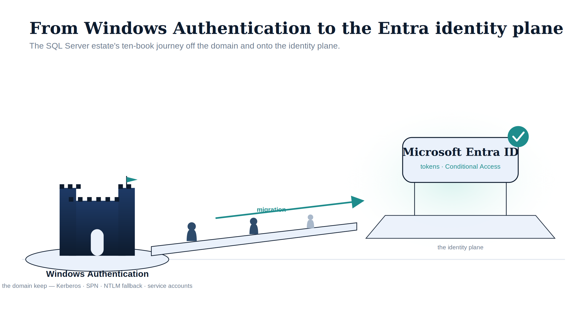

# SQL Server Identity Transformation {.unnumbered}

{#fig-index-image-01 fig-alt="An illustrative figure on a white background. On the left, a dark navy castle keep on a small island, labelled 'Windows Authentication — the domain keep — Kerberos, SPN, NTLM fallback, service accounts'. A rising bridge crosses to the right, with three stylised human silhouettes walking across it beneath a teal arrow labelled 'migration'. On the right, a luminous teal glow surrounds a floating slab labelled 'the identity plane', on which sits a light-blue card reading 'Microsoft Entra ID — tokens, Conditional Access', topped by a teal check badge. Illustrative register: federal navy (#0D1B2E), teal (#1E8C8C), ice-blue (#EAF1FB); stylised silhouettes, no photographs; 16:9 landscape." width="100%"}

::: {.callout-important appearance="default"}
## Status — Draft series
This ten-book series is **DRAFT v0.1**. It is the explanatory companion to the
**SQL Server engine-authentication decision**, which is **PROPOSED**, not yet
accepted. Treat the engineering patterns here as the evidentiary foundation for
that decision rather than as accepted normative governance until it is accepted
and this series is reviewed against it.
:::

::: {.callout-tip}
## Download the full section
**[sql-server-narrative-standalone-bundle.docx](https://github.com/WhalerMike/uiao/releases/download/downloads-latest/sql-server-narrative-standalone-bundle.docx)** — every page in this section concatenated into one Word document. Regenerated on every site deploy.
:::

::: {.callout-note appearance="default"}
## Companion series — the executable layer
This narrative is the *why*. Its book-for-book companion, the **[SQL Server Identity Transformation — Implementation Companion](../sql-server-implementation/index.qmd)**, is the *how*: the runbooks, scripts, parameters, output schemas, and failure modes — each implementation book the executable counterpart to the narrative book of the same number.
:::

The transformation inventory classifies the SQL Server authentication
transformation as **Partially Defined**. The destination is not in
doubt — the inventory names it precisely: Windows Authentication and SQL
Authentication are eliminated and replaced with Microsoft Entra ID
authentication for SQL Server 2022 and later, enforced through OAuth 2.0
tokens, a Managed Identity for the engine process, and multi-factor
authentication for every human principal. What was *partially defined* is the
normative canon governing how that destination is reached at the engine layer.
This series documents that path, fills it in narrative form, and provides the
analytical foundation that the **SQL Server engine-authentication decision**
formalizes.

The series is written in continuous narrative voice. It avoids the
bullet-point shorthand of a runbook, because the transformation it describes
is not a checklist — it is an engineering argument, and engineering arguments
require sentences.

The reading sequence has a deliberate shape. Book 01 names the inheritance:
SQL Server's Windows Authentication was good engineering for its world, not
negligence. Book 02 — new to this revision — confronts the precondition that
most authentication narratives skip: you cannot migrate the authentication of
an estate you have not first **assessed and consolidated**, and after twenty
years across an Active Directory forest, the estate is larger and more tangled
than any team's mental model of it. Books 03 through 06 trace the migration
itself — the authentication audit, the Arc identity bridge, the login
migration, and NTLM elimination at the SQL layer. Books 07 and 08 follow the
transformation outward, into access control and the upstream application chain.
Book 09 describes the transformed steady-state and the 2027 milestone, and Book
10 addresses the certificate-authority dependency that the other nine books
depend on but rarely name.

## Reading sequence {#chapters}

::: {#chapters}
:::

## Related decisions

This narrative is the explanatory foundation for several governance decisions:

- The **SQL Server engine-authentication decision** — the engine-layer decision
  this series motivates (currently **PROPOSED**).
- The **Kerberos/NTLM-elimination program** — the protocol layer, with its
  2027-04-01 NTLM backstop.
- The **Arc non-domain-join requirement** — the server / OS layer.
- The **LDAP-dependent-application migration plan** — the upstream application chain.
- The **identity & directory transformation inventory** — the program-wide
  catalog in which the SQL Server authentication transformation is entry #7.
- **`Get-SQLServerAuthAudit.ps1`** — the engine-layer discovery baseline.

## Relationship to OrgPath

This series is a sibling to the [OrgPath](../orgpath-narrative/index.qmd)
reading sequence and is best read alongside it. OrgPath builds the
organizational-identity substrate — the `extensionAttribute` lineage carried on
Entra ID user objects. This series consumes that substrate: Book 07 describes
dynamic Entra security groups whose membership rules reference OrgPath
attributes to drive SQL Server access without manual DBA provisioning. The
OrgPath attribute infrastructure must precede the dynamic-group access work
described here.

The seams where the two series meet — dynamic-group access, DBA delegation,
migration sequencing, the Conditional Access perimeter, and closure-and-drift —
are documented in full, with a recommended cross-series reading order, in
[OrgPath × SQL Server — The Integration Bridge](bridge-orgpath-sql.qmd).

## Audience

Database engineers who execute the login migrations, infrastructure architects
responsible for estate consolidation and Arc sequencing, security engineers who
own the Conditional Access design and the continuous-compliance monitoring, and
program leadership who must understand the scope of the engine-authentication gap
and the consolidation program that precedes it. The series assumes familiarity with SQL Server
administration and Active Directory security concepts; familiarity with Entra ID
is built progressively across the ten books.

## Download

Every chapter renders to Microsoft Word (`.docx`) alongside the web view
(see the **DOCX** button in the page header on each chapter).
