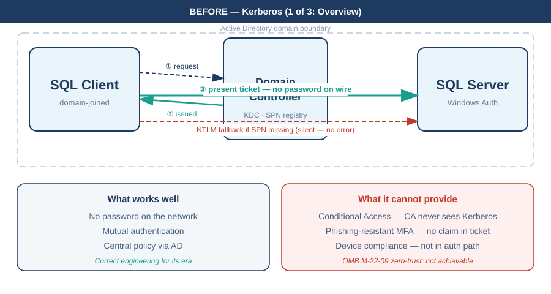
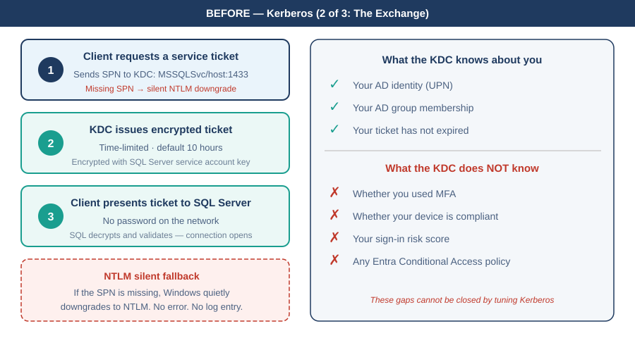
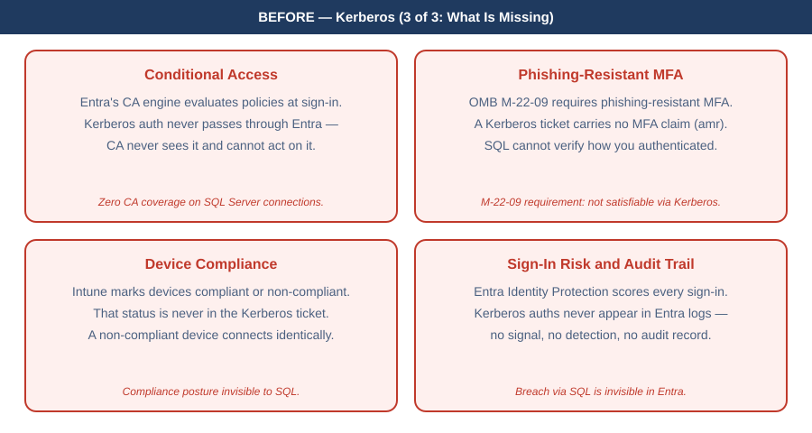
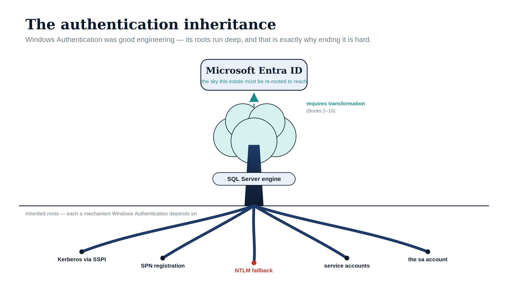

::: {.content-visible when-format="docx"}
# Book_01 — The Authentication Inheritance Problem
:::

::: {.callout-note}
SQL Server's Windows Authentication was an act of good engineering, not negligence. This book makes the case for replacement without making the case that what came before was foolish — a precise account of what Windows Authentication is, why it worked, and why it must now end. (UIAO_135 §1.2, ADR-068)
:::

{#fig-book-01-card-before-01 fig-alt="Card diagram on white background. Title: BEFORE — Kerberos (1 of 3: Overview). Three boxes: SQL Client left, Domain Controller KDC center, SQL Server right. Numbered arrows show the Kerberos ticket flow. Two-column bottom panel lists what works well versus what Kerberos cannot provide. Navy, teal, red palette." width="100%"}

{#fig-book-01-card-before-02 fig-alt="Card diagram on white background. Title: BEFORE — Kerberos (2 of 3: The Exchange). Left panel shows three numbered steps: AS-REQ, TGS-REQ with SPN badge, AP-REQ to SQL. Right panel: what the KDC knows versus what it does not know. Red dashed NTLM fallback note." width="100%"}

{#fig-book-01-card-before-03 fig-alt="Card diagram on white background. Title: BEFORE — Kerberos (3 of 3: What Is Missing). 2x2 grid of red gap cards: Conditional Access blind spot, Phishing-Resistant MFA absent, Device Compliance invisible, Sign-In Risk and Audit Trail zero." width="100%"}

{#fig-book-01-seq-kerberos fig-alt="UML sequence diagram on white background. Three vertical lifelines: SQL Client (navy), Domain Controller KDC (red dashed), SQL Server (navy). Seven numbered steps trace the Kerberos exchange. SPN badge highlights the service ticket request. Bottom panel explains the NTLM silent fallback and ADR-068 progressive NTLM elimination strategy." width="100%"}

{#fig-book-01-image-01 fig-alt="An illustrative figure on a white background showing a tree as a metaphor for inherited authentication. The trunk is labelled 'SQL Server engine' in navy; five navy roots descend below a ground line, tipped with labels 'Kerberos via SSPI', 'SPN registration', 'NTLM fallback' (in red), 'service accounts', and 'the sa account'. A teal-tinted canopy rises toward a light-blue card at the top reading 'Microsoft Entra ID — the sky this estate must be re-rooted to reach', connected by a dashed teal arrow labelled 'requires transformation (Books 2 to 10)'. Illustrative register (ADR-095): navy (#0D1B2E), teal (#1E8C8C), red (#C0392B) for NTLM; no photographs; 16:9 landscape." width="100%"}

::: {.callout-tip}
## Download this book
**[Book_01-bundle.docx](Book_01-bundle.docx)** — every chapter of this book concatenated into one Word document. Regenerated on every site deploy.
:::

## Chapters

::: {#book-chapters}
:::

::: {.callout-tip}
## Continue the series
[Index](index.qmd) · [Next: Book 02 — The Estate Itself →](Book_02.qmd)
:::
