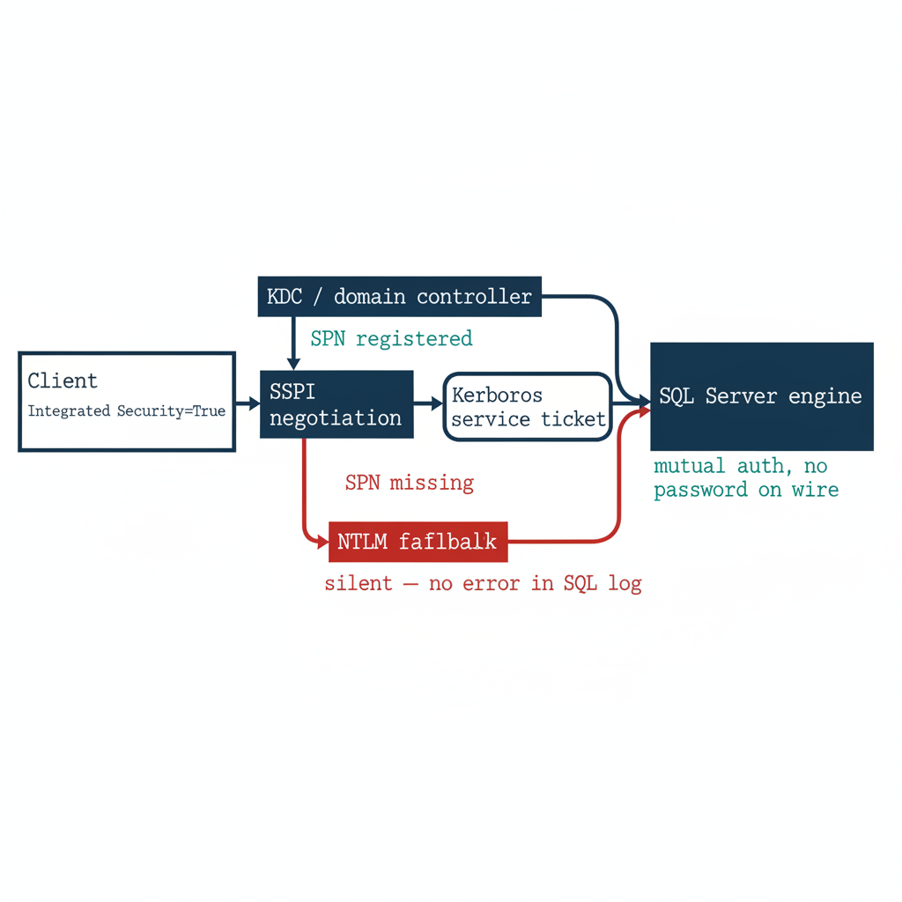

# Chapter 1 — What Windows Authentication Actually Is

*The inheritance, named precisely, before the case for replacing it.*

::: {.callout-note}
## In this chapter
How SQL Server delegates authentication to the Windows security subsystem through Kerberos and SSPI, why a missing SPN silently drops a connection to NTLM, what the service account and the `sa` account each contribute to the picture, and why this whole architecture was genuinely good engineering for the world it was designed for.
:::

## The Kerberos Foundation

SQL Server in Windows Authentication mode delegates authentication entirely to the Windows security subsystem. It does not implement its own password verification, its own cryptographic challenge-response, or its own session token model. When a client opens a connection with `Integrated Security=True`, the driver passes control to the Security Support Provider Interface — SSPI.

The SSPI layer examines the available authentication protocols and determines whether Kerberos is negotiable for the target server. If it is, SSPI requests a Kerberos service ticket from the Key Distribution Center — the domain controller's Kerberos service — scoped to the SQL Server's Service Principal Name. That ticket is presented to the SQL Server engine.

The engine validates the ticket's cryptographic signature using the session key derived from the service account's credentials, extracts the Kerberos principal, and maps it to a SQL Server login. No password has traversed the network. No credential has been stored in any application configuration file. The authentication is mutual: the client proves its identity to the server, and the server to the client, both through the shared authority of the domain's KDC. This is genuinely good security architecture, and it is important to say so plainly before explaining why it must be replaced.

{#fig-book-01-cpt-01-diagram-01 fig-alt="A horizontal engineering flow diagram on a white background. Left: a client box labeled 'Integrated Security=True' connects to an 'SSPI' negotiation box. From SSPI two paths diverge: an upper green path labeled 'SPN registered' goes to a 'KDC / domain controller' box that issues a 'Kerberos service ticket' to a 'SQL Server engine' box on the right, annotated 'mutual auth, no password on wire'; a lower red path labeled 'SPN missing' drops down to an 'NTLM fallback' box annotated 'silent — no error in SQL log'. The two paths both terminate at the SQL Server engine. Engineering blueprint style, white background, federal navy (#1F3A5F) for boxes and the Kerberos path, teal (#1A9E8F) for the success annotations, red (#C0392B) for the NTLM fallback path, monospace labels, no human figures, 16:9 landscape." width="100%"}

The SPN must be registered against the service account running the SQL Server engine process. The format for a SQL Server instance is `MSSQLSvc/hostname.domain.com:port`, and the registration binds the service account's long-term key — its password hash in the AD domain — to the service name, so the KDC can generate a valid ticket when a client requests one.

Without a correctly registered SPN, the KDC cannot issue a service ticket for the SQL Server endpoint. The SSPI layer on the client, having failed to negotiate Kerberos, silently falls back to the next available protocol. In most Windows environments, that next protocol is NTLM.

This silent fallback is the first and most consequential fault in the inheritance. It is invisible at the application layer, it produces no error in the SQL Server error log under default configuration, and it means that environments which believe with complete confidence that they are running Kerberos for their SQL Server connections are, in a significant fraction of those connections, running NTLM. The fraction can be measured — `Spec3-D1.8` (`Get-SQLServerAuthAudit.ps1`) is the instrument — but it cannot be known without measurement, and most federal environments have not measured it.

## The NTLM Fallback

NTLM is not a failure state that was tolerated by accident. In the early history of Windows networking, NTLM was the primary authentication protocol for all Windows workgroup and domain connections. When Kerberos was introduced in Windows 2000 as the preferred domain protocol, NTLM was retained as a compatibility fallback for scenarios where Kerberos was not negotiable — cross-domain connections without trust, connections from non-domain-joined clients, connections to servers the KDC could not locate.

SQL Server inherited this behavior without modification: SSPI negotiates the best available protocol, Kerberos first and NTLM second. For most workloads in most federal environments of the early 2000s and 2010s, this was perfectly adequate. NTLM provided authentication that was sufficient for the threat model of a perimeter-defended network where every client and server was a domain member.

The problem with NTLM is not that it was wrong for its time. The problem is that it does not scale to a modern zero-trust posture, and that posture is now a requirement of this program's FedRAMP-Moderate boundary, not an aspiration.

NTLM is a challenge-response protocol that embeds the entire authentication exchange within the connection negotiation itself. The server sends a challenge; the client responds with a hash of its credential and the challenge; the server validates the response. There is no token issued at the conclusion of this exchange, and no session assertion that can be presented to a third party for validation.

There is, therefore, no mechanism by which a Conditional Access policy engine — which lives in the Azure identity plane, outside the SQL Server connection path entirely — can observe the NTLM exchange, evaluate it against policy conditions such as device compliance or sign-in risk, and either permit or deny it. NTLM authentication succeeds or fails at the protocol layer, between client and server, and produces no artifact the Azure identity plane can observe, record, or control. (ADR-068)

## The Service Account

The SQL Server engine process runs under a service account. That account is the identity the engine presents when it makes network connections — when it accesses file shares, communicates with other instances via linked servers, or forwards log data to a monitoring sink. In federal environments, that account has historically taken one of three forms.

The first is a domain service account: a named Active Directory user with a non-expiring password, typically named something like `svc-sqlengine-prod`, with a password set at installation and changed infrequently or not at all. The second is a Group Managed Service Account (gMSA): a domain account whose password is managed automatically by Active Directory, rotated every 30 days, and never known to any human. The gMSA pattern is strictly better than the named account from a credential-hygiene perspective, but it is still AD-anchored — when the domain is removed from the architecture, the gMSA loses its governance foundation.

The third form is the `NT SERVICE\MSSQLSERVER` virtual account, a Windows-local account that uses the computer's domain account for network authentication. This pattern is also AD-anchored, because it is the domain-joined computer account that provides the Kerberos credential for network connections.

In every one of these patterns, Active Directory is the identity authority for the engine process. The engine's ability to authenticate to any network resource depends on AD. When the directory modernization program removes AD as the authoritative identity source, the service account pattern loses its foundation, and the engine must acquire a new identity — the system-assigned Managed Identity that Arc provides for the host. That transition is the subject of Book 04.

## The sa Account

Alongside Windows Authentication, SQL Server has always supported a second mode: SQL Authentication, which uses credentials stored in SQL Server's own `master` database rather than in Active Directory. The `sa` account — system administrator — is the built-in SQL Authentication login present on every instance at installation.

In a well-governed environment, `sa` is disabled, renamed, or both; its password is long and random; and it is never used for routine operations. In practice, many federal environments carry active `sa` accounts as emergency-access mechanisms, often with passwords set at installation and never rotated, on the logic that if AD becomes unavailable, `sa` provides a path back into the instance.

This is understandable logic, but it produces a serious posture problem. SQL Authentication, unlike Windows Authentication, produces no Entra ID sign-in events. A connection using SQL Authentication is invisible to the Azure identity plane: there is no Conditional Access policy that can intercept it, no Defender for Identity signal, no sign-in risk assessment. SQL Authentication is a completely opaque path from the perspective of the modern identity plane, and the `sa` account, if active, is the most dangerous entry point on the instance. Its handling is one of the decisions ADR-091 formalizes.

## Why This Was Correct

The full picture — Kerberos negotiation via SSPI, SPN registration against the service account, NTLM fallback, domain service accounts and gMSAs, SQL Authentication as a local fallback — is a coherent and defensible architecture.

In a fully domain-joined world with a working KDC, correctly registered SPNs, and a client population consisting entirely of domain members, Windows Authentication was centrally managed through Active Directory, non-repudiable at the Kerberos ticket level, and resistant to credential theft in the network path. It required no infrastructure beyond the domain controller that already existed for every other authentication purpose in the environment.

It was not a security compromise. It was the application of the existing, well-understood Windows security substrate to the SQL Server authentication problem, and for the world that substrate was designed for, it was the right answer. The problem is not the design. The problem is that the world it was designed for — every client domain-joined, every server domain-joined, the perimeter as the security boundary, no cloud identity plane — no longer exists and cannot be made to exist again. (UIAO_135 §1.2)

::: {.callout-tip title="Division of labor"}
**Microsoft provides:** Entra ID as the replacement authentication plane; Arc Managed Identity for the engine process; OAuth 2.0 token validation in SQL Server 2022; NTLM auditing and enforcement controls; Conditional Access policy enforcement.

**What only you can provide:** the complete estate inventory; the per-instance SPN audit that surfaces silent NTLM fallback; the service-account-to-Managed-Identity mapping; the sequencing plan that coordinates authentication migration with domain consolidation.
:::

::: {.callout-note title="What Book 01 establishes — Chapter 1"}
SQL Server Windows Authentication delegates entirely to the Windows security subsystem: Kerberos via SSPI when an SPN is registered, silent NTLM fallback when it is not. The engine process and the `sa` account are both anchored to authorities — Active Directory and `master` respectively — that the modernization program removes or renders invisible to the Azure identity plane. None of this was a mistake. It was correct engineering for a fully domain-joined world that no longer exists.
:::
