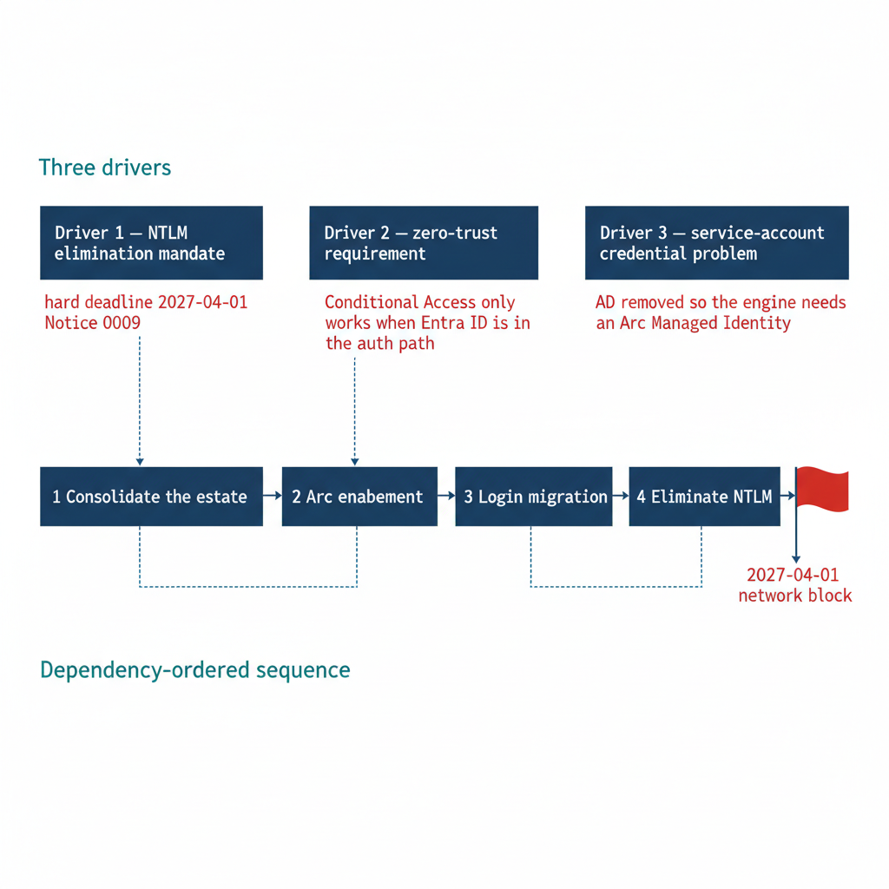

# Chapter 2 — Why the Inheritance Must End

*Three drivers, each as well-reasoned as the original design, and their dependency structure.*

::: {.callout-note}
## In this chapter
The three forces that now require replacing Windows Authentication for SQL Server — the NTLM elimination mandate with its hard 2027-04-01 deadline, the zero-trust requirement that puts the Azure identity plane in the authentication path, and the service-account credential problem created by the broader directory modernization — and why their dependency structure dictates the order of the entire series.
:::

That replacement is now necessary, and the reasons are as well-reasoned as the original design choices were. The NTLM elimination mandate, the zero-trust requirement that Conditional Access policies sit in the authentication path for all human access, and the collapse of the domain-joined world as the universal substrate for federal computing are not organizational preferences. They are architectural inevitabilities driven by Notice 0009, UIAO_135 §1.2, and the FedRAMP-Moderate requirements that govern this program's boundary.

{#fig-book-01-cpt-02-diagram-01 fig-alt="An engineering diagram on a white background in two stacked bands. The top band, titled Three drivers, shows three boxes side by side: Driver 1 — NTLM elimination mandate, annotated hard deadline 2027-04-01 Notice 0009; Driver 2 — zero-trust requirement, annotated Conditional Access only works when Entra ID is in the auth path; Driver 3 — service-account credential problem, annotated AD removed so the engine needs an Arc Managed Identity. The bottom band, titled Dependency-ordered sequence, shows a left-to-right arrow chain of four numbered stages: 1 Consolidate the estate, 2 Arc enablement, 3 Login migration, 4 Eliminate NTLM, ending in a flag marker labeled 2027-04-01 network block. Thin connector lines link each top driver down to the stage it forces. Engineering blueprint style, white background, federal navy #1F3A5F for boxes and the sequence chain, red #C0392B for the 2027-04-01 deadline markers, teal #1A9E8F for the band titles, monospace labels, no human figures, 16:9 landscape." width="85%"}

## Driver One — The NTLM Elimination Mandate

The first driver is not a choice made by this program — it is a deadline imposed on it. ADR-068 (Kerberos / NTLM Elimination), accepted 2026-05-13, implements the NTLM elimination mandate of Notice 0009. The mandate distinguishes NTLMv1 from NTLMv2 because they present different risk profiles and require different timelines, but both are eliminated.

NTLMv1 is blocked immediately upon ADR-068 adoption: the Group Policy value for "Network Security: LAN Manager Authentication Level" is set to "Send NTLMv2 response only; refuse LM and NTLM," and any connection attempt requiring NTLMv1 fails at the domain level. This is not a future concern. If ADR-068 has been adopted in the program's environment, NTLMv1 is already blocked, and a SQL Server connection that generates NTLMv1 traffic — which would require a very old client or a misconfigured application — is already failing. (ADR-068)

NTLMv2 has a longer runway but a hard deadline: 2027-04-01. After that date, Notice 0009 requires NTLM to be blocked domain-wide, and ADR-068 Phase C implements that block. Any SQL Server connection that relies on NTLMv2 — because an SPN is missing, because the client cannot negotiate Kerberos, because the connection crosses a trust boundary, or because the host has already been migrated to a non-domain-joined state — will fail after 2027-04-01.

Not "may fail" or "should be migrated before failing" — will fail, at the network layer, before the SQL Server engine receives the connection. The 2027-04-01 deadline is not a completion date for the SQL Server authentication migration; it is a date by which the migration must already be complete.

The migration itself must occur earlier. The timeline needed to execute the consolidation, the Arc deployment, the login migration, and the application connection-string migration all have a hard backstop at 2027-04-01. (ADR-068, Notice 0009)

## Driver Two — The Zero-Trust Requirement

The second driver is architectural: the zero-trust posture required by this program's FedRAMP-Moderate boundary cannot be implemented without the Azure identity plane in the authentication path for SQL Server connections.

Conditional Access policies enforce device compliance, network-location restrictions, MFA completion, and sign-in risk thresholds by intercepting the token issuance request that occurs when a principal authenticates to Entra ID. If the authentication protocol is Kerberos or NTLM, there is no token issuance request. The authentication completes entirely within the Windows security subsystem, and the Azure identity plane is not in the path at any point.

A database administrator connecting to a production SQL Server from an unmanaged personal device, from a network outside the program's named locations, or with an elevated sign-in risk signal cannot be blocked by a Conditional Access policy if the authentication protocol is Kerberos or NTLM. The policy has no visibility and no leverage point.

Entra ID authentication for SQL Server changes this entirely. When a principal authenticates using an Entra ID-issued OAuth 2.0 access token, the token issuance request passes through the Entra ID authentication service, which evaluates all applicable Conditional Access policies before the token is issued.

If a policy requires MFA and the principal has not completed it, the token is denied and the connection never opens. If a policy requires a compliant device and the client is not registered or is out of compliance, the token is denied. If the sign-in risk level is elevated — an anonymous IP, or an account flagged by Entra ID Protection — the token is denied or a remediation challenge is triggered. In every case, the Conditional Access policy has real enforcement leverage, because the token it controls is the credential SQL Server accepts. This is the zero-trust identity anchoring the program requires. (ADR-008, ADR-068)

## Driver Three — The Service Account Credential Problem

The third driver is a consequence of the broader directory modernization this series is embedded within. The OrgPath substrate and UIAO_135 collectively describe a transformation in which Active Directory is removed as the authoritative identity source for this program's environment.

When that transformation completes, the AD service accounts and gMSAs that currently authorize the SQL Server engine process for network access lose their governance foundation. They are objects in a directory that no longer exists as an authoritative identity source. The engine must acquire a new identity before that removal occurs.

The only credential-free, cloud-native identity available for an on-premises server in this architecture is the system-assigned Managed Identity that the Azure Arc Connected Machine agent provides. Arc deployment is therefore not an optional enhancement for SQL Server hosts; it is a prerequisite for the service-account migration the engine requires before the directory modernization can complete.

The sequencing implication follows directly from the dependency structure of these three drivers — and, before any of them, from the consolidation decision of Book 02. You assess and consolidate the estate first, so effort is spent only on instances that survive; then Arc enablement; then the login migration; then NTLM elimination. That order is the architecture of this series. (ADR-002, UIAO_135 Transformation #7)

::: {.callout-note title="What Book 01 establishes — Chapter 2"}
Three independent drivers require ending the Windows Authentication inheritance: a mandatory NTLM elimination deadline of 2027-04-01 (ADR-068, Notice 0009), a zero-trust posture that only works when the Azure identity plane is in the authentication path (ADR-008), and a service-account credential problem created by AD's removal that only an Arc Managed Identity can solve (ADR-002). Their dependency structure — consolidate, then Arc, then migrate logins, then eliminate NTLM — sets the order of the books that follow.
:::
