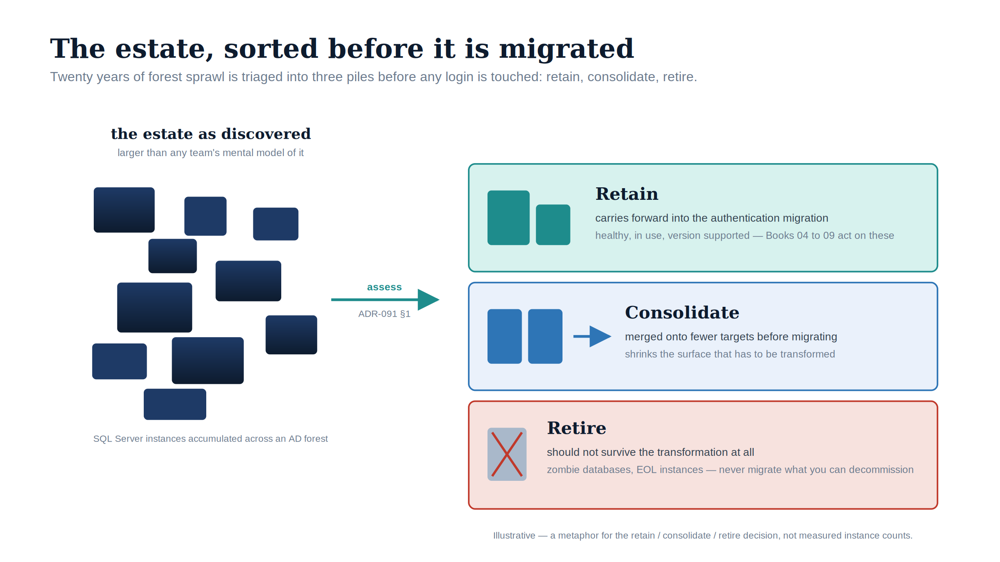

::: {.content-visible when-format="docx"}
# Book_02 — The Estate Itself
:::

::: {.callout-note}
You do not migrate the estate in the shape you discover it. After twenty years across an Active Directory forest, the SQL Server estate is larger and more tangled than any team's mental model of it — and a significant fraction of it should not survive the transformation at all. This book establishes the consolidation assessment that classifies every instance **retain**, **consolidate**, or **retire** before any login is touched. (ADR-091 §1)
:::

{#fig-book-02-image-01 fig-alt="An illustrative figure on a white background. On the left, a loose scatter of navy rectangles of varying sizes labelled 'the estate as discovered — larger than any team's mental model of it' and 'SQL Server instances accumulated across an AD forest'. A teal arrow labelled 'assess (ADR-091 §1)' points right to three stacked, colour-coded panels. The top teal panel reads 'Retain — carries forward into the authentication migration; healthy, in use, version supported — Books 04 to 09 act on these'. The middle ice-blue panel reads 'Consolidate — merged onto fewer targets before migrating; shrinks the surface that has to be transformed'. The bottom red-tinted panel reads 'Retire — should not survive the transformation at all; zombie databases, EOL instances — never migrate what you can decommission'. Illustrative register (ADR-095): navy (#0D1B2E) for instances, teal (#1E8C8C) for retain, blue (#2E75B6) for consolidate, red (#C0392B) for retire; no photographs; 16:9 landscape. A footer line notes the figure is illustrative — a metaphor for the decision, not measured instance counts." width="100%"}

::: {.callout-tip}
## Download this book
**[Book_02-bundle.docx](https://github.com/WhalerMike/uiao/releases/download/downloads-latest/sql-server-narrative-Book_02-bundle.docx)** — every chapter of this book concatenated into one Word document. Regenerated on every site deploy.
:::

## Chapters

::: {#book-chapters}
:::

::: {.callout-tip}
## Continue the series
[← Previous: Book 01 — The Authentication Inheritance Problem](Book_01.qmd) · [Index](index.qmd) · [Next: Book 03 — Discovery →](Book_03.qmd)
:::
