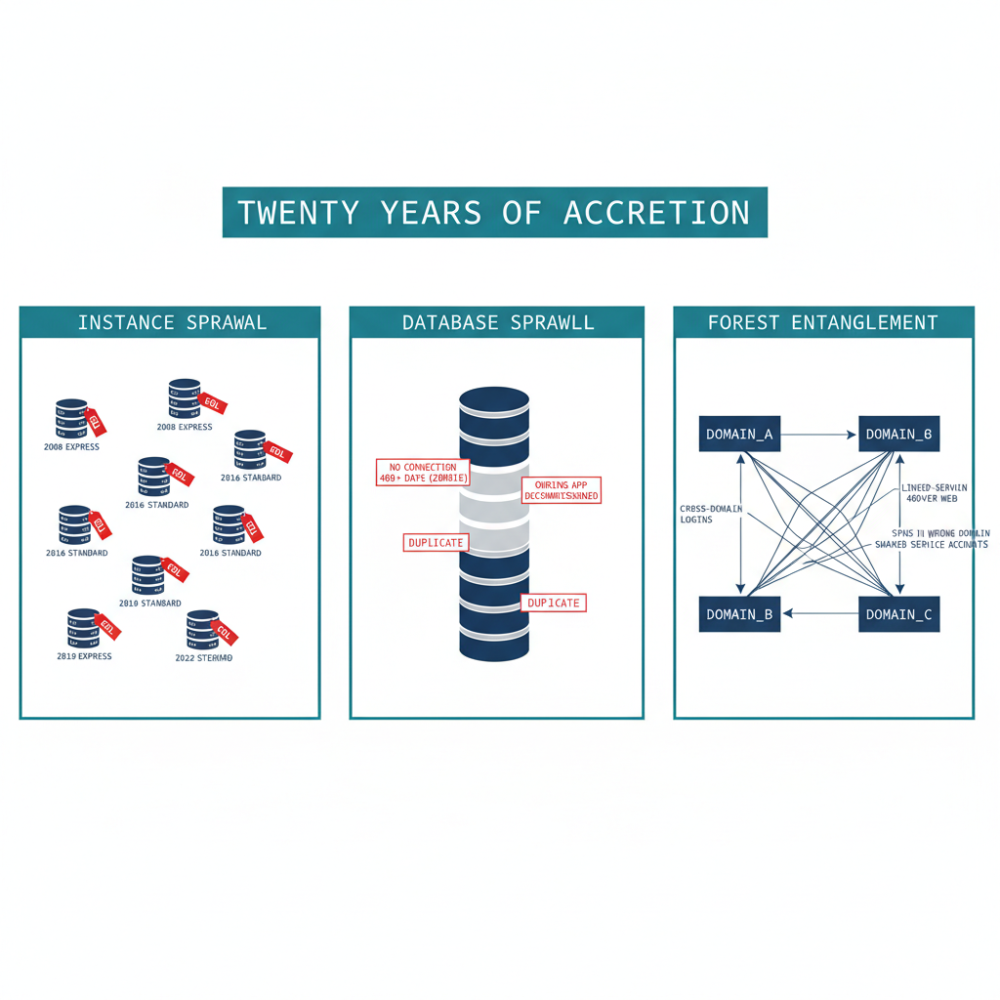

# Chapter 1 — The Shape of Twenty Years

*Why the estate you must transform is not the estate anyone remembers building.*

::: {.callout-note}
## In this chapter
The three forms of sprawl that accumulate in a SQL Server estate over two decades across an Active Directory forest — instance sprawl, database sprawl, and forest entanglement — and why an authentication transformation that begins before this sprawl is assessed will migrate the authentication of servers that should not survive the transformation at all.
:::

The previous book named the inheritance and the three drivers that require ending it. This book confronts a precondition that most authentication narratives skip entirely: you cannot migrate the authentication of an estate you have not first measured and rationalized. After twenty years across an Active Directory forest, the SQL Server estate is larger, older, and more entangled than any single team's mental model of it — and a meaningful fraction of it should not survive the transformation in its current shape.

The order matters because effort is finite and the 2027-04-01 deadline is fixed. Migrating the logins of an instance to Entra ID, only to retire that instance three months later, is wasted work measured against a deadline that does not move. ADR-091 §1 makes the sequencing normative: the consolidation assessment classifies every instance **retain**, **consolidate**, or **retire** before any login is touched.

## Instance Sprawl

A SQL Server estate does not grow by design. It grows by accretion. A development instance becomes a production instance because a project shipped and nobody rebuilt it on the production tier. A test instance set up for a vendor evaluation is never decommissioned. An application installer silently provisions a SQL Server Express instance on an application server, and that instance accumulates real data for years without ever appearing on a DBA team's inventory.

The result, in a mature federal environment, is a population of instances spanning every SQL Server version released across two decades — 2008, 2012, 2014, 2016, 2017, 2019, and 2022 — in every edition, from Express on a workstation to Enterprise on a clustered host. Several of those versions are out of support and receive no security updates. The licensing posture is equally heterogeneous: a mix of Standard and Enterprise cores, some covered by Software Assurance and some not, with no single authority that can state how many cores the estate actually consumes.

Instance sprawl is the first thing the assessment must quantify, because the count of instances — and especially the count of *unknown* instances — determines the true scope of the transformation. An estate that the DBA team believes contains forty instances and the discovery sweep reveals to contain a hundred and ten is not forty instances behind schedule; it is operating on a scope estimate that is wrong by a factor of nearly three.

{#fig-book-02-cpt-01-diagram-01 fig-alt="A three-panel engineering diagram on a white background, panels arranged left to right under a single title band reading 'Twenty years of accretion'. Panel 1 'Instance sprawl': a scatter of small server icons of varying sizes labeled with version years 2008, 2012, 2016, 2019, 2022 and editions Express/Standard/Enterprise, several marked with a small red 'EOL' tag. Panel 2 'Database sprawl': a stack of database cylinders, some greyed-out and tagged 'no connection 400+ days (zombie)', some tagged 'duplicate', one tagged 'owning app decommissioned'. Panel 3 'Forest entanglement': three domain boxes connected by trust arrows, with tangled lines between them labeled 'cross-domain logins', 'linked-server web', 'SPNs in wrong domain', 'shared service accounts'. Engineering blueprint style, white background, federal navy (#1F3A5F) for healthy elements, red (#C0392B) for EOL and zombie tags, teal (#1A9E8F) for the title band and panel labels, monospace labels, no human figures, 16:9 landscape." width="90%"}

## Database Sprawl

Beneath the instances lies a second layer of accretion: the databases themselves. An instance that has run for fifteen years carries databases nobody can confidently account for. Some are *orphaned* — the application that created them has been decommissioned, but the database was never dropped because no one was certain it was safe to do so. Some are *zombies* — they have received no connection in over a year, yet they consume storage, appear in backup jobs, and lengthen every maintenance window. Some are near-duplicates, the residue of a migration that copied a database to a new name and never removed the original.

Database sprawl matters to the authentication transformation for a specific reason. Every database is a potential source of logins, and every login is a unit of migration work. A zombie database may map a long-forgotten SQL Authentication service account that still has a valid password and still appears, to a discovery script, as an active credential requiring migration. The fastest way to reduce the migration surface is not to migrate faster — it is to retire the databases and instances that should not be migrated at all.

Zombie detection is therefore not a housekeeping nicety; it is migration-scope reduction. A database with no connections in four hundred days, no recent backups consumed for a restore, and an owning application that the application portfolio lists as retired is a database whose logins should never enter the migration pipeline.

## Forest Entanglement

The third form of sprawl is the one that makes the SQL Server transformation genuinely harder than a single-domain migration: the estate is entangled with the Active Directory forest it grew up in. Instances are spread across multiple domains connected by trusts. Logins on one instance resolve to security principals in a different domain. Linked-server definitions form a web of cross-instance dependencies that crosses domain boundaries, and the service accounts running the engine processes are drawn from several domains with no consistent naming or governance.

This entanglement is precisely what the directory modernization removes the foundation for. When Active Directory ceases to be the authoritative identity source, every cross-domain login, every SPN registered in a domain that is being collapsed, and every shared service account becomes a dependency that must be resolved — not merely re-pointed. Consolidation is the moment when that resolution is cheapest, because collapsing many instances into fewer modern targets is also the moment to collapse the cross-domain identity sprawl into Entra-backed identity.

The shape of twenty years, then, is three overlapping problems: too many instances, too many databases, and too many forest-spanning dependencies between them. The chapters that follow describe how to measure each, and how to turn the measurement into the **retain / consolidate / retire** decision that gates everything in Books 03 through 10.

::: {.callout-note title="What Book 02 establishes — Chapter 1"}
A twenty-year SQL Server estate exhibits three overlapping forms of sprawl: instance sprawl (many unknown instances across many versions and editions, several out of support), database sprawl (orphaned and zombie databases that inflate the migration surface), and forest entanglement (cross-domain logins, linked-server webs, and shared service accounts). The authentication transformation must not begin until this sprawl is assessed, because a significant fraction of the estate should be retired or consolidated rather than migrated. (ADR-091 §1)
:::
