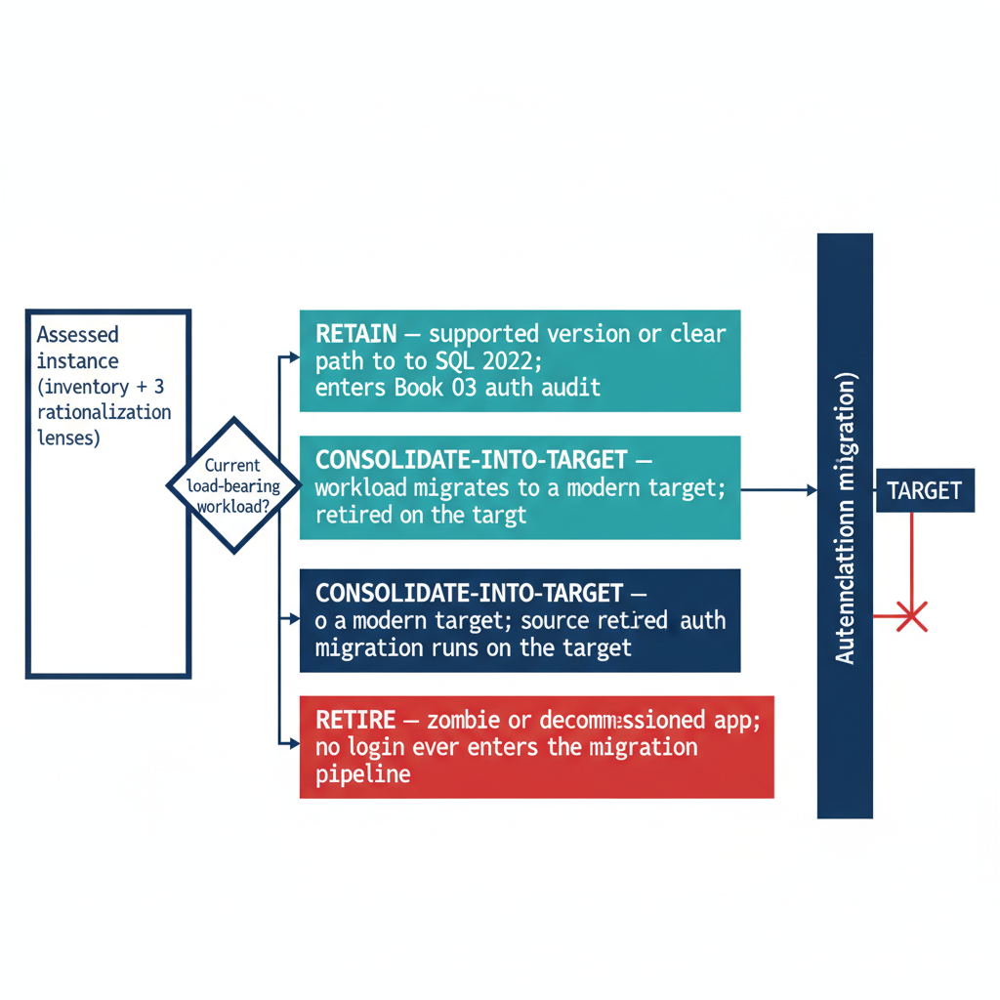

# Chapter 4 — The Retain, Consolidate, Retire Decision

*The gate that determines which instances enter the authentication migration at all.*

::: {.callout-note}
## In this chapter
How the three rationalization lenses resolve into a single per-instance classification — retain, consolidate-into-target, or retire — the target-state options that absorb consolidated workloads, the constraints that prevent consolidation, and why this decision is the moment to collapse the forest-spanning identity sprawl into Entra-backed identity. (ADR-091 §1)
:::

The assessment now resolves to a decision. Every instance the inventory surfaced and the rationalization lenses evaluated is assigned one of three classifications, and that classification governs whether the instance enters the authentication migration that Books 03 through 10 describe. ADR-091 §1 makes the classification a normative prerequisite: engine-layer authentication migration is performed only on instances classified **retain** or on the **consolidation targets** that absorb consolidated workloads. Instances classified **retire** or **consolidate-into-target (source)** are not migrated — they are decommissioned or collapsed.

## The Three Classifications

A **retain** instance survives the transformation roughly in place. It carries current, load-bearing workload; it is on a supported version or has a clear in-place upgrade path to SQL Server 2022; and its dependencies do not argue for collapsing it into something larger. A retain instance proceeds directly into the Book 03 authentication audit and the Arc-eligibility classification.

A **consolidate-into-target** instance does not survive as an instance, but its workload does. The databases it carries are migrated onto a modern consolidation target, and the source instance is then retired. This is the classification for the large middle of an aged estate: lightly utilized instances, out-of-support engines whose workload is still needed, and instances whose only real function is to host one or two databases that belong on a shared platform. The migration work for these instances happens at the database-and-workload level; the authentication migration is performed on the *target*, not the source.

A **retire** instance does not survive at all, and neither does its workload. Zombie instances, instances whose every database is a zombie, and instances whose owning applications are decommissioned are retired outright. No login on a retire instance ever enters the migration pipeline — which is the entire point of running this assessment before the migration rather than after it.

{#fig-book-02-cpt-04-diagram-01 fig-alt="A decision-flow diagram on a white background. At the left, a single input box 'Assessed instance (inventory + 3 rationalization lenses)'. It flows into a diamond decision node 'Current load-bearing workload?'. Three labeled output paths lead to three outcome boxes arranged vertically: top, teal, 'RETAIN — supported version or clear path to SQL 2022; enters Book 03 auth audit'; middle, navy, 'CONSOLIDATE-INTO-TARGET — workload migrates to a modern target; source retired; auth migration runs on the target'; bottom, red, 'RETIRE — zombie or decommissioned app; no login ever enters the migration pipeline'. To the right, a vertical gate bar labeled 'Authentication migration (Books 03-10)' that only the RETAIN box and a TARGET box (drawn as absorbing the CONSOLIDATE arrow) pass through; the RETIRE box is blocked by the gate. Engineering blueprint style, white background, federal navy (#1F3A5F), teal (#1A9E8F) for retain, red (#C0392B) for retire, monospace labels, no human figures, 16:9 landscape." width="90%"}

## Target-State Options

A consolidation target is the platform that absorbs consolidated workloads, and the assessment chooses among a small set of options based on the workload profile and the program's boundary posture. Collapsing many instances onto fewer modern SQL Server 2022 instances — through instance stacking or database consolidation onto a shared engine — is the most direct path and keeps the workload on infrastructure the program already operates. Azure SQL Managed Instance offers a near-full-compatibility platform-as-a-service target for workloads that can move to a managed surface, eliminating the host and much of the patching burden. Azure SQL Database and elastic pools suit workloads that have been modernized to the database-scoped feature set.

The target choice interacts with the rest of the series. A consolidation onto SQL Server 2022 on an Arc-enabled host is exactly the Category 1 starting position that Book 03 describes and Book 05 migrates. A consolidation onto Azure SQL Managed Instance changes the authentication story in detail — the Managed Instance is natively Entra-integrated — but not in principle, because the destination is still Entra ID-only authentication. The point of naming the target during the assessment is that the authentication migration is then performed once, on the target, in its final shape, rather than twice.

## What Cannot Be Consolidated

Not every instance that looks like a consolidation candidate can actually be consolidated, and the assessment must record the constraints honestly. Collation conflicts between databases that must coexist on a shared instance can block stacking. Version-locked vendor applications that certify only against a specific SQL Server version cannot be moved to a newer engine without losing vendor support. Compliance-isolation requirements — a database whose data classification mandates physical or logical separation — can prevent co-residency regardless of technical compatibility. And cross-database or cross-instance dependencies that the dependency map surfaced can make two instances a single indivisible unit that must move together or not at all.

Each of these constraints converts an apparent consolidate candidate into either a constrained-consolidation case (move it, but onto a dedicated rather than shared target) or a retain case (leave it in place and migrate its authentication where it sits). Recording the constraint is what makes the consolidation plan executable rather than aspirational.

## The Identity Dividend

Consolidation and the authentication transformation are mutually reinforcing, and the assessment is the moment to realize the connection. Collapsing many instances across multiple domains into fewer modern targets is also the moment to collapse the forest-spanning identity sprawl that Chapter 1 described. The cross-domain logins, the orphaned SPNs registered in domains being decommissioned, and the shared service accounts drawn from several domains do not need to be re-pointed instance by instance if the instances carrying them are being retired or consolidated. They are resolved once, at the target, into Entra-backed identity.

This is why the consolidation decision gates the authentication migration rather than running alongside it. The retain instances and the consolidation targets are the surface on which Books 03 through 10 operate; everything classified retire or consolidate-source falls away before that work begins, and the forest entanglement falls away with it. ADR-091 §1 records this ordering as canon: assess and consolidate first, so the authentication transformation is spent only on the estate that survives.

::: {.callout-note title="What Book 02 establishes — Chapter 4"}
Every assessed instance is classified retain, consolidate-into-target, or retire, and only retain instances and consolidation targets enter the authentication migration. Targets are chosen from SQL Server 2022 on Arc-enabled hosts, Azure SQL Managed Instance, or Azure SQL Database, with the choice made during the assessment so authentication is migrated once, in final shape. Collation conflicts, version-locked vendor apps, compliance isolation, and indivisible dependency clusters constrain what can consolidate. Consolidation is the moment to collapse forest-spanning identity sprawl into Entra-backed identity — which is why ADR-091 §1 makes this decision the gate for everything that follows.
:::
