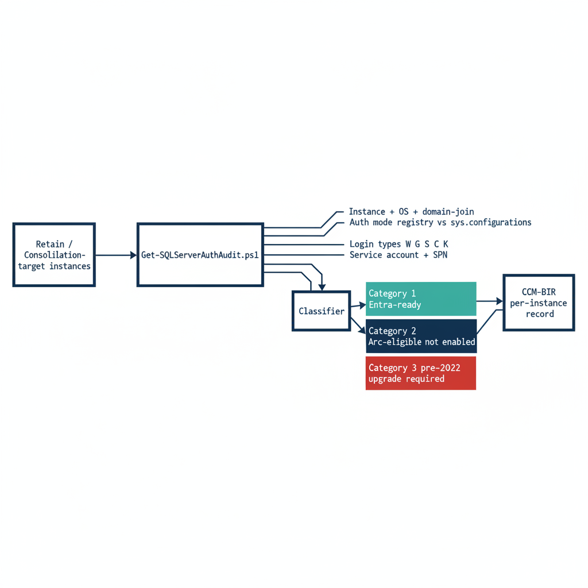

# Chapter 1 — Get-SQLServerAuthAudit.ps1: What It Measures and Why

*The instrument that turns the surviving estate into a structured, drift-aware authentication record.*

::: {.callout-note}
## In this chapter
What `Get-SQLServerAuthAudit.ps1` enumerates across the surviving estate, how it reads the authentication-mode configuration and classifies every login by type, how it captures the engine service-account identity and SPN registration, the three-category Arc-eligibility classification that drives migration sequencing, and why the script's output feeds the CCM-BIR pipeline rather than a spreadsheet.
:::

This audit runs only on the instances Book 02 classified as **retain** or **consolidation-target** — the rationalization decision has already removed the zombies and retirees from scope before a single line of enumeration runs.

{#fig-book-03-cpt-01-diagram-01 fig-alt="A horizontal engineering flow diagram on a white background. Left: a box labeled 'Retain / Consolidation-target instances' feeds into a central 'Get-SQLServerAuthAudit.ps1' box. From the central box four capture lanes branch right in navy: 'Instance + OS + domain-join', 'Auth mode registry vs sys.configurations', 'Login types W G S C K', and 'Service account + SPN'. These converge on a classifier box that outputs three stacked category boxes: a teal 'Category 1 Entra-ready', a navy 'Category 2 Arc-eligible not enabled', and a red 'Category 3 pre-2022 upgrade required'. All three flow into a final box labeled 'CCM-BIR per-instance record'. Engineering blueprint style, white background, federal navy (#1F3A5F), red (#C0392B) for problems, teal (#1A9E8F) for valid/ready, monospace labels, no human figures, 16:9 landscape." width="85%"}

## Scope of the Enumeration

`Get-SQLServerAuthAudit.ps1` performs a structured enumeration of the SQL Server estate across all hosts in the program's management scope. For each host it identifies every SQL Server instance — named instances and the default instance — along with the version, edition, and build number.

The host operating system version is captured because it determines the Arc capability envelope. Windows Server 2019 and 2022 support the Connected Machine agent, and therefore support Arc-based Managed Identity for the SQL Server engine process. They do not, however, support the `AADLoginForWindows` OS-level Entra login extension, which requires Windows Server 2025. Windows Server 2025 supports both capabilities.

That distinction matters for migration sequencing, and the audit captures it explicitly. The domain-join status of the host is recorded alongside it: a host already migrated to a non-domain-joined state under the ADR-002 server transformation occupies a different starting position than a domain-joined host, and the per-instance output must reflect that.

Arc-enablement status — whether the Connected Machine agent is installed and the system-assigned Managed Identity is available — is the single most consequential classification output for migration prioritization. (Spec3-D1.8)

## Authentication Mode Configuration

For each instance the script reads the authentication-mode configuration. SQL Server supports two modes: Windows Authentication Only and Mixed Mode. In Windows Authentication Only mode, SQL Authentication logins are rejected at the connection level — no SQL Authentication credential is accepted regardless of whether a matching login exists in `master`. In Mixed Mode, both Windows Authentication and SQL Authentication are accepted.

The mode is stored in the Windows registry at `HKLM:\SOFTWARE\Microsoft\Microsoft SQL Server\[InstanceName]\MSSQLServer\LoginMode`: a value of `1` indicates Windows Authentication Only, and a value of `2` indicates Mixed Mode.

The audit reads this value directly and also cross-references it against the `sys.configurations` view within the instance. Discrepancies between the registry value and the running configuration can occur after a manual reconfiguration without a service restart. Any discrepancy is flagged as an anomaly requiring resolution before the migration can proceed.

## Login Type Classification

The script connects to each instance and queries the `sys.server_principals` system view to enumerate all logins. Each login is classified by type: Windows logins derived from individual AD user accounts (type `W`, mapped by SID to an AD user object); Windows logins derived from AD security groups (type `G`, mapped by SID to an AD group object); SQL Authentication logins with credentials stored in `master` (type `S`); certificate-mapped logins (type `C`); and asymmetric key-mapped logins (type `K`).

The count and identity of each type is reported per instance. The presence of active SQL Authentication logins — type `S` — is a critical finding, because these logins are invisible to the Azure identity plane.

Such logins must be either migrated to Entra ID equivalents — type `E`, `FROM EXTERNAL PROVIDER` logins created in Book 04 — or formally excepted with documented justification before Transformation #7 can be declared closed.

The `sa` account's status is separately flagged: enabled, disabled, or renamed. An enabled `sa` account with a non-rotated password is the highest-priority remediation finding in the audit output.

## Service Account Identity and SPN Registration

The script captures the identity of the Windows service account running the SQL Server engine process — the `MSSQLSERVER` service or its named-instance equivalent — by querying the service configuration. This identifies whether the engine runs as a domain service account, a gMSA, the `NT SERVICE\MSSQLSERVER` virtual account, or another identity.

It then queries Active Directory — using the `Get-ADServiceAccount` and `setspn` equivalents — to determine whether the correct SPN is registered for the service account and the instance endpoint.

The SPN check is one of the most operationally valuable outputs of the audit. SPN misconfiguration is the primary cause of NTLM fallback, and it is not visible without deliberately querying AD for it.

An instance with a missing or incorrect SPN is generating NTLM traffic for every connection that expects Kerberos — and in most cases, the application teams generating those connections do not know it. (Spec3-D1.8, ADR-068)

## The Arc-Eligibility Output

The most consequential output of the audit is the Arc-eligibility classification it assigns to every instance. Every instance falls into one of three categories.

Category 1 is Arc-eligible and Entra-auth-ready today: the server is already running the Connected Machine agent, the Azure extension for SQL Server has been deployed, the system-assigned Managed Identity is available for the engine process, and the SQL Server version is 2022 or later. A Category 1 instance can have its Entra ID logins created and its login migration begun immediately — it requires no further infrastructure work before Book 04's migration pattern can be applied.

Category 2 is Arc-eligible but not yet enabled: the host meets all the prerequisites for Arc enablement — Windows Server 2019 or later, network connectivity to the Azure Arc endpoint, SQL Server 2022 — but the Connected Machine agent has not been installed. A Category 2 instance requires Arc deployment as the prerequisite action before login migration can begin.

Category 3 is not yet Arc-eligible. Either the SQL Server version is pre-2022 — 2019, 2017, or earlier — which means the engine cannot accept `FROM EXTERNAL PROVIDER` logins regardless of Arc status, or the host has a configuration that prevents Arc enrollment.

A Category 3 instance requires a SQL Server version upgrade as the gate before any Entra-auth migration can occur, and that upgrade timeline must be factored into the overall program sequencing against the 2027-04-01 NTLM deadline.

## The CCM-BIR Telemetry Sink

The audit script's output is not a standalone deliverable — it is the input to the CCM-BIR ingestion pipeline. This is the architectural characteristic that distinguishes Spec3-D1.8 from a conventional discovery script.

The CCM-BIR — Continuous Compliance Monitoring, Boundary Identity Record — is the program-level tracking system for SQL Server authentication state at the instance level. Each time the audit runs — and it is designed to run continuously, on a schedule, against the full estate — it produces a structured record per instance that the CCM-BIR pipeline ingests.

That pipeline computes the current authentication posture of the instance, compares it to the previous record, and flags any drift: a new SQL Authentication login that appeared since the last scan, an instance that has reverted from Entra-only authentication back to Mixed Mode, a new linked-server definition that uses NTLM passthrough.

Drift events in the CCM-BIR are not informational — they are compliance violations that trigger the program's remediation workflow. The output mandated by ADR-068 is a CCM-BIR record per instance, not a spreadsheet delivered to a program manager. (ADR-068, Spec3-D1.8)

::: {.callout-note title="What Book 03 establishes — Chapter 1"}
`Get-SQLServerAuthAudit.ps1` (Spec3-D1.8) enumerates the surviving estate — instances, version and OS, domain-join status, authentication mode, login types, and engine service-account and SPN posture — and assigns every instance a three-category Arc-eligibility classification: Entra-ready today (Category 1), Arc-eligible but not enabled (Category 2), or version-upgrade-required (Category 3). Its output is not a spreadsheet but a per-instance CCM-BIR record that establishes a continuous, drift-aware authentication baseline under ADR-068.
:::
