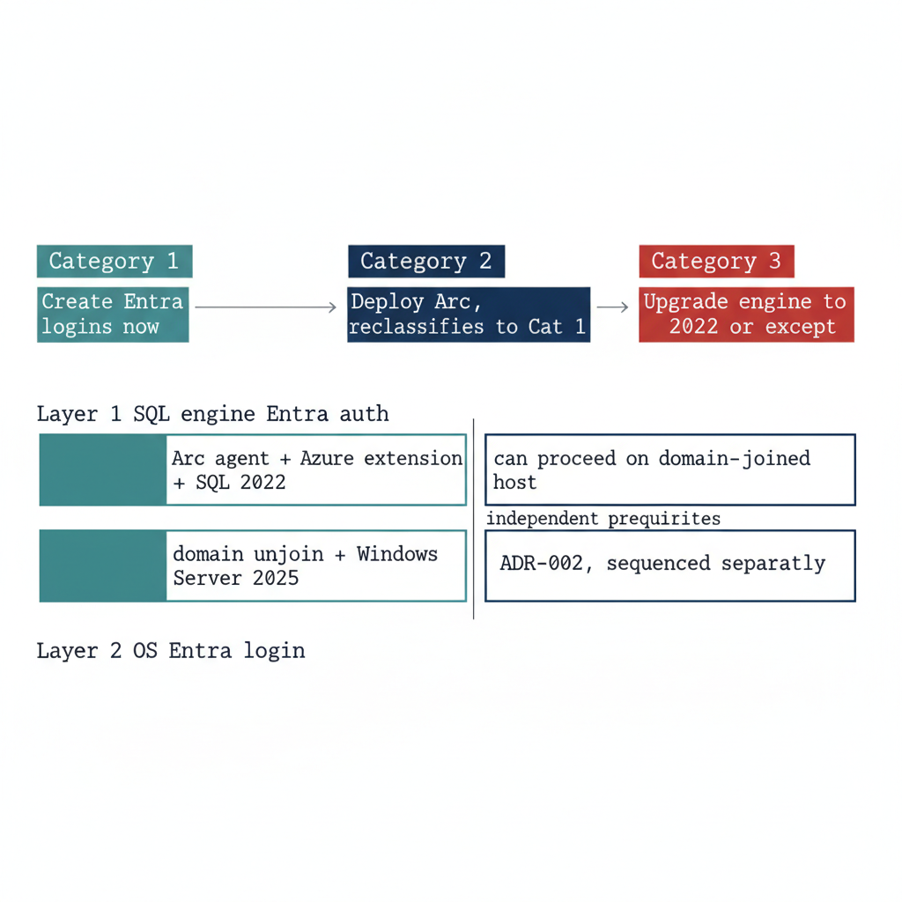

# Chapter 2 — Reading the Audit: Classification and Triage

*From a per-instance category to a defensible migration order — and the one distinction that prevents the program's most common mistake.*

::: {.callout-note}
## In this chapter
How to interpret each of the three Arc-eligibility categories the audit assigns, how the audit output should drive triage and prioritization within each category, and the architectural distinction between SQL Server engine Entra authentication and server OS Entra login capability — the Layer 1 versus Layer 2 separation that lets engine migration proceed on a host that is still domain-joined.
:::

{#fig-book-03-cpt-02-diagram-01 fig-alt="A two-part engineering diagram on a white background. Upper band: three category boxes left to right — a teal 'Category 1' box with arrow to 'Create Entra logins now', a navy 'Category 2' box with arrow to 'Deploy Arc, reclassifies to Cat 1', and a red 'Category 3' box with arrow to 'Upgrade engine to 2022 or except'. Lower band: two stacked horizontal layers. The upper layer labeled 'Layer 1 SQL engine Entra auth' lists 'Arc agent + Azure extension + SQL 2022' in teal and is marked 'can proceed on domain-joined host'. The lower layer labeled 'Layer 2 OS Entra login' lists 'domain unjoin + Windows Server 2025' in navy and is marked 'ADR-002, sequenced separately'. A vertical divider between the two layers is labeled 'independent prerequisites'. Engineering blueprint style, white background, federal navy (#1F3A5F), red (#C0392B) for problems, teal (#1A9E8F) for valid/ready, monospace labels, no human figures, 16:9 landscape." width="85%"}

## Interpreting Category 1: Entra-Auth-Ready

A Category 1 classification is the program's best starting position. It means the infrastructure prerequisites for Entra ID authentication are already in place — the Arc agent is running, the Azure extension for SQL Server is deployed, and the engine is running on SQL Server 2022.

The Managed Identity for the server is available, and the SQL Server extension has registered the instance with the Arc data services plane. Nothing in the infrastructure stack remains to be built.

The migration work for a Category 1 instance therefore begins with the login inventory from the audit: how many Windows logins exist, what AD groups are mapped to SQL Server roles, and whether any SQL Authentication logins need to be addressed before or alongside the Windows login migration. The specific migration steps are documented in Book 04.

The point here is that the audit has done its job for a Category 1 instance when it delivers a precise login inventory. The infrastructure work is already done, and the migration can proceed without any further prerequisites.

## Interpreting Category 2: Arc-Eligible but Not Enabled

A Category 2 instance requires an Arc deployment action before login migration can begin. The audit output for such an instance should be used to prioritize that deployment.

Instances with a large number of Windows logins, active SQL Authentication logins, or missing SPN registrations — and therefore NTLM-generating connections — are higher priority for Arc deployment than instances with simple, well-configured Windows Authentication.

The Arc deployment itself is not a SQL Server change. It is a server-level action that installs the Connected Machine agent and the SQL Server extension. Book 03 describes the Arc deployment sequence in detail.

Once Arc deployment is complete and the SQL Server extension confirms the Managed Identity is available, the instance re-classifies from Category 2 to Category 1 on the next audit run, and the login migration can begin.

## Interpreting Category 3: Version Upgrade Required

A Category 3 instance is the most operationally complex. A pre-2022 instance cannot accept `FROM EXTERNAL PROVIDER` logins regardless of any other configuration change.

The `CREATE LOGIN [user@tenant] FROM EXTERNAL PROVIDER` syntax was introduced in SQL Server 2022 as part of the Azure extension for SQL Server integration. Earlier versions do not support the syntax at all — it produces a parse error.

A Category 3 instance therefore has two possible paths: upgrade the SQL Server engine to 2022 and then proceed through the Category 2 pathway, or document a formal exception with a sunset date for the instance.

Given the 2027-04-01 NTLM elimination deadline, a Category 3 instance that cannot be upgraded to SQL Server 2022 before that date will face NTLM failure regardless of exception status. The NTLM block is network-level, not application-level, and it does not distinguish between instances that are excepted from the transformation and instances that are not.

The version-upgrade timeline for Category 3 instances must be integrated into the ADR-091 migration plan as an explicit dependency.

## The SQL Engine vs. OS Entra Auth Distinction

One of the most important clarifications the audit output must carry — and that the teams reading it must internalize — is the architectural distinction between SQL Server engine Entra authentication and server OS Entra ID login capability. These are two separate capabilities with separate prerequisites, and confusing them is the most common misunderstanding this program will encounter.

SQL Server engine Entra authentication — Layer 1, the capability described in this series — requires the Arc Connected Machine agent, the Azure extension for SQL Server, and SQL Server 2022. It does not require the server to be domain-unjoined, and it does not require Windows Server 2025.

A domain-joined Windows Server 2019 host running SQL Server 2022 with Arc installed can have Entra ID-backed SQL Server logins today, while the server itself remains domain-joined and continues to authenticate OS-level users via Kerberos to the domain controller.

Server OS Entra ID login capability — Layer 2, the ability for administrators to RDP into the server using Entra ID credentials instead of domain credentials — is a separate transformation governed by ADR-002. It requires domain unjoin and Windows Server 2025 with Desktop Experience.

The two capabilities are related — both are part of UIAO_135 Transformation #7 — but they are sequenced independently, and the SQL Server engine migration can and should proceed first.

This sequencing point must be explicit in every instance of audit output that classifies a server as "not yet domain-unjoined." The correct interpretation is not "SQL Server migration blocked" but "OS-level Entra login not yet available; SQL engine migration can proceed." (ADR-002)

::: {.callout-note title="What Book 03 establishes — Chapter 2"}
The three Arc-eligibility categories map directly to triage actions: a Category 1 instance migrates now from its login inventory, a Category 2 instance is prioritized for Arc deployment and then re-classifies to Category 1, and a Category 3 instance must be upgraded to SQL Server 2022 or formally excepted against the 2027-04-01 NTLM deadline. The decisive clarification is the Layer 1 versus Layer 2 distinction: SQL engine Entra authentication depends only on Arc, the Azure extension, and SQL Server 2022 — it can proceed on a still-domain-joined host, independent of the ADR-002 OS-level Entra login transformation.
:::
