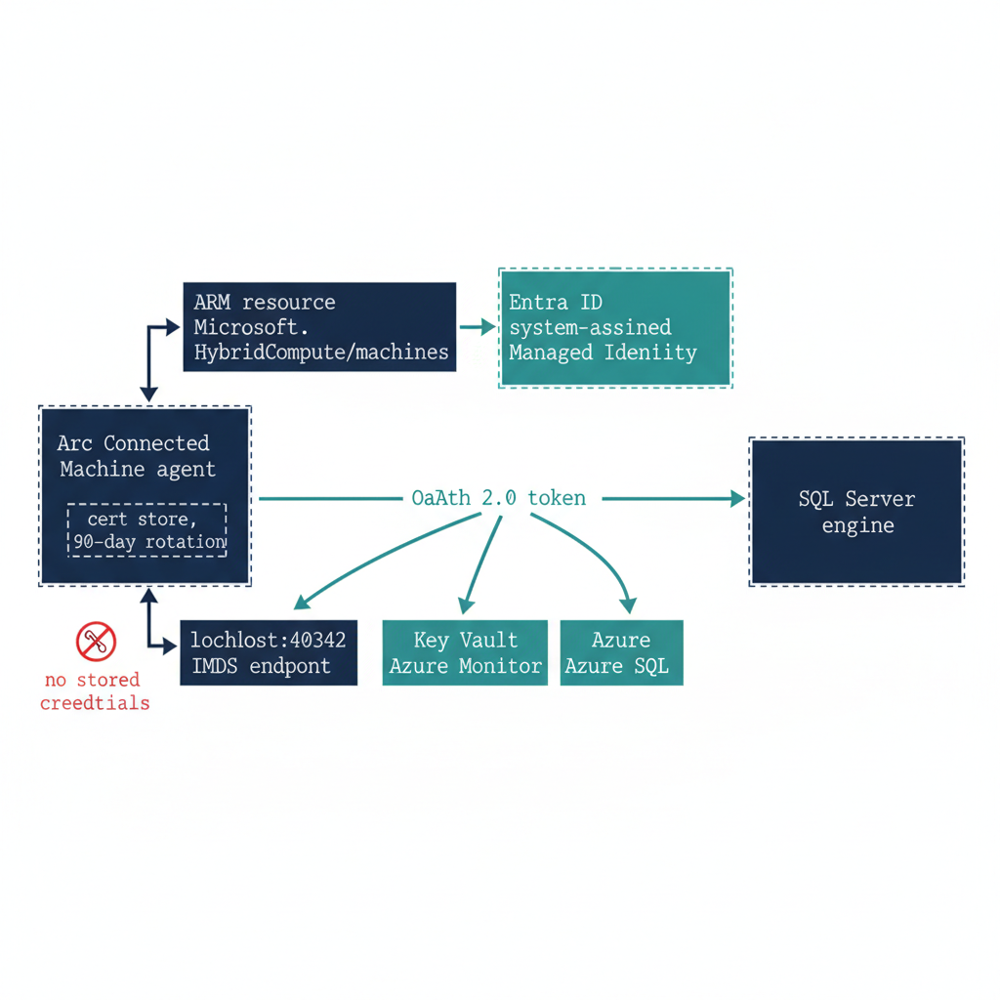

# Chapter 1 — What Arc Provides to SQL Server

*Arc is not an end state — it is the bridge that gives the SQL Server engine a cloud-native identity.*

::: {.callout-note}
## In this chapter
What the Connected Machine agent and its ARM resource identity actually establish, how the system-assigned Managed Identity provides a credential-free token through the local IMDS endpoint, the architecturally independent two-layer distinction between SQL-engine Entra authentication and OS-level Entra login, how the Managed Identity replaces the AD-anchored service account, why Arc's Managed Identity is preferred over a gMSA, a vault-stored service-principal secret, or certificate-based authentication, and — just as important — what Arc deliberately does not change.
:::

When most people encounter Microsoft Azure Arc in a cloud modernization program, they encounter it as a management capability. Arc lets you see on-premises servers in the Azure portal, apply Azure Policy to them, and manage them through Azure Resource Manager. That is accurate, but it understates the architectural significance of Arc for this specific transformation.

Arc does something more fundamental for SQL Server on-premises: it gives the server — and by extension, the SQL Server engine process — a cloud-native identity. Without that identity, the SQL Server engine has no credential that the Azure identity plane can issue, validate, or condition.

Without that identity, there is no Managed Identity to replace the AD service account, and no mechanism for the engine to authenticate to Azure Key Vault, forward logs to Azure Monitor, or accept Entra ID-issued OAuth 2.0 tokens from clients. Arc is the enablement layer for everything that follows in this series. (ADR-002, UIAO_135 Transformation #7)

{#fig-book-04-cpt-01-diagram-01 fig-alt="A horizontal engineering diagram on a white background. Left: a server box labeled 'Arc Connected Machine agent' holds a small 'cert store, 90-day rotation' annotation. An upward arrow goes to an 'ARM resource Microsoft.HybridCompute/machines' box, which links to an 'Entra ID system-assigned Managed Identity' box. Below the server, a 'localhost:40342 IMDS endpoint' box returns an 'OAuth 2.0 token' arrow to a 'SQL Server engine' box on the right. The token arrow fans out to three target boxes labeled 'Key Vault', 'Azure Monitor', and 'Azure SQL'. Engineering blueprint style, white background, federal navy (#1F3A5F) for boxes, teal (#1A9E8F) for the valid token path and Managed Identity, red (#C0392B) for the absence of stored credentials annotation, monospace labels, no human figures, 16:9 landscape." width="85%"}

## The Arc Agent and the ARM Resource Identity

When the Microsoft Azure Connected Machine agent is installed on a server, that server acquires a resource identity in Azure Resource Manager. This is not a figurative identity or a management label. It is a first-class ARM resource, of type `Microsoft.HybridCompute/machines`, with a resource ID, a subscription scope, a resource group, and a set of ARM resource properties.

The ARM resource identity is what makes the server visible in the Azure portal, manageable through Azure Policy, and addressable by Azure Resource Manager API calls. More importantly for this series, it is the basis for the system-assigned Managed Identity.

The system-assigned Managed Identity is automatically created when the Arc agent is installed and the server resource is registered in ARM. The Managed Identity is an Entra ID service principal whose lifecycle is bound to the server resource. When the server resource exists in ARM, the Managed Identity exists in Entra ID; when the server is deregistered from Arc, the Managed Identity is deleted.

The Managed Identity's credential — the private key for the identity's certificate — is stored in the Arc agent's local certificate store on the server and is rotated automatically by the Arc agent every 90 days. No human administrator ever sees the private key. No process has access to it except the Arc agent itself and the Windows security subsystem components the Arc agent uses to request tokens.

When any process on the server requests a token from the Arc agent's local IMDS endpoint — `http://localhost:40342/metadata/identity/oauth2/token` — the Arc agent uses the Managed Identity certificate to authenticate to Entra ID and return a token. The token can be scoped to any Azure resource for which the Managed Identity has been granted access: Azure Key Vault, Azure SQL, Azure Storage, Azure Monitor, or any other service that accepts Entra ID-issued OAuth 2.0 tokens.

## The Two-Layer Distinction

Arc enables two distinct Entra ID capabilities for SQL Server, and they are architecturally independent. This is the most commonly misunderstood aspect of the SQL Server identity transformation, and it must be stated precisely before any migration planning begins.

Failure to understand the distinction leads to incorrect sequencing assumptions — either blocking SQL engine migration on OS-level work that is not a prerequisite, or attempting OS-level Entra login without the domain unjoin it requires.

Layer 1 is SQL Server engine Entra authentication, which is the subject of this series. When the Azure extension for SQL Server is deployed on an Arc-enabled server running SQL Server 2022, the engine can be configured to accept Entra ID-issued OAuth 2.0 access tokens as the authentication credential for SQL Server logins.

Clients connect using `CREATE LOGIN [user@tenant.onmicrosoft.com] FROM EXTERNAL PROVIDER` logins, present an Entra ID access token scoped to the SQL Server's Azure resource audience, and the engine validates the token against Entra ID's public key infrastructure. This capability does not require the server to be domain-unjoined. It does not require Windows Server 2025.

It requires three things: the Arc Connected Machine agent installed and registered, the SQL Server 2022 engine, and the Azure extension for SQL Server deployed. A domain-joined Windows Server 2019 host with Arc installed and SQL Server 2022 running is fully capable of Layer 1 today.

Layer 2 is server OS Entra ID login capability, implemented via the AADLoginForWindows extension. This capability allows administrators to authenticate to the server's operating system using Entra ID credentials — to RDP into the server using their Entra credentials instead of domain credentials. It is governed by ADR-002 and is part of the server infrastructure transformation, not the SQL Server authentication transformation.

It requires domain unjoin — the server must be removed from the Active Directory domain — and it requires Windows Server 2025 with Desktop Experience. This is a more disruptive change than Layer 1: domain unjoin affects every service on the server that depends on AD membership, requires coordination with every team that manages the server, and has implications for DNS, Group Policy, and certificate enrollment that must be planned carefully.

The sequencing guidance is clear. Layer 1 can and should be completed before Layer 2 begins. SQL Server engine authentication can be migrated to Entra ID while the server remains domain-joined, providing transformation progress and security improvement without incurring the operational risk of domain unjoin. (ADR-002)

::: {.callout-important}
Do not block SQL Server engine Entra authentication migration (Layer 1) on domain unjoin (a Layer 2 prerequisite). These are independent sequencing tracks. Layer 1 can proceed on domain-joined servers. Layer 2 is a separate transformation with separate prerequisites. This distinction must be communicated explicitly to every DBA team and infrastructure team involved in the migration. Incorrect sequencing assumptions are the most common cause of unnecessary delays in SQL Server Entra auth migration. (ADR-002, UIAO_135 Transformation #7)
:::

## The Managed Identity as Service Account Replacement

The SQL Server engine process typically runs as `NT SERVICE\MSSQLSERVER` on most standard installations, or as a domain service account or gMSA on installations where the default virtual account was changed. When the Arc agent is installed and the Azure extension for SQL Server is configured, the engine can use the server's system-assigned Managed Identity to authenticate to Azure services.

The SQL Server extension registers the Managed Identity with the Azure SQL Arc resource plane and configures the engine's use of the Managed Identity for specific Azure-service interactions. Key Vault secrets, Azure Monitor log forwarding via the Azure Monitor agent, and Azure Arc data services all authenticate via the Managed Identity rather than via stored credentials.

This does not immediately change how the SQL Server engine authenticates to the Windows operating system. The engine still runs as `NT SERVICE\MSSQLSERVER` for local process purposes. What changes is the engine's Azure-plane identity: Azure resources see the Managed Identity rather than a service account credential.

The service account migration for SQL Server is thus Arc-first. Deploy Arc, deploy the SQL Server extension, and the engine's Azure identity is established without any credential management or credential rotation risk.

## Why Arc and Not the Alternatives

A skeptical reviewer will ask the fair question directly: why Arc, and not one of the identity mechanisms the organization already operates? The answer is not that Arc is fashionable — it is that every alternative either re-anchors on the very directory the program is retiring, or reintroduces the stored credential the transformation exists to eliminate.

A group Managed Service Account or domain service account is the incumbent, and it works — for as long as Active Directory remains the authoritative identity source. It does not. Driver Three of Book 01 is precisely that AD is removed as the authority for this boundary; binding the engine's new identity to a gMSA would anchor it to the thing being decommissioned, which is circular. A service principal with a client secret — whether the secret sits on disk or in Azure Key Vault — solves the AD-anchoring problem but reintroduces a stored, rotatable credential, and a bootstrapping one: the engine must authenticate *to* the vault before it can read the secret, so a root credential lands on the server regardless. That is the credential-management and rotation risk the program is trying to retire, not relocate.

Certificate-based authentication is viable, and is in fact the program's chosen posture — but as the *interim* one. ADR-068 and ADR-091 §4 authorize Certificate-Based Authentication specifically for the pre-2022 exception long-tail that cannot reach Kerberos or Entra OAuth before the 2027-04-01 block; it still requires certificate lifecycle management, which is why it carries the ADCS-to-Cloud-PKI dependency (UIAO_135 §3.3, "Not Yet Defined"). It is a bridge, not a destination.

The Arc system-assigned Managed Identity is the only option that is simultaneously cloud-native and credential-free from the operator's perspective: the certificate lives in the Arc agent's local store, rotates automatically every 90 days, is never visible to any human, and its lifecycle is bound to the ARM resource rather than to a directory the program is removing. No secret to vault, no rotation to schedule, no AD object to preserve. That is why Arc wins — not by assertion, but because it is the one mechanism that survives the removal of AD without recreating a managed secret. (ADR-002, ADR-068, ADR-091)

## What Arc Does Not Do

It is equally important to be precise about what Arc does not change, because the scope of Arc's effect on SQL Server is frequently overstated in both directions. Arc does not change how SQL Server authenticates connections from domain-joined clients.

A domain-joined Windows client connecting to a SQL Server instance on an Arc-enabled server using `Integrated Security=True` still uses Kerberos or NTLM — the same protocol negotiation described in Book 01. The Arc agent has no effect on the SQL Server engine's SSPI-based authentication of Windows-integrated connections, and Arc installation alone produces no Entra ID sign-in events for SQL Server connections.

Arc does not move any login from the Windows type to the External Provider type. Arc does not disable Windows Authentication or Mixed Mode. Arc does not affect the SPN registration status for the instance. Arc is the enablement layer; it provides the capability for Entra ID authentication without activating it.

The login migration described in Book 04 is what actually changes the authentication behavior for SQL Server connections — Arc merely makes that migration possible. Understanding this distinction is essential for communicating the transformation scope to stakeholders: Arc deployment is a necessary prerequisite, but it is not the transformation itself.

::: {.callout-note title="What Book 04 establishes — Chapter 1"}
The Connected Machine agent gives a server a first-class ARM resource identity, and that identity anchors a system-assigned Managed Identity — a credential-free Entra ID service principal whose certificate is rotated automatically and never exposed to any human, served as an OAuth 2.0 token through the local IMDS endpoint. Arc enables two architecturally independent layers: Layer 1 SQL-engine Entra authentication (the subject of this series, available today on domain-joined SQL Server 2022 hosts) and Layer 2 OS-level Entra login (a separate, more disruptive transformation requiring domain unjoin). Layer 1 must never be blocked on Layer 2. Arc replaces the AD-anchored service account at the Azure plane and provides the capability for Entra authentication — but it does not itself activate it. Arc is preferred over the alternatives — a gMSA (re-anchors on the AD being retired), a vault-stored service-principal secret (reintroduces a stored bootstrap credential), or certificate-based authentication (the ADR-068 *interim* exception posture, not the steady state) — because its Managed Identity is the one credential-free, cloud-native option that survives the removal of AD.
:::
