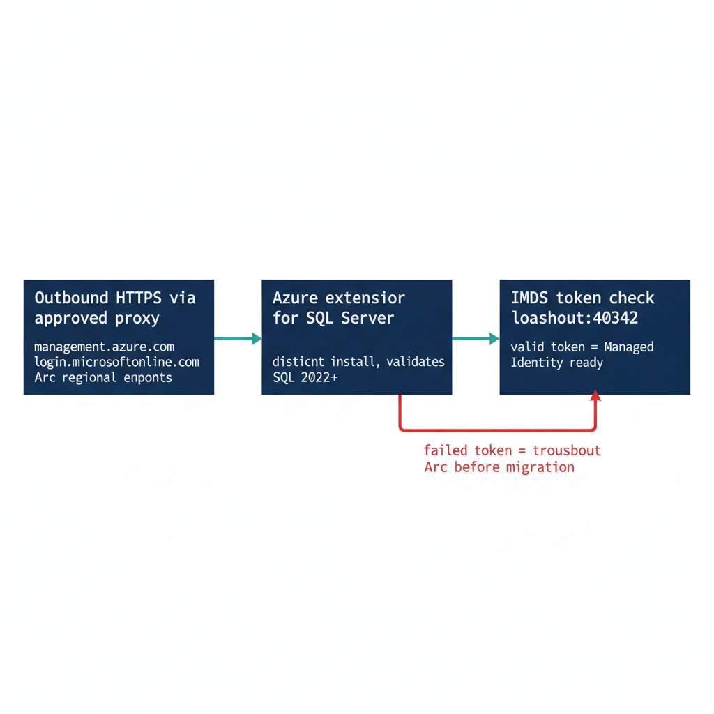

# Chapter 2 — Arc Deployment Sequencing for SQL Server Hosts

*The ordered prerequisites that turn a domain-joined SQL Server host into an Arc-enabled, identity-ready instance.*

::: {.callout-note}
## In this chapter
The connectivity prerequisites that Arc enrollment demands inside a GCC-Moderate boundary, why the Azure extension for SQL Server is a distinct installation with its own version validation, and the IMDS token check that confirms the system-assigned Managed Identity is genuinely available before any login migration begins.
:::

Arc deployment is a sequence, not a single act. Each step has a prerequisite that the prior step satisfies, and skipping ahead produces failures that are easy to misdiagnose as migration problems when they are in fact enrollment problems. The order is connectivity first, then the SQL Server extension, then a verification that the Managed Identity is actually present and answering.

{#fig-book-04-cpt-02-diagram-01 fig-alt="A left-to-right engineering sequence diagram on a white background showing three ordered stages connected by arrows. Stage one is a box labeled 'Outbound HTTPS via approved proxy' with sub-labels 'management.azure.com', 'login.microsoftonline.com', 'Arc regional endpoints'. Stage two is a box labeled 'Azure extension for SQL Server' annotated 'distinct install, validates SQL 2022+'. Stage three is a box labeled 'IMDS token check localhost:40342' annotated 'valid token = Managed Identity ready'. A red side-branch from stage three labeled 'failed token = troubleshoot Arc before migration' loops back. Engineering blueprint style, white background, federal navy (#1F3A5F) for the sequence boxes, teal (#1A9E8F) for the successful verification path, red (#C0392B) for the failure branch, monospace labels, no human figures, 16:9 landscape." width="85%"}

## Prerequisites for Arc Enrollment

The Connected Machine agent requires outbound HTTPS connectivity from the server to the Azure Arc endpoints — `management.azure.com`, `login.microsoftonline.com`, and the Arc-specific regional endpoints. In a GCC-Moderate boundary, this connectivity must be routed through the program's approved network egress path.

Direct internet egress from a production SQL Server host is not acceptable under the boundary's network posture. The Arc agent supports proxy configuration for HTTPS traffic, and the proxy address must be provided at installation time.

Connectivity verification — confirming that the server can reach all required Arc endpoints through the approved proxy — is the first prerequisite check before Arc deployment begins. An agent that cannot reach its endpoints will fail to register its ARM resource, and without that resource there is no Managed Identity to verify later.

## The Azure Extension for SQL Server

The Azure extension for SQL Server is a distinct installation from the Connected Machine agent and must be deployed after the agent is enrolled. It is installed via Azure Policy assignment — the recommended approach for fleet-wide deployment — or via the Azure portal or CLI for individual servers.

The extension performs additional validation at installation time. It verifies the SQL Server version, where 2022 or later is required for Entra auth capability; it registers the SQL Server instance with the Arc SQL resource plane; and it configures the Managed Identity access for the engine process.

The Spec3-D1.8 audit's Arc-eligibility classification — Category 1 versus Category 2 versus Category 3 — is the primary input for prioritizing Arc deployment across the estate. Category 2 instances are the immediate deployment targets, and the audit's login inventory and NTLM risk signals within Category 2 are used to order those deployments by remediation urgency. (Spec3-D1.8, ADR-002)

## Verification of Managed Identity Availability

After the Connected Machine agent is installed and the Azure extension for SQL Server is deployed, the program must verify that the system-assigned Managed Identity is available before proceeding to the login migration. This verification is not optional — it is the gate between enrollment and migration.

The verification check calls the local IMDS endpoint on the server — `http://localhost:40342/metadata/identity/oauth2/token?api-version=2019-11-01&resource=https://management.azure.com/` — and confirms that the Arc agent returns a valid access token.

A successful token response confirms three things at once: that the Managed Identity is enrolled in Entra ID, that the Arc agent is functioning, and that the server's ARM resource is in a healthy state. A failed token response at this stage requires Arc troubleshooting before the SQL Server migration can proceed.

The Spec3-D1.8 audit's Arc-eligibility classification is updated on each run to reflect the current Managed Identity availability state, so the CCM-BIR record for the instance reflects this verification outcome in near-real-time.

::: {.callout-note title="What Book 04 establishes — Chapter 2"}
Arc deployment for a SQL Server host proceeds in a strict order: first verify outbound HTTPS connectivity to the Arc endpoints through the program's approved GCC-Moderate egress proxy, then install the Azure extension for SQL Server — a distinct installation that validates the SQL Server 2022+ version and registers the instance with the Arc SQL resource plane — and finally confirm the system-assigned Managed Identity is live by requesting a token from the local IMDS endpoint. A successful IMDS token response is the gate that authorizes login migration; a failure is an enrollment problem to resolve before migration begins. The Spec3-D1.8 audit drives prioritization and records the verification outcome in near-real-time.
:::
