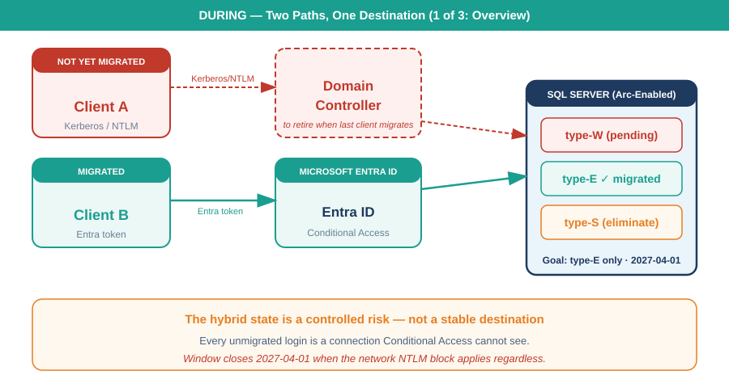
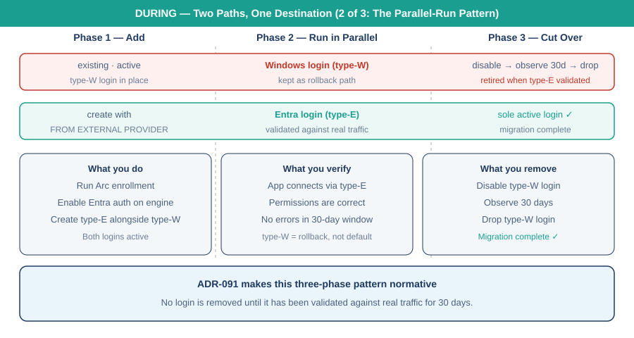
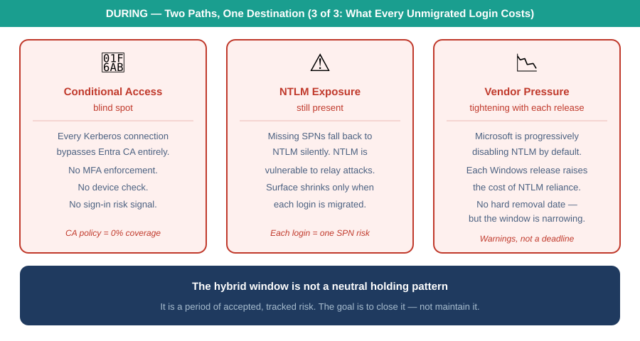

::: {.content-visible when-format="docx"}
# Book_05 — The Login Migration: Windows Principals to Entra Logins
:::

::: {.callout-note}
Everything in Books 01 through 04 is prerequisite; everything in Books 06 through 09 is consequence. This book is the migration itself — performed only on the instances Book 02 classified **retain** or **target**, using the three-phase parallel-run pattern that ADR-091 makes normative. (ADR-091)
:::

{#fig-book-05-card-during-01 fig-alt="Card diagram on white background. Title: DURING — Two Paths, One Destination (1 of 3: Overview). Two client boxes: Client A Not Yet Migrated in red, Client B Migrated in teal. Center: Domain Controller (dashed red) and Entra ID (teal). Right: SQL Server with type-W, type-E, and type-S login badges. Footer explains the hybrid state is a controlled risk. Navy, teal, red palette." width="100%"}

{#fig-book-05-card-during-02 fig-alt="Card diagram on white background. Title: DURING — Two Paths, One Destination (2 of 3: The Parallel-Run Pattern). Three phase columns with vertical dashed dividers. Two login track rows: Windows login in red, Entra login in teal. Three detail boxes below: what you do, what you verify, what you remove. Footer: ADR-091 makes this three-phase pattern normative." width="100%"}

{#fig-book-05-card-during-03 fig-alt="Card diagram on white background. Title: DURING — Two Paths, One Destination (3 of 3: What Every Unmigrated Login Costs). Three red risk cards: Conditional Access blind spot, NTLM Exposure still present, Hard Deadline approaching. Navy footer: the hybrid window is not a neutral holding pattern." width="100%"}

{#fig-book-05-wan-02 fig-alt="WAN topology diagram showing the hybrid migration state with two client types, Entra ID for the new path, the domain controller for the old path, and SQL Server accepting both type-W and type-E logins simultaneously. Progress bars at the bottom show the estate at 40% login migration completion. Navy, teal, red, amber palette, white background." width="100%"}

{#fig-book-05-wan-simple-02 fig-alt="Simplified WAN diagram showing two client boxes — Not Yet Migrated in red and Migrated in teal — feeding two separate paths to SQL Server. The old path routes through the Domain Controller using Kerberos or NTLM. The new path goes directly to Entra ID and arrives at SQL Server as an OAuth 2.0 token. Bottom bar explains that the hybrid state is a controlled risk, not a stable destination, and closes at 2027-04-01. White background, navy, teal, red, amber palette." width="100%"}

{#fig-book-05-image-01 fig-alt="An illustrative figure on a white background showing two parallel tracks across three phases — 'Phase 1, add', 'Phase 2, run in parallel', 'Phase 3, cut over'. A stylised principal silhouette on the left ('user, group, service') feeds two arrows: a grey arrow up to a 'Windows login (Kerberos ticket / NTLM)' box and a teal arrow down to an 'Entra login (FROM EXTERNAL PROVIDER)' box. The Windows-login track continues as a grey dashed line labelled 'still works — kept as the rollback path' and ends at a red crossed-out circle labelled 'old login removed'. The Entra-login track continues as a solid teal arrow labelled 'validated in parallel against real traffic' into a navy 'SQL Server engine' box reading 'accepts Entra-issued OAuth tokens'. Illustrative register (ADR-095): navy (#0D1B2E), teal (#1E8C8C) for the new path, grey for the legacy path, red (#C0392B) for removal; stylised silhouette, no photographs; 16:9 landscape. A footer line notes the figure is illustrative — the phases are conceptual, not a schedule or measured cutover." width="100%"}

::: {.callout-tip}
## Download this book
**[Book_05-bundle.docx](Book_05-bundle.docx)** — every chapter of this book concatenated into one Word document. Regenerated on every site deploy.
:::

## Chapters

::: {#book-chapters}
:::

::: {.callout-tip}
## Continue the series
[← Previous: Book 04 — Arc as the Identity Bridge](Book_04.qmd) · [Index](index.qmd) · [Next: Book 06 — Eliminating NTLM at the SQL Layer →](Book_06.qmd)
:::
