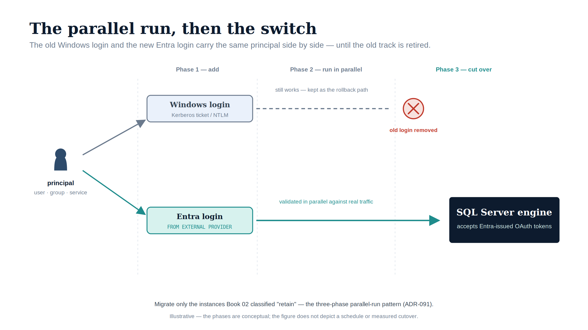

::: {.content-visible when-format="docx"}
# Book_05 — The Login Migration: Windows Principals to Entra Logins
:::

::: {.callout-note}
Everything in Books 01 through 04 is prerequisite; everything in Books 06 through 09 is consequence. This book is the migration itself — performed only on the instances Book 02 classified **retain** or **target**, using the three-phase parallel-run pattern that ADR-091 makes normative. (ADR-091)
:::

{#fig-book-05-image-01 fig-alt="An illustrative figure on a white background showing two parallel tracks across three phases — 'Phase 1, add', 'Phase 2, run in parallel', 'Phase 3, cut over'. A stylised principal silhouette on the left ('user, group, service') feeds two arrows: a grey arrow up to a 'Windows login (Kerberos ticket / NTLM)' box and a teal arrow down to an 'Entra login (FROM EXTERNAL PROVIDER)' box. The Windows-login track continues as a grey dashed line labelled 'still works — kept as the rollback path' and ends at a red crossed-out circle labelled 'old login removed'. The Entra-login track continues as a solid teal arrow labelled 'validated in parallel against real traffic' into a navy 'SQL Server engine' box reading 'accepts Entra-issued OAuth tokens'. Illustrative register (ADR-095): navy (#0D1B2E), teal (#1E8C8C) for the new path, grey for the legacy path, red (#C0392B) for removal; stylised silhouette, no photographs; 16:9 landscape. A footer line notes the figure is illustrative — the phases are conceptual, not a schedule or measured cutover." width="100%"}

::: {.callout-tip}
## Download this book
**[Book_05-bundle.docx](Book_05-bundle.docx)** — every chapter of this book concatenated into one Word document. Regenerated on every site deploy.
:::

## Chapters

::: {#book-chapters}
:::

::: {.callout-tip}
## Continue the series
[← Previous: Book 04 — Arc as the Identity Bridge](Book_04.qmd) · [Index](index.qmd) · [Next: Book 06 — Eliminating NTLM at the SQL Layer →](Book_06.qmd)
:::
