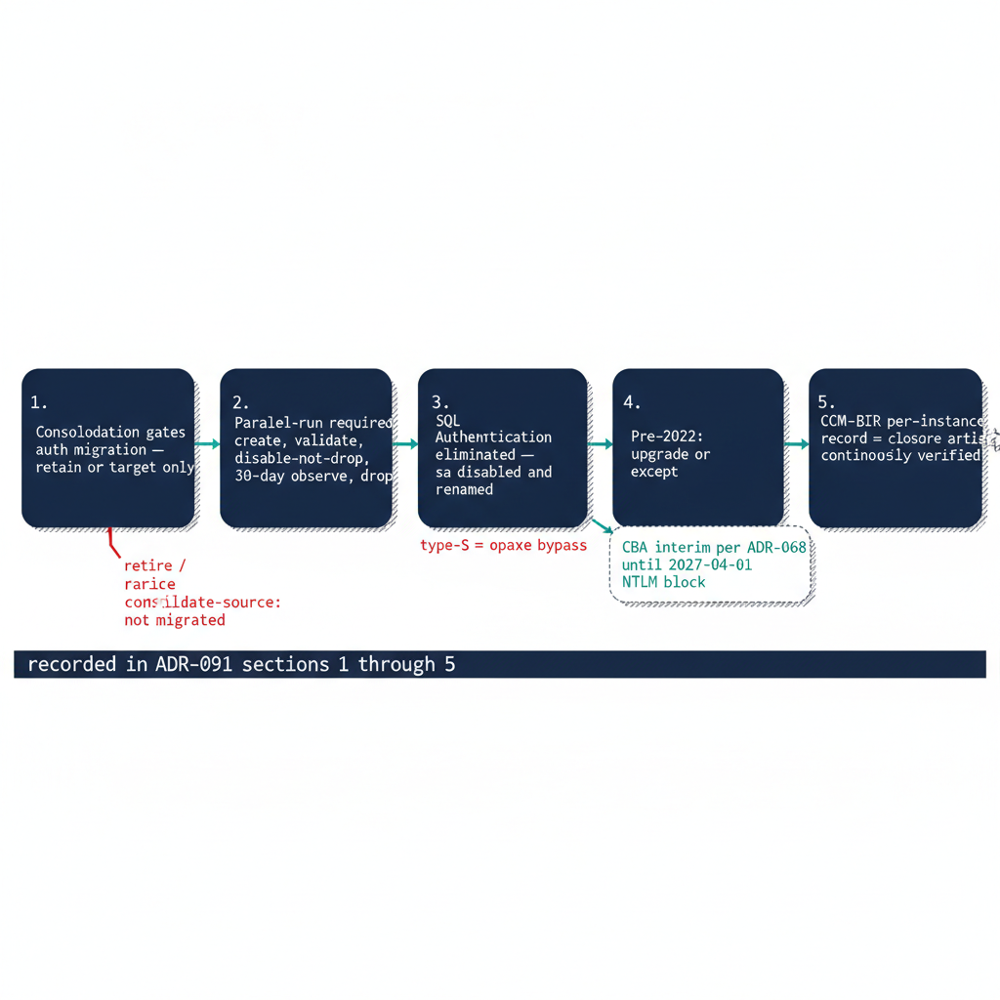

# Chapter 2 — What ADR-091 Decides

*The five governance positions that turn the migration pattern into enforceable canon.*

::: {.callout-note}
## In this chapter
The five decisions ADR-091 records — that consolidation gates auth migration, that the parallel-run sequence is required, that SQL Authentication is eliminated and `sa` disabled and renamed, that pre-2022 instances are upgrade-or-except with a Certificate-Based Authentication interim posture, and that the CCM-BIR per-instance record is the closure artifact. (ADR-091 §1–§5)
:::

The migration pattern in Chapter 1 covers the core engineering case — Windows logins migrated to type-E logins through `FROM EXTERNAL PROVIDER` — but a pattern alone leaves a set of governance positions that a narrative is not the instrument to settle. Those positions require an architecture decision record, and that record is ADR-091, accepted in PROPOSED status on 2026-06-02 as the engine-layer companion to ADR-068 (protocol layer) and ADR-002 (server and OS layer).

An early draft of this series referred to a "forthcoming ADR-090." That number was independently taken by an unrelated substrate high-availability decision on the same date, so the engine-layer SQL Server authentication decision is recorded as ADR-091. It does not defer these questions: it answers all five, in operational sequence, and this chapter presents each as ADR-091 records it.

{#fig-book-05-cpt-02-diagram-01 fig-alt="A left-to-right sequence diagram on a white background showing five numbered navy decision boxes connected by teal arrows. Box 1 'Consolidation gates auth migration — retain or target only' with a red side-branch labeled 'retire / consolidate-source: not migrated'. Box 2 'Parallel-run required — create, validate, disable-not-drop, 30-day observe, drop'. Box 3 'SQL Authentication eliminated — sa disabled and renamed', with a red annotation 'type-S = opaque bypass'. Box 4 'Pre-2022: upgrade or except' with a teal interim-posture note 'CBA interim per ADR-068 until 2027-04-01 NTLM block'. Box 5 'CCM-BIR per-instance record = closure artifact, continuously verified'. A footer bar spanning all five reads 'recorded in ADR-091 sections 1 through 5'. Engineering blueprint style, white background, federal navy (#1F3A5F), red (#C0392B) for legacy/disabled, teal (#1A9E8F) for migrated/validated, monospace labels, no human figures, 16:9 landscape." width="100%"}

## Decision 1 — Consolidation Precedes and Gates Auth Migration

ADR-091 §1 records the first and ordering decision: the estate consolidation assessment precedes and gates the engine-layer authentication migration. The SQL Server estate that has accumulated across an Active Directory forest over twenty years is not migrated in the shape it is discovered in. Before any instance is migrated to Entra ID authentication, the consolidation assessment must classify it as retain, consolidate-into-target, or retire.

Engine-layer auth migration is performed only on instances classified retain or on the consolidation targets that absorb consolidated workloads. Instances classified retire or consolidate-into-target as a source are not migrated — they are decommissioned or collapsed, and migrating their logins to Entra ID first would be wasted effort. This is the decision Book 02 established at the assessment layer; ADR-091 §1 makes it the normative prerequisite to everything in this book.

The Arc-eligibility classification from `Spec3-D1.8` — Category 1, 2, or 3 — is layered on top of the consolidation classification, not before it. Consolidation and auth transformation are mutually reinforcing: collapsing many instances across multiple domains into fewer modern SQL Server 2022 targets, or into Azure SQL Managed Instance or Arc-enabled SQL, is the natural moment to retire cross-domain login sprawl, orphaned SPNs, and shared service accounts into Entra-backed identity.

## Decision 2 — The Parallel-Run Sequence Is Required

ADR-091 §2 records that the canonical login migration is a three-phase parallel run, and that it is required for production instances. For every instance classified retain or target, Windows logins — type-W users and type-G groups — and SQL Authentication service-account logins, type-S, are migrated to Entra ID external-provider logins across the three principal types Chapter 1 described.

Phase 1 creates a type-E equivalent for every migrating login, with the Entra-to-AD principal mapping verified before each `CREATE LOGIN` and any unconfirmable principal raised as a blocking finding. Phase 2 exercises each type-E login with a real Entra-credentialed test authentication, which must succeed before the corresponding legacy login is touched. Phase 3 disables the legacy logins — not drops them — after their Entra equivalents validate, retains them for a 30-day observation window during which monitoring confirms no residual dependency, then drops them.

The earlier draft framed this sequence as something a governance record "must decide" between required, recommended, and discretionary. ADR-091 §2 settles it: the parallel run is required for production, and non-production instances may compress the observation window only with documented owner sign-off. Disable-and-observe makes every cutover reversible inside the window, so no principal is locked out by a mapping that turned out wrong.

## Decision 3 — SQL Authentication Eliminated; sa Disabled and Renamed

ADR-091 §3 records the disposition of SQL Authentication. Every active type-S login on a retain or target instance is migrated to a type-E service-principal or Managed-Identity login, or carries a documented exception under §4 with a named compensating control and a sunset date. SQL Authentication produces no Entra ID sign-in events and is invisible to Conditional Access and Defender for Identity; it is not an acceptable steady-state credential.

This is the position the earlier draft left open — whether every SQL Authentication login must migrate, or whether some type-S logins could be retained with justification. ADR-091 §3 closes it toward elimination, allowing only the §4 documented-exception path rather than open-ended retention.

The built-in `sa` account is disabled and renamed on every production instance. Emergency-access recovery, if retained, is documented as a break-glass procedure with its own monitoring, not as an active `sa` login. An enabled `sa` account with a non-rotated password is the highest-priority remediation finding in the `Spec3-D1.8` audit. A single active `sa` or type-S login defeats the entire Conditional Access perimeter, because it authenticates outside the Entra ID plane — the perimeter is binary, covering all connections or none.

## Decision 4 — Pre-2022 Instances Are Upgrade-or-Except

ADR-091 §4 records the exception path for instances that cannot accept type-E logins. `CREATE LOGIN ... FROM EXTERNAL PROVIDER` requires SQL Server 2022 plus the Azure extension for SQL Server on an Arc-enabled host, so a pre-2022 Category 3 instance cannot accept external-provider logins regardless of Arc status.

A Category 3 instance classified retain has two paths: upgrade the engine to SQL Server 2022 and then proceed through the Category 2-to-Category 1 pathway, or file a documented exception with a sunset date. ADR-091 §4 notes that most Category 3 instances should be consolidation retire or consolidate-into-target candidates under §1 rather than upgrade candidates. The exception process requires the inability-to-migrate reason, the compensating control, the maximum exception duration, and explicit acknowledgement that the 2027-04-01 NTLM block is network-level and does not honor engine-layer exception status.

Where a connection cannot reach Kerberos or Entra OAuth before that deadline, Certificate-Based Authentication is the authorized interim posture per ADR-068. That makes the certificate-authority dependency — the ADCS-to-Cloud-PKI transformation, classified Not Yet Defined in UIAO_135 §3.3 — a hard dependency for the exception long-tail. The earlier draft asked what evidence an exception requires, what its maximum duration is, and what happens if an instance is still excepted at the deadline; §4 records all three, with the CBA interim posture as the answer for connections that physically cannot reach the modern planes in time.

## Decision 5 — The CCM-BIR Record Is the Closure Artifact

ADR-091 §5 records the closure condition. Transformation #7 is closed for an instance when its CCM-BIR record simultaneously shows `LoginMode = 1` (Windows Authentication Only), zero active type-S logins outside the exception registry, zero active type-W or type-G logins, `sa` disabled and renamed, the Arc Connected Machine agent enrolled and healthy, the Azure extension for SQL Server deployed with the Managed Identity active, and — for human principals — Conditional Access MFA enforcement satisfied for SQL Server resource sign-ins over a defined validation period.

The earlier draft observed that without a defined evidence artifact there was no enforceable completion criterion. ADR-091 §5 supplies exactly that field set: the specific values that, populated correctly, constitute proof that the instance has completed the transformation. "Done" stops being a subjective claim and becomes a queryable posture.

Closure is continuously verified, not a point-in-time claim. `Spec3-D1.8` runs on a recurring schedule, and CCM-BIR drift events — `LoginMode` reverting to Mixed Mode, a new type-S, type-W, or type-G login appearing, the Arc agent going offline — are compliance violations that trigger the remediation workflow. With all five positions recorded, the migration pattern of Chapter 1 becomes enforceable canon rather than operational best practice, and the books that follow operate against a defined closure artifact rather than a moving target.

::: {.callout-note title="What Book 05 establishes — Chapter 2"}
ADR-091 records five positions in operational sequence. §1: the consolidation assessment of Book 02 gates auth migration — only retain instances and consolidation targets are migrated. §2: the three-phase parallel run (create, validate, disable-not-drop, 30-day observe, drop) is required for production. §3: SQL Authentication is eliminated and `sa` disabled and renamed on every production instance. §4: pre-2022 instances upgrade or file a sunset-dated exception, with Certificate-Based Authentication as the ADR-068 interim posture against the network-level 2027-04-01 NTLM block. §5: the CCM-BIR per-instance record is the continuously-verified closure artifact for Transformation #7. The forthcoming "ADR-090" the early draft awaited is authored — it is ADR-091, and it has decided.
:::
