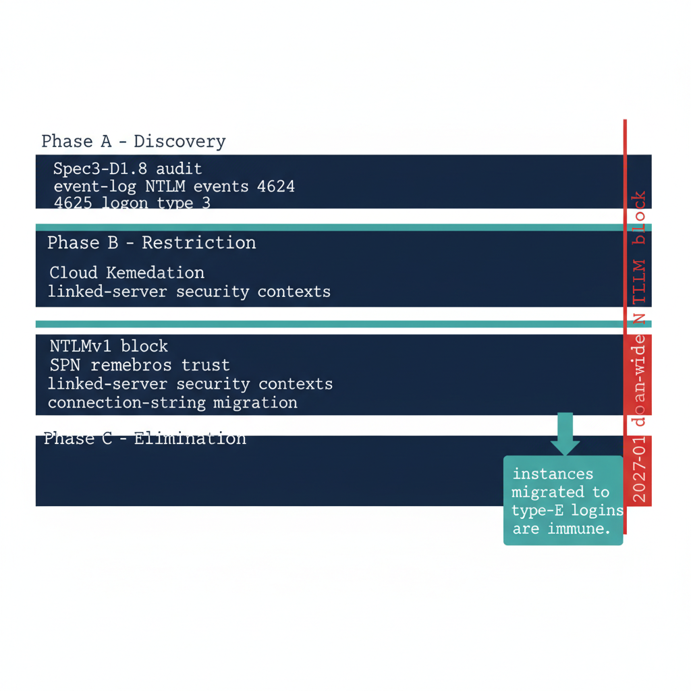

# Chapter 2 — The Three Phases of NTLM Elimination for SQL Server

*Discover, restrict, eliminate — the same phase structure ADR-068 applies program-wide, applied specifically to SQL Server workloads.*

::: {.callout-note}
## In this chapter
How ADR-068's three-phase structure applies to SQL Server: Phase A discovery using Spec3-D1.8 alongside Windows event-log NTLM analysis, Phase B restriction that converts NTLM connections to Kerberos and migrates the remaining patterns, and Phase C elimination at the 2027-04-01 domain-wide block — and why an instance migrated to Entra ID logins is immune to that block because it was never generating NTLM in the first place.
:::

ADR-068 structures NTLM elimination into three phases — discover, restrict, eliminate — and this chapter applies that structure specifically to SQL Server workloads. The phases are sequential and the final one is a hard deadline: the domain-wide NTLM block takes effect no later than 2027-04-01 per Notice 0009.

After that date, any SQL Server connection that requires NTLM will fail at the network layer. The SQL Server engine will not receive the connection — the NTLM exchange is rejected before it reaches the listener. SQL Server NTLM elimination is therefore not decoupled from the broader ADR-068 timeline. Every NTLM-generating connection pattern must be resolved before the elimination phase, not after. (ADR-068, Notice 0009)

{#fig-book-06-cpt-02-diagram-01 fig-alt="A horizontal engineering timeline diagram on a white background showing three sequential phase bands in federal navy leading to a hard deadline marker. Phase A discovery band labeled Spec3-D1.8 audit plus event-log NTLM events 4624 and 4625 logon type 3. Phase B restriction band in navy with teal accents labeled NTLMv1 block, SPN remediation, Cloud Kerberos trust, linked-server security contexts, connection-string migration. Phase C elimination band ending at a bold red vertical deadline line labeled 2027-04-01 domain-wide NTLM block. A teal callout above the deadline reads instances migrated to type-E logins are immune. Engineering blueprint style, white background, federal navy (#1F3A5F), red (#C0392B) for the deadline and blocked state, teal (#1A9E8F) for Kerberos and Entra-safe annotations, monospace labels, no human figures, 16:9 landscape." width="85%"}

## Phase A — Discovery

The discovery phase is ADR-068's first phase, and for SQL Server its primary instrument is Spec3-D1.8. The Phase A output for SQL Server includes the full instance inventory with Arc-eligibility classifications, the login-type inventory, the SPN registration status for every instance, and the service-account identity for each engine process.

Network-traffic analysis supplements the script output by capturing actual NTLM authentication events in the Windows event log. The relevant events are Event IDs 4624 and 4625 — logon success and failure — with logon type 3, the network logon type, and authentication package NTLM, filtered to events where the target server is a SQL Server host.

The combination of the audit-script output and the event-log analysis produces a complete picture of NTLM-generating SQL Server connection patterns across the estate. That Phase A output is ingested by CCM-BIR as the baseline record from which all subsequent phases measure progress.

## Phase B — Restriction

The restriction phase applies controls that reduce NTLM traffic without eliminating it entirely. The restrictions create pressure on connection patterns to migrate while preserving operational continuity. The primary Phase B control for SQL Server is NTLMv1 blocking, combined with Kerberos remediation for the missing-SPN cases.

SPN registration is corrected for all instances with missing or incorrect SPNs, converting those connections from NTLM to Kerberos. Cloud Kerberos trust is deployed per ADR-068 (Cloud Kerberos trust) for cross-site connection patterns where on-premises KDC reachability cannot be guaranteed. Linked-server definitions using passthrough authentication are migrated to defined security contexts. Application connection strings on recently domain-unjoined hosts are migrated to Managed Identity or service-principal authentication.

After Phase B, the only remaining NTLM-generating SQL Server connections should be those that require the elimination phase's hard block to remove. These are typically applications that cannot be modified before the 2027-04-01 block date set by FedRAMP Notice 0009, which become exception cases requiring formal exception documentation per ADR-068. (Notice 0009 for the deadline; ADR-068 for the exception class)

## Phase C — Elimination

The elimination phase implements the domain-wide NTLM block. Group Policy restricts NTLM authentication at the domain level, and any connection that cannot negotiate an alternative protocol fails. For SQL Server, Phase C is only safe to implement after the login migration of Book 04 has been completed for every instance in the estate.

An instance whose connections have been migrated to Entra ID OAuth 2.0 tokens generates no NTLM traffic at all. The SQL Server engine does not use NTLM or Kerberos for type-E login connections. An instance that has completed the login migration is therefore immune to Phase C — it was not generating NTLM before the block, and it is not affected by the block after.

The sequencing imperative is clear: complete the SQL Server login migration before Phase C is applied. The 2027-04-01 deadline is the Phase C application date, and the SQL Server login migration must be complete before that date for every production instance in the estate. (ADR-068, Notice 0009)

::: {.callout-note title="What Book 06 establishes — Chapter 2"}
ADR-068 elimination runs in three phases for SQL Server. Discovery uses Spec3-D1.8 plus Windows event-log analysis of NTLM events 4624 and 4625 at logon type 3 to baseline every NTLM-generating pattern. Restriction blocks NTLMv1, remediates SPNs, deploys Cloud Kerberos trust, migrates linked-server security contexts, and updates connection strings on domain-unjoined hosts. Elimination applies the domain-wide NTLM block at 2027-04-01 per Notice 0009 — and any instance migrated to type-E Entra ID logins is immune, because it never generated NTLM to begin with.
:::
