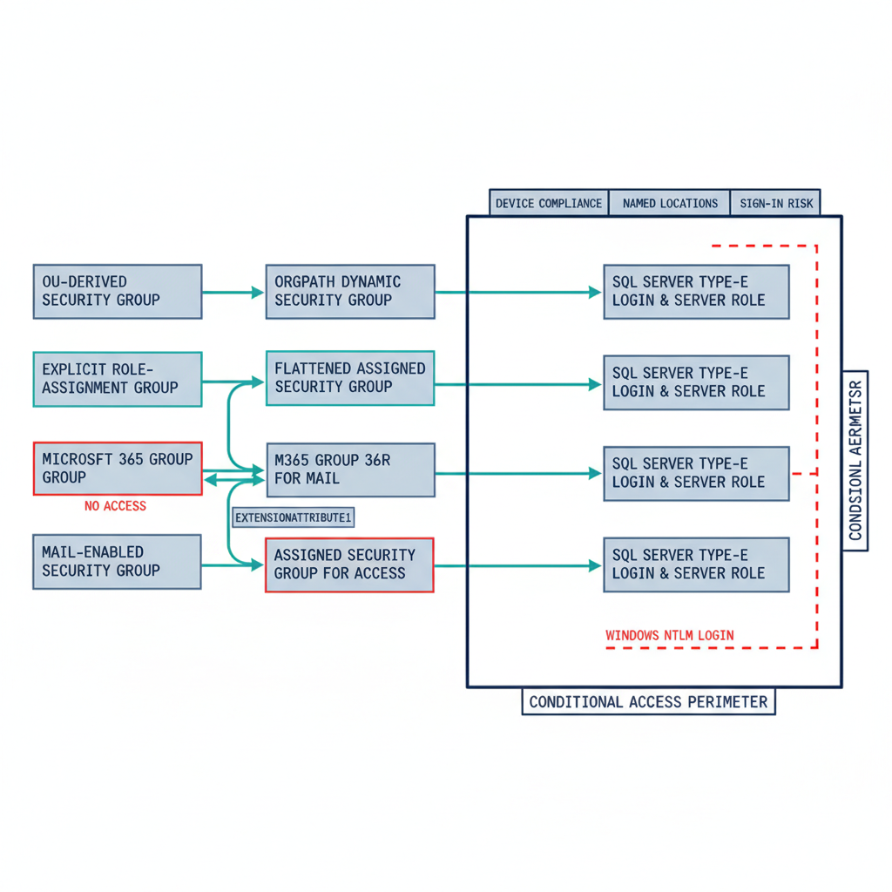

::: {.callout-note}
## OrgPath examples in this chapter predate Hybrid-C+Path

The dynamic-group rule examples below use the retired Model A/B form — the whole
OrgPath as one composite string in a single slot. [ADR-078](/docs/adr/adr-078-orgpath-attribute-schema-15-facet.html)
replaced that with named facets (`extensionAttribute1` is the **region** facet),
and [ADR-127](/docs/adr/adr-127-orgpath-hybrid-derived-path.html) moved the
derived canonical path to `extensionAttribute15`. A *subtree* rule reads
`(user.extensionAttribute15 -startsWith "Region=NCR|Department=Finance|")` —
anchored at `Region=`, because the derived path is composed region, department,
division in that order, and with the trailing delimiter, which is mandatory. A
rule for "all of Finance, in every region" is not a subtree at all: it is the
facet predicate `(user.extensionAttribute2 -eq "Finance")`.

The examples are retained as written because the *pattern* they teach —
OU-derived groups become dynamic groups keyed on organizational attributes — is
unchanged. Do not copy the slot numbers or value shapes; the authoritative map is
[`codebook.yaml`](https://github.com/WhalerMike/uiao/blob/main/src/uiao/canon/data/orgpath/codebook.yaml).
:::

<!-- orgpath-slot-allow-file: teaching examples deliberately retained in the retired Model A/B form; reader-facing banner above (issue #1432) -->

# Chapter 1 — AD Group Types and the Entra Perimeter

*The group-based access model survives the migration; its lifecycle and its outer boundary do not.*

::: {.callout-note}
## In this chapter
How the four canonical AD-to-Entra group types of the ADR-067 rationalization framework map onto SQL Server roles, why an OrgPath-driven dynamic security group replaces the helpdesk-ticket membership model, how the mail-enabled security group splits into two Entra objects, why Conditional Access becomes a binary outer perimeter that covers every type-E SQL Server connection and none of the Windows ones, and why that binary is a governed steady state rather than a false dichotomy — with compensating controls accommodated as time-bound exceptions, not co-equal destinations.
:::

The access control model for SQL Server has historically lived entirely inside SQL Server: server-level roles, database-level roles, and the AD security groups mapped to them. The migration from AD-backed Windows logins to Entra-backed type-E logins changes the identity authority for those groups from Active Directory to Microsoft Entra ID, but it does not eliminate the group-based pattern itself.

What changes is the group lifecycle. Where an AD security group required a helpdesk ticket to add or remove a member, an Entra dynamic security group whose membership rule references OrgPath attributes updates itself continuously as HR data changes. The DBA manual cycle — grant access, verify access, revoke access — is replaced by an attribute-driven policy that requires no DBA action for routine changes.

{#fig-book-07-cpt-01-diagram-01 fig-alt="An engineering blueprint diagram on a white background. Left column lists four AD source group types stacked vertically: OU-derived security group, explicit role-assignment group, distribution list, mail-enabled security group. Arrows cross a center column of Entra targets: OU-derived maps in teal to an OrgPath dynamic security group; explicit-role maps to a flattened assigned security group; distribution list maps to a Microsoft 365 Group annotated no access in red; mail-enabled security group splits with two teal arrows into both an M365 Group for mail and an assigned security group for access, joined by a small correlation tag labeled extensionAttribute1. The three access-bearing targets feed into a right-side stack of SQL Server type-E logins and server roles. Wrapping the entire right side is a navy boundary rectangle labeled Conditional Access perimeter with three condition tags reading device compliance, Named Locations, sign-in risk. A red dashed line shows a Windows NTLM login bypassing the perimeter entirely. Engineering blueprint style, white background, federal navy (#1F3A5F) for boxes and the perimeter, red (#C0392B) for the no-access and bypass paths, teal (#1A9E8F) for granted and dynamic mappings, monospace labels, no human figures, 16:9 landscape." width="100%"}

ADR-067 classifies every migrating AD security group into exactly one of four canonical types, each with a defined Entra target and transformation pattern. The remainder of this chapter walks those four types, maps each to its SQL Server consequence, and then turns to the perimeter the completed migration enables. (ADR-036, ADR-067, ADR-037)

## Type 1 — OU-Derived Security Groups Become OrgPath Dynamic Groups

The first ADR-067 type is the security group used for OU-derived access: groups that exist because users in a given organizational unit needed access to a SQL Server database or server role. In the AD world these are typically named for the unit they serve — `OU-DEPT-DBA-PROD` — and members are added by organizational position.

ADR-067 maps this type to the dynamic-group pattern that ADR-036 defines. In Entra ID these become dynamic security groups whose membership rule references OrgPath attributes, expressing the organizational logic that was previously encoded in the group name and maintained by hand. A rule such as `(user.extensionAttribute5 -eq "ORG/DEPT/TEAM") -and (user.jobTitle -contains "DBA")` admits any principal whose OrgPath attribute matches and whose title contains "DBA," automatically and continuously.

OrgPath attribute values are populated by the OrgPath Narrative's HR-data synchronization pipeline; they are not manually managed. Migrating a Type 1 group therefore requires two things: confirming the OrgPath attribute infrastructure is in place — a dependency on the OrgPath Narrative — and authoring the dynamic membership rule that correctly expresses the original group's organizational logic. (ADR-036)

## Type 2 — Explicit Role-Assignment Groups

Type 2 groups exist specifically to grant a named role or permission on SQL Server — `PROD-SQL-SYSADMIN`, `DB-REPORTING-READONLY`. They carry no organizational-derivation logic; members are added explicitly because they need the specific permission. In Entra ID these become flat assigned security groups: no dynamic rule, membership managed by direct assignment, and — per ADR-067 — flattened, with no nested transitive groups carried over.

The difference from the AD equivalent is in the maintenance model. Modifying membership of an assigned Entra security group requires an Entra role assignment — User Administrator scope, or a delegated role within an Administrative Unit per ADR-037 — rather than a helpdesk ticket to an AD administrator. That is the governance improvement.

The migration itself is operationally straightforward: create the Entra security group, populate it with the AD group's members, create the SQL Server type-E login for the Entra group, and validate. The process is simple; the improvement is in the ongoing model, which Chapter 2 shows depends on the Administrative Unit being provisioned first. (ADR-037)

## Type 3 — Distribution Lists for SQL Server Agent Notifications

Type 3 groups are not access control groups at all — they are routing artifacts. SQL Server Agent jobs can send completion and failure notifications to an email address, and many environments have used AD distribution lists, mail-enabled groups with security disabled, as the target.

In Entra ID, ADR-067 maps a distribution list to a Microsoft 365 Group with `securityEnabled: false` — mail-only, and explicitly never used for access control. Migrating a Type 3 group is an email-routing migration, not a SQL Server access control migration. The SQL Server Agent operator definition that holds the notification address must be updated to reference the new M365 Group's email.

No SQL Server login is created for a Type 3 group, because it carries no access role. The ADR-067 classification makes this exclusion explicit: distribution lists are removed from the login migration and handled on the mail-routing path instead. (ADR-067)

## Type 4 — Mail-Enabled Security Groups Split in Two

Type 4 is the most complex case: a single group that is both a security group, used for SQL Server access, and mail-enabled, used for Agent notifications. ADR-067 specifies a two-object pattern. The one mail-enabled security group is split into an M365 Group for mail routing — taking the email address and the distribution membership — and an assigned Entra security group for access — taking the security membership and the SQL Server role.

The two objects are correlated by an OrgPath extension attribute so the organizational relationship between them is preserved and a future engagement can re-correlate them. The SQL Server login is created against the security group; the Agent operator is pointed at the M365 Group's email.

The operational result is identical to the original — the right people get access, the right people get job notifications — but the model is cleaner, because the access group and the mail group now have independent lifecycles. ADR-067 accepts the cost: the split doubles the migration object count for this class, and every split is recorded in the migration audit with its correlation attribute. (ADR-067)

## Conditional Access as the Outer Perimeter

The architectural dividend of completing the access control migration is that Conditional Access — a Microsoft Entra capability, not a SQL Server feature — becomes the outer perimeter for all SQL Server access. When every login is a type-E login backed by an Entra principal, every connection attempt requires an Entra access token, and every token request passes through Conditional Access evaluation before the token is issued.

A DBA connecting from a device that is not registered in Entra ID, or registered but out of compliance with the device policy, receives a token denial; the connection never opens. A DBA connecting from a network address outside the program's Named Locations is denied. A DBA whose sign-in risk is elevated to "high" by Entra ID Protection — an unusual location, or a credential flagged in a breach report — is denied or challenged for remediation.

None of these controls exist in the Windows Authentication model, and none apply to a type-U or type-G login backed by an AD principal. The perimeter is binary: it covers all connections or it covers none, because a single Windows-backed login is a bypass path around every Conditional Access control. This is the zero-trust posture the program's boundary requires, with continuous verification replacing the perimeter trust of the domain-joined world. (ADR-091)

## The Binary Perimeter Is Not a False Binary

A reviewer is right to interrogate the word *binary*, and the claim deserves a precise defense. The assertion is not that no other control can touch a surviving Windows or SQL-Authentication login — it is that no other control delivers the same assurance, which is why ADR-091 §4 treats every such login as a time-bound exception rather than a co-equal steady state.

The compensating controls a skeptical panel will raise are real and worth naming. A privileged-access workstation (PAW) or Azure Bastion constrains *where* an administrative connection originates. Network segmentation and host firewalls constrain *which* hosts can reach the instance. Just-in-time elevation through Privileged Identity Management, and credential vaulting through a privileged-access-management (PAM) system, constrain *when* a standing credential is live and *who* can check it out. Each reduces the exposure of a Windows-backed login, and each is appropriate during the migration window.

What none of them provides is identity-conditioned, continuous, per-connection evaluation. A bastion host authorizes the jump, but the SQL connection that leaves it still authenticates with Kerberos or NTLM beneath the Entra plane — the device-compliance state, the sign-in-risk signal, and the MFA freshness that Conditional Access evaluates *at token issuance, on every connection* are invisible to it. Network controls are perimeter controls: they do not travel with the identity, they do not re-evaluate as risk changes mid-session, and the credential itself stays outside the Entra plane, where Defender for Identity cannot correlate it. A PAM vault still hands out a credential that, once retrieved, authenticates without any of those checks.

This is why ADR-091 §4 does not forbid the compensating-control posture — it *governs* it. A login that cannot yet move to the Entra plane is permitted only as a **documented exception** carrying the inability-to-migrate reason, a **named compensating control**, and a **sunset date**; where a connection genuinely cannot reach Kerberos or Entra OAuth as dependencies are remediated, **Certificate-Based Authentication is the authorized interim posture per ADR-068**. Compensating controls are the governed bridge across the migration window, not an equivalent destination. The steady state remains binary because the assurance the program's boundary requires — OMB M-22-09 phishing-resistant, Conditional-Access-conditioned access, operationalized through AC-17 and IA-2 — is achievable only when the credential SQL Server accepts is the Entra token the policy controls. (ADR-091, ADR-068)

::: {.callout-tip title="Division of labor"}
**Microsoft provides:** Entra ID security groups; Entra Connect sync for AD group projection; the dynamic group membership engine; Conditional Access as the binary outer perimeter once every login is Entra-backed.

**What only you can provide:** the ADR-067 four-type classification for every migrating AD group; the OrgPath-driven dynamic group design; the two-object split for mail-enabled security groups; the compensating-control documentation for any login that cannot yet reach the Entra plane (ADR-068 CBA as interim posture).
:::

::: {.callout-note title="What Book 07 establishes — Chapter 1"}
The ADR-067 rationalization framework classifies every migrating AD security group into one of four canonical types: OU-derived groups become OrgPath-driven dynamic security groups (ADR-036); explicit role-assignment groups become flattened assigned security groups; distribution lists become mail-only Microsoft 365 Groups with no access role; and mail-enabled security groups split into a two-object pattern — an M365 Group for mail plus an assigned security group for access, correlated by an OrgPath attribute. The access-bearing types map to SQL Server type-E logins, and once every login is Entra-backed, Conditional Access becomes a binary outer perimeter — device compliance, Named Locations, and sign-in risk — that a single surviving Windows login would entirely bypass. That binary is the steady-state target, not a false dichotomy: ADR-091 §4 accommodates compensating controls (PAW/bastion, segmentation, JIT, PAM) only as documented, sunset-dated exceptions, with Certificate-Based Authentication as the authorized interim posture for connections that cannot yet reach the Entra plane (ADR-068).
:::
