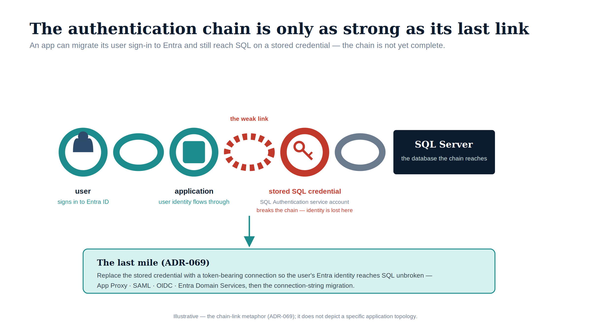

::: {.content-visible when-format="docx"}
# Book_08 — The Application Chain: LDAP-Bound and SQL-Consuming Applications
:::

::: {.callout-note}
An upstream application that has migrated its user authentication to Entra ID but still uses a SQL Authentication service account to reach the database has not completed its transformation. The application chain must be addressed as a complete authentication path, not as independent layers. (ADR-069, Spec3-D1.9)
:::

{#fig-book-08-image-01 fig-alt="An illustrative figure on a white background showing an authentication path drawn as a chain of links. From the left, a teal link with a silhouette icon ('user — signs in to Entra ID') connects to a teal link with a square icon ('application — user identity flows through'). The next connector is a red dashed link annotated 'the weak link', joining a red link with a key icon labelled 'stored SQL credential — SQL Authentication service account; breaks the chain — identity is lost here'. A grey link then reaches a navy 'SQL Server' box ('the database the chain reaches'). Below, a teal-bordered panel headed 'The last mile (ADR-069)' reads 'Replace the stored credential with a token-bearing connection so the user's Entra identity reaches SQL unbroken — App Proxy, SAML, OIDC, Entra Domain Services, then the connection-string migration', linked up to the weak link by a teal arrow. Illustrative register (ADR-095): teal (#1E8C8C) for migrated links, red (#C0392B) for the broken stored-credential link, navy (#0D1B2E) for SQL Server; no photographs; 16:9 landscape. A footer line notes the figure is illustrative — the chain-link metaphor, not a specific application topology." width="100%"}

::: {.callout-tip}
## Download this book
**[Book_08-bundle.docx](Book_08-bundle.docx)** — every chapter of this book concatenated into one Word document. Regenerated on every site deploy.
:::

## Chapters

::: {#book-chapters}
:::

::: {.callout-tip}
## Continue the series
[← Previous: Book 07 — Access Control](Book_07.qmd) · [Index](index.qmd) · [Next: Book 09 — The Transformed Posture →](Book_09.qmd)
:::
