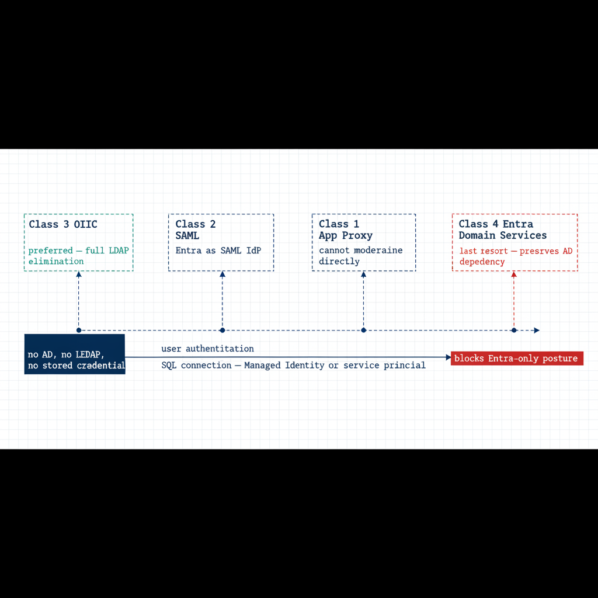

# Chapter 1 — The Four-Class Pattern Applied to SQL-Consuming Applications

*The application is the other half of the authentication chain — and it has its own AD dependency to remove.*

::: {.callout-note}
## In this chapter
Why SQL Server's authentication transformation is incomplete until the upstream applications that consume it are addressed, how ADR-069's four-class taxonomy categorizes those applications by modernization capability, what each class means for both the user-authentication track and the SQL-connection track, and how `Spec3-D1.9` produces the per-application classification data that drives the triage.
:::

SQL Server does not exist in isolation. In every federal environment of meaningful size, it is the data layer downstream of a middleware tier — web application servers, API backends, reporting services, ETL pipelines, and legacy integration systems. Those middleware applications carry their own authentication architecture, and in many federal environments that architecture includes LDAP binding: the application binds to Active Directory as a directory authority, queries group membership or user attributes, and treats AD as its authorization source.

The same AD dependency that must be removed from SQL Server's authentication layer must also be removed from those upstream applications, and the removal must be coordinated. An application that has migrated its user authentication to Entra ID OIDC but still uses a SQL Authentication service account to reach SQL Server has not completed its transformation. The application chain must be addressed as a complete authentication path — user to application to database — not as independent layers.

ADR-069 (LDAP-Dependent Application Migration), accepted 2026-05-13, provides the four-class taxonomy for categorizing upstream applications by modernization capability, in a strict preference order: Class 3 (OIDC) preferred, then Class 2 (SAML), then Class 1 (App Proxy), then Class 4 (Entra Domain Services) as the last resort. `Spec3-D1.9` (`Get-LDAPBindAccountInventory.ps1`) is the discovery instrument that produces the per-application classification data this chapter depends on. (ADR-069, Spec3-D1.9)

{#fig-book-08-cpt-01-diagram-01 fig-alt="A horizontal engineering blueprint on a white background showing four application-class boxes arranged left to right in ADR-069 preference order: Class 3 OIDC labeled 'preferred — full LDAP elimination' in teal, Class 2 SAML labeled 'Entra as SAML IdP', Class 1 App Proxy labeled 'cannot modernize directly', and Class 4 Entra Domain Services labeled 'last resort — preserves AD dependency' in red. Below each class box two parallel horizontal tracks run: an upper track labeled 'user authentication' and a lower track labeled 'SQL connection — Managed Identity or service principal'. The Class 3 box shows both tracks merging into a single navy 'no AD, no LDAP, no stored credential' endpoint; the Class 4 box shows the SQL connection track blocked by a red bar labeled 'blocks Entra-only posture'. Engineering blueprint style, white background, federal navy (#1F3A5F) for boxes, teal (#1A9E8F) for OIDC and preferred annotations, red (#C0392B) for Class 4 and least-preferred annotations, monospace labels, no human figures, 16:9 landscape." width="85%"}

## Class 1 — App Proxy: Cannot Be Modernized Directly

Class 1 applications cannot modify their authentication mechanism. They bind to LDAP for user authentication, and the dependency is architectural — embedded in unmaintainable code, supplied by a vendor with no modern auth option, or frozen by a regulatory certification that prevents code modification. For SQL Server, Class 1 applications typically connect using an AD service-account credential stored in a connection string or configuration file.

The Class 1 migration pattern has two independent tracks. The user-authentication track deploys Entra Application Proxy in front of the application: the App Proxy connector fronts the application's user authentication behavior without modifying the application itself. The SQL-connection track migrates the application's database credential from a SQL Authentication service account to a service principal or Managed Identity — a change made in the connection string or configuration, not in code, and independent of the user-authentication track. Both tracks must complete before the application's contribution to the SQL Server transformation is fulfilled. (ADR-069)

## Class 2 — SAML: Federated Identity but Not OIDC

Class 2 applications support SAML federation but not OIDC. SAML 2.0 is an XML-based federation protocol that predates OIDC and is common in federal environments because many enterprise applications implemented SAML support before OIDC was standardized. For Class 2 applications, Entra ID becomes the SAML Identity Provider per ADR-051. The user's authentication is modernized — they authenticate to Entra ID using their Entra credentials, Entra issues a SAML assertion, and the application validates the assertion and grants access — but the protocol is SAML, not OIDC.

The SQL-connection track for Class 2 follows the same pattern as Class 1: the connection string migrates from SQL Authentication or Windows Integrated Security to Managed Identity or service-principal authentication. The user-authentication modernization and the SQL-connection migration are separate tracks and can be sequenced independently. ADR-069 places Class 2 second to Class 3 because SAML eliminates the LDAP dependency rather than proxying through it, yet ranks below OIDC because it does not provide the full capability set of a modern identity protocol. (ADR-069, ADR-051)

## Class 3 — OIDC: The Preferred Destination

Class 3 is the preferred migration destination in ADR-069's ordering. An OIDC-capable application can migrate fully to Entra ID as its identity provider, eliminating the LDAP dependency entirely. The application redirects the user to the Entra ID authorization endpoint, the user authenticates with Entra credentials, Entra issues an ID token and an access token, and the application uses the claims in those tokens for identity and authorization. No LDAP bind occurs, and no AD query occurs.

The application's SQL Server connection also uses Managed Identity or service-principal authentication, with no stored credential. The end-to-end chain for a Class 3 application reaching SQL Server is direct: the user authenticates to Entra ID via OIDC, the application uses its Managed Identity to authenticate the SQL connection, SQL Server validates the Managed Identity token through the Arc-provided token-validation infrastructure, and the connection is established. There is no AD in this path, no LDAP, no NTLM or Kerberos, and no stored credential. This is the target architecture. (ADR-069)

## Class 4 — Entra Domain Services: Last Resort

Class 4 applications cannot be modernized to any modern authentication protocol. They require actual LDAP and Kerberos from a domain controller — not a proxy, not a federation, but a real AD-compatible domain with DNS SRV records, LDAP on port 389, and Kerberos on port 88. For these applications, Entra Domain Services provides a Microsoft-managed PaaS domain that presents an AD-compatible interface — LDAP, Kerberos, NTLM — while being backed by Entra ID rather than a customer-managed domain controller. ADR-069 places Class 4 last because it preserves the AD dependency rather than eliminating it.

For SQL Server, Class 4 carries a specific implication. An instance hosting databases for a Class 4 application cannot complete the full authentication transformation until that application is upgraded to a higher class or sunset. An instance that still accepts Windows Authentication logins because a Class 4 application cannot use Entra ID authentication is blocked from the Entra-only posture that UIAO_135 Transformation #7 requires. Class 4 applications must be inventoried against their SQL Server dependencies, and each instance with a Class 4 upstream application must carry a documented exception with a sunset date. (ADR-069)

## Spec3-D1.9 as the Classification Triage Tool

The `Get-LDAPBindAccountInventory.ps1` script (`Spec3-D1.9`) is the instrument that produces the per-application classification data needed to execute the four-class triage. For each application in its enumeration scope, the script captures the LDAP bind account — the AD service account used for directory queries — and the SQL Server connection target, meaning the instance and database the application connects to.

It also captures the authentication mechanism for that SQL connection (Windows Integrated Security, SQL Authentication, or already-migrated Managed Identity or service principal) and the signals that map to each class: SAML metadata URLs, OIDC discovery-endpoint registration, or vendor documentation indicating modernization capability. The output is a per-application record with a recommended class assignment and the detection signals that support it.

That record is the input to the ADR-069 migration triage and to the instance-level migration planning in Book 04. The two audit scripts must be correlated to produce a complete picture: `Spec3-D1.8` enumerates SQL Server instances, and `Spec3-D1.9` enumerates the upstream applications. Only when both are joined does each SQL Server instance reveal its full authentication chain — every application that depends on it, and the class each one falls into. (Spec3-D1.9, ADR-069)

::: {.callout-note title="What Book 08 establishes — Chapter 1"}
SQL Server's authentication transformation is incomplete until the upstream applications that consume it are addressed as a full chain — user to application to database. ADR-069's four-class taxonomy ranks those applications by modernization capability: Class 3 (OIDC, full LDAP elimination) preferred, then Class 2 (SAML, Entra as IdP per ADR-051), then Class 1 (App Proxy, cannot modernize directly), then Class 4 (Entra Domain Services, last resort, which preserves the AD dependency and blocks the host instance from Entra-only posture). Every class carries two independent tracks — user authentication and the SQL connection — and `Spec3-D1.9` produces the per-application classification data that drives the triage.
:::
