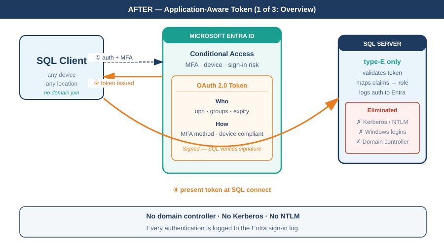
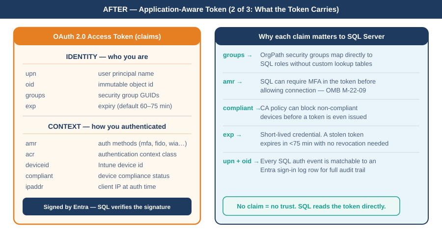
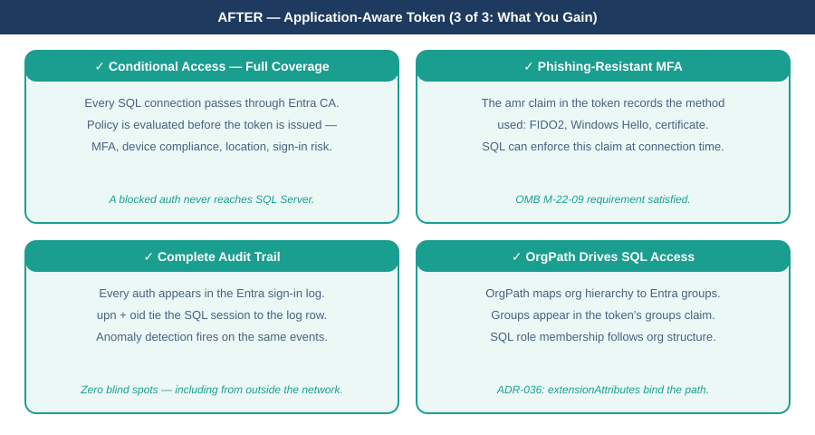

::: {.content-visible when-format="docx"}
# Book_09 — The Transformed Posture: Continuous Governance and the 2027 Milestone
:::

::: {.callout-note}
A transformation that achieves a completed state and then stops monitoring is a transformation that will regress. The transformed posture is not a permanent state achieved by a one-time action — it is an ongoing condition maintained by continuous monitoring, automated drift detection, and a governance process that treats regression as a compliance violation. (ADR-068 Phase C, UIAO_135 Transformation #7)
:::

{#fig-book-09-card-after-01 fig-alt="Card diagram on white background. Title: AFTER — Application-Aware Token (1 of 3: Overview). SQL Client left, Microsoft Entra ID center with Conditional Access and OAuth 2.0 token box, SQL Server right with type-E only and Eliminated box. Three numbered arrows: auth+MFA, token issued, token presented at SQL connect. Footer: no domain controller, no Kerberos, no NTLM." width="100%"}

{#fig-book-09-card-after-02 fig-alt="Card diagram on white background. Title: AFTER — Application-Aware Token (2 of 3: What the Token Carries). Left panel: OAuth 2.0 token anatomy with Identity and Context sections listing all claims. Right panel: why each claim matters to SQL Server — groups drive role mapping, amr enforces MFA, compliant blocks non-compliant devices, exp limits credential lifetime, upn+oid enable full audit trail." width="100%"}

{#fig-book-09-card-after-03 fig-alt="Card diagram on white background. Title: AFTER — Application-Aware Token (3 of 3: What You Gain). 2x2 grid of teal gain cards: CA Full Coverage, Phishing-Resistant MFA (OMB M-22-09 satisfied), Complete Audit Trail, OrgPath Drives SQL Access (ADR-036)." width="100%"}

{#fig-book-09-seq-token fig-alt="UML sequence diagram on white background. Four vertical lifelines: SQL Client (navy), Microsoft Entra ID (teal), Conditional Access Engine (amber), SQL Server (navy). Seven numbered steps: auth+MFA, CA evaluation, policy result with CA checks badge, signed token, token presented, SQL validation box, connection open. Silent refresh step shown dashed. Footer: token expiry 60-75 min, no domain controller at any step." width="100%"}

{#fig-book-09-wan-03 fig-alt="WAN topology diagram showing the new world authentication state: client connects to Entra ID with MFA and Conditional Access, receives an OAuth 2.0 token with context claims, presents it to Arc-enabled SQL Server which accepts only type-E logins and continuously verifies zero NTLM via CCM-BIR and Defender for SQL. A navy footer bar explains the shift from identity-only to application-aware authentication. Navy, teal, amber palette, white background." width="100%"}

{#fig-book-09-wan-simple-03 fig-alt="Simplified WAN diagram showing SQL Client on the left, Microsoft Entra ID center, Arc-enabled SQL Server right. Three curved arrows: authenticate with MFA, token issued, token presented at SQL connect. Entra box shows Conditional Access and token claims. SQL Server shows type-E only with eliminated list. Navy footer bar contrasts old world with new world. White background, navy, teal, amber palette." width="100%"}

::: {.callout-tip}
## Download this book
**[Book_09-bundle.docx](Book_09-bundle.docx)** — every chapter of this book concatenated into one Word document. Regenerated on every site deploy.
:::

## Chapters

::: {#book-chapters}
:::

::: {.callout-tip}
## Continue the series
[← Previous: Book 08 — The Application Chain](Book_08.qmd) · [Index](index.qmd) · [Next: Book 10 — Certificate Authority →](Book_10.qmd)
:::
