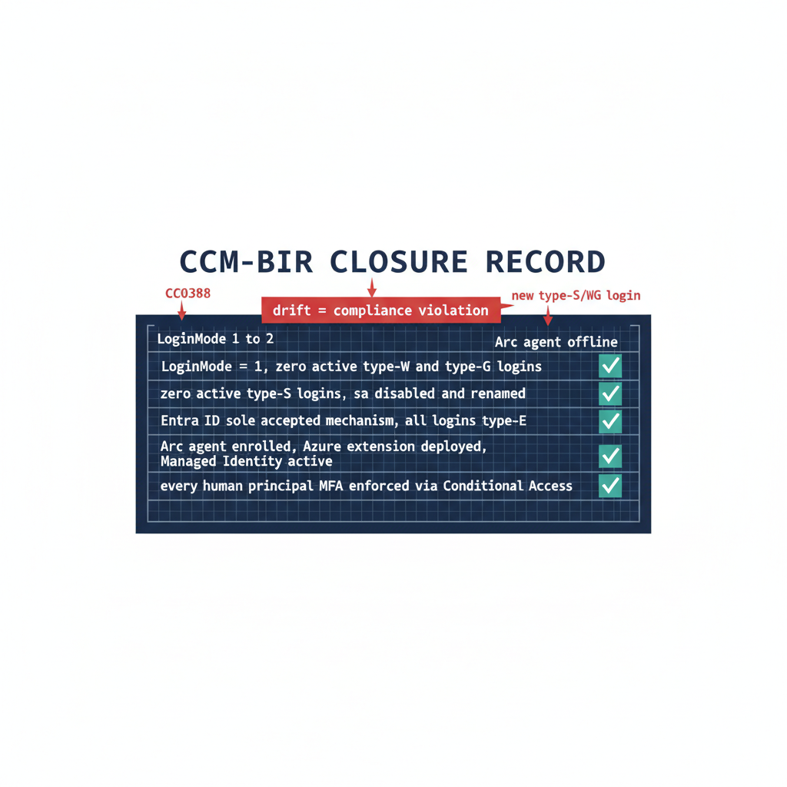

# Chapter 1 — The Closure Condition for UIAO_135 Transformation #7

*Transformations do not complete — they achieve a posture, and a posture is something you keep proving.*

::: {.callout-note}
## In this chapter
The five conditions that must be simultaneously satisfied for Transformation #7 to be closed across the estate, why the continuous audit rather than a one-time scan is the verification instrument, how the CCM-BIR record per instance captures the satisfying state, what drift detection looks for, and how Defender for SQL adds a behavioral telemetry layer on top of the structural monitoring.
:::

A transformation that achieves a completed state and then stops monitoring is a transformation that will regress. A SQL Server instance migrated to Entra ID-only authentication can be reconfigured to Mixed Mode by any administrator with sufficient permission. New SQL Authentication logins can be created. New Windows logins can be created if the instance remains domain-joined. The transformed posture is not a permanent state achieved through a one-time action — it is an ongoing condition maintained by continuous monitoring, automated drift detection, and a governance process that treats regression as a compliance violation rather than an operational preference. (ADR-068 Phase C, UIAO_135 Transformation #7)

{#fig-book-09-cpt-01-diagram-01 fig-alt="An engineering blueprint panel on a white background titled CCM-BIR closure record. A central record card lists five rows, each a closure condition with a satisfied marker: row one LoginMode = 1, zero active type-W and type-G logins; row two zero active type-S logins, sa disabled and renamed; row three Entra ID sole accepted mechanism, all logins type-E; row four Arc agent enrolled, Azure extension deployed, Managed Identity active; row five every human principal MFA enforced via Conditional Access. Each satisfied row is marked teal. A red banner across the top reads drift = compliance violation, with three small red callouts pointing at the record labeled LoginMode 1 to 2, new type-S/W/G login, Arc agent offline. Engineering blueprint style, white background, federal navy (#1F3A5F) for the record card and labels, red (#C0392B) for drift and regression markers, teal (#1A9E8F) for satisfied and closed markers, monospace labels, no human figures, 16:9 landscape." width="100%"}

## The Five Closure Conditions

UIAO_135 §1.2 defines Transformation #7 as complete when five conditions are simultaneously satisfied across all production SQL Server instances in the estate. The first is that Windows Authentication is eliminated as an accepted login mechanism. No production instance is configured for Mixed Mode — all instances run in Windows Authentication Only mode, but with no active Windows-backed logins in `master`. The operational verification is the authentication mode registry value (`LoginMode = 1`) together with a query of `sys.server_principals` confirming zero type-W and type-G logins that are not in a disabled state.

The second condition is that SQL Authentication is eliminated. No SQL Authentication logins — type-S logins — exist on any production instance other than those carrying documented exception status, and the `sa` account is disabled on every instance. The operational verification is a `sys.server_principals` query for type-S logins, cross-referenced against the exception registry the program maintains. The third condition is that Entra ID authentication is the sole accepted mechanism. This is the positive statement of the first two: all active logins on all instances are type-E logins, and every connection produces an Entra ID sign-in event.

The fourth condition is that the engine process runs with a Managed Identity. The Arc Connected Machine agent is installed, the system-assigned Managed Identity is active, and the Azure extension for SQL Server is deployed on every production host. The fifth condition is that every human principal authenticates with MFA enforced by Conditional Access. This is verified through Entra ID sign-in logs and Conditional Access policy reports — every sign-in event for a SQL Server resource should show MFA satisfied and Conditional Access grant controls met. (UIAO_135 §1.2, ADR-091 §5)

## The Continuous Audit as the Verification Instrument

Spec3-D1.8 in continuous monitoring mode — running on a recurring schedule against the full estate rather than as a point-in-time scan — is the primary instrument for verifying that all five closure conditions remain satisfied over time. The CCM-BIR record per instance, updated on each audit run, is the structured evidence artifact that captures the current state of each condition for each instance. ADR-091 §5 defines the field set that record carries. (Spec3-D1.8, ADR-091 §5)

A CCM-BIR record that shows `LoginMode = 1`, zero active type-S logins, zero active type-W logins, zero active type-G logins, the `sa` account disabled and renamed, the Arc agent enrolled, the SQL extension deployed, and the Managed Identity active is a record that satisfies all five closure conditions for that instance. When all production instances carry satisfying CCM-BIR records, Transformation #7 is verifiably closed for the estate. The continuous audit ensures closure is not a point-in-time claim — it is an ongoing verification. (ADR-091 §5)

## Drift Detection

Drift detection in the CCM-BIR pipeline identifies conditions that would constitute regression before they become compliance violations. A drift event for SQL Server authentication takes one of several forms. An instance whose `LoginMode` value changes from 1 to 2 — Windows Authentication Only to Mixed Mode — indicates that someone has enabled Mixed Mode without authorization. A new type-S login appearing in `sys.server_principals` that was not present on the previous audit run indicates that a SQL Authentication login has been created.

A new type-W or type-G login appearing on an instance that was previously in the Entra-only posture is the same class of regression for Windows-backed identity. And an Arc agent going offline, or the SQL extension becoming unavailable, would interrupt the Managed Identity-based engine authentication. Each drift event triggers the program's remediation workflow. ADR-091 §5 records these same events — `LoginMode` reverting to Mixed Mode, a new type-S/W/G login appearing, the Arc agent going offline — as compliance violations, not advisory signals.

The 2027-04-01 NTLM elimination backstop is not a migration completion date in the CCM-BIR context — it is the date by which the records for all production instances must have been in the satisfied state continuously for a sufficient validation period. Migration activity should conclude well before the 2027-04-01 block date set in ADR-068; the final months before it are the continuous-audit validation period, not the migration period. (ADR-068 Phase C and ADR-091 §5)

## Defender for SQL as the Behavioral Telemetry Layer

Microsoft Defender for SQL provides the behavioral anomaly detection layer that complements the CCM-BIR structural compliance monitoring. CCM-BIR monitors the configuration state of each instance — is the `LoginMode` correct, are the login types correct. Defender for SQL monitors the behavioral patterns of connections to each instance: who is connecting, from where, at what times, using what authentication mechanisms, and whether those patterns deviate from the established baseline.

In the transformed posture, Defender for SQL operates against a baseline of Entra ID-only connections. Every connection produces an Entra ID sign-in event; every anomalous connection — from an unusual source IP, at an unusual time, with an elevated sign-in risk signal — is surfaced by Defender for SQL and by Entra ID Protection. Any NTLM or Kerberos authentication event in Defender for SQL telemetry, which should be zero in the transformed posture, is an immediate alert.

An NTLM event means one of three things: an instance has regressed to Mixed Mode, which CCM-BIR should already have detected; an instance was not included in the original audit scope, a discovery gap; or a novel connection pattern has appeared that the migration plan did not anticipate. All three require investigation. The combination of CCM-BIR structural monitoring and Defender for SQL behavioral monitoring is the two-layer governance instrument that maintains the transformed posture continuously after the migration is complete.

::: {.callout-tip title="Division of labor"}
**Microsoft provides:** Spec3-D1.8 on a schedule for CCM-BIR structural monitoring; Defender for SQL behavioral monitoring; the five-condition verification capability; the Entra ID sign-in log as evidence.

**What only you can provide:** the program that drives all five closure conditions to simultaneous satisfaction across every production instance; the drift-detection response process that treats every CCM-BIR event as a compliance violation; the continuous monitoring instruments in production before the migration is declared done.
:::

::: {.callout-note title="What Book 09 establishes — Chapter 1"}
Transformation #7 is closed when five conditions hold simultaneously across every production instance: Windows Authentication eliminated (`LoginMode = 1`, no active type-W/G logins), SQL Authentication eliminated (`sa` disabled, no active type-S outside the exception registry), Entra ID the sole mechanism, the engine running under a Managed Identity, and every human principal MFA-enforced via Conditional Access. The continuous audit (Spec3-D1.8 on a schedule) is the verification instrument, the satisfying CCM-BIR record per ADR-091 §5 is the evidence, drift detection catches regression before it becomes a violation, and Defender for SQL adds a behavioral layer over the structural monitoring.
:::
