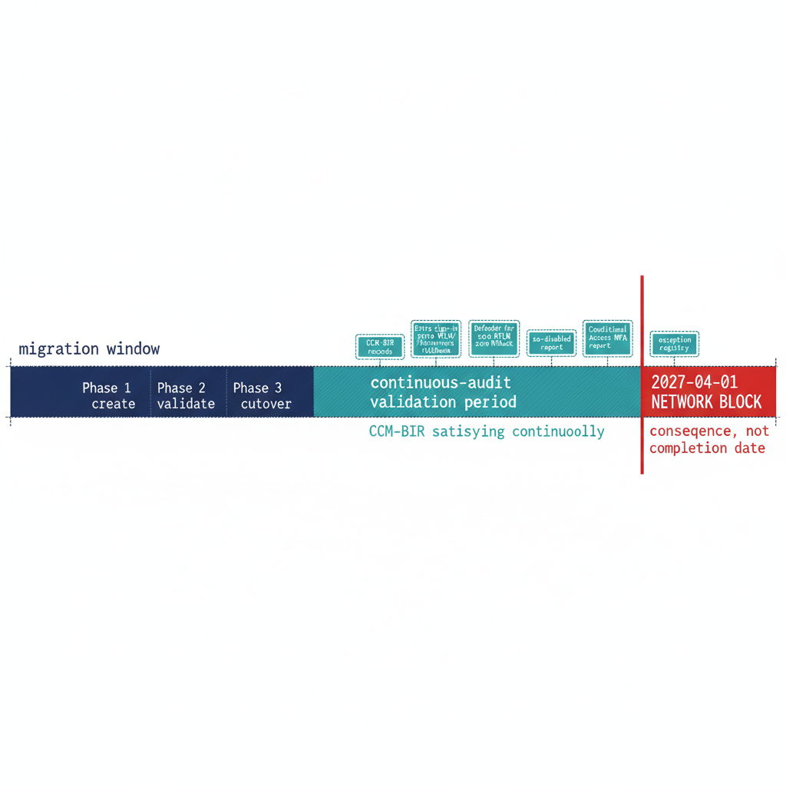

# Chapter 2 — The 2027 Milestone: What Done Looks Like

*The evidence is not a binder you assemble — it is the live output of the monitoring you never turn off.*

::: {.callout-note}
## In this chapter
The six evidence artifact sets that close Transformation #7 — and why each is a live output of the continuous monitoring infrastructure rather than a point-in-time document — followed by the correct reading of 2027-04-01: not a migration completion date, but the date the network block is applied, which means the migration must already be complete and the final months reserved for validation.
:::

The evidence artifacts required to close Transformation #7 in UIAO_135 are not a collection of documents produced at a single point in time — they are the live outputs of the continuous monitoring infrastructure described in Chapter 1. A closure claim is only as strong as the monitoring that keeps producing the evidence after the claim is made. This chapter names the artifacts, then places the program's 2027-04-01 NTLM backstop in its proper operational context. (UIAO_135 §1.2, ADR-068 Phase C)

{#fig-book-09-cpt-02-diagram-01 fig-alt="A horizontal engineering timeline on a white background running left to right toward a hard vertical line labeled 2027-04-01 NETWORK BLOCK marked in red. To the left of the block the timeline is divided into two navy bands: an earlier wide band labeled migration window — Phase 1 create, Phase 2 validate, Phase 3 cutover, ending well before the block; and a later teal band labeled continuous-audit validation period, abutting the red line, annotated CCM-BIR satisfying continuously. Six small teal artifact tags sit above the validation band labeled CCM-BIR records, Entra sign-in logs zero NTLM/Kerberos fallback, Defender for SQL zero NTLM, sa-disabled report, Conditional Access MFA report, exception registry. A red caption beneath the block reads consequence, not completion date. Engineering blueprint style, white background, federal navy (#1F3A5F) for the migration band and labels, red (#C0392B) for the network block and its consequence caption, teal (#1A9E8F) for the validation band and satisfied artifact tags, monospace labels, no human figures, 16:9 landscape." width="85%"}

## The Evidence Artifacts as Live Outputs

The closure claim for Transformation #7 must be supported by six artifact sets, and each is a continuously regenerated output rather than a static deliverable. The first is the CCM-BIR record set: a record for every production SQL Server instance in the estate, each showing Entra-only authentication mode, zero active SQL Authentication logins, zero active Windows-backed logins, the Arc agent enrolled and healthy, and the SQL extension deployed. ADR-091 §5 defines the field set these records carry, and the continuous audit keeps them current rather than freezing them at the moment of the claim. (ADR-091 §5)

The second is the Entra ID sign-in log set, showing zero failed token requests attributable to NTLM or Kerberos fallback for SQL Server resource audience tokens over a defined validation period preceding the closure claim. The third is the Defender for SQL telemetry, showing zero NTLM authentication events over that same validation period — the behavioral confirmation that complements the structural CCM-BIR view. These two artifacts together demonstrate that the transformed posture holds not only in configuration but in observed connection behavior.

The fourth is the `sa` account status report, showing the `sa` account disabled on all instances. The fifth is the Conditional Access policy compliance report, showing MFA enforcement satisfied for one hundred percent of SQL Server resource sign-ins by human principals over the validation period. The sixth is the exception registry, showing every currently excepted instance with documented justification, a sunset date, and its own CCM-BIR tracking record. When all six artifact sets are simultaneously satisfying, and the monitoring infrastructure confirms they have been satisfying for the validation period, Transformation #7 is closed. That is what done looks like — not a checkbox, but a demonstrated, continuously verified, evidence-backed posture. (UIAO_135 §1.2, ADR-091 §5)

## 2027-04-01: A Consequence, Not a Completion Date

The 2027-04-01 NTLM elimination deadline is the single most misread date in the program. It is widely treated as the date by which the migration must complete. It is not. It is the date on which the network-level NTLM block is applied. The block does not distinguish a compliant instance from an excepted one — it does not honor engine-layer exception status at all. The difference between "migration complete by 2027-04-01" and "migration must be complete before 2027-04-01, and 2027-04-01 is when the block is applied" is not a semantic distinction. It is the difference between a deadline and a consequence. (ADR-068 Phase C and ADR-091 §5 set the 2027-04-01 block date)

Read as a consequence, the date reorganizes the schedule. If 2027-04-01 is when connections that still depend on NTLM stop working, then the migration must have already concluded by then, with enough margin for the continuous audit to have confirmed the satisfying posture across a full validation period. Migration activity — the three-phase parallel-run, the cutover, the `sa` disablement, the type-S elimination — should finish well before the deadline. The final months are reserved for validation, not for migration, because a posture confirmed only on the last day before the block is a posture nobody has had time to prove.

This reading also gives the exception long-tail its proper weight. An instance that cannot reach Kerberos or Entra OAuth before the block must carry a documented exception with Certificate-Based Authentication as the authorized interim posture, and that exception's sunset date must be reconciled against the block rather than against any softer internal milestone. The block is network-level and fixed; the program's schedule must bend to it, not the other way around. When the migration is complete, the audit has validated the posture continuously, and the six artifact sets are live and satisfying, the 2027-04-01 block arrives as a non-event — which is exactly what done is supposed to feel like. (ADR-068 Phase C and ADR-091 §5 set the 2027-04-01 block date)

::: {.callout-note title="What Book 09 establishes — Chapter 2"}
The six evidence artifact sets that close Transformation #7 — CCM-BIR records, Entra sign-in logs showing zero NTLM/Kerberos fallback, Defender for SQL zero-NTLM telemetry, the `sa`-disabled report, the Conditional Access MFA report, and the exception registry — are live outputs of the continuous monitoring infrastructure, satisfying across a defined validation period rather than assembled once. 2027-04-01 is the network-block date and its consequence, not a migration completion date: the migration must complete earlier, with the final months reserved for continuous-audit validation, so the block arrives as a non-event.
:::
