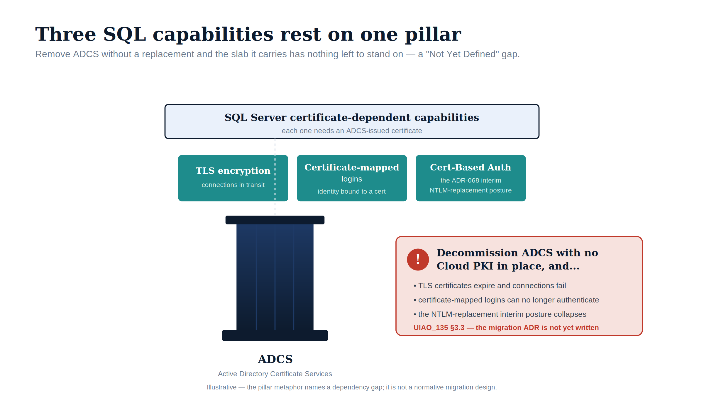

::: {.content-visible when-format="docx"}
# Book_10 — Certificate Authority: From ADCS to Cloud PKI
:::

::: {.callout-warning}
This book documents a **"Not Yet Defined"** gap from UIAO_135 §3.3. The content is analytical and motivational — it identifies the dependencies, names the gap, and describes what the as-yet-unwritten ADCS-migration ADR must address. Spec3-D1.10 (`Get-CertBasedAuthAudit.ps1`) is the discovery instrument. Do not cite this book as normative governance for ADCS-migration decisions.
:::

{#fig-book-10-image-01 fig-alt="An illustrative figure on a white background. A horizontal ice-blue slab labelled 'SQL Server certificate-dependent capabilities — each one needs an ADCS-issued certificate' carries three teal capability blocks: 'TLS encryption (connections in transit)', 'Certificate-mapped logins (identity bound to a cert)', and 'Cert-Based Auth (the ADR-068 interim NTLM-replacement posture)'. The slab is supported by a single navy classical column labelled 'ADCS — Active Directory Certificate Services'. To the right, a red-tinted warning panel headed with a red exclamation reads 'Decommission ADCS with no Cloud PKI in place, and...' followed by 'TLS certificates expire and connections fail', 'certificate-mapped logins can no longer authenticate', 'the NTLM-replacement interim posture collapses', and 'UIAO_135 §3.3 — the migration ADR is not yet written'. Illustrative register (ADR-095): navy (#0D1B2E) for the ADCS pillar, teal (#1E8C8C) for the capabilities, red (#C0392B) for the warning; no photographs; 16:9 landscape. A footer line notes the figure is illustrative — the pillar metaphor names a dependency gap, not a normative migration design." width="100%"}

::: {.callout-tip}
## Download this book
**[Book_10-bundle.docx](Book_10-bundle.docx)** — every chapter of this book concatenated into one Word document. Regenerated on every site deploy.
:::

## Chapters

::: {#book-chapters}
:::

::: {.callout-tip}
## Continue the series
[← Previous: Book 09 — The Transformed Posture](Book_09.qmd) · [Index](index.qmd)
:::
