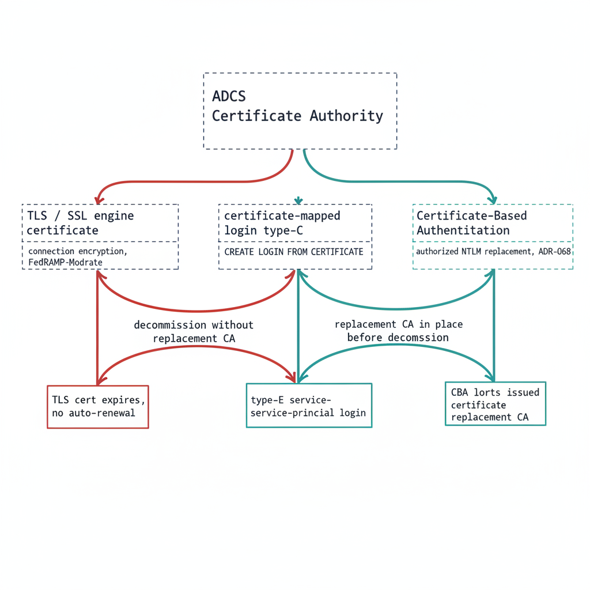

# Chapter 1 — Where SQL Server Touches ADCS

*The certificate dependencies a decommission plan cannot see, named before any decommission plan exists.*

::: {.callout-note}
## In this chapter
The three distinct SQL Server capabilities that depend on ADCS-issued certificates — TLS encryption of client connections, certificate-mapped logins, and Certificate-Based Authentication as the authorized NTLM-replacement interim posture — why each one breaks if ADCS is decommissioned before it is migrated, and why this book documents a transformation for which no normative ADR has yet been authored.
:::

UIAO_135 §3.3 identifies the Active Directory Certificate Services to Cloud PKI transformation as "Not Yet Defined." As the series opening established, that label means the destination may be known but the normative canon governing how to reach it has not been authored. For most of this series, the missing record has been the substrate ADR; for Book 10, the gap is more fundamental still. No architecture decision record governs the certificate authority transformation at all.

There is no ADR equivalent to point to. The transformation is identified as necessary in UIAO_135, the discovery instrument exists, but the normative decision about the replacement CA, the enrollment mechanism, and the sequencing of ADCS decommission has not been made. This book is therefore analytical and motivational rather than prescriptive. It documents why the certificate gap matters specifically for SQL Server, and it cites no normative ADCS-migration ADR because none exists. (UIAO_135 §3.3)

It matters specifically because SQL Server has certificate dependencies that are not visible to most of the teams that will plan the ADCS decommission. Three distinct capabilities depend on ADCS-issued certificates: TLS encryption of client connections, certificate-mapped SQL Server logins, and Certificate-Based Authentication as the authorized NTLM replacement for connections that cannot reach Kerberos or Entra OAuth before the deadline. Spec3-D1.10 (`Get-CertBasedAuthAudit.ps1`) is the instrument for discovering them. (Spec3-D1.10)

{#fig-book-10-cpt-01-diagram-01 fig-alt="An engineering blueprint diagram on a white background. A central box labeled 'ADCS Certificate Authority' connects downward to three SQL Server dependency boxes arranged left to right: 'TLS / SSL engine certificate' annotated 'connection encryption, FedRAMP-Moderate', 'certificate-mapped login type-C' annotated 'CREATE LOGIN FROM CERTIFICATE', and 'Certificate-Based Authentication' annotated 'authorized NTLM replacement, ADR-068'. From each dependency two paths diverge. A red path labeled 'decommission without replacement CA' leads to failure annotations: 'TLS cert expires, no auto-renewal', 'mapped login fails validation', and 'CBA loses certificate infrastructure'. A teal path labeled 'replacement CA in place before decommission' leads to migrated annotations: 'new CA issues TLS cert', 'type-E service-principal login', and 'CBA certs issued by replacement CA'. Engineering blueprint style, white background, federal navy (#1F3A5F) for the ADCS and dependency boxes, red (#C0392B) for the decommission-without-replacement failure path, teal (#1A9E8F) for the migrated replacement-CA path, monospace labels, no human figures, 16:9 landscape." width="100%"}

## SQL Server TLS/SSL Certificates

The first and most commonly recognized SQL Server certificate dependency is the TLS certificate the engine presents for encryption of client connections. When SQL Server is configured to use TLS encryption — which is required under this program's FedRAMP-Moderate posture — it presents a server certificate to connecting clients as part of the TLS handshake.

In most federal environments, that certificate is issued by the organization's ADCS infrastructure. The administrator submitted a request to the ADCS Certificate Authority, the CA issued a certificate carrying the SQL Server's hostname as the Subject Alternative Name, and the certificate was installed in the instance's certificate store and bound through SQL Server Configuration Manager. The certificate has an expiration date.

When ADCS is decommissioned, that certificate will not be renewed automatically — there is no CA left to issue the renewal. If the TLS certificate expires after ADCS decommission, clients configured to validate the server certificate, which is the correct security posture, will reject the connection with a certificate validation error. The encryption that FedRAMP-Moderate requires becomes the thing that breaks the connection.

The Spec3-D1.10 audit captures the TLS certificate for every instance in scope: the subject, the SAN, the issuing CA, and the expiration date. Any instance whose TLS certificate is ADCS-issued is a dependency the migration plan must address. The replacement certificate must come from the new CA — whether Microsoft Cloud PKI or an alternative — and must be installed and bound before the ADCS-issued certificate expires or before ADCS goes offline, whichever comes first. (Spec3-D1.10)

## Certificate-Mapped SQL Server Logins

The second dependency is less commonly known. SQL Server supports a login type — the type-C login — that maps an X.509 certificate to a SQL Server login using the `CREATE LOGIN [name] FROM CERTIFICATE [cert_name]` syntax. When a client connects with a certificate-mapped login, it presents its certificate as the authentication credential. SQL Server validates the certificate's signature against the certificate object stored in `master`, and on success accepts the connection with the associated login's permissions.

Certificate-mapped logins are uncommon in standard deployments, but they appear in specific scenarios: service accounts using certificate-based rather than password-based authentication, SQL Server integration with PKI-based authentication systems, and legacy configurations for Service Broker endpoints. Each is the kind of arrangement that survives quietly across an estate for years without anyone documenting it.

If a certificate-mapped login exists on a production instance and the certificate backing it was issued by ADCS, that login will fail when ADCS is decommissioned and the certificate expires. The preferred migration path is to replace certificate-mapped logins with type-E service-principal logins backed by Entra ID authentication, as described in Book 05. The Spec3-D1.10 audit captures every certificate-mapped login and the issuing CA of its associated certificate, providing the inventory the migration needs. (Spec3-D1.10)

## CBA as the NTLM Replacement Interim Posture

The third dependency is the most consequential for the NTLM elimination timeline. ADR-068 (Certificate-Based Authentication) designates CBA as the authorized replacement for NTLM connections that cannot be migrated to Kerberos or Entra ID OAuth 2.0 tokens within the required timeline. CBA allows a client to authenticate with an X.509 client certificate rather than a password or Kerberos ticket — a strong mechanism that is not subject to the NTLM protocol weaknesses Book 01 described. (ADR-068)

For connections that cannot reach Entra ID auth before the 2027-04-01 NTLM backstop — Category 3 instances still pre-2022, or applications still in the deferred class — CBA is the authorized interim posture. The connection authenticates by certificate rather than NTLM, satisfying the program's NTLM-elimination commitment (recorded in ADR-068) without requiring the full Entra ID migration that pre-2022 instances cannot complete. It is the bridge that keeps an un-migratable connection compliant.

The problem is that CBA certificates must be issued by a CA. If the plan is to deploy CBA as the NTLM-replacement posture for connections that cannot yet reach Entra auth, and ADCS is being decommissioned, the replacement CA must already be in place and issuing CBA certificates before ADCS goes offline. The interim posture has its own certificate dependency, and that dependency points at the same authority the program intends to remove.

## The Sequencing Dependency

The three dependencies converge on a single sequencing question. TLS certificates must be re-issued before they expire; certificate-mapped logins must be migrated to type-E before their backing certificates lapse; and CBA, the very mechanism ADR-068 relies on to cover connections that cannot meet the deadline, must have a CA issuing its certificates before ADCS is retired.

If the ADCS decommission timeline runs earlier than the replacement-CA and CBA-deployment timeline, the program loses the interim posture ADR-068 depends on at precisely the moment it is most needed — connections that could not migrate to Entra auth in time would have no compliant fallback. The sequencing of ADCS decommission against the 2027-04-01 NTLM deadline is therefore a critical dependency, and it is one the as-yet-unwritten ADCS-migration ADR must explicitly address before any decommission date is set. (UIAO_135 §3.3, ADR-068)

::: {.callout-note title="What Book 10 establishes — Chapter 1"}
SQL Server touches ADCS in three places that a decommission plan rarely sees: the TLS certificate the engine presents for FedRAMP-Moderate connection encryption, type-C certificate-mapped logins, and Certificate-Based Authentication as the ADR-068 authorized NTLM-replacement interim posture. Spec3-D1.10 (`Get-CertBasedAuthAudit.ps1`) is the discovery instrument for all three. Because UIAO_135 §3.3 marks the ADCS-to-Cloud-PKI transformation "Not Yet Defined" and no normative ADR governs it, this book is analytical rather than prescriptive — its central finding is that the sequencing of ADCS decommission against the 2027-04-01 NTLM deadline is a critical dependency the as-yet-unwritten ADCS-migration ADR must resolve.
:::
