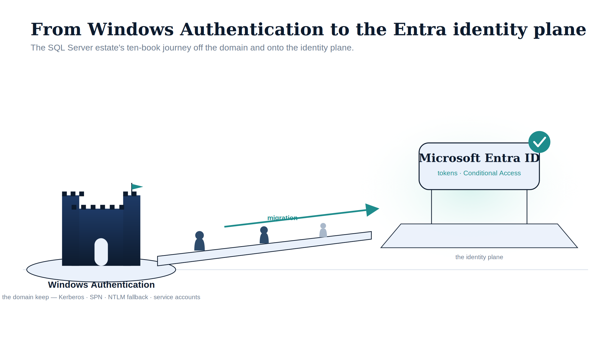
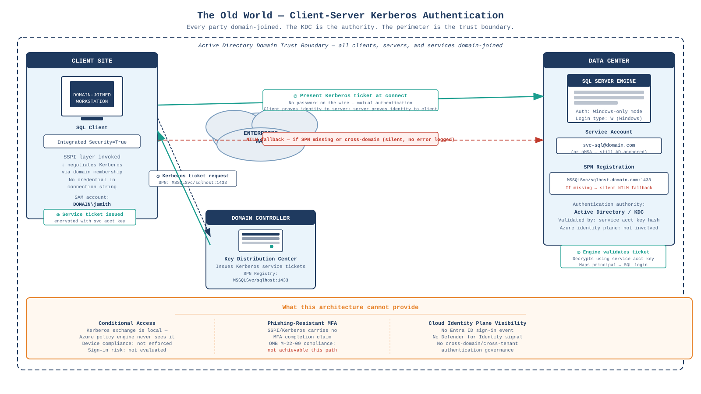
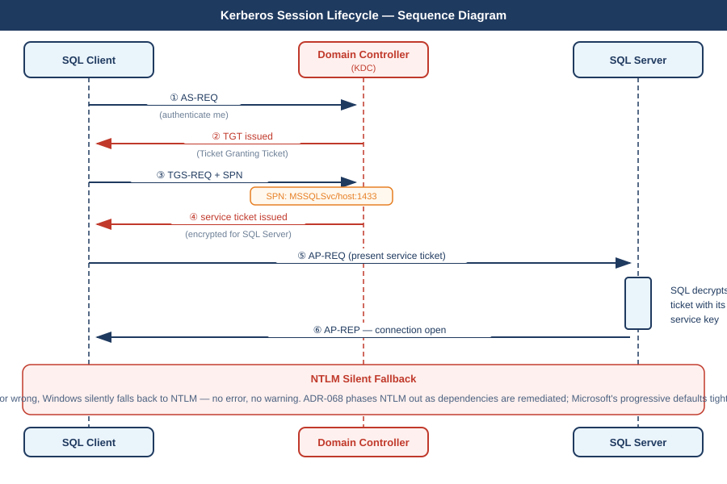
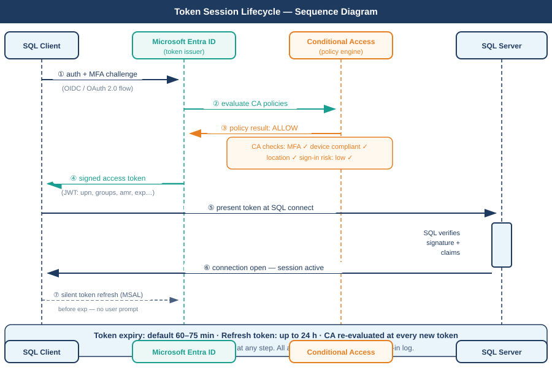
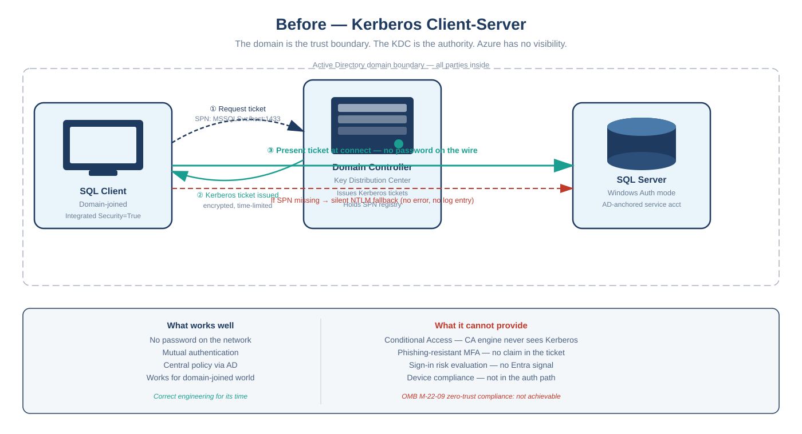
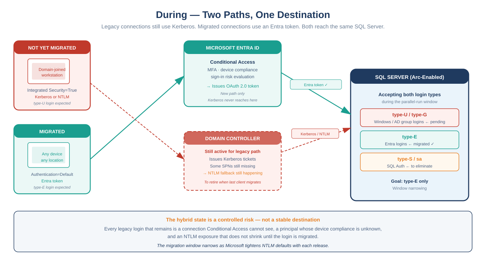
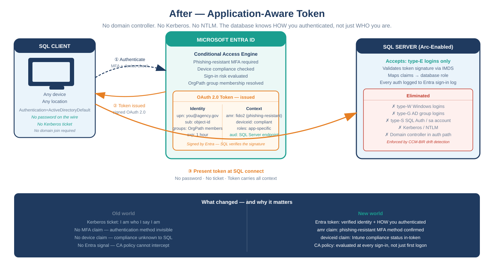

# SQL Server Identity Transformation {.unnumbered}

{#fig-index-image-01 fig-alt="An illustrative figure on a white background. On the left, a dark navy castle keep on a small island, labelled 'Windows Authentication — the domain keep — Kerberos, SPN, NTLM fallback, service accounts'. A rising bridge crosses to the right, with three stylised human silhouettes walking across it beneath a teal arrow labelled 'migration'. On the right, a luminous teal glow surrounds a floating slab labelled 'the identity plane', on which sits a light-blue card reading 'Microsoft Entra ID — tokens, Conditional Access', topped by a teal check badge. Illustrative register (ADR-095): federal navy (#0D1B2E), teal (#1E8C8C), ice-blue (#EAF1FB); stylised silhouettes, no photographs; 16:9 landscape." width="100%"}

::: {.callout-important appearance="default"}
## Status — Draft series
This ten-book series is **DRAFT v0.1**. It is the explanatory companion to
**ADR-091** (SQL Server Engine Authentication Transformation), which is
**PROPOSED**, not yet accepted. Treat the engineering patterns here as the
evidentiary foundation for ADR-091 rather than as accepted normative governance
until that ADR is accepted and this series is reviewed against it.
:::

::: {.callout-tip}
## Download the full section
**[sql-server-narrative-bundle.docx](sql-server-narrative-bundle.docx)** — every page in this section concatenated into one Word document. Regenerated on every site deploy.
:::

::: {.callout-note appearance="default"}
## Companion series — the executable layer
This narrative is the *why*. Its book-for-book companion, the **[SQL Server Identity Transformation — Implementation Companion](../sql-server-implementation/index.qmd)**, is the *how*: the runbooks, scripts, parameters, output schemas, and failure modes — each implementation book the executable counterpart to the narrative book of the same number.
:::

UIAO_135 §3.2 classifies the SQL Server authentication transformation
(Transformation #7) as **Partially Defined**. The destination is not in
doubt — UIAO_135 §1.2 names it precisely: Windows Authentication and SQL
Authentication are eliminated and replaced with Microsoft Entra ID
authentication for SQL Server 2022 and later, enforced through OAuth 2.0
tokens, a Managed Identity for the engine process, and multi-factor
authentication for every human principal. What was *partially defined* is the
normative canon governing how that destination is reached at the engine layer.
This series documents that path, fills it in narrative form, and provides the
analytical foundation that **ADR-091** formalizes.

The series is written in continuous narrative voice. It avoids the
bullet-point shorthand of a runbook, because the transformation it describes
is not a checklist — it is an engineering argument, and engineering arguments
require sentences.

The reading sequence has a deliberate shape. Book 01 names the inheritance:
SQL Server's Windows Authentication was good engineering for its world, not
negligence. Book 02 — new to this revision — confronts the precondition that
most authentication narratives skip: you cannot migrate the authentication of
an estate you have not first **assessed and consolidated**, and after twenty
years across an Active Directory forest, the estate is larger and more tangled
than any team's mental model of it. Books 03 through 06 trace the migration
itself — the authentication audit, the Arc identity bridge, the login
migration, and NTLM elimination at the SQL layer. Books 07 and 08 follow the
transformation outward, into access control and the upstream application chain.
Book 09 describes the transformed steady-state and the 2027 milestone, and Book
10 addresses the certificate-authority dependency that the other nine books
depend on but rarely name.

## The transformation in three WAN diagrams

The series traces a single architectural journey. These three diagrams show it at the network topology level — what the authentication path looks like before, during, and after.

{#fig-index-wan-01 fig-alt="WAN topology diagram on white background showing Client Site on the left with a domain-joined workstation, Enterprise WAN cloud in the center, Domain Controller KDC lower center, and Data Center with SQL Server on the right. Numbered arrows show the Kerberos ticket request flow from client to KDC, service ticket return, and ticket presentation to SQL Server. A red dashed arrow shows the silent NTLM fallback path when the SPN is missing. A bottom panel lists three things this architecture cannot provide: Conditional Access, phishing-resistant MFA, and cloud identity plane visibility. Navy and teal palette, white background." width="100%"}

{#fig-index-wan-02 fig-alt="WAN topology diagram on white background showing two client boxes on the left — Client A Legacy in red and Client B Migrated in teal. Center top shows Microsoft Entra ID with Conditional Access for the new path; center bottom shows Domain Controller KDC with dashed red border for the old path. Right shows Arc-enabled SQL Server accepting both type-W Windows logins and type-E Entra logins simultaneously. Red dashed arrows show the old Kerberos and NTLM paths; solid teal arrows show the new Entra token path. A bottom progress bar shows estate consolidation at 80%, Arc enrolled at 60%, logins migrated at 40%, NTLMv1 eliminated at 20%, connection strings migrated at 30%. Navy, teal, red, amber palette, white background." width="100%"}

{#fig-index-wan-03 fig-alt="WAN topology diagram on white background showing Client on the left connecting upward to Microsoft Entra ID with a Conditional Access Policy Engine box listing identity checks and device checks. Entra issues an OAuth 2.0 access token shown in an amber box with two columns of claims — standard claims (iss, sub, upn, aud, exp) and context claims (amr showing MFA method, groups from OrgPath, deviceid compliant, roles). The token flows right to Arc-enabled SQL Server which accepts only type-E logins and has eliminated type-W, type-G, type-S, Kerberos, NTLM, and domain controller dependency. A navy footer bar contrasts old world identity-only authentication with new world application-aware token authentication. Navy, teal, amber palette, white background." width="100%"}

### Protocol detail

The step-by-step exchange inside each authentication path.

{#fig-index-seq-kerberos fig-alt="UML sequence diagram on white background. Three vertical lifelines: SQL Client (navy), Domain Controller KDC (red dashed), SQL Server (navy). Seven numbered steps trace the full Kerberos exchange. SPN badge on step 3. Bottom panel explains the NTLM silent fallback and ADR-068 progressive NTLM phase-out." width="100%"}

{#fig-index-seq-token fig-alt="UML sequence diagram on white background. Four vertical lifelines: SQL Client (navy), Microsoft Entra ID (teal), Conditional Access Engine (amber), SQL Server (navy). Seven numbered steps. CA checks badge on step 3. SQL validation activation box on step 5. Silent refresh step dashed. Footer: token expiry 60-75 min, no domain controller at any step, all events in Entra sign-in log." width="100%"}

### Simplified overview

The same three moments, simplified for quick orientation.

{#fig-index-wan-simple-01 fig-alt="Simplified WAN diagram, white background, three boxes: SQL Client left, Domain Controller center, SQL Server right. Curved arrows show ticket request, ticket issued, and ticket presented at connect. Red dashed arrow shows NTLM fallback. Two-column bottom panel: what works well vs what it cannot provide. Navy, teal, red palette." width="100%"}

{#fig-index-wan-simple-02 fig-alt="Simplified WAN diagram, white background, two client boxes on the left — Not Yet Migrated in red and Migrated in teal. Center top Entra ID, center bottom Domain Controller with dashed border. Right SQL Server accepting both type-W and type-E logins. Red dashed arrows for old path, solid teal arrows for new path. Bottom bar explains the hybrid state is a controlled risk. Navy, teal, red, amber palette." width="100%"}

{#fig-index-wan-simple-03 fig-alt="Simplified WAN diagram, white background, three boxes: SQL Client left, Microsoft Entra ID center, SQL Server right. Three numbered curved arrows show the flow: authenticate with MFA, token issued, token presented at SQL connect. Entra ID box shows Conditional Access and the OAuth 2.0 token contents. SQL Server box shows type-E only with an eliminated list. Navy footer bar contrasts old world identity-only with new world application-aware token authentication. Navy, teal, amber palette." width="100%"}

## Division of labor

The organizing principle of the series — what Microsoft provides vs. what only
the program can solve — is captured for every topic in a single reference page:

**[Division of Labor — Microsoft vs. You](responsibility-matrix.qmd)**

## Reading sequence {#chapters}

::: {#chapters}
:::

## Companion canon

For the normative specifications and architectural decisions this narrative
explains:

- [ADR-091](/docs/adr/adr-091-sql-server-authentication-transformation.html) —
  SQL Server Engine Authentication Transformation (the engine-layer decision
  this series motivates; **PROPOSED**).
- [ADR-068](/docs/adr/adr-068-kerberos-ntlm-elimination.html) — Kerberos / NTLM
  Elimination (the protocol layer; progressive NTLM elimination strategy).
- [ADR-002](/docs/adr/adr-002-arc-entra-join-no-domain-join.html) — Arc-Enabled
  Servers Require Non-Domain-Joined State (the server / OS layer).
- [ADR-069](/docs/adr/adr-069-ldap-dependent-application-migration.html) —
  LDAP-Dependent Application Migration (the upstream application chain).
- `UIAO_135` — Identity & Directory Transformation Inventory (Transformation #7).
- `Spec3-D1.8` — `Get-SQLServerAuthAudit.ps1` (the engine-layer discovery baseline).

## Relationship to UIAO OrgPath

This series is a sibling to the [UIAO OrgPath](../orgpath-narrative/index.qmd)
reading sequence and is best read alongside it. OrgPath builds the
organizational-identity substrate — the `extensionAttribute` lineage carried on
Entra ID user objects. This series consumes that substrate: Book 07 describes
dynamic Entra security groups whose membership rules reference OrgPath
attributes to drive SQL Server access without manual DBA provisioning. The
OrgPath attribute infrastructure must precede the dynamic-group access work
described here.

The seams where the two series meet — dynamic-group access, DBA delegation,
migration sequencing, the Conditional Access perimeter, and closure-and-drift —
are documented in full, with a recommended cross-series reading order, in
[OrgPath × SQL Server — The Integration Bridge](bridge-orgpath-sql.qmd).

## Audience

Database engineers who execute the login migrations, infrastructure architects
responsible for estate consolidation and Arc sequencing, security engineers who
own the Conditional Access design and the CCM-BIR monitoring, and program
leadership who must understand the scope of the ADR-091 gap and the consolidation
program that precedes it. The series assumes familiarity with SQL Server
administration and Active Directory security concepts; familiarity with Entra ID
is built progressively across the ten books.

## Download

Every chapter renders to Microsoft Word (`.docx`) alongside the web view
(see the **DOCX** button in the page header on each chapter).
