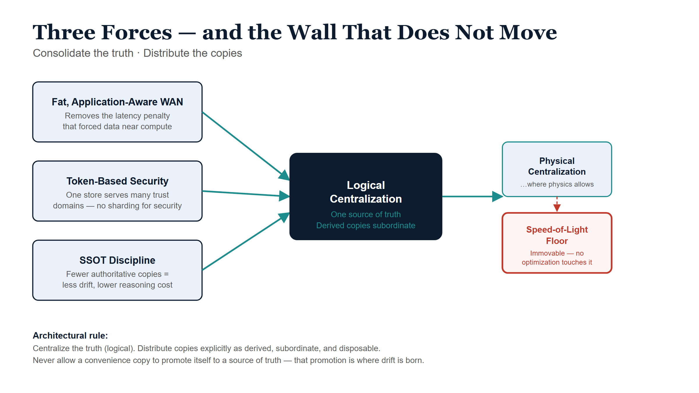

# Executive Summary — The Centralization Question

## The question

For a decade the default answer to "where should the data live?" has been
*spread it out*: every microservice owns its own database, every region gets
its own store, and a single large SQL server is treated as a legacy
embarrassment. That instinct is now worth re-examining. With wide-area
networking that is both fast and application-aware, and with token-based
security that travels identity with every request, **is it more efficient to
consolidate onto large, centralized database servers — to fight data drift and
stay close to a single source of truth?**

This white paper's answer is a qualified *yes*, with one hard boundary set by
physics. The qualification matters as much as the answer.

## The three forces pushing toward consolidation

| Force | What it removes | Consequence for data topology |
|---|---|---|
| **Fat, application-aware WAN** | The latency penalty that forced data to sit physically next to compute | You can centralize the *system of record* without the old performance tax — at least within a region. |
| **Token-based (zero-trust) security** | The need to fragment data behind network perimeters for isolation | One logical store can safely serve many trust domains; you no longer shard *for security*. |
| **SSOT discipline** | The reconciliation cost of many divergent copies | Fewer authoritative copies means less drift, fewer "which number is correct?" incidents, and a model one engineer can hold. |

Each force is real, and together they justify pulling authority back toward the
center. The microservices-era fragmentation created drift that the original
gospel never budgeted for; consolidating the *truth* is a defensible, and
increasingly common, correction.

{#fig-ssot-cpt00-diagram-01 fig-alt="Blueprint diagram showing three forces — Fat Application-Aware WAN, Token-Based Security, and SSOT Discipline — converging via teal arrows onto a central navy Logical Centralization box, which leads right to a Physical Centralization option and a red Speed-of-Light Floor constraint box. White background, navy and teal palette." width="100%"}

## The distinction that prevents the trap

The single most important idea in this paper is the separation of two things
that the word "centralize" carelessly fuses:

::: {.callout-important}
## Logical centralization is good; physical centralization hits walls.
**Centralize the *truth* — one authoritative source of record. Distribute the
*copies* — read replicas, caches, edge stores — and keep them explicitly
subordinate, derived, and disposable.** A convenience copy must never be
allowed to quietly promote itself to a source of truth. That promotion is where
drift is born.
:::

Physical centralization — one big server in one place — still runs into walls
that no amount of clever networking removes:

- **The speed of light.** WAN got fast in *bandwidth*; it did not get fast in
  *latency*. Strong consistency across continents is a latency problem, and the
  propagation floor is fixed by distance.
- **Blast radius.** One central server is one outage, one bad migration, one
  noisy tenant away from taking everything down. Distribution is partly a
  *failure-domain* strategy, not only a performance one.
- **Data residency and sovereignty.** Some data legally cannot sit in one
  central place, regardless of how good the network is. This veto is political,
  not technical, so no technology removes it.

## The wall, and the way around it

Chapters 3 and 4 confront the speed-of-light tax directly and ask what
modern networking — specifically **SD-WAN differentiated transport**, which
can steer latency-critical traffic onto a lean low-latency path while pushing
bulk traffic onto a fat slower one — can actually do for keeping large
databases in sync.

The honest finding: SD-WAN attacks the (usually large) gap between the latency
you *observe* and the physical floor, and that gap is where most real-world
sync pain lives. It cannot move the floor itself. The architecturally correct
response, therefore, is not to make global synchronization fast — it is to
**need less of it**: keep strong consistency inside a region where it is nearly
free, and let everything that crosses a continent be asynchronous,
eventually-consistent, or merge-friendly by design.

## The UIAO reference example

UIAO's own SaaS data plane already embodies this doctrine, and the paper uses
it as the worked example throughout:

- **One shared, single-region PostgreSQL store** is the tenant registry and
  system of record — logical centralization (ADR-096).
- **Passwordless, token-based authentication** (an Entra access token used as
  the database password) makes that shared store safe to operate and removes
  the highest-value secret in the deployment (ADR-116) — the enabler force made
  concrete.
- **A control-plane "stamp"** provisions dedicated, physically-isolated
  resources *only* for customers whose compliance posture requires it — the
  distribute-where-you-must escape hatch, kept as an exception rather than the
  default (ADR-096).
- **No global synchronous write path exists**, on purpose — UIAO's answer to
  the speed-of-light tax is to not span it synchronously in the first place.

## How to read this paper

Chapter 1 makes the case for logical centralization and SSOT. Chapter 2 shows
why token-based security is the keystone that makes consolidation safe on the
data plane. Chapter 3 establishes the physics floor. Chapter 4 details what
SD-WAN can and cannot buy a database tier. Chapter 5 — forward-looking, on the
proposed ADR-066 transport plane — extends token-based security from data
*access* to the network *path* itself, so "identity is the new boundary" holds
on both planes. Chapter 6 unifies the data and network layers into a single
design rule. Chapter 7 walks the UIAO implementation end to end and names the
one risk this whole bet imports.
