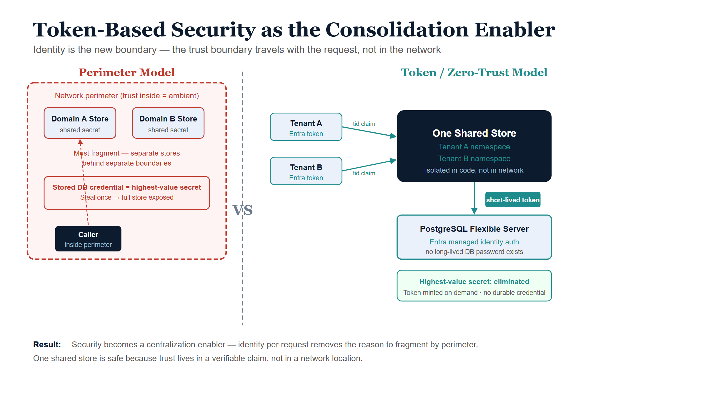

# Token-Based Security as the Enabler

## Why this is the keystone

Chapter 1 made the case for consolidating the source of truth. But there is a
reason the industry fragmented data in the first place that had nothing to do
with scale: **isolation by perimeter.** When the only way to enforce
"who may touch this data" was network segmentation, the safest way to separate
two trust domains was to give them separate databases behind separate network
boundaries. Security, not performance, drove a great deal of the
fragmentation — and no hardware advance addresses it.

Token-based, identity-centric (zero-trust) security is what dissolves that
reason. It is the keystone of the whole consolidation argument: without it, you
are forced back into per-domain physical isolation for safety, and the
single-source-of-truth story collapses. With it, **one logical store can serve
many trust domains safely**, because the trust boundary travels with the
request rather than living in the network.

## The shift: from perimeter to identity

| Dimension | Perimeter model | Token / zero-trust model |
|---|---|---|
| Where trust lives | In the network location of the caller | In a signed, verifiable claim the caller presents |
| Unit of isolation | A network segment (and often a separate datastore) | A verified identity, scoped per request |
| Default posture | Trust inside the perimeter | Trust nothing; verify every request |
| Effect on data layout | Encourages a store per trust domain | Permits one store across many trust domains |
| Highest-value secret | Long-lived credentials guarding the perimeter and the database | None — short-lived tokens, minted on demand |

The consequence for data architecture is direct: **you no longer shard for
security.** Two customers, two business units, two classification levels can
share a logical store when every request carries a cryptographically verifiable
statement of who is asking and what they are entitled to, and the store
enforces scoping on that statement.

{#fig-ssot-cpt02-diagram-01 fig-alt="Blueprint split diagram. Left panel shows a red-dashed perimeter enclosing two separate domain stores with a shared-secret credential risk callout. Right panel shows a central navy shared store served by two ice tenant boxes via teal tid-claim token arrows, with an outbound short-lived token arrow to a PostgreSQL Flexible Server and a green callout stating the highest-value secret is eliminated. White background." width="100%"}

## How UIAO makes this concrete

UIAO's SaaS plane is a working instance of this principle on both sides of the
connection — inbound (who is calling the service) and outbound (how the service
authenticates to its own database).

### Inbound: identity travels with the request

Many different customer Microsoft Entra tenants are governed by one operated
UIAO service. Requests arrive bearing Entra access tokens minted by *different*
tenants. The data plane verifies each token's signature against the issuing
tenant's published keys (JWKS, RS256), reads the tenant identity from the
token's `tid` claim, and binds a tenant context for the life of the request
(ADR-096). One shared, elastically-scaled data plane serves every customer —
and the isolation is enforced because the *identity* of the tenant is proven on
every single call, not assumed from a network location.

### Outbound: the database password disappears

The sharper demonstration is how the service authenticates *to its own
PostgreSQL store*. Under **ADR-116**, UIAO uses passwordless authentication:
Azure Database for PostgreSQL Flexible Server accepts a short-lived Entra access
token *as the connection password*. The service's managed identity is bound as
the database's Entra administrator, so the application connects with **no
long-lived database password at all.**

::: {.callout-important}
## The highest-value secret is removed, not protected
A stored database password is the single most valuable secret in a typical
deployment — steal it once and the central store is exposed. Token-based auth
does not guard that secret better; it **eliminates it.** The connection is
authorized by a token that is minted on demand, scoped to the database
audience, cached only briefly, and refreshed before expiry. There is nothing
durable to steal. (UIAO: `uiao.saas.pg_auth`, ADR-116.)
:::

Mechanically, a token provider acquires an access token scoped to the
OSSRDBMS audience for the correct sovereign cloud, caches it, and refreshes it
shortly before expiry so token acquisition stays off the hot path of every
connection while a near-expired token is never presented. The same connection
seam is provider-agnostic: an Entra token provider on Azure and an RDS-IAM
token provider on AWS both satisfy it, so passwordless auth works identically
across clouds.

## Why this makes centralization *safe*, not merely possible

The combination of inbound token verification and outbound passwordless auth
changes the risk calculus that originally justified fragmentation:

- **No perimeter to breach into a shared trust zone.** Every request re-proves
  identity; there is no "inside the firewall" where a single foothold yields
  ambient access to all tenants' data.
- **No long-lived database credential to exfiltrate.** The classic
  "one leaked connection string compromises everything" failure mode is
  designed out.
- **Per-request scoping replaces per-store isolation.** A tenant's reach is
  bounded by its verified identity on each call, so one store can hold many
  tenants without that being a security downgrade relative to many stores.

This is the precise sense in which token security *earns the right to
centralize*. The shared source of truth is not safe *despite* being shared; it
is safe *because* the security model moved from the network to the identity.

That same move — a credential minted per event rather than a durable secret or a
standing session — applies one layer down, to the network *path* the request
rides on. Chapter 5 (forward-looking, on the proposed ADR-066 transport plane)
carries token-based security from data *access* onto the transport plane, so
"identity is the new boundary" holds end to end rather than only at the store.

## The friction it removes — and the drift that follows

Chapter 1 argued that drift is born when teams create unofficial local copies
because the central store is too hard to reach. Token-based security attacks the
"too restricted to reach" half of that friction directly. When access is a
matter of presenting the right scoped identity — rather than being granted a
network path, a firewall exception, and a shared secret — the central store
becomes *easier* to reach than standing up a private copy. Removing access
friction removes the incentive to fork, which removes the drift at its source.
Security, counter-intuitively, becomes a centralization *enabler* rather than a
fragmentation *driver*.

## The residual constraint

Token security removes the *security* reason to fragment. It does not remove the
*legal* one. Data-residency and sovereignty rules can still require that certain
data physically reside in a certain place or boundary, and no identity model
overrides a regulator. UIAO handles this not by fragmenting the default plane
but by provisioning a dedicated, physically-isolated **stamp** for the
customers who require it (Chapter 7, ADR-096), and by carrying sovereign-cloud
token audiences explicitly in the auth layer (the OSSRDBMS scope differs for US
Government clouds; ADR-033, ADR-116). The default stays centralized and safe;
the exception is provisioned deliberately, with its own boundary.

## Summary

- Much historical data fragmentation was driven by *security through
  perimeter*, which no hardware advance addresses.
- Token-based, zero-trust security moves the trust boundary from the network
  into a verifiable, per-request identity, so one store can serve many trust
  domains.
- UIAO realizes this on both sides: inbound `tid`-claim verification per
  request (ADR-096) and outbound passwordless Postgres auth that removes the
  highest-value secret entirely (ADR-116).
- This makes centralization *safe*, not merely possible — and it removes the
  access friction that drives teams to create drift-prone shadow copies.
- The one reason to fragment that survives is legal residency, handled as a
  deliberate stamped exception rather than as the default.
