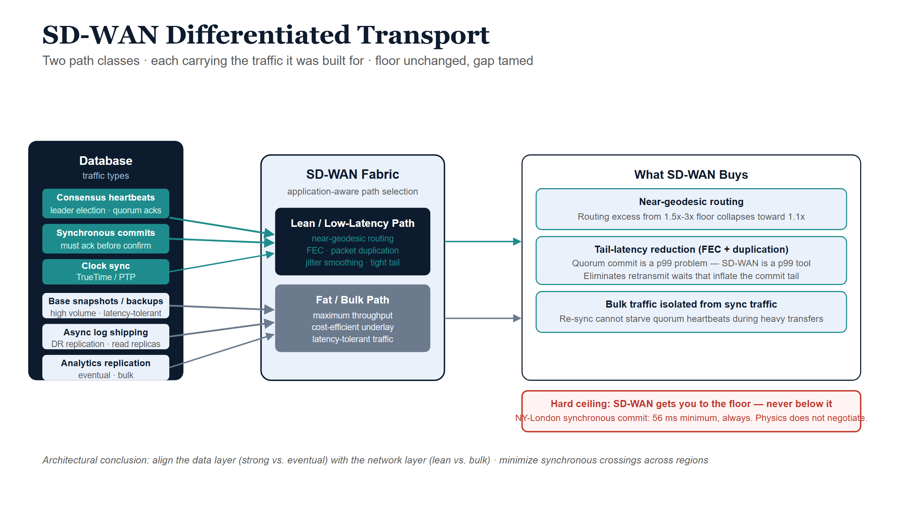

# SD-WAN and Differentiated Transport

## The question, stated precisely

Software-defined WAN can select among multiple underlay paths per traffic
class: it can steer latency-sensitive traffic onto a lean, low-latency,
low-jitter path while pushing bulk traffic onto a fatter but slower or cheaper
one. **Can this help large databases stay in sync, and can it assist with the
speed-of-light problem through optimization?**

The answer, grounded in Chapter 3: **yes, meaningfully — but only inside the
gap between observed latency and the physical floor.** SD-WAN never moves the
floor. Because the gap is usually large and disproportionately damages
distributed databases (it inflates the commit-latency tail), operating there is
high-value. Overstating it as "beating the speed of light" is the error to
avoid.

## SD-WAN as the network mirror of consistency classes

The instinct to split traffic into a low-latency class and a bulk class is
exactly right, because it maps one-to-one onto what a database actually emits:

| Traffic class | Database traffic it carries | Wants | Best path |
|---|---|---|---|
| **Lean / low-latency** | Consensus heartbeats, leader election, synchronous-commit quorum acknowledgements, clock synchronization | Minimum RTT, minimum jitter | Shortest, least-congested path; small packets |
| **Fat / bulk** | Base snapshots, backups, re-sync after a partition, analytics replication, asynchronous log shipping | Maximum throughput, cost efficiency | High-bandwidth path; latency-tolerant |

This is **differentiated transport per traffic class**, and it is the network
layer's reflection of a decision the data layer is already making — *what must
be strongly consistent versus what can be eventually consistent* (Chapter 6).
When the two agree, you get the best synchronization physics permits.

{#fig-ssot-cpt04-diagram-01 fig-alt="Blueprint flow diagram. Left: a navy database box lists teal traffic items for consensus heartbeats, synchronous commits, and clock sync, plus grey items for snapshots, async log shipping, and analytics. Center: an SD-WAN Fabric box with a navy Lean Low-Latency Path and a grey Fat Bulk Path. Teal arrows route latency-critical traffic to the lean path; grey arrows route bulk traffic to the fat path. Right: three ice result boxes for near-geodesic routing, tail-latency reduction via FEC, and bulk isolation. A red callout states the hard ceiling. White background." width="100%"}

## What SD-WAN genuinely buys a database tier

### 1. Steering and near-geodesic routing

Internet paths routinely run 1.5×–3× the great-circle distance. SD-WAN, by
choosing a better underlay (or a premium backbone) and steering the
latency-critical class onto it, reclaims much of that routing excess — moving
observed propagation from "floor × 3" toward "floor × 1.1." That is a pure win
against the *addressable* part of latency, with no consistency trade-off.

### 2. Crushing the tail, not just the average

This is the underrated, highest-leverage effect. Recall from Chapter 3 that a
quorum commit waits for the *slowest* member it must hear from, so commit
latency is a **tail (p99)** statistic — and the tail is inflated by loss,
congestion, and jitter, not by propagation. SD-WAN targets the tail directly:

- **Forward error correction (FEC):** send redundant repair data so a lost
  packet is reconstructed at the receiver without waiting for a retransmit.
  This trades bandwidth for latency — and for a quorum gated by the unluckiest
  packet, eliminating retransmit waits can cut p99 commit latency far more than
  shaving the mean ever could.
- **Packet duplication across two paths:** send the latency-critical packet on
  two diverse paths and take whichever arrives first; the slow or lossy path no
  longer determines the tail.
- **Jitter smoothing and sub-second path failover:** move traffic off a
  browning-out path before TCP's own loss detection reacts.

::: {.callout-tip}
## The leverage point
Distributed-database performance is a tail problem; SD-WAN's loss/jitter
mitigations are tail tools. The match is exact. A path can go from "floor × 3
with an ugly tail" to "floor × 1.1 with a tight tail" — a large, real
improvement in how well replicas stay in sync — without anyone violating
physics.
:::

### 3. Protecting sync traffic from bulk traffic

A re-sync or a backup can saturate a link and inflict queueing delay on the
small, latency-critical consensus packets sharing it — self-inflicted tail
latency. Class separation ensures the bulk transfer cannot starve or delay the
heartbeats and commit acks. The database stays in sync *during* exactly the
heavy-transfer events that would otherwise destabilize it.

## The clock angle: optimization that assists physics directly

There is a second, independent way networking helps — and it is the closest
thing to genuinely *assisting* the speed-of-light problem rather than merely
approaching the floor. It runs through **time**, not distance.

A low-latency, low-jitter path is also the best path to **distribute a clock.**
Precision time protocols degrade with path asymmetry and jitter, not with raw
distance, so the same lean class that carries consensus traffic also carries
high-quality clock synchronization. And tight clock sync enables an architecture
that *replaces* network round trips:

::: {.callout-note}
## Trading network coordination for bounded clock uncertainty
Google **Spanner**'s **TrueTime** orders transactions using globally
synchronized clocks (GPS and atomic references) with a small, *bounded*
uncertainty. Instead of an extra cross-continent round trip to agree on
transaction order, Spanner waits out a short "commit-wait" interval sized to its
clock uncertainty. The latency bound becomes **clock error, not network RTT** —
and clock error is kept tiny. (Source: Corbett et al., "Spanner: Google's
Globally-Distributed Database," OSDI 2012.)
:::

This is the deepest version of the user's question. You cannot make light
faster, but you can make the database *need fewer trips through it* by spending
clock certainty instead of network round trips. The lean SD-WAN class is what
makes the clock certain enough to do so — so SD-WAN assists the speed-of-light
problem not by reducing propagation, but by enabling a design that propagates
less often.

## The hard ceiling, restated

For all of that, one boundary is immovable and must be stated plainly:

::: {.callout-important}
## SD-WAN gets you to the floor with a tight tail. It never gets you below it.
A synchronous, strongly-consistent commit across continents pays **at least one
round trip, every time** — ~56 ms for New York ↔ London, no matter how clever
the network. SD-WAN removes the *excess* over that floor and tames the tail; the
floor itself is the speed-of-light tax on strong consistency, and it is
non-negotiable.
:::

Therefore SD-WAN does not change the correct architectural conclusion from
Chapter 3 — it *enables* it. The right move remains **"need less global
sync,"** and SD-WAN's contribution is to make the synchronization you *do*
keep cheaper, more reliable, and tighter in the tail, while making
asynchronous bulk replication efficient on its own dedicated path.

SD-WAN supplies the path; it does not, by itself, *govern* the path. Chapter 5
(forward-looking) takes the next step — making the chosen path identity-anchored
and token-bound, so the network carrying the data is held to the same per-call
standard as access to the data itself.

## Summary

- SD-WAN's low-latency / bulk path split is the network-layer mirror of the
  data layer's strong-vs-eventual consistency split; align them.
- It buys three things: near-geodesic routing, tail-latency reduction (FEC,
  packet duplication, jitter smoothing — which match the database's tail-gated
  commit behavior), and protection of sync traffic from bulk transfers.
- The lean path also distributes high-quality time, enabling clock-based
  concurrency (Spanner/TrueTime) that *replaces* network round trips with
  bounded clock-wait — the one technique that genuinely sidesteps propagation.
- It cannot move the floor: a cross-continent synchronous commit still pays at
  least one RTT. SD-WAN takes you *to* the floor with a tight tail, never below.
- Net: it enables the "need less global sync" architecture rather than
  overturning it.
