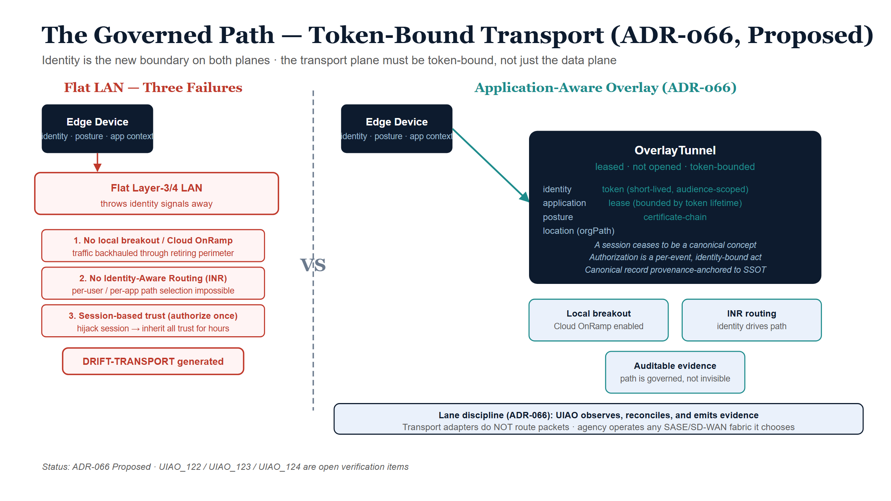

# The Governed Path — Token-Bound Transport and the Application-Aware Overlay

::: {.callout-warning}
## Forward-looking chapter — proposed direction, not yet ratified
This chapter rests on **ADR-066 (Application-Aware Networking and Token-Bound
Transport Plane)**, whose status is **Proposed**. Unlike the Accepted decisions
that anchor the rest of this paper (ADR-096, ADR-116), the transport-plane model
here is canon *direction* with implementing specifications — **UIAO_122**
(Token-Based Transport Authorization), **UIAO_123** (Application-Aware Overlay
Fabric Model), **UIAO_124** (Transport Plane Telemetry Contract) — still open.
Read it as where the architecture is going, not where it has arrived.
:::

## The other half of "identity is the new boundary"

Chapter 2 established the keystone of consolidation: token-based security lets
one logical store serve many trust domains because the trust boundary travels
*with the request*. That argument was about the **data plane** — who may touch
the data. This chapter applies the identical principle to the **transport
plane** — the network path the request rides on — and shows that the two are
the same idea wearing different clothes.

UIAO's own doctrine names the gap precisely. Identity has become the root of
trust and the addressing model, but, in ADR-066's words, *"identity is the new
boundary, but only halfway"*: the transport that carries identity-derived claims
is still session-based — *"a TLS connection establishes once, then rides for
minutes-to-hours carrying intent the issuer can no longer attest to"* (ADR-066
§Context #2). The data plane re-proves identity on every call; the transport
plane proves it once and coasts. That asymmetry is the subject of this chapter.

::: {.callout-important}
## The unified thesis
"Identity is the new boundary" must hold on **both** planes. Chapter 2 anchored
the *data plane* with token-bound access — a fresh, scoped credential per call.
This chapter anchors the *transport plane* with token-bound transport — a
fresh, scoped credential per *path*. A centralized source of truth reached over
an ungoverned, session-trusted network is only half-secured: the front door is
identity-checked while the hallway is not.
:::

## The efficient edge device is necessary but not sufficient

Consider a perfectly tuned edge device: identity-anchored, telemetry-emitting,
policy-compliant — everything the endpoint control plane asks for
(`control-planes.yml`, Endpoint plane). Land it on a flat, non–application-aware
datacenter LAN and its efficiency is *bounded by the fabric it lands on*. The
device is optimized in isolation while its traffic is undermined in three
concrete ways.

| # | What the flat LAN lacks | Canon | Consequence for the edge device |
|---|---|---|---|
| 1 | **Local breakout / Cloud OnRamp** — app-aware path selection, `local_breakout`, `optimal_path_selection` | `control-planes.yml` (Network plane, `cloud_onramp`) | Traffic is backhauled/hairpinned through a central perimeter — the TIC3 / F5 choke-point being retired. The device's efficiency is spent on the detour. |
| 2 | **INR — Identity-aware Routing** — the convergence point where identity, telemetry, and routing unify; `requires: [telemetry_plane, ipam_plane]` | `control-planes.yml` (INR) | A flat LAN treats every flow identically. It cannot do per-user / per-app path selection or zero-trust segmentation, so the device's identity signals have nowhere to land. |
| 3 | **Per-call authorization** — trust scoped to a single intent | ADR-066 §Context #2 | Trust collapses into a long-lived session: authorize once, ride for hours. Hijacking the session inherits its trust — exactly the antipattern ADR-066 exists to retire. |

The pattern is the same each time: the edge device emits high-quality identity,
posture, and application context, and a flat Layer-3/4 LAN throws it all away.
The substrate is left able to govern *what* runs and *who* runs it, but not
*how it gets there* — and that blind spot surfaces as `DRIFT-AUTHZ` findings the
substrate cannot explain, because the transport context is invisible (ADR-066
§Context).

{#fig-ssot-cpt05-diagram-01 fig-alt="Blueprint split diagram. Left panel: a navy edge device feeds a red-dashed Flat LAN box; three red failure boxes list no local breakout, no Identity-Aware Routing, and session-based trust; a red DRIFT-TRANSPORT callout appears below. Right panel: a navy edge device connects via teal arrow to a navy OverlayTunnel box listing identity, application, posture, location, token, lease, and certificate-chain attributes; teal benefit boxes show local breakout, INR routing, and auditable evidence. White background." width="100%"}

## What the device actually needs: an application-aware overlay

The requirement is not "a faster LAN." It is an **application-aware overlay
fabric** in which the path is a typed, identity-anchored, governed object.
ADR-066 promotes UIAO_001's tunnel abstraction from concept to schema as the
`OverlayTunnel`:

::: {.callout-note}
## The `OverlayTunnel` (ADR-066 §Decision #3)
An `OverlayTunnel` carries
`{identity, application, posture, location, token, lease, certificate-chain}`.
**Tunnels are *leased*, not opened** — the lease is bounded by token lifetime,
and the canonical record is provenance-anchored to SSOT. The authorizing token
is short-lived and audience-scoped, bound to **caller identity + target
application + device posture + orgPath-derived location** (ADR-066 §Decision
#2). A "session" — any long-lived authorization context that survives a single
authorized intent — ceases to be a canonical concept.
:::

This is precisely the data-plane move of Chapter 2, transposed onto the network.
There, the database password was replaced by a freshly-minted, audience-scoped
token per connection. Here, the open session is replaced by a freshly-leased,
audience-scoped tunnel per path. In both cases the durable, hijackable artifact
— the stored password, the long-lived session — is *removed*, and authorization
becomes a per-event, identity-bound act.

The "SD-WAN / SDN" part is only the **mechanism** — vManage/vSmart/vBond and WAN
edges (`overlays/cisco/sd-wan.yml`), SASE/ZTNA from the TIC3 retirement roadmap.
The **requirement** is application-awareness plus token-bound transport. On that
fabric the edge device's efficiency is finally realized, and the path itself
becomes governed evidence rather than an invisible Layer-3/4 detail.

## A flat LAN is a drift generator, not neutral ground

The sharpest consequence for a governance substrate: a non-optimized LAN that
stays flat does not merely run slower — it manufactures drift. ADR-066 proposes
a sixth drift class, **`DRIFT-TRANSPORT`**, joining the substrate's existing
five (`DRIFT-SCHEMA`, `DRIFT-SEMANTIC`, `DRIFT-PROVENANCE`, `DRIFT-AUTHZ`,
`DRIFT-IDENTITY`). Under it, an `OverlayTunnel` or flow observed *without* an
issuing token is a finding (P2), as is path-policy variance between the
canonical orgPath/location binding and the observed flow (P4). The flat LAN is
therefore not a neutral substrate the edge device merely fails to exploit — from
the substrate's point of view it is an active source of transport drift.

This closes the loop with Chapter 1's deepest claim: drift is born where the
governed path is the path of *most* resistance and an ungoverned shortcut
exists. A flat, session-trusted LAN *is* that ungoverned shortcut, one layer
down from the shadow-copy problem — the network equivalent of an unofficial
local database nobody blessed.

## Lane discipline: UIAO governs the fabric, it does not become it

One boundary must be stated as plainly here as the speed-of-light floor was in
Chapter 3. UIAO's stake in "land the device on an application-aware overlay" is
**governance**, not packet-forwarding. Per ADR-066's lane discipline
(§"what UIAO does NOT become"), transport adapters **observe, reconcile, and
emit evidence — they do not route packets or terminate tunnels.** The decision
is explicitly doctrinal, not implementation-prescriptive: it picks no token
format (SPIFFE vs PASETO), no SD-WAN vendor, and does not put UIAO in the data
plane. The agency operates whatever SASE/SD-WAN fabric it likes; UIAO requires
only that the fabric be application-aware and token-bound, so the edge device's
identity / application / posture / location can drive routing and per-call
authorization — and so the path becomes auditable evidence.

The relationship is exactly that of an identity to Conditional Access. Without
the governed overlay, the efficient edge device is optimized in isolation, its
traffic backhauled through a perimeter being retired, and its trust riding a
long-lived session the substrate cannot see.

## Summary

- "Identity is the new boundary" must hold on the transport plane as well as the
  data plane; today it holds "only halfway" (ADR-066 §Context #2).
- An efficient edge device is necessary but not sufficient — its efficiency is
  bounded by the fabric it lands on. A flat LAN undermines it three ways: no
  local breakout / Cloud OnRamp, no identity-aware routing (INR), and trust that
  collapses into a long-lived session.
- The requirement is an application-aware overlay where the path is a typed
  `OverlayTunnel` — *leased, not opened*, bounded by a short-lived,
  audience-scoped token (ADR-066 §Decision #2–3). SD-WAN/SASE is the mechanism;
  application-awareness + token-bound transport is the requirement.
- A flat LAN is a `DRIFT-TRANSPORT` generator (P2/P4), not neutral ground.
- UIAO governs the fabric and emits evidence; it does not route packets. The
  whole model is **Proposed** (ADR-066), with UIAO_122/123/124 as the open
  verification items.
