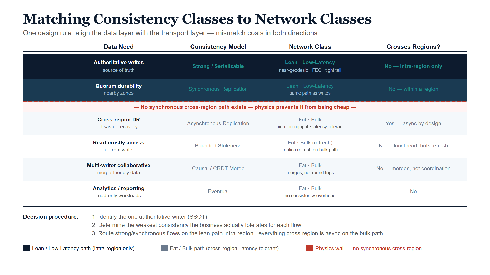

# Matching Consistency Classes to Network Classes

## The single design rule

The previous chapters converge on one rule that ties the data layer and the
network layer together:

::: {.callout-important}
## Align consistency class with transport class.
The data layer's question — *what must be strongly consistent versus what can
be eventually consistent* — is the same question, viewed from the other side,
as the network layer's — *what rides the lean low-latency path versus the fat
bulk path.* When those two decisions agree, you get the best synchronization
physics permits. When they disagree, you pay for it.
:::

A mismatch is expensive in both directions. Putting strong-consistency traffic
on the bulk path inflicts the bulk path's latency and tail on your commits.
Putting trivial asynchronous replication on the premium low-latency path wastes
the scarce resource that your consensus quorum actually needs. The architecture
works when each class of data rides the class of transport built for it.

## The mapping

| Data need | Consistency model | Network class | Crosses regions synchronously? |
|---|---|---|---|
| Authoritative writes to the source of truth | Strong / serializable | Lean, low-latency | No — kept intra-region |
| Quorum durability across nearby zones | Synchronous replication | Lean, low-latency | Within a region only |
| Cross-region durability / disaster recovery | Asynchronous replication | Fat, bulk | No — async by design |
| Read-mostly access far from the writer | Bounded staleness / read replica | Fat, bulk (refresh) | No |
| Multi-writer collaborative data | Causal / CRDT merge | Fat, bulk | No — merges, not round trips |
| Analytics / reporting | Eventual | Fat, bulk | No |

The pattern is stark: **only the top two rows ride the lean path, and neither
of them crosses a region synchronously.** Everything that spans distance is
asynchronous and rides the bulk path. That is the physics of Chapter 3 made
into a layout.

{#fig-ssot-cpt06-diagram-01 fig-alt="Blueprint alignment table with six rows. Top two rows on navy background show strong serializable and synchronous replication on the lean low-latency path intra-region only. A red dashed divider labeled no synchronous cross-region path separates them from four grey rows showing async replication, bounded staleness, CRDT merge, and eventual consistency, all on the fat bulk path. White background." width="100%"}

## Techniques for needing less global synchronization

Chapter 3 concluded that the architectural goal across regions is to *need
fewer synchronous crossings*. These are the concrete techniques, each of which
moves a workload off the lean cross-region path it cannot afford:

- **Strong within a region, asynchronous across regions.** At metro and
  intra-continental distances the propagation floor is sub-millisecond to a few
  milliseconds, so synchronous consistency is effectively free. Confine the
  single-writer source of truth and its quorum to one region; replicate to other
  regions asynchronously. This is the default for the overwhelming majority of
  systems, and it is UIAO's choice (Chapter 7).
- **Bounded staleness instead of strict global serializability.** Where the
  business tolerates reads that are a known, small interval behind, you replace
  a cross-region read round trip with a local read from a slightly-stale
  replica. The staleness bound is a contract, not an accident.
- **Causal consistency.** Preserve cause-and-effect ordering without paying for
  total global ordering — far cheaper across distance, and sufficient for a
  large class of application semantics.
- **Conflict-free replicated data types (CRDTs).** For genuinely multi-writer
  data, CRDTs let independent replicas accept writes locally and *merge*
  deterministically, so cross-region traffic becomes a mergeable bulk-path
  update rather than a coordination round trip. (Source: Shapiro et al.,
  "Conflict-free Replicated Data Types," 2011.) Distance stops being a
  per-operation latency tax.
- **Witness / learner replicas placed by path.** Put voting quorum members on
  the lean, low-latency links so quorum is decided by your fastest paths, while
  non-voting learner replicas on the bulk path provide cross-region durability
  and read scale without dragging the quorum across a continent.
- **Clock-based concurrency (Spanner/TrueTime).** Where strong cross-region
  semantics are genuinely required, spend bounded clock uncertainty instead of
  network round trips (Chapter 4), and carry the clock on the lean class.

## A decision procedure

For any given dataset, the layout falls out of three questions answered in
order:

1. **Does this data have one source of truth?** It should (Chapter 1). Identify
   the single authoritative writer. Everything else is a derived copy.
2. **What is the weakest consistency the business actually tolerates for each
   reader and writer?** Not the strongest you can imagine needing — the weakest
   that is still correct. Strong only where required; bounded-stale, causal, or
   eventual everywhere it suffices.
3. **For each flow, which transport class matches?** Strong/synchronous flows
   take the lean path and stay intra-region. Everything that crosses a region
   takes the bulk path and is asynchronous or merge-based.

The output is a data-and-network layout in which the lean path carries a small
volume of latency-critical, intra-region consensus and clock traffic, and the
bulk path carries everything that spans distance — which is, by design,
latency-tolerant.

## The risk this synthesis imports

Aligning the layers this way concentrates correctness into a small number of
places, and honesty requires naming the cost. When you centralize the source of
truth and enforce tenant or domain isolation *in code* (per-request identity
scoping, Chapter 2) rather than by physical separation, the **blast radius moves
into that code path.** A bug in tenant resolution or namespace scoping is no
longer a contained, single-tenant fault — it is a potential cross-tenant data
exposure. This is the unavoidable trade of the whole consolidation bet: you
exchange the failure-domain isolation of many physical stores for the
simplicity and drift-resistance of one logical store, and in return you owe that
shared correctness path disproportionate engineering rigor — small, heavily
tested, and fail-closed. Chapter 7 shows where exactly that path lives in UIAO.

A parallel obligation applies to the network classes themselves: the lean and
bulk paths are not merely *selected* but must be *governed* — token-bound and
auditable — or the transport layer becomes its own drift surface. Chapter 5
(forward-looking) develops that requirement.

## Summary

- One rule unifies the paper: align the data layer's consistency class with the
  network layer's transport class.
- Only authoritative writes and intra-region quorum durability ride the lean
  path; everything that crosses a region is asynchronous on the bulk path.
- The toolkit for "needing less global sync" is concrete: strong-local/
  async-remote, bounded staleness, causal consistency, CRDTs, path-placed
  witnesses, and clock-based concurrency.
- A three-question decision procedure (one source of truth → weakest tolerable
  consistency → matching transport) produces the layout.
- The bet concentrates correctness into the shared isolation path; that path
  must be small, tested, and fail-closed — examined next in UIAO.
