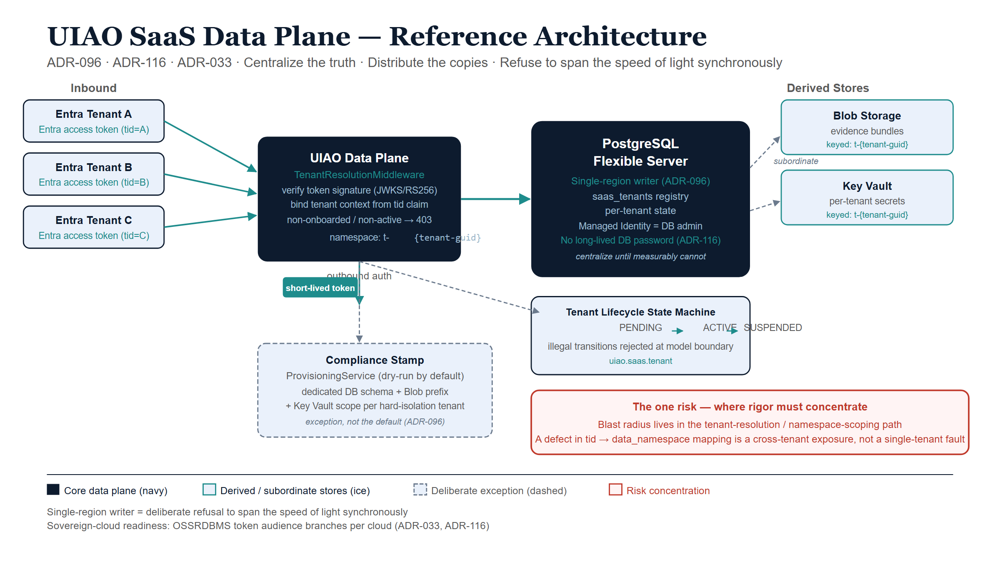

# Reference Architecture — UIAO SaaS Data Plane

## Why UIAO is the worked example

The preceding chapters argued a doctrine: centralize the truth, distribute the
copies, let token security make centralization safe, and refuse to span the
speed of light synchronously. UIAO's multi-tenant SaaS data plane was designed
to that doctrine before this paper named it. Reading the decision record back
through the framework shows the abstractions landing as concrete components —
and, importantly, shows where the one residual risk lives.

The authoritative sources for everything in this chapter are **ADR-096** (Azure
SaaS architecture), **ADR-116** (passwordless Entra Postgres auth), and
**ADR-033** (the GCC-Moderate boundary) under `src/uiao/canon/adr/`.

## The decision, in the paper's terms

UIAO offers governance-as-a-service: many customer Microsoft Entra tenants are
governed by one operated service. ADR-096 had to answer the central question of
this paper — one shared store or many — and chose, deliberately:

::: {.callout-note}
## ADR-096, Decision 2–3 (paraphrased)
*One shared, elastically-scaled data plane with strong per-tenant
data-namespace isolation, plus a control plane that can stamp dedicated
resources where a customer's compliance posture requires it.* The durable
tenant registry and per-tenant state live in **a single PostgreSQL Flexible
Server**; the `data_namespace` derived from each tenant's GUID is the isolation
handle.
:::

That is logical centralization (Chapter 1) with a deliberate physical-isolation
escape hatch (Chapters 1 and 2), expressed as an accepted decision.

## Mapping the architecture to the doctrine

| Paper concept | UIAO realization | Source |
|---|---|---|
| One logical source of truth | Single PostgreSQL Flexible Server holds the `saas_tenants` registry and per-tenant state | ADR-096, Decision 3 |
| Token security, inbound | Per-request `tid`-claim verification against the issuing tenant's JWKS (RS256); non-onboarded / non-active tenants rejected with 403 | ADR-096, Security |
| Token security, outbound | Passwordless auth — a short-lived Entra token used *as* the Postgres password; no long-lived DB secret exists | ADR-116; `uiao.saas.pg_auth` |
| Distribute the copies | Evidence bundles in Blob Storage; per-tenant secrets in Key Vault — derived, subordinate stores keyed by the same namespace | ADR-096, Decision 3 |
| Compliance-stamped exception | Control-plane `ProvisioningService` stamps dedicated DB schema / Blob prefix / Key Vault scope for hard-isolation customers | ADR-096, Decision 2 |
| Refuse to span light synchronously | Single-region writer; no global synchronous multi-master commit path exists | ADR-096 (single Flexible Server) |
| Sovereign-cloud readiness | OSSRDBMS token audience and issuer/Graph/ARM resolution already branch per cloud (US Gov vs. commercial) | ADR-116, ADR-033 |

{#fig-ssot-cpt07-diagram-01 fig-alt="Blueprint architecture diagram. Left: three ice Entra tenant boxes send teal token arrows to a central navy UIAO Data Plane service block that verifies tid claims and scopes namespaces. A teal outbound short-lived token arrow flows to a large navy PostgreSQL Flexible Server box labeled single-region writer with no long-lived DB password. Grey dashed arrows from the store point right to two ice derived stores: Blob Storage and Key Vault, both keyed by tenant namespace. Below the service a dashed Compliance Stamp box shows the ProvisioningService exception path. A red callout names the blast-radius risk in the tenant-resolution path. White background." width="100%"}

## The source of truth: one registry, one writer

The tenant registry is the system of record for *who is onboarded and in what
state.* A tenant is identified by its Entra directory GUID and carries an
explicit lifecycle state machine —
`PENDING → ACTIVE → SUSPENDED → ACTIVE / → DEPROVISIONED` — with illegal
transitions rejected at the model boundary (`uiao.saas.tenant`). There is
exactly one authoritative copy of this truth. Every other representation —
evidence in Blob, secrets in Key Vault — is keyed by the `data_namespace`
derived deterministically from the tenant GUID (`t-<guid>`), so the derived
stores are subordinate pointers to the registry's truth, never independent
sources of it. This is Chapter 1's SSOT discipline as running code.

Because the writer is single-region, the strong-consistency path never crosses
a continent. Per Chapter 3, that is not a limitation to be engineered away — it
is the deliberate exploitation of the physics: at single-region distances,
strong consistency is nearly free, so UIAO takes it.

## Token security: the secret that does not exist

Chapter 2's keystone is visible on both sides of every connection:

- **Inbound**, the trust boundary travels in the request. The data plane does
  not assume a caller is trustworthy because of where it connects from; it
  verifies the Entra token's signature against the issuing tenant's published
  keys and binds the tenant context from the `tid` claim, per request. One
  shared plane safely serves all tenants because identity is proven every time.
- **Outbound**, under ADR-116, the application authenticates to PostgreSQL with
  a freshly-minted Entra access token used as the connection password — its
  managed identity is the database's Entra administrator. The token provider
  caches and refreshes the token off the connection hot path and never presents
  a near-expired one. There is **no long-lived database password anywhere in
  the deployment** — the single highest-value secret is removed, not guarded.
  The same connection seam serves an AWS RDS-IAM token provider, so passwordless
  auth is cloud-portable.

This is precisely why the shared store is safe to centralize: the security
model lives in identity, not in a perimeter or a stored credential.

## The escape hatch: distribute only where compliance demands it

UIAO does not pretend physical centralization is universally acceptable. ADR-096
keeps the option to fragment as a *deliberate, provisioned exception* rather
than the default:

- The control plane's `ProvisioningService` can **stamp** dedicated resources
  — a dedicated DB schema, Blob prefix, and Key Vault scope — for a customer
  whose compliance posture cannot accept shared-plane, in-code isolation.
- Provisioning is **dry-run by default** (a no-op stamp executor only *plans*),
  so the control plane is safe to exercise in CI and locally; a concrete
  executor is injected only in production.
- The `GOV` tenant plan and the sovereign-cloud token audiences exist for
  customers under stricter boundaries, with sovereign SaaS itself listed as a
  future decision and explicit review trigger.

This is Chapter 1's "small databases survive as compliance-stamped exceptions"
realized exactly: the default is one shared source of truth; the dedicated
small store is the exception, requested by compliance, not the architecture's
resting state.

## Centralize until you measurably cannot

ADR-096 even encodes the discipline of Chapter 1 — scale up before you scale out
— into its own expiry conditions. Among the decision's stated review triggers is
*"the tenant registry outgrows a single PostgreSQL Flexible Server."* The
architecture is centralized-until-evidence: it stays on one node until a
measured limit forces a change, rather than pre-emptively sharding against a
hypothetical. That is the correct posture this paper has argued for throughout.

## Where SD-WAN would enter — and where it would not

Applying Chapters 3–4 to UIAO sharpens what networking does and does not buy
here. Because the data plane is single-region with one writer, **there is no
global synchronous commit path for SD-WAN to optimize** — UIAO has already
removed the workload that would need it. Differentiated transport would matter
in exactly two latency-tolerant, bulk-class places:

- **Cross-region disaster-recovery replication** of the Postgres registry —
  asynchronous by design, riding the fat bulk path; SD-WAN would improve its
  lag and resilience, not its correctness.
- **Read-replica and evidence-bundle freshness** for tenants far from the home
  region — bounded-staleness reads on the bulk path.

The day a sovereign-cloud stamp (a listed review trigger) requires a second
region that must stay in sync, the full Chapter 4 toolkit — path classes, FEC
for the commit tail, clock distribution for TrueTime-style coordination —
becomes load-bearing. Until then, UIAO's answer to the speed-of-light tax is the
cheapest one available: **do not span it synchronously in the first place.**

The proposed next frontier is orthogonal to the data topology: governing the
*path* itself. ADR-066 (Proposed) would promote the transport plane to a
first-class governed concern — token-bound `OverlayTunnel`s and a
`DRIFT-TRANSPORT` class — holding the network that carries UIAO's claims to the
same per-call, identity-anchored standard as the data plane (Chapter 5).

## The one risk, named plainly

The whole bet has a cost, and the decision record states it without flinching.
Because tenant isolation on the shared plane is *enforced in code* —
`TenantResolutionMiddleware` plus `data_namespace` scoping — rather than by
physical separation, **the blast radius lives in that code path.** A defect in
tenant resolution or namespace scoping is not a contained single-tenant fault;
it is a potential cross-tenant data exposure. ADR-096 lists this explicitly as a
negative trade-off.

::: {.callout-important}
## Where the engineering rigor must concentrate
The database topology is not where this architecture can quietly fail — the
**tenant-resolution and namespace-scoping path** is. That path must be small,
exhaustively tested, and fail-closed (the auth layer already rejects unsigned,
non-onboarded, and non-active tenants by default). The single highest-value
verification for this whole design is to confirm there is no code path by which
a validated `tid` for tenant A can address tenant B's `data_namespace`. That is
the concentrated correctness obligation you accept in exchange for one shared
source of truth.
:::

## Summary

- ADR-096 chose one shared, single-region PostgreSQL source of truth with
  per-tenant in-code isolation, plus a stamped escape hatch — the paper's
  doctrine as an accepted decision.
- Token security appears on both sides: inbound per-request `tid` verification,
  outbound passwordless Postgres auth (ADR-116) that removes the highest-value
  secret entirely.
- Derived stores (Blob, Key Vault) are subordinate, namespace-keyed pointers to
  the registry's truth — never independent sources.
- The single-region writer is a deliberate refusal to span the speed of light
  synchronously; SD-WAN would help only the async DR and read-replica paths
  until a second region is required.
- The architecture concentrates correctness into the tenant-resolution path;
  that path — not the database topology — is where rigor and verification must
  go.
