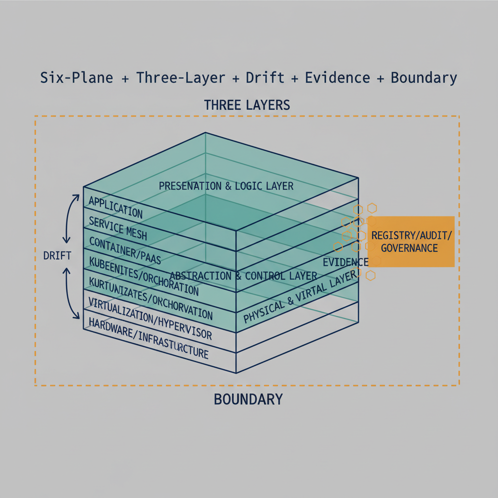

# Core Architecture {.unnumbered}

{#fig-index-image-01 fig-alt="Six-Plane + Three-Layer + Drift + Evidence + Boundary stack overview. Engineering blueprint style, neutral slate background, federal navy (#1F3A5F) for primary structural elements, teal (#1A9E8F) for secondary/integration elements, amber (#D4A017) for governance/audit/registry overlays, monospace labels for identifiers, no human figures, 16:9 landscape." width="85%"}

The architectural abstractions that every pillar inherits from. These
aren't optional — a page that violates the Six-Plane Architecture or the
Three-Layer Rule Model is non-canonical by definition.

## Leaves

- **S.A.1** Six-Plane Architecture — [architecture-series](../../architecture-series/six-plane-architecture.html)
- **S.A.2** Three-Layer Rule Model — [architecture-series](../../architecture-series/three-layer-rule-model.html)
- **S.A.3** Drift Engine — [architecture-series](../../architecture-series/drift-engine.html)
- **S.A.4** Evidence Chain — [architecture-series](../../architecture-series/evidence-chain.html)
- **S.A.5** Boundary Impact Model — [architecture-series](../../architecture-series/boundary-impact-model.html)
- **S.A.6** Two-Way Governance (SCuBA assesses · ScubaConnect automates · UIAO governs)
