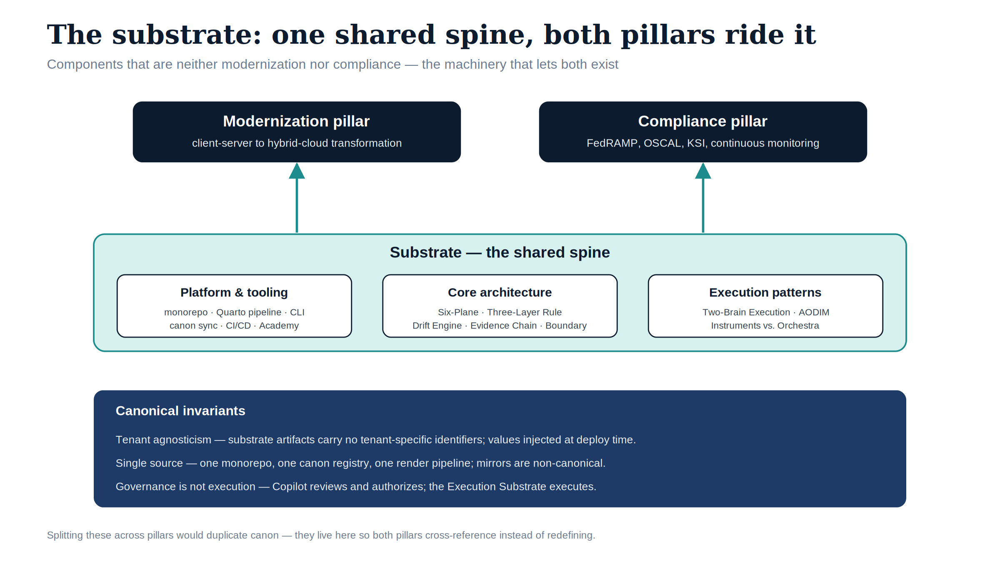
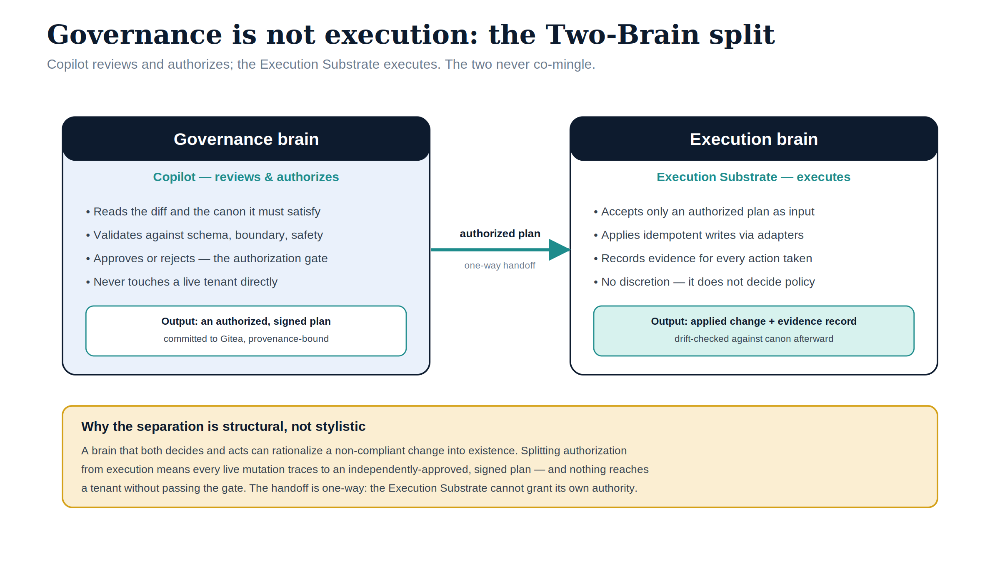

# Substrate {.unnumbered}

::: {.callout-tip}
## Download the full section
**[substrate-bundle.docx](substrate-bundle.docx)** — every page in this section concatenated into one Word document. Regenerated on every site deploy.
:::

The **shared spine both pillars ride on.** These components aren't
modernization *or* compliance — they're the machinery that lets both exist:
the monorepo, the render pipeline, the architecture abstractions, and the
execution patterns that distinguish governance from execution.

Splitting these across pillars would duplicate canon. They live here so
modernization pages and compliance pages cross-reference them instead of
redefining them.

{#fig-index-image-01 fig-alt="Diagram showing the substrate as a shared spine. Two pillar boxes at the top — Modernization (client-server to hybrid-cloud transformation) and Compliance (FedRAMP, OSCAL, KSI, continuous monitoring) — both fed by upward arrows from a central teal Substrate band containing three sub-category cards: Platform and tooling (monorepo, Quarto pipeline, CLI, canon sync, CI/CD, Academy), Core architecture (Six-Plane, Three-Layer Rule, Drift Engine, Evidence Chain, Boundary), and Execution patterns (Two-Brain Execution, AODIM, Instruments vs. Orchestra). A navy footer band lists the three canonical invariants. Engineering blueprint style, navy and teal on white, no human figures, 16:9 landscape." width="100%"}

## Sub-categories

| Section | Scope | Leaf count |
|---|---|---|
| [Platform & tooling](platform-tooling/index.html) | GitHub/Gitea monorepo · Quarto pipeline · canon sync · CI/CD · Customer Documents portal · CLI · Academy | 8 |
| [Core architecture](core-architecture/index.html) | Six-Plane Architecture · Three-Layer Rule Model · Drift Engine · Evidence Chain · Boundary Impact Model · Two-Way Governance | 6 |
| [Execution patterns](execution-patterns/index.html) | Two-Brain Execution (Copilot + Execution Substrate) · AODIM · "Instruments vs. Orchestra" positioning | 3 |

## Canonical invariants

- **Tenant agnosticism:** substrate artifacts carry no tenant-specific
  identifiers. Values are injected at deployment time.
- **Single source:** there is one monorepo, one canon registry, one render
  pipeline. Mirrors and derived copies are non-canonical.
- **Governance ≠ execution:** Copilot reviews and authorizes; the Execution
  Substrate executes. The two never co-mingle.

{#fig-index-image-02 fig-alt="Two-Brain split diagram. Left panel 'Governance brain — Copilot reviews and authorizes': reads the diff and the canon it must satisfy, validates against schema/boundary/safety, approves or rejects at the authorization gate, never touches a live tenant; output is an authorized, signed plan committed to Gitea. A one-way teal 'authorized plan' handoff arrow points to the right panel 'Execution brain — Execution Substrate executes': accepts only an authorized plan, applies idempotent writes via adapters, records evidence for every action, has no policy discretion; output is applied change plus evidence record, drift-checked afterward. An amber footer explains the separation is structural: nothing reaches a tenant without passing the gate. Engineering blueprint style, navy and teal on white, no human figures, 16:9 landscape." width="100%"}
