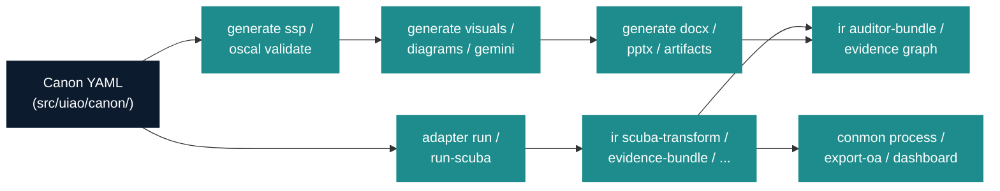
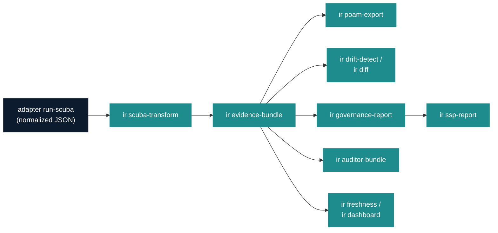
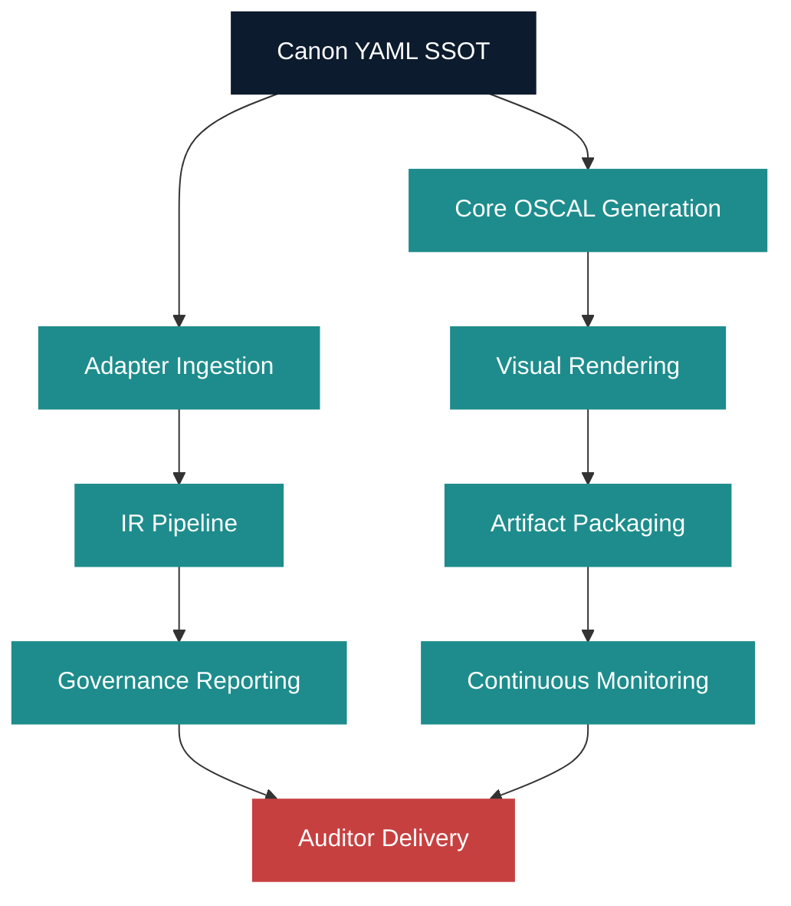

# Image Prompts — UIAO CLI Reference

> Companion catalog for `uiao-cli-reference.qmd`. One entry per
> `![...]` placeholder in the `.qmd` file. Generated images land in
> `./images/` with the exact filename referenced by the page.
>
> **Generation:** run `uiao generate gemini` with `GEMINI_API_KEY`
> exported; the generator reads this file, computes a SHA-256 of the
> prompt block, writes the PNG plus a JSON sidecar carrying the prompt
> hash + Gemini-model version. The sidecar makes regeneration
> deterministic — identical prompt → identical hash → cache hit.
>
> **Visual language.** All figures share the UIAO aesthetic:
>
> - **Palette:** dark navy `#0D1B2E` + teal `#1E8C8C` accents on white;
>   red `#C74040` reserved for failure/warning surfaces only.
> - **Typography:** clean sans-serif for labels; monospace for command
>   tokens, attribute values, and path fragments.
> - **Style:** diagrammatic / technical-illustration — not photographic,
>   not isometric-3D, not marketing-flat. Engineering-blueprint
>   aesthetic similar to high-quality cloud reference architectures.
> - **No human figures.** Infrastructure documentation, not lifestyle
>   imagery.
> - **Aspect ratio:** landscape 16:9 (e.g. 1600×900). Embedded at 85%
>   width in the `.qmd` file.
>
> **Canon compliance.** Every figure must respect UIAO canon:
> GCC-Moderate boundary visible where relevant; sub-app names spelled
> exactly per `src/uiao/cli/`; ADR-046 sub-app hierarchy honored
> (no flat top-level commands).

---

## IMAGE-01 — `uiao-cli-reference-image-01-cli-subapp-topology.png`

**Placement:** Top-of-page hero, immediately after the H1.

**Slug:** `cli-subapp-topology`

**Aspect:** 16:9 (1600×900)

**Prompt:**

> A horizontal engineering-blueprint diagram illustrating the UIAO
> command-line topology after ADR-046. At the center-top, a single
> rounded rectangle labelled `uiao` in monospace, painted dark navy
> (#0D1B2E) with white text. From that rectangle, thirteen labelled
> branches fan downward to thirteen smaller rounded rectangles, each
> in teal (#1E8C8C) with white monospace labels, in this order from
> left to right: `canon`, `generate`, `oscal`, `adapter`, `ir`,
> `conmon`, `reciprocity`, `cql`, `evidence`, `substrate`, `ksi`,
> `orchestrator`, `enforcement`. Beneath each sub-app, a short stack
> of two or three faint sub-command pills shows representative
> commands (e.g. under `generate`: `ssp`, `visuals`, `docx`; under
> `ir`: `scuba-transform`, `evidence-bundle`, `auditor-bundle`).
> Below the sub-app row, three horizontal lanes span the full width,
> labelled in small caps: `CANON-ANCHORED`, `ADAPTER-INGESTED`,
> `AUDITOR-DELIVERED`. Thin teal arrows connect the relevant sub-apps
> into each lane (e.g. `canon` and `generate` into CANON-ANCHORED;
> `adapter` and `ir` into ADAPTER-INGESTED; `evidence`,
> `orchestrator`, and `ir` into AUDITOR-DELIVERED). The bottom edge
> carries a thin grey ribbon labelled `pyproject.toml [project.scripts]
> uiao = "uiao.cli.app:app"` in monospace, with a small annotation
> "single entry point — Invariant I2". Clean white background, no
> gradients, no human figures, no vendor logos. Engineering-blueprint
> aesthetic, comparable in spirit to AWS / Azure reference-architecture
> diagrams but vendor-neutral.

**`fig-alt` (for accessibility, mirror in the `.qmd`):** A horizontal
blueprint-style diagram showing the `uiao` root entry point branching
into 13 named sub-apps: canon, generate, oscal, adapter, ir, conmon,
reciprocity, cql, evidence, substrate, ksi, orchestrator, enforcement.
Below the sub-apps, three lanes labelled 'Canon-anchored',
'Adapter-ingested', 'Auditor-delivered' connect to the substrate's
data flow. Clean engineering-blueprint aesthetic, dark navy and teal
on white, no human figures.

---

## IMAGE-02 — `uiao-cli-reference-image-02-pipeline-overview.png`

**Placement:** §1 Overview, after the introductory prose.

**Slug:** `pipeline-overview`

**Aspect:** 1600×600 (landscape)

**Generator:** `mermaid-cli@11.12.0` (rendered, not generative — see
"Generation notes" below for the regen recipe).

**Source mermaid:**

**`fig-alt`:** Pipeline overview: Canon YAML branches into two parallel
tracks. Top: generate ssp/oscal validate → generate visuals/diagrams/gemini
→ generate docx/pptx/artifacts. Bottom: adapter run/run-scuba → ir
scuba-transform/evidence-bundle → conmon process/export-oa/dashboard. Both
tracks converge into ir auditor-bundle/evidence graph.

---

## IMAGE-03 — `uiao-cli-reference-image-03-ir-pipeline.png`

**Placement:** §3.8 IR pipeline, after the introductory prose.

**Slug:** `ir-pipeline`

**Aspect:** 1600×600 (landscape)

**Generator:** `mermaid-cli@11.12.0`.

**Source mermaid:**

**`fig-alt`:** IR pipeline: adapter run-scuba produces normalized JSON,
which feeds ir scuba-transform, which produces ir evidence-bundle. The
evidence bundle fans out to six terminal commands: ir poam-export, ir
drift-detect/ir diff, ir governance-report (which feeds ir ssp-report),
ir auditor-bundle, and ir freshness/ir dashboard.

---

## IMAGE-04 — `uiao-cli-reference-image-04-pipeline-architecture.png`

**Placement:** §6 Pipeline architecture, after the introductory prose.

**Slug:** `pipeline-architecture`

**Aspect:** 1200×1000 (portrait)

**Generator:** `mermaid-cli@11.12.0`.

**Source mermaid:**

**`fig-alt`:** Full pipeline architecture, top-down. Canon YAML SSOT
branches into two streams. Stream one: Core OSCAL Generation → Visual
Rendering → Artifact Packaging → Continuous Monitoring. Stream two:
Adapter Ingestion → IR Pipeline → Governance Reporting. Both streams
converge into Auditor Delivery at the bottom.

---

## Generation notes

- **Why pre-rendered, not inline `{mermaid}`.** GitHub Actions DOCX
  render hangs on inline mermaid blocks because `mermaid-cli` requires
  a headless Chromium that the runner does not provide. Pre-rendering
  the PNGs locally with `mmdc` and embedding them with `` makes
  the DOCX pipeline deterministic and self-contained.
- **Regenerating an IMAGE-0N PNG.** Save the source mermaid block above
  to a temporary `.mmd` file and run:
  `mmdc -i <source>.mmd -o images/<name>.png -b white -w <W> -H <H>`
  using the aspect dimensions listed for that image. Then update the
  `sha256` field in the matching `.png.json` sidecar.
- IMAGE-01 (hero) is the only Gemini-generated figure on this page;
  IMAGE-02, IMAGE-03, IMAGE-04 are mermaid-rendered diagrams.
- CI link-check tolerates missing images under `images/` by convention
  (see `.lycheeignore`).
