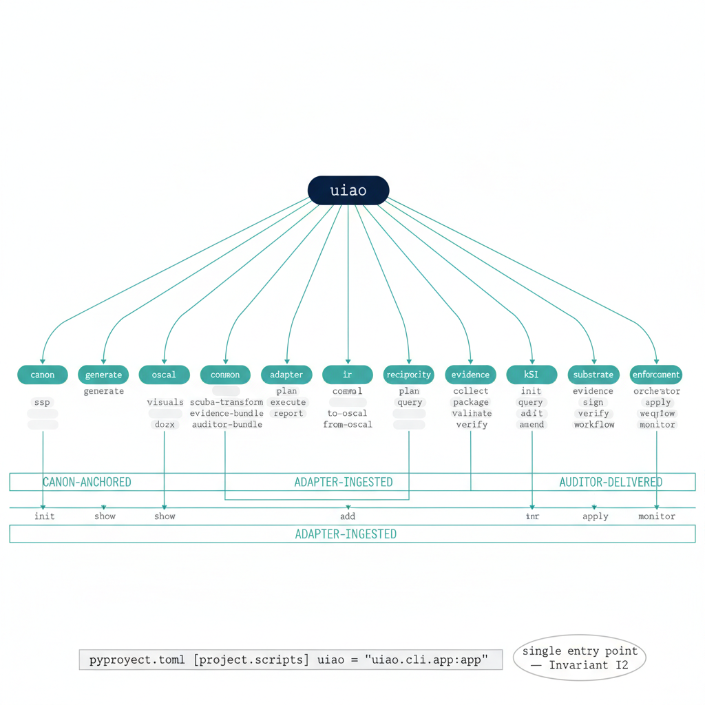
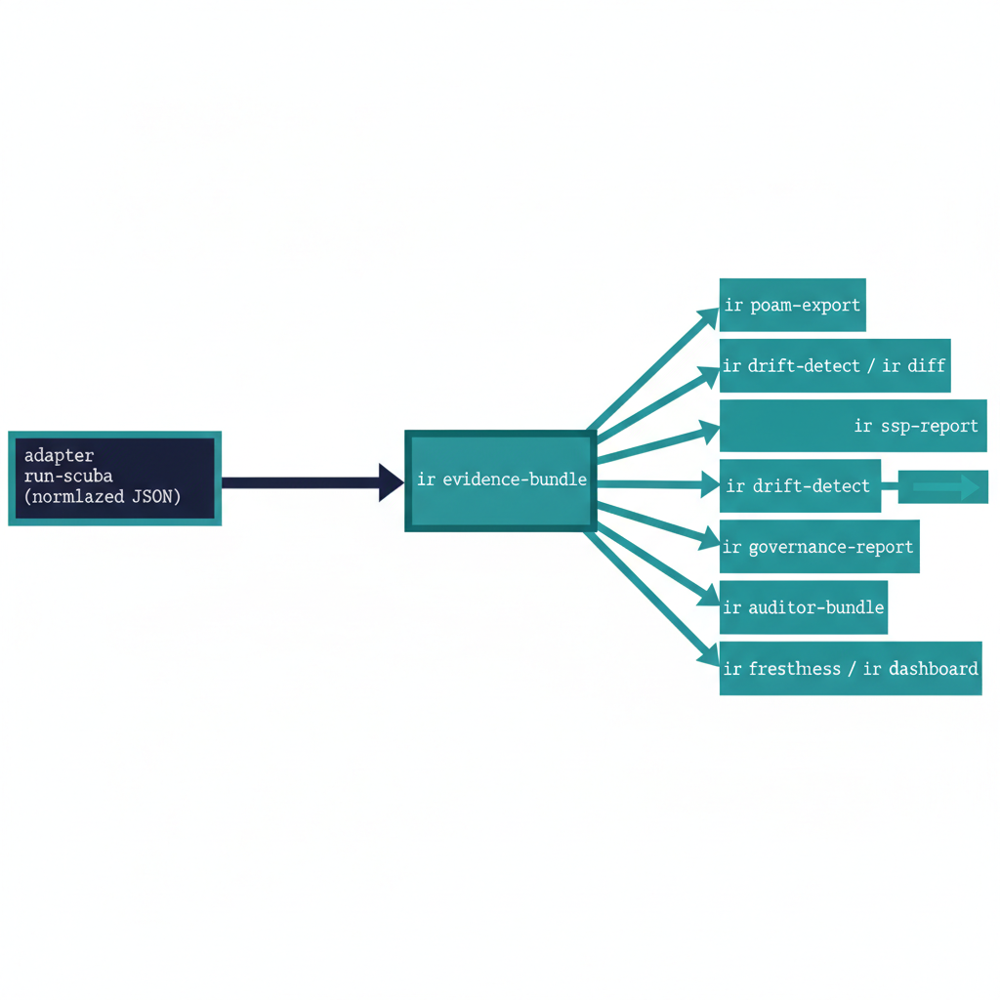
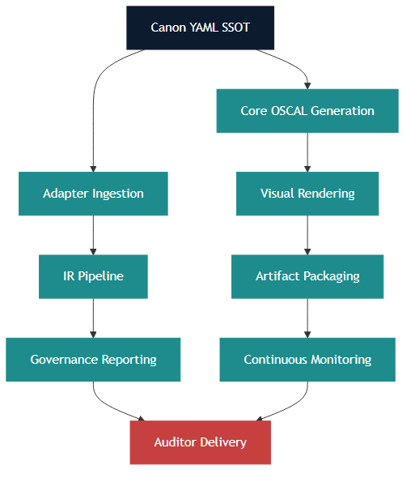

# UIAO CLI Reference {.unnumbered}

{#fig-uiao-cli-reference-image-01 fig-alt="A horizontal blueprint-style diagram showing the uiao root entry point branching into 13 named sub-apps: canon, generate, oscal, adapter, ir, conmon, reciprocity, cql, evidence, substrate, ksi, orchestrator, enforcement. Below the sub-apps, three lanes labelled 'Canon-anchored', 'Adapter-ingested', 'Auditor-delivered' connect to the substrate's data flow. Clean engineering-blueprint aesthetic, dark navy and teal on white, no human figures." width="85%"}

::: {.callout-note title="Authoritative surface"}
This page is the customer-facing rendering of the CLI surface specified in
[`docs/docs/cli-reference.qmd`](../../../docs/cli-reference.qmd) (the
canonical reference) and implemented under [`src/uiao/cli/`](../../../../src/uiao/cli/).
Every command listed below is reachable as `uiao <sub-app> <command>` once
`pip install -e .` (or the published wheel) has been run; the `[api]`
extra is required only for the REST server documented in §5.

The surface was reorganized in **ADR-046** so every command lives under
a domain sub-app — flat top-level commands like `uiao generate-ssp` are
no longer accepted. Older customer-facing material that uses the flat
form is superseded by this page.
:::

**Version:** Current (May 2026) · **Environment:** Commercial Cloud
(FedRAMP-governed); GCC-Moderate applies to Microsoft 365 SaaS services
only. **Toolkit:** OSCAL compliance toolkit for US Government systems.

## 1. Overview

The UIAO CLI is the canonical command-line toolkit for the **Unified
Identity-Addressing-Overlay Architecture (UIAO)** governance substrate.
It automates the full lifecycle of compliance artifact generation,
continuous monitoring, governance reporting, and auditor evidence
packaging — from canon YAML source-of-truth through OSCAL-compliant
outputs.

The CLI is organized around a deterministic pipeline: Canon YAML →
OSCAL generation → visual rendering → artifact packaging → continuous
monitoring → IR (Intermediate Representation) governance pipeline.
Every command is idempotent, auditable, and traceable to its canon
source.

{#fig-uiao-cli-reference-image-02 fig-alt="Pipeline overview: Canon YAML branches into two parallel tracks. Top: generate ssp/oscal validate → generate visuals/diagrams/gemini → generate docx/pptx/artifacts. Bottom: adapter run/run-scuba → ir scuba-transform/evidence-bundle → conmon process/export-oa/dashboard. Both tracks converge into ir auditor-bundle/evidence graph." width="85%"}

::: {.callout-important title="Governance note"}
UIAO operates in **Commercial Cloud as governed by FedRAMP** unless
specifically noted. **GCC-Moderate** applies to Microsoft 365 SaaS
services only — it does not include Azure services. **UIAO is not
FedRAMP High.**
:::

## 2. Global options

The following options are available on every UIAO CLI invocation.

| Option | Short | Description |
|---|---|---|
| `--version` | `-V` | Show the UIAO version and exit. |
| `--help` | | Show the top-level help message and exit. |

::: {.callout-tip title="Sub-app help"}
Every sub-app supports its own `--help`. Example:
`uiao ir --help` lists the eleven IR commands.
`uiao ir scuba-transform --help` shows the per-command flags.
:::

## 3. Command reference by pipeline stage

### 3.1 Core OSCAL generation and validation

These commands form the foundation of the UIAO compliance pipeline.
They produce and validate OSCAL (Open Security Controls Assessment
Language) artifacts from the canonical YAML source-of-truth. Every
downstream artifact — SSPs, POA&Ms, dashboards, briefings — traces its
provenance back to the outputs of this stage.

| Command | Description | Pipeline role |
|---|---|---|
| `generate ssp` | Generate an OSCAL SSP from canon YAML and data files. | Primary SSP generation; authoritative compliance narrative. |
| `oscal validate` | Validate an OSCAL document against its schema. | Schema-level structural validation gate. |
| `canon check` | Check canon YAML files for consistency. | First-line defense against configuration drift. |
| `oscal validate-ssp` | Validate OSCAL artifacts with compliance-trestle Pydantic models. | Semantic validation beyond schema compliance. |

#### Details

**`generate ssp`** — Reads the canonical YAML configuration and data
files to produce a fully-formed OSCAL System Security Plan. The SSP is
the authoritative compliance narrative for the system boundary, control
implementations, and responsible parties.

**`oscal validate`** — Schema-level validation of any OSCAL document
(SSP, SAR, SAP, POA&M, component-definition) against the NIST OSCAL
schema. Catches structural errors before submission or downstream
processing.

**`canon check`** — Ensures canon YAML files are internally consistent:
cross-references resolve, required fields are present, enumerations are
valid, and no drift has occurred between canon sources.

**`oscal validate-ssp`** — Goes beyond schema validation by loading
OSCAL artifacts through NIST compliance-trestle's Pydantic models.
Catches semantic errors that pass schema validation — invalid control
references, orphaned parameters, broken cross-links.

### 3.2 Visual and artifact generation

UIAO produces leadership-grade deliverables — DOCX briefings, PPTX
decks, embedded diagrams, and AI-generated visuals. These commands
render canon data into presentation-ready formats. PlantUML is the
canonical diagram renderer; the Gemini API produces AI imagery for
executive-facing materials.

| Command | Description | Pipeline role |
|---|---|---|
| `generate visuals` | Render PlantUML diagrams to PNG for DOCX/PPTX embedding. | Diagram rendering stage; publication-quality PNGs. |
| `generate gemini` | Generate images via Gemini API (requires `GEMINI_API_KEY`). | AI-generated visuals for executive-facing materials. |
| `generate pptx` | Generate a leadership briefing PPTX deck. | Executive communication; governance and risk posture. |
| `generate docx` | Generate a rich DOCX leadership briefing with embedded visuals. | Word-format briefing with embedded diagrams. |
| `generate diagrams` | Generate PlantUML `.puml` files and render them to PNG from canon YAML. | Deterministic, version-controlled diagram generation. |
| `generate docs` | Render Jinja2 templates into Markdown docs using canon YAML and data files. | Parameterized documentation from templates. |
| `generate artifacts` | Generate DOCX + PPTX with embedded PlantUML and Gemini visuals. | Full visual artifact pipeline in a single invocation. |
| `generate briefing` | Generate a personal briefing document from live repo state. | Daily operational awareness; live pipeline and governance status. |

### 3.3 Supply chain security

Software supply chain transparency is a FedRAMP and NIST requirement.
UIAO generates machine-readable Software Bills of Materials (SBOMs) to
document every dependency in the compliance toolkit itself and in
assessed systems.

| Command | Description | Pipeline role |
|---|---|---|
| `generate sbom` | Generate a CycloneDX 1.4 Software Bill of Materials (SBOM). | Supply chain transparency; EO 14028 compliance. |

**`generate sbom`** — Produces a CycloneDX 1.4-compliant SBOM
enumerating all software components, dependencies, and versions.
Supports supply chain risk assessment, vulnerability tracking, and
Executive Order 14028 compliance.

### 3.4 Reciprocity (HRIT Single-ATO)

The `reciprocity` sub-app implements the HRIT Single-ATO Reciprocity
Model (UIAO_140 / ADR-054). It emits signed, schema-valid reciprocity
records per consuming agency, verifies HMAC-SHA256 signatures, and
enumerates all registered records with live expiry status.

| Command | Description | Pipeline role |
|---|---|---|
| `reciprocity onboard-agency` | Emit a signed reciprocity record for a consuming agency. | Primary record-creation command; calls the WS-A2 emitter. |
| `reciprocity list-records` | Enumerate reciprocity records and display Active / Expired status. | Record inventory and health check. |
| `reciprocity verify` | Verify the HMAC-SHA256 signature of a reciprocity record. | Signature integrity validation. |

Example — emit a reciprocity record:

```bash
uiao reciprocity onboard-agency \
    --agency-code TREAS \
    --agency-name "Department of the Treasury" \
    --out /tmp/hrit-recip/TREAS/reciprocity-record.json
```

Verify with non-zero exit on bad signature (CI-friendly):

```bash
uiao reciprocity verify /tmp/hrit-recip/TREAS/reciprocity-record.json \
    || echo "signature invalid"
```

### 3.5 Continuous monitoring (ConMon)

Continuous monitoring is the operational heartbeat of FedRAMP
compliance. These commands process live security telemetry (Sentinel
alerts), manage Plans of Action & Milestones (POA&Ms), export ongoing
authorization evidence, produce KSI dashboards, and validate the
30/45-day ATO cadence SLAs.

| Command | Description | Pipeline role |
|---|---|---|
| `conmon process` | Process a Sentinel alert and auto-upsert a POA&M entry. | Primary ConMon event processing automation. |
| `conmon export-oa` | Export an OSCAL ongoing-authorization evidence artifact. | ATO maintenance; evidence for authorizing officials. |
| `conmon dashboard` | Export the KSI continuous monitoring dashboard. | Governance-grade security posture summary. |
| `conmon ato-cadence-check` | Validate 30-day SSP-draft / 45-day SSP-final / 30-day reauth SLAs. | UIAO_140 §4 cadence enforcement; CI gate. |

Example — ATO cadence verification:

```bash
uiao conmon ato-cadence-check \
    --award-date 2026-01-01 \
    --ssp-draft-at 2026-01-25T12:00:00Z \
    --ssp-final-at 2026-02-10T12:00:00Z \
    --current-ato-decision 2026-03-01 \
    --current-ato-expires 2027-03-01 \
    --exit-on-fail
```

### 3.6 Full pipeline

For end-to-end generation from canon YAML through all output artifacts
in a single deterministic pass.

| Command | Description | Pipeline role |
|---|---|---|
| `generate all` | Run the full UIAO generation pipeline: YAML canon → all output artifacts. | Canonical "build everything" command; idempotent. |

**`generate all`** — Executes every generation stage in dependency
order: canon validation → SSP generation → diagram rendering → Gemini
visuals → DOCX/PPTX assembly → SBOM. Idempotent — safe to re-run at
any time.

### 3.7 Adapter layer

Adapters are the integration boundary between external vendor tools
and the UIAO canonical data model. They ingest third-party assessment
outputs and normalize them into UIAO's DNS-style claim format —
lightweight, human-readable, and traceable — without requiring heavy
OSCAL conversion at the adapter boundary.

| Command | Description | Pipeline role |
|---|---|---|
| `adapter run` | Run a vendor adapter and align claims (DNS-style, no heavy OSCAL conversion). | Generic adapter runner; normalizes vendor output. |
| `adapter run-scuba` | Run SCuBA adapter: ingest ScubaGear report and map to UIAO KSI evidence. | Primary M365 security posture assessment integration. |

Every adapter declares `class` (modernization | conformance) ×
`mission-class` (identity | telemetry | policy | enforcement |
integration) per UIAO_003. See the adapter registries
([`adapter-registry.yaml`](../../../../src/uiao/canon/adapter-registry.yaml),
[`modernization-registry.yaml`](../../../../src/uiao/canon/modernization-registry.yaml))
for the complete enumeration.

### 3.8 IR (Intermediate Representation) pipeline

The IR pipeline is the analytical and governance core of UIAO. It
transforms normalized adapter output (starting with SCuBA) through a
deterministic chain: raw results → normalized IR objects → evidence
bundles → governance actions → auditor packages. Every stage produces
traceable, machine-readable artifacts. The IR layer enables drift
detection, freshness tracking, POA&M generation, SSP narrative
synthesis, and full auditor evidence packaging.

{#fig-uiao-cli-reference-image-03 fig-alt="IR pipeline: adapter run-scuba produces normalized JSON, which feeds ir scuba-transform, which produces ir evidence-bundle. The evidence bundle fans out to six terminal commands: ir poam-export, ir drift-detect/ir diff, ir governance-report (which feeds ir ssp-report), ir auditor-bundle, and ir freshness/ir dashboard." width="85%"}

| Command | Description | Pipeline role |
|---|---|---|
| `ir scuba-transform` | Transform normalized SCuBA JSON → IR Evidence objects and print summary. | IR pipeline entry point; canonical evidence creation. |
| `ir evidence-bundle` | Build a canonical EvidenceBundle from a SCuBA transform. | Evidence aggregation; auditor-consumable unit. |
| `ir poam-export` | Export POA&M rows (FAIL + WARN only) from a SCuBA run. | Non-passing findings → actionable POA&M entries. |
| `ir drift-detect` | Detect drift between two IR state JSON files and print classification. | Change detection; governance escalation trigger. |
| `ir governance-report` | Run full governance pipeline: SCuBA → IR → Evidence → Actions → Report. | Comprehensive governance report synthesis. |
| `ir ssp-report` | Generate SSP narrative + lineage from SCuBA → IR → Evidence → Governance. | SSP authoring with full provenance lineage. |
| `ir auditor-bundle` | Run full pipeline and write all auditor artifacts to a directory. | Auditor-facing artifact packaging. |
| `ir diff` | Diff two SCuBA runs: KSI changes, evidence hash deltas, status changes. | Trend analysis and regression detection. |
| `ir validate` | Validate a normalized SCuBA JSON file for IR pipeline conformance. | Input validation gate for IR pipeline. |
| `ir freshness` | Compute evidence freshness and generate refresh actions for stale evidence. | ConMon compliance; evidence currency enforcement. |
| `ir dashboard` | Build IR governance dashboard: evidence freshness + governance action summary. | Capstone governance visibility; daily operational use. |

### 3.9 CQL (Compliance Query Language) engine

The CQL engine (UIAO_108) is an SQL-like query layer over compliance
data. It lets operators interrogate evidence bundles, controls, drift
records, and POA&M entries without writing Python.

| Command | Description | Pipeline role |
|---|---|---|
| `cql query` | Execute a CQL query against an evidence bundle JSON file. | Ad-hoc compliance data analysis; operator interrogation surface. |

CQL syntax:

```
SHOW CONTROLS  [WHERE field OP 'value' [AND ...]] [SINCE 'ISO-date'] [ORDER BY field [ASC|DESC]]
SHOW EVIDENCE  [FOR CONTROL 'control-id'] [WHERE ...] [SINCE '...'] [ORDER BY ...]
SHOW DRIFT     [WHERE ...] [SINCE '...'] [ORDER BY ...]
SHOW POAM      [WHERE ...] [SINCE '...'] [ORDER BY ...]
```

Supported operators: `=`, `!=`, `>=`, `<=`, `>`, `<`, `LIKE` (substring
match). Four data domains: `CONTROLS`, `EVIDENCE`, `DRIFT`, `POAM`.

Examples:

```bash
# List all failing controls
uiao cql query "SHOW CONTROLS WHERE status = 'FAIL'" --bundle bundle.json

# Show evidence for a specific control
uiao cql query "SHOW EVIDENCE FOR CONTROL 'AC-2'" --bundle bundle.json --format json

# Find semantic drift events
uiao cql query "SHOW DRIFT WHERE drift_class = 'DRIFT-SEMANTIC'" --bundle bundle.json

# High-severity open POA&M items, most critical first
uiao cql query "SHOW POAM WHERE severity >= 'High' ORDER BY severity DESC" \
    --bundle bundle.json --output poam-high.json
```

### 3.10 Evidence Graph (UIAO_113)

The Evidence Graph is a directed property graph that links controls,
IR objects, evidence nodes, provenance records, findings, and POA&M
entries. Every edge carries typed metadata so any compliance claim can
be traced back to its raw assessment output.

| Command | Description | Pipeline role |
|---|---|---|
| `evidence graph` | Build and inspect an Evidence Graph from a SCuBA run. | Provenance tracing; compliance claim lineage. |

Examples:

```bash
# Print graph statistics
uiao evidence graph --input normalized.json

# Trace a specific control's evidence chain
uiao evidence graph --input normalized.json --trace KSI-IA-02

# Trace a control and export the full chain as JSON
uiao evidence graph --input normalized.json --trace AC-2 --format json --output trace.json
```

### 3.11 Substrate walker, KSI, OSCAL export, orchestrator

Five additional sub-apps cover substrate self-observation, KSI
evaluation, OSCAL export, and orchestration. Surface inventory:

| Sub-app | Commands | Purpose |
|---|---|---|
| `substrate` | `substrate walk`, `substrate drift` | Validate the substrate manifest (UIAO_200) and emit DRIFT-SCHEMA / DRIFT-PROVENANCE findings. `--json` for machine-readable; exit-code-only summary for CI. |
| `ksi` | `ksi evaluate`, `ksi report` | Evaluate the KSI library against current evidence; produce per-control verdicts and aggregate posture. |
| `oscal` | `oscal generate`, `oscal export`, `oscal validate`, `oscal validate-ssp` | OSCAL artifact generation, validation, and export. |
| `orchestrator` | `orchestrator run`, `orchestrator status` | Pipeline orchestration across adapter runs, IR transforms, and evidence assembly. |
| `tenant` / `orgtree` / `init` | per-domain helpers | Bootstrap and tenant-promotion workflows. See `uiao <sub-app> --help`. |

```bash
uiao substrate walk              # structured report
uiao substrate walk --json       # machine-readable
uiao substrate drift             # exit-code-only summary (CI-friendly)
```

## 4. Library-only features

The following modules are part of the `uiao` package but are
intentionally **not** exposed through the CLI. They are stable Python
APIs for advanced integration scenarios.

### 4.1 Enforcement Runtime (UIAO_111)

**Module:** `uiao.enforcement`

The Enforcement Runtime (`EnforcementRuntime`) is a policy evaluation
and enforcement engine. Policies are expressed as Python callables
(`EPLPolicy.condition: Callable[[dict], bool]`) and cannot be
represented as simple CLI arguments. The runtime is designed to be
embedded in Python automation scripts, GitHub Actions workflows, or
orchestration pipelines.

```python
from uiao.enforcement import EnforcementRuntime, EPLPolicy

policy = EPLPolicy(
    policy_id="POL-IA-01",
    control_id="IA-2",
    description="MFA must be enforced",
    adapter_id="noop",
    condition=lambda ir_obj: not ir_obj.get("mfa_enabled", True),
    severity="High",
    auto_enforce=False,
)

runtime = EnforcementRuntime(dry_run=True)
result = runtime.run(policy, ir_object={"id": "user-001", "mfa_enabled": False})
print(result.state)  # "VIOLATED"
```

Key classes: `EnforcementRuntime`, `EPLPolicy`, `EnforcementResult`,
`RuntimeState`, `EnforcementAdapter` (base class for real enforcement
adapters).

## 5. REST API server (`[api]` optional extra)

The `uiao.api` module provides a FastAPI REST service for the UIAO
governance layer. It is gated behind the `[api]` optional extra
because it requires `fastapi`, `httpx`, `uvicorn`, and `msal` —
dependencies that most CLI users do not need.

Installation:

```bash
pip install "uiao[api]"
```

Running the server:

```bash
# Development
uvicorn uiao.api.app:app --host 0.0.0.0 --port 8080

# Production (IIS / Windows Server 2025 — see deploy/windows-server/)
python deploy/windows-server/run.py
```

REST endpoints:

| Endpoint | Method | Description |
|---|---|---|
| `/api/auditor/evidence` | `GET` | List evidence records with optional control/status filters. |
| `/api/auditor/evidence/{id}` | `GET` | Get a single evidence record by ID. |
| `/api/auditor/findings` | `GET` | List findings with optional severity filter. |
| `/api/auditor/summary` | `GET` | Aggregate evidence and finding statistics. |
| `/api/health` | `GET` | Service health check. |

**Authentication:** Bearer token on all `/api/auditor/*` routes.
Windows Authentication (Kerberos via IIS Negotiate) for inbound
requests and MSAL client credentials for outbound Microsoft Graph
calls.

**Swagger UI:** Available at `/api/docs` when the server is running.

::: {.callout-note}
The REST API is for server-side deployment in GCC-Moderate
environments. For local analysis, use the CLI commands in §3.6–3.10
instead. The canonical Windows Server 2025 deployment surface is
documented in
[`platform-server-build.qmd`](../../platform/platform-server-build.qmd)
and the
[Git Server Interfaces whitepaper](../../whitepapers/git-server-interfaces-whitepaper.qmd).
:::

## 6. Pipeline architecture

The UIAO CLI implements a deterministic pipeline architecture.
Every artifact produced by any command is traceable back to its canon
YAML source-of-truth.

{#fig-uiao-cli-reference-image-04 fig-alt="Full pipeline architecture, top-down. Canon YAML SSOT branches into two streams. Stream one: Core OSCAL Generation → Visual Rendering → Artifact Packaging → Continuous Monitoring. Stream two: Adapter Ingestion → IR Pipeline → Governance Reporting. Both streams converge into Auditor Delivery at the bottom." width="70%"}

The pipeline is **idempotent** — any stage can be re-run without side
effects. Re-running with identical inputs produces identical outputs.
This property is essential for auditability: an auditor can re-execute
any stage and verify that the output matches the delivered artifact.

The IR pipeline specifically enforces **provenance** by hashing
evidence objects and tracking lineage through every transformation.
Each IR Evidence object carries a content hash, a timestamp, and a
reference to its source adapter output. EvidenceBundles aggregate
these objects with a bundle-level hash, creating a tamper-evident
chain from raw vendor assessment through governance action.

## 7. Environment and prerequisites

| Prerequisite | Details |
|---|---|
| **Python** | Python 3.10+ (canonical runtime). |
| **compliance-trestle** | NIST compliance-trestle library for OSCAL Pydantic model validation. Required by `oscal validate-ssp`. |
| **PlantUML** | Java runtime required for diagram rendering. Used by `generate visuals` and `generate diagrams`. |
| **`GEMINI_API_KEY`** | Environment variable required for AI-generated visuals via `generate gemini`. |
| **Canon YAML** | Canon files must be present and pass `canon check` before any generation command. |
| **`[api]` extra** | `pip install "uiao[api]"` required to run the FastAPI REST server (§5). |

::: {.callout-warning title="Environment boundaries"}
- UIAO operates in **Commercial Cloud** as governed by FedRAMP unless
  specifically noted.
- **GCC-Moderate** applies to Microsoft 365 SaaS services only — it
  does not include Azure services.
- **Amazon Connect Contact Center** and **SailPoint NERM** are
  explicit named exceptions running in Commercial Cloud / FedRAMP
  Moderate on AWS GovCloud per ADR-059.
:::

## 8. Canonical rules

The following governance rules are authoritative and apply to all
UIAO operations, artifacts, and communications:

1. **UIAO is not FedRAMP High.** UIAO operates under FedRAMP governance
   at the applicable baseline; no artifacts, narratives, or
   communications should assert or imply FedRAMP High authorization.
2. **GCC-Moderate applies to Microsoft 365 SaaS services only.** Azure
   services, AWS, and other cloud infrastructure operate under their
   respective Commercial Cloud authorizations.
3. **UIAO operates in Commercial Cloud as governed by FedRAMP unless
   specifically noted.** Exceptions (Amazon Connect, SailPoint NERM)
   are explicitly documented.
4. **No references to any previous version in active canon context.**
   Artifacts are current-state only; ADRs are append-only with
   supersession markers.
5. **Every artifact must be canonical, deterministic, and
   provenance-aligned.** Outputs are reproducible from canon YAML,
   traceable through the pipeline, and consistent across invocations.
6. **New CLI commands live under domain sub-apps.** Flat top-level
   commands are disallowed by ADR-046 / Invariant I6; the smoke test
   in `tests/test_cli_help_smoke.py` walks the Typer tree and asserts
   `--help` returns exit 0 for every command.

## 9. Provenance and references

| Artifact | Path | Role |
|---|---|---|
| Canonical CLI reference | [`docs/docs/cli-reference.qmd`](../../../docs/cli-reference.qmd) | Authoritative surface; this page mirrors it for the customer-documents tree. |
| ADR-046 | `src/uiao/canon/adr/adr-046-cli-sub-app-organization.md` | Sub-app reorganization decision; basis for §3 structure. |
| AGENTS.md | [`AGENTS.md`](../../../../AGENTS.md) | Public surface inventory (v0.5.0 + v0.6.0 deltas); rules for moving features between tiers. |
| ADR-054 / UIAO_140 | reciprocity canon | Source for §3.4. |
| UIAO_108 | CQL engine | Source for §3.9. |
| UIAO_113 | Evidence Graph | Source for §3.10. |
| UIAO_111 | Enforcement Runtime | Source for §4.1. |
| Windows Server 2025 deployment | [`platform-server-build.qmd`](../../platform/platform-server-build.qmd), [Git Server Interfaces whitepaper](../../whitepapers/git-server-interfaces-whitepaper.qmd) | Production runtime for the `[api]` extra. |
| CLI entry point | [`src/uiao/cli/app.py`](../../../../src/uiao/cli/app.py) | Single Typer entry; resolves to `uiao = "uiao.cli.app:app"` in `pyproject.toml`. |
| CLI smoke test | `tests/test_cli_help_smoke.py` | Walks the Typer tree, asserts `--help` returns 0 for every command. |
