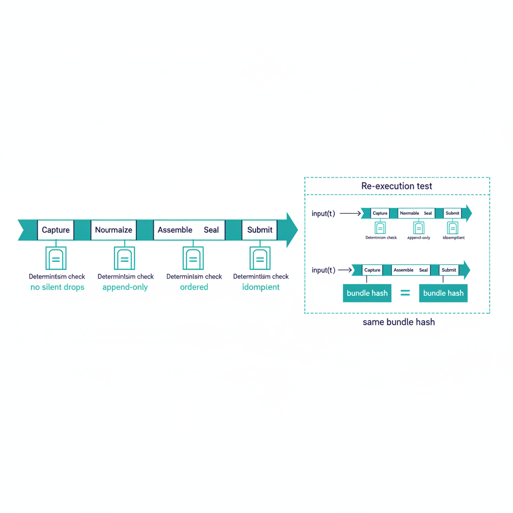

# Telemetry Modernization Validation Suite

## Scope

Conformance tests and validation criteria for the telemetry domain.
Pairs with the
[Telemetry Modernization Spec](../../../modernization-specs/telemetry/telemetry.qmd).
The suite gates whether a telemetry adapter or pipeline meets
substrate conformance — primary focus is provenance envelope
completeness, ADR-006 determinism, and ADR-016 lifecycle adherence.

{#fig-telemetry-image-01 fig-alt="A horizontal pipeline runs from Capture → Normalize → Assemble → Seal → Submit. Below the pipeline, four \"Determinism check\" gates are placed at each stage, each labeled with one ADR-006 property: no silent drops, append-only, ordered, idempotent. To the right of the pipeline, a \"Re-execution test\" panel shows the same pipeline rerun with input(t1) producing the same bundle hash. Clean engineering blueprint style, dark navy (#0D1B2E) and teal (#1E8C8C) on white background. No photographs, purely diagrammatic." width="85%"}

## Test categories

### 1. Provenance envelope completeness

For every emitted claim:

- All canonical fields present: `claim_id`, `issuer_identity`,
  `source_system`, `source_classification`, `extraction_timestamp`,
  `extraction_method`, `transformation_chain`, `lineage_hash`,
  `schema_version`, `signature`.
- `source_classification` is `authoritative` / `derived` /
  `synthesized` (not free-form).
- `transformation_chain` is non-empty and append-only.
- `lineage_hash` is recomputable from the source record.

### 2. ADR-006 determinism properties

The pipeline must demonstrate, by re-execution test:

- **No silent drops** — every input is accepted, rejected, or
  queued.
- **Append-only writes** — no in-place updates.
- **Ordered records** — re-runs produce identical ordering.
- **Idempotent ingestion** — re-ingesting the same source twice
  yields the same canonical claim.

The reference test: assemble bundle B from canon vN + inputs T;
re-assemble months later from the same canon vN + archived inputs T;
compare bundle hashes. Pass requires byte-identical match.

### 3. ADR-016 lifecycle conformance

Bundle lifecycle: `assemble → seal → submit → close`. Tests:

- Sealed bundles cannot be modified; updates produce new bundles.
- Each bundle carries a canonical lifecycle state.
- Provenance fields at item and bundle scope match the
  `evidence-bundle.schema.json` constraints.

### 4. Drift detection coverage

- `DRIFT-PROVENANCE` (P1/P2) — envelope chain breakage.
- `DRIFT-SCHEMA` — event payload structure mismatch.
- `DRIFT-SEMANTIC` — event meaning stale (e.g. retired field still
  emitted).

## Evidence expectations

A conformant telemetry pipeline produces:

- Per-claim provenance records with full envelope.
- Sealed evidence bundles with hash-verifiable lineage.
- Per-bundle determinism re-execution proof.
- OSCAL artifacts derived deterministically from sealed bundles.

## Conformance gates

| Gate | Required | Tier |
|---|---|---|
| **T1 — envelope completeness** | All canonical fields present | Required |
| **T2 — determinism** | ADR-006 re-execution test passes | Required |
| **T3 — lifecycle** | ADR-016 sealed-bundle properties hold | Required |
| **T4 — continuous capture** | End-to-end event-time emission across the adapter fleet | Target |

T4 is the maturity bar; the substrate's interval-evidence adapters
(e.g. SCuBAGear) satisfy T1–T3 today but represent partial T4.

## Drift procedures

`DRIFT-PROVENANCE` is the telemetry domain's primary drift class.
P1 findings (envelope chain broken on a live claim) halt the affected
emission and alert. P2 findings auto-remediate when deterministic;
otherwise escalate within 1 hour.

## Honest limits

- Continuous event-time capture (T4) is target across the adapter
  fleet. Programs running with T1–T3 are at substrate-baseline
  conformance.
- Cryptographic signing with agency-issued certificates is design-
  only; the envelope reserves the field, but end-to-end signing is
  engineering ahead.
- Re-execution tests assume archived inputs are available. Programs
  that discard inputs after assembly cannot pass T2 retroactively.

## Related documents

- [Modernization Spec — Telemetry](../../../modernization-specs/telemetry/telemetry.qmd)
- [Provenance Profile (canon)](../../../../docs/15_ProvenanceProfile.qmd)
- [ADR-006: Evidence Determinism](../../../../../src/uiao/canon/adr/adr-006-evidence-determinism.md)
- [ADR-016: Evidence Bundle Lifecycle](../../../../../src/uiao/canon/adr/adr-016-evidence-bundle-lifecycle.md)
