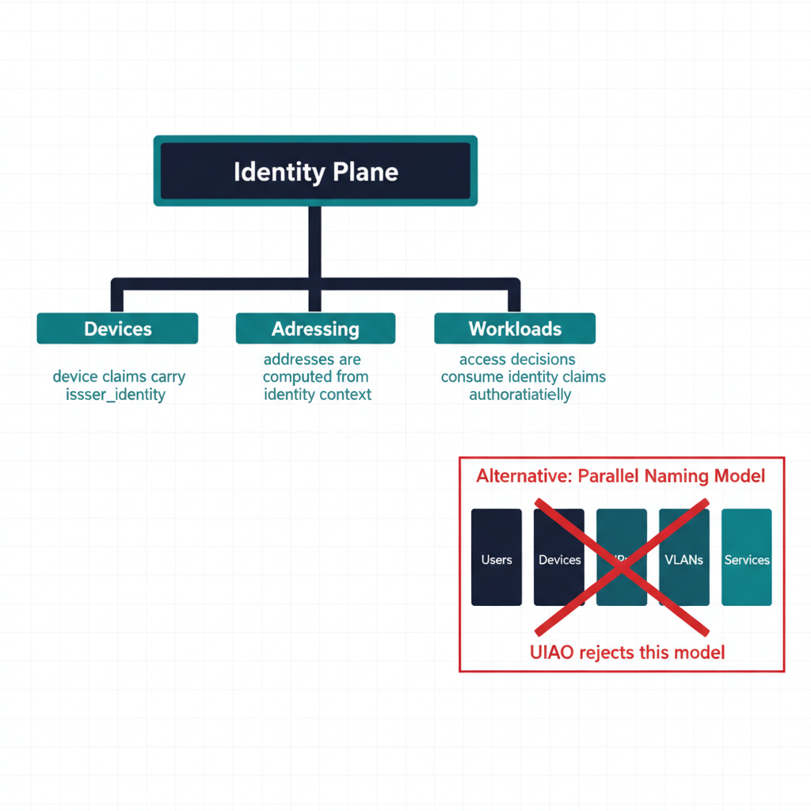
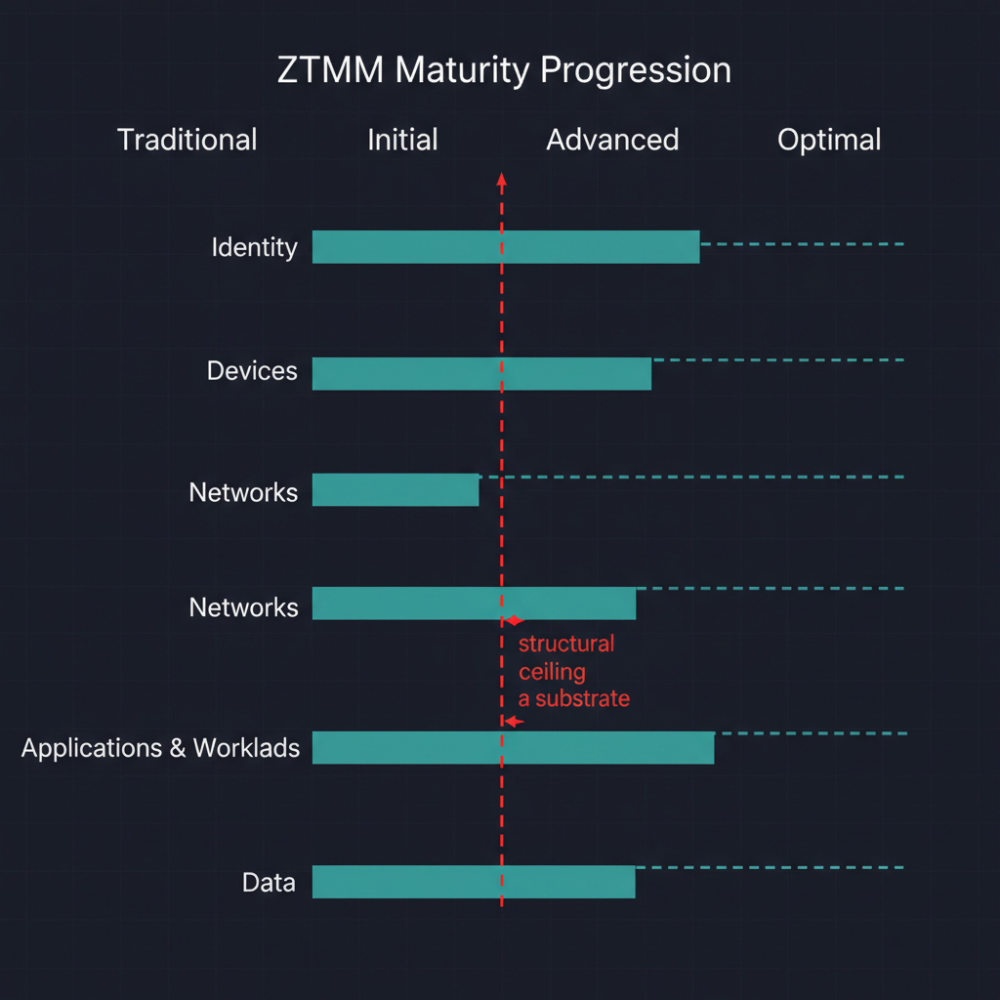
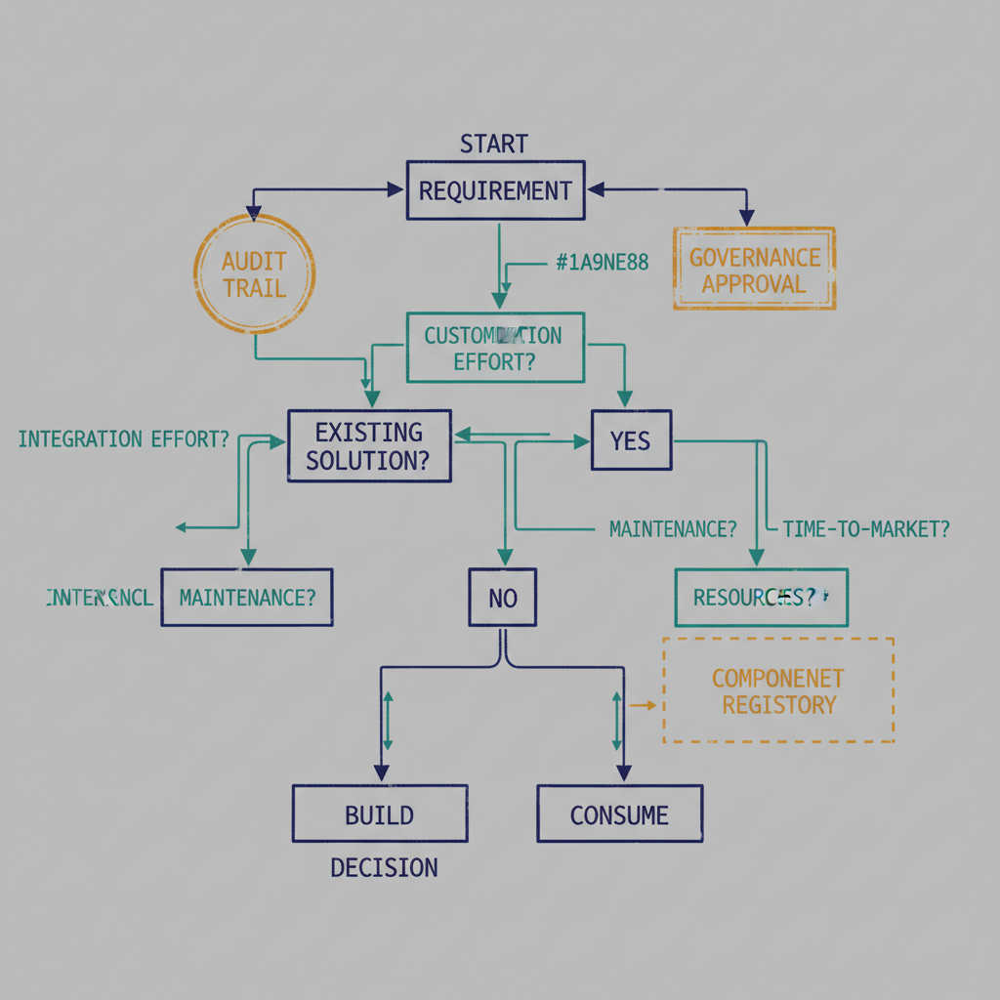

# Executive Summary

{#fig-aodim-executive-whitepaper-image-01 fig-alt="HR-to-access attribute flow pipeline. Engineering blueprint style, neutral slate background, federal navy (#1F3A5F) for primary structural elements, teal (#1A9E8F) for secondary/integration elements, amber (#D4A017) for governance/audit/registry overlays, monospace labels for identifiers, no human figures, 16:9 landscape." width="85%"}

{#fig-aodim-executive-whitepaper-image-02 fig-alt="OrgPath hierarchical decomposition. Engineering blueprint style, neutral slate background, federal navy (#1F3A5F) for primary structural elements, teal (#1A9E8F) for secondary/integration elements, amber (#D4A017) for governance/audit/registry overlays, monospace labels for identifiers, no human figures, 16:9 landscape." width="85%"}

{#fig-aodim-executive-whitepaper-image-03 fig-alt="Dynamic-group rule model (node/branch/functional). Engineering blueprint style, neutral slate background, federal navy (#1F3A5F) for primary structural elements, teal (#1A9E8F) for secondary/integration elements, amber (#D4A017) for governance/audit/registry overlays, monospace labels for identifiers, no human figures, 16:9 landscape." width="85%"}

{#fig-aodim-executive-whitepaper-image-04 fig-alt="Before-after access-decision comparison. Engineering blueprint style, neutral slate background, federal navy (#1F3A5F) for primary structural elements, teal (#1A9E8F) for secondary/integration elements, amber (#D4A017) for governance/audit/registry overlays, monospace labels for identifiers, no human figures, 16:9 landscape." width="85%"}

Enterprises transitioning to cloud identity platforms face a structural mismatch between dynamic organizational models and static access control systems. AODIM (Attribute-Oriented Directory & Identity Model) resolves this by making identity attributes the authoritative driver of access, policy, and governance.

This approach enables automated access alignment, reduces operational overhead, and strengthens security through continuous least privilege.

# Problem Statement

- Manual access management processes

- Inefficient handling of role changes (movers)

- Over-permissioning and access drift

- Audit and compliance complexity

- Misalignment between HR, IT, and Security

# Architecture Overview

HR System → Identity Attributes → Dynamic Groups → Access & Policy Enforcement

# Core Principle

Identity attributes define organizational structure; access is computed, not assigned.

# Attribute Model

- orgPath (hierarchical structure)

- orgCode (normalized identifier)

- department

- costCenter

- manager

Example: orgPath = CORP/US/EAST/BALTIMORE/IT

# Dynamic Group Model

- Node groups (exact match)

- Branch groups (hierarchical match)

- Functional groups (department/role)

Example Rules:

user.orgPath -startsWith \"CORP/US/EAST\"

user.orgPath -eq \"CORP/US/EAST/BALTIMORE/IT\"

# Delegation Model

Administrative Units and scoped roles replace traditional OU-based delegation.

# Operational Flow

1.  HR system updates user data

2.  Attributes are updated in identity platform

3.  Dynamic groups recalculate membership

4.  Access and policies update automatically

# Key Benefits

- Automatic access alignment

- Deterministic and explainable access

- Reduced operational overhead

- Continuous least privilege enforcement

- Improved audit readiness

# Risks and Mitigations

- Data quality issues → implement validation pipelines

- Group sprawl → enforce naming standards and lifecycle management

- Complexity → apply governance and documentation

- Delegation gaps → align administrative units with major org segments

# Strategic Impact

- Enables Zero Trust security models

- Aligns HR, IT, and Security operations

- Supports SaaS and cloud-native environments

- Transforms identity into a control plane

# Conclusion

AODIM transforms identity systems from static directories into dynamic, attribute-driven control planes. By aligning access with authoritative identity data, organizations achieve greater agility, security, and operational efficiency.
