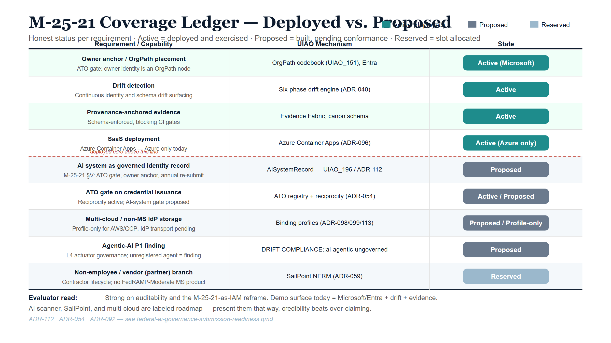
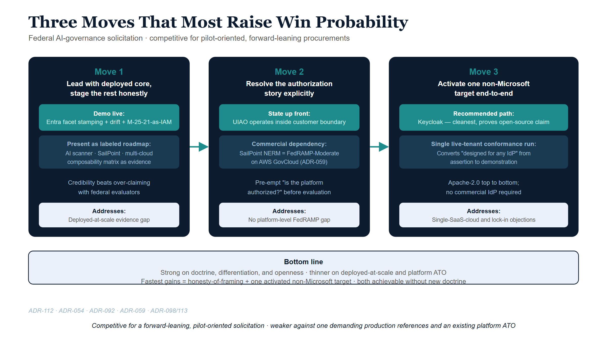

## Purpose

A candid read on how UIAO competes if submitted against a federal AI-governance
solicitation, grounded in what is actually in the repository today — not the
roadmap. It pairs the M-25-21 requirement coverage with an honesty ledger of
deployed vs. proposed, names the gaps a federal evaluator will find, and lists
the three moves that most raise win probability.

## What M-25-21 actually requires

Per [ADR-112](/docs/adr/adr-112-federal-ai-usecase-governance.html) and Book 21
Chapter 2:

1. **Seven minimum risk-management practices for high-impact AI**, set by
   **§4(b)**: pre-deployment testing; an AI impact assessment; ongoing
   monitoring; human training; human oversight and intervention; remedies and
   appeals; and public feedback. Independent review is a component *inside* the
   impact assessment, not an eighth practice. These were due **3 April 2026**.
2. **An AI use-case inventory to OMB, at least annually** — the machine-readable
   artifact this paper's mechanism reads.
3. **Compliance plans at 180 days and every two years thereafter, until 2036** —
   a second cadence, distinct from the inventory, and the one most often missed.
4. **A Chief AI Officer**, due within 60 days of the memo. Every M-25-21
   deadline has now passed.

**What M-25-21 does *not* impose is an AI-specific Authorization to Operate.**
It directs agencies to continue applying their existing authorization
requirements to AI systems. The inventory's `have_ato` field *reports* that
existing posture; it is not a gate the memo created. An earlier revision of this
brief read it as one and built the product differentiator on top of it — which
is the single most damaging thing a submission can do in front of an evaluator
who knows the memo, because it reads as inventing the test you pass.

::: {.callout-note}
## Companion memoranda this brief previously omitted
M-25-21 rescinded M-24-10. **M-25-22** governs how an agency *acquires* AI and
is the memo a contracting officer actually works from — directly relevant to a
solicitation response. **M-26-04** (11 December 2025) adds unbiased-AI
principles and self-sunsets on 11 December 2027.
:::

### The differentiator, re-based on something true

The wedge survives the correction and gets sharper. Read as **IAM obligations**,
`contact_email` is an owner anchor and `agency_bureau` is an OrgPath node — both
still hold. `have_ato` is not a credential-issuance gate *mandated by the memo*,
but it is an **external ATO enumeration source**: an inventoried deployed system
with `have_ato = No` is a drift finding against the agency's own authorization
policy, and one with a `system_name_ato` absent from the known ATO registry is a
reciprocity-lookup candidate (ADR-054). That claim is defensible because it
describes what UIAO does, not what the memo requires.

The stronger claim is one the invented gate was obscuring. **The inventory's six
`hi_*` fields cannot evidence all seven §4(b) practices** — human training and
public feedback have no inventory field at all. Any vendor whose story is
"we read the inventory" is structurally unable to close two of the seven. Naming
that gap, and saying which practices need evidence from outside the inventory,
is a more credible differentiator than claiming to satisfy a gate that does not
exist.

{#fig-federal-ai-diagram-01 fig-alt="Nine-row status ledger titled M-25-21 Coverage Ledger — Deployed vs. Proposed, columns Requirement/Capability, UIAO Mechanism, State. Four teal Active rows above a red dashed \"deployed core above this line\" divider: owner anchor / OrgPath placement (Active, Microsoft), drift detection via the six-phase drift engine (Active), provenance-anchored evidence (Active), and SaaS deployment — Azure Container Apps ADR-096 with AWS CDK ADR-117 (Active Azure / IaC landed AWS). Below the divider, grey rows: AI system as governed identity record — AISystemRecord UIAO_196 with the ai_inventory L1 scanner (Scanner built, ADR-112 Proposed); ATO enumeration and reciprocity reconciliation (Active / Proposed); multi-cloud / non-MS IdP storage via binding profiles (Proposed / Profile-only); agentic-AI P1 finding (Proposed); and an ice-blue Reserved row for the SailPoint NERM non-employee branch. Bottom evaluator note: demo surface today is Microsoft/Entra plus drift plus evidence; SailPoint and GCP/VMware bindings are roadmap; the AI scanner is built and awaits ADR-112 activation. White background, navy/teal/ice palette." width="100%"}

## Coverage ledger — deployed vs. proposed

| Requirement / capability | UIAO mechanism | State | Caveat |
|---|---|---|---|
| AI system as governed identity record | AISystemRecord (UIAO_196) | Spec drafted (Spec4-AI-D1.1); L1 scanner implemented (`src/uiao/governance/ai_inventory/`); ADR-112 still Proposed | Scanner is built but has nothing to gate yet — ADR-112 activation is the remaining step |
| ATO enumeration + reciprocity reconciliation | ATO registry + reciprocity (ADR-054), reading the inventory's `have_ato` / `system_name_ato` | Active (reciprocity) / Proposed (AI reconciliation) | Reciprocity is live in production; the AI-inventory reconciliation on top of it is not yet wired. This is enumeration against **agency** authorization policy — M-25-21 mandates no AI-specific ATO gate |
| Agentic-AI P1 finding | `DRIFT-COMPLIANCE::ai-agentic-ungoverned` | Proposed | Doctrine only — no detector implementation yet |
| Owner anchor / OrgPath placement | OrgPath codebook (UIAO_151), Entra | **Active (Microsoft estate)** | Proven inside the Microsoft/Entra estate only |
| Drift detection | Six-phase drift engine (ADR-040) | **Active** | — |
| Non-employee / vendor (partner) branch | SailPoint NERM (ADR-059) | Reserved | Pre-activation; no live tenant exercises this branch yet |
| Multi-cloud / non-MS IdP storage | Binding profiles (ADR-098/099/113) | Proposed (IdP) / Profile-only (GCP, VMware) | Design-level profiles only; no non-Microsoft IdP has been run end to end |
| Provenance-anchored evidence | Evidence Fabric, schema-enforced canon | **Active** | — |
| SaaS deployment | Azure Container Apps (ADR-096); AWS CDK (ADR-117 — ECS Fargate + ALB + RDS + S3) | **Active (Azure)** / IaC landed (AWS) | Azure has operational tenant history; the AWS surface has none yet, and there is no GCP IaC — UIAO reaches non-Azure clouds as an API client, not yet as a proven host |

The compliance series holds the same object from the registry side: the
agency AI use-case inventory is a designated SSOT object class with a full
joiner/mover/leaver lifecycle in the
[Federal Organization Compliance series' SSOT Registry (Vol 0 Book 00)](../orgcomp-series/Vol_0_Book_00_OrgComp_Executive_Summary.qmd).

## Where we are strong

- **The reframe is genuinely novel.** "M-25-21 obligations are IAM obligations,
  and agentic AI is an L4 actuator" is a sharper, more operational story than
  the inventory dashboards most vendors ship.
- **Auditability is real and mechanized.** Provenance-anchored, schema-enforced,
  drift-detected canon with blocking CI gates is exactly what federal evaluators
  weight — and it is *deployed*, not aspirational.
- **Open and lock-in-resistant.** Apache-2.0 substrate, an open-source IdP path
  (Keycloak + generic LDAP), and a vendor-neutral facet model blunt the
  single-vendor-dependency objection.

## Where an evaluator will find gaps

- **The demo surface today is essentially Microsoft/Entra + read-only
  assessment + drift.** The coverage ledger's Caveat column marks exactly
  which rows are proposed, reserved, or pre-activation — that column is the
  gap map, not a separate list.
- **No platform-level FedRAMP authorization of UIAO itself.** UIAO rides inside
  customer boundaries / GCC-Moderate; SailPoint NERM carries its own ATO on AWS
  GovCloud as a named carve-out. A solicitation requiring the *platform* to be
  FedRAMP-authorized exposes a gap.
- **The agentic-AI P1 finding (`DRIFT-COMPLIANCE::ai-agentic-ungoverned`,
  above) is doctrine-only.** The
  [Federal AI Identity Governance operational
  guide](../operational-guides/ai-identity-governance/index.qmd) is the kit
  that will operationalize it; it is proposed, not yet deployed.

{#fig-federal-ai-diagram-02 fig-alt="Three dark-navy columns labeled Move 1, Move 2, Move 3 with teal headers and teal action boxes. Move 1: Lead with deployed core, stage the rest honestly - demo live Entra facet stamping plus drift plus M-25-21-as-IAM. Move 2: Resolve the authorization story explicitly - state UIAO operates inside customer boundary, SailPoint NERM FedRAMP-Moderate on AWS GovCloud. Move 3: Activate one non-Microsoft target end-to-end - Keycloak recommended path. Bottom ice-blue bar summarizes bottom line. White background, navy/teal/ice palette." width="100%"}

## The three moves that most raise win probability

1. **Lead with the deployed core, stage the rest honestly.** Demo Entra facet
   stamping + drift + the M-25-21-as-IAM reframe live; present AI scanner /
   SailPoint / multi-cloud as a labeled roadmap with the composability matrix.
   Credibility beats over-claiming with federal evaluators.
2. **Resolve the authorization story explicitly.** State the ATO-inheritance
   posture up front: UIAO operates inside the customer's existing boundary, and
   the one commercial dependency (SailPoint NERM) is itself FedRAMP-Moderate.
   Pre-empt the "is the platform authorized" question rather than letting it
   surface in evaluation.
3. **Activate one non-Microsoft target end-to-end.** A single live-tenant
   conformance run (Keycloak is the cleanest, and proves the open-source claim)
   converts "designed for any IdP" from assertion to demonstration.

## Bottom line

Strong on doctrine, differentiation, and openness; thinner on deployed-at-scale
evidence and platform-level authorization. **Competitive for a forward-leaning,
pilot-oriented solicitation; weaker against one demanding production references
and an existing platform ATO.** The fastest gains are honesty-of-framing plus
one activated non-Microsoft target — both achievable without new doctrine.

## References

- [ADR-112 — Federal AI Use Case Governance](/docs/adr/adr-112-federal-ai-usecase-governance.html)
- [ADR-054 — Single-ATO Reciprocity](/docs/adr/adr-054-single-ato-reciprocity.html)
- [ADR-092 — Active Governance](/docs/adr/adr-092-active-governance.html)
- [Choose Your Partners — The OrgPath Composability Matrix](orgpath-composability-matrix.qmd)
- [OrgComp Vol I Book 03 — Machine and Workload Identity](../orgcomp-series/Vol_I_Book_03_OrgComp_Certificates_Tokens_Cryptographic_Identity.qmd)
- [Book 21 — OrgPath and Federal AI Governance](../orgpath-narrative/Book_21.qmd)
