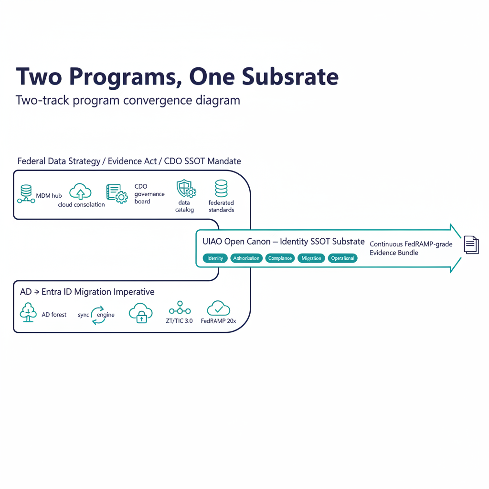

# Federal SSOT Alignment

## How the open UIAO canon governs the identity layer beneath federal data governance mandates

### Executive summary

Federal civilian agencies have been mandated — through the Evidence Act, the
Federal Data Strategy, and OMB CDO directives — to eliminate data sprawl,
designate authoritative systems of record, and enforce Single Source of Truth
(SSOT) across fragmented operational environments. At the same time, those
same agencies face a migration imperative: retiring on-premises Active
Directory infrastructure in favor of Microsoft Entra ID, while remaining
coherent with Zero Trust, TIC 3.0, NIST 800-63, and FedRAMP 20x.

These two mandates are almost universally treated as separate programs. They
should not be.

UIAO is an open, FedRAMP-Moderate-focused governance substrate that addresses
both — treating the identity namespace as the root of the SSOT hierarchy, and
the AD → Entra ID migration as a governance event rather than a technical
transition. UIAO does not displace Microsoft Entra ID, Microsoft Purview,
Microsoft Fabric, Microsoft Defender, or Microsoft Sentinel. It is the open
canon that describes how those capabilities compose, at the identity layer,
into a substrate that survives an audit and survives the migration boundary
the entire Azure SSOT stack is built on.

The Azure SSOT stack alignment — UIAO's positioning beneath Microsoft Purview
and OneLake — is developed in its own chapter
([07a — UIAO Beneath the Azure SSOT Stack](../orgpath-narrative/07a-uiao-beneath-the-azure-ssot-stack.qmd))
of the OrgPath Narrative series. This whitepaper establishes the federal
mandate alignment that makes that chapter necessary.

{#fig-federal-ssot-alignment-image-01 fig-alt="Two-track program convergence diagram. Left track is a horizontal lane labeled \"Federal Data Strategy / Evidence Act / CDO SSOT Mandate\" with five inline icons (MDM hub, cloud consolidation, data catalog, CDO governance board, federated standards). Right track is a parallel horizontal lane labeled \"AD → Entra ID Migration Imperative\" with five inline icons (AD forest, sync engine, Entra ID, ZT/TIC 3.0, FedRAMP 20x). The two lanes start separate on the left, then bend inward and converge at center into a single thick horizontal band labeled \"UIAO Open Canon — Identity SSOT Substrate\" carrying the six control planes (Identity, Authorization, Compliance, Migration, Evidence, Operational) as small inline pill icons. To the right of the convergence, a single output arrow labeled \"Continuous FedRAMP-grade Evidence Bundle\" exits to a small documents-stack icon. Title above: \"Two Programs, One Substrate\". Clean engineering blueprint style, dark navy (#0D1B2E) and teal (#1E8C8C) on white background. No photographs, purely diagrammatic." width="85%"}

---

### 1. The federal SSOT problem — what agencies already know

Federal data governance guidance is explicit: silos, regional office sprawl,
and overlapping SQL Server instances undermine mission effectiveness. The
recommended counter-measures are well-established:

- Master Data Management (MDM) to define "golden records" and authoritative
  sources
- Cloud consolidation (Azure Government, AWS GovCloud) to eliminate redundant
  on-premises copies
- Data catalogs and lineage tools to enforce visibility and provenance
- Chief Data Officers and Data Governance Boards to assign ownership and
  accountability
- Federated governance models that balance central control with operational
  autonomy

These are the right mechanisms. The gap is that none of them are designed for
the identity layer — and identity is not just another data domain. Identity
is the *namespace* from which all other enterprise data is governed: who owns
a record, who can modify it, who last changed it, and whether the current
state of that record is trusted.

When the identity infrastructure is in transition — as it is in every AD →
Entra ID migration — the SSOT frameworks built on top of it are structurally
at risk. Agency CDO offices have inherited a data governance mandate that
assumes the identity layer is stable. The identity layer is not stable. It is
moving.

---

### 2. Why AD → Entra ID is a governance event, not a migration

A conventional AD → Entra ID migration project moves users. A governance-aware
migration moves the *entire identity namespace* — and every dependency
attached to it.

| Domain | AD artifact | Migration risk |
|---|---|---|
| Identity | User accounts, SPNs, service accounts | Orphaned accounts, broken dependencies |
| Network | DNS, DHCP, DFS namespaces | Namespace drift, split-horizon DNS |
| Security | PKI, RADIUS/NPS, certificate templates | Broken authentication chains |
| Policy | GPOs, conditional access equivalents | Policy gap between AD and Entra ID |
| Applications | LDAP-dependent apps, legacy SSO | Silent auth failures |
| Devices | Domain-joined endpoints, SCCM/Intune hybrid | Device trust drift |

Conventional migration engagements manage this complexity manually. The
reason is structural: there is no shared, tamper-evident record of the
pre-migration state, the migration events, or the post-migration compliance
posture that survives the engagement. Each engagement starts from scratch.
Findings are not reusable. Evidence for FedRAMP continuity is assembled
retrospectively.

This is exactly the class of SSOT failure that federal data governance
programs exist to prevent — applied to the one domain those programs have
historically excluded: directory and identity infrastructure.

UIAO's
[`ad-dependency-inventory.md`](../../../src/uiao/modernization/directory-migration/ad-dependency-inventory.md)
enumerates eleven AD object types that must be governed through the migration
event, each with a named adapter contract in
[`migration-adapter-registry.yaml`](../../../src/uiao/modernization/directory-migration/migration-adapter-registry.yaml).
The inventory exists as canon so that successive engagements consume it
rather than rediscover it.

---

### 3. UIAO architecture: SSOT enforcement as a canon property

UIAO treats the identity namespace as a governance substrate, not a migration
target. Its core architectural mechanisms map directly to the federal SSOT
mechanisms described in agency data governance frameworks.

{#fig-federal-ssot-alignment-image-02 fig-alt="Two vertical columns side-by-side under a shared header bar \"Federal SSOT Mechanism ↔ UIAO Canon Capability\". Left column header \"Federal Mandate / Mechanism\", with five stacked rows reading top-to-bottom: \"MDM Golden Records\", \"Data Lineage & Provenance\", \"Redundancy & Conflict Audit\", \"Federated Governance\", \"Layer-on-Legacy (no rip-and-replace)\". Right column header \"UIAO Canon Mechanism\", with the parallel five rows: \"COR Schema (UIAO_007 + OrgPath)\", \"Immutable Provenance Chain → Evidence Bundle\", \"Drift Engine — 5 DRIFT classes (P1–P4)\", \"Six Control Planes (federated, central-standards)\", \"Eight Adapter Interfaces (IPAM, PKI, RADIUS, LDAP-proxy, sync-engine, device-mgmt, NTP, DFS)\". Each pair connected by a teal horizontal bridge bar with a small bidirectional arrow icon at center. Below the columns, a thin footer band labeled \"Each mapping is mechanical, not aspirational — every row anchors to a named canon artifact\". Clean engineering blueprint style, dark navy (#0D1B2E) and teal (#1E8C8C) on white background. No photographs, purely diagrammatic." width="85%"}

#### 3.1 COR schema → golden record / MDM hub

UIAO's Canonical Object Record (COR) schema functions as the identity MDM
hub. Every principal — user, service account, device, group — has a single
authoritative representation. Downstream systems reference or synchronize to
the COR; they do not maintain independent copies. This mirrors the federal
MDM pattern exactly: a central hub with governed pipelines, not duplicated
instances.

The OrgTree registry and the OrgPath extension attribute documented in
[`UIAO_007`](../../../src/uiao/canon/UIAO_007_OrgTree_Modernization_AD_to_EntraID_v1.0.md)
are the canonical form of this hub for the user and device planes. The
[OrgPath Narrative](../orgpath-narrative/index.qmd) develops the substrate
end-to-end across every Microsoft surface that consumes the attribute.

#### 3.2 Provenance chain → data lineage and audit

Every change to a COR entry is recorded in an immutable provenance chain —
who made the change, from what source, at what time, under which policy
authority. This is the identity-layer equivalent of data catalog lineage
tools, but embedded natively in the substrate rather than bolted on
externally.

For FedRAMP Moderate environments, the provenance chain is the Evidence
Bundle: a continuous, tamper-evident audit trail that survives the migration
boundary. The substrate manifest at
[`src/uiao/canon/substrate-manifest.yaml`](../../../src/uiao/canon/substrate-manifest.yaml)
declares the modules whose changes feed it.

#### 3.3 Drift Engine → automated redundancy and conflict detection

The UIAO drift taxonomy, formalized in
[`16_DriftDetectionStandard`](../../docs/16_DriftDetectionStandard.qmd),
defines five drift classes — `DRIFT-SCHEMA`, `DRIFT-SEMANTIC`,
`DRIFT-PROVENANCE`, `DRIFT-AUTHZ`, and `DRIFT-IDENTITY` — each with severity
classification (P1–P4) and a remediation contract. `DRIFT-IDENTITY` and
`DRIFT-AUTHZ` flag the conditions that compromise identity SSOT in
real time:

- Service accounts that exist in AD but have no COR representation (shadow
  principals)
- Entra ID objects that diverge from their migrated COR baseline
  (post-migration drift)
- Authorization policies in Entra Conditional Access that conflict with the
  NIST 800-63 AAL requirements encoded in the COR

This is the automated equivalent of the federal mandate to "regularly audit
for redundancy" — applied in real time to the identity layer, with the
drift class and severity carried as schema rather than narrative.

#### 3.4 Six control planes → federated governance with central standards

UIAO's six control planes implement a federated governance model — the same
architecture federal agencies prefer for balancing enterprise-wide standards
with operational autonomy.

| UIAO control plane | Federal governance equivalent |
|---|---|
| Identity Plane | CDO-designated identity SSOT |
| Authorization Plane | Data access policy standards |
| Compliance Plane | FedRAMP / NIST continuous monitoring |
| Migration Plane | Transition governance and rollback authority |
| Evidence Plane | Audit, lineage, and reporting |
| Operational Plane | Regional / silo operational continuity |

Each control plane is governed independently but references the same
COR-based SSOT. This is the "hybrid governance" model: centralized standards,
federated execution.

#### 3.5 No rip-and-replace — legacy infrastructure stays operational

UIAO does not require agencies to eliminate existing operational directory
instances. AD domain controllers, LDAP-dependent applications, and regional
authentication infrastructure can remain operational during and after
migration. UIAO layers governance *on top* — exactly as federal guidance
recommends layering MDM and cloud consolidation on top of legacy SQL
instances rather than replacing them wholesale. The eight adapter interfaces
under
[`src/uiao/modernization/directory-migration/adapters/`](../../../src/uiao/modernization/directory-migration/adapters/)
(IPAM, PKI, RADIUS, LDAP-proxy, sync-engine, device-management, NTP, DFS)
are the explicit governance surface for the legacy infrastructure that
stays.

---

### 4. The M365 GCC Moderate compliance boundary problem

{#fig-federal-ssot-alignment-image-03 fig-alt="GCC-Moderate compliance-boundary triangle diagram. At the center, a labeled box \"M365 GCC Moderate tenant (runs on Azure Commercial infrastructure)\". Three vertices of an outer triangle each labeled with a mandate and its conflict point: top vertex \"TIC 3.0 — CASB inspection requirement\" with a red dashed arrow into the center labeled \"telemetry bypasses inspection point\"; lower-left vertex \"CISA ZTMM — verified device posture\" with a red dashed arrow labeled \"hybrid-joined posture-signal fidelity reduced\"; lower-right vertex \"FedRAMP 20x — clean continuous-monitoring boundary\" with a red dashed arrow labeled \"boundary not clean for all data categories\". Around the bottom of the triangle, a teal arc labeled \"UIAO Compliance Plane — surfaces each conflict as a finding with documented compensating control, not an ATO comment\". Title above: \"The Three-Way GCC-Moderate Boundary Problem\". Red (#C74040) for the three conflict arrows; clean engineering blueprint style, dark navy (#0D1B2E) and teal (#1E8C8C) on white background. No photographs, purely diagrammatic." width="85%"}

There is a structural compliance problem that the open UIAO canon is
positioned to make explicit, and that is significantly underdocumented in
federal architecture guidance.

M365 GCC Moderate runs on Azure Commercial infrastructure. This means:

- Telemetry and diagnostic data flow to Azure Commercial endpoints
- Microsoft Entra ID tenant control planes are shared with non-GovCloud
  tenants
- Location services required by TIC 3.0 CASB enforcement are not available
  at the GCC Moderate boundary

This creates a three-way compliance conflict:

1. **TIC 3.0** requires CASB inspection of all cloud service traffic — but
   GCC Moderate telemetry bypasses the inspection point
2. **CISA Zero Trust Maturity Model** requires verified device posture — but
   hybrid-joined devices in a GCC Moderate tenant have reduced posture signal
   fidelity
3. **FedRAMP 20x** continuous monitoring requirements assume a clean cloud
   boundary — which GCC Moderate does not provide for all data categories

Agencies migrating from AD to Entra ID into a GCC Moderate tenant are
structurally inheriting this boundary without a clear compliance remediation
path. The canon GCC Moderate boundary model at
[`B1-gcc-moderate-boundary-model`](../compliance/boundary-authorization/B1-gcc-moderate-boundary-model.qmd)
documents the structural shape. UIAO's Compliance Control Plane is the
substrate where these boundary conditions are surfaced as compliance findings
with documented compensating controls, rather than left as ATO comments
discovered during 3PAO review.

The boundary problem is precisely the kind of finding that vendor
documentation cannot honestly surface and that customer-side compliance teams
need an open framework to articulate.

---

### 5. Alignment to federal mandates

The substrate's alignment is mechanical, not aspirational. Each federal
mandate maps to a specific UIAO capability that exists in canon.

| Federal mandate | UIAO capability | Canon anchor |
|---|---|---|
| Evidence Act — Data Asset Inventories | COR schema as authoritative identity inventory | `UIAO_007`, `substrate-manifest.yaml` |
| Federal Data Strategy — SSOT Designation | Identity namespace as root SSOT; no parallel copies | OrgPath Narrative §1–4 |
| CDO Data Governance Board requirements | Six control planes with ownership and accountability assignments | `substrate-manifest.yaml` |
| DAMA-DMBOK — Quality, Lineage, Metadata | Provenance Chain + COR schema metadata layer | `16_DriftDetectionStandard` §4 |
| Zero Trust Executive Order | Continuous identity verification via drift taxonomy | `16_DriftDetectionStandard` §2 |
| FedRAMP Moderate Continuous Monitoring | Evidence Bundle schema, tamper-evident audit trail | `substrate-manifest.yaml`, OSCAL exports |
| TIC 3.0 | Compliance Plane models GCC boundary constraints | `B1-gcc-moderate-boundary-model` |
| NIST 800-63 AAL requirements | COR schema encodes authenticator assurance levels per principal | `UIAO_007`, `DRIFT-IDENTITY` |

---

### 6. The shape of the current engagement model

Federal AD → Entra ID migration today follows a recognizable shape regardless
of which system integrator delivers the work:

1. Manual discovery of the AD environment
2. Migration runbooks specific to that engagement
3. Execution with point-in-time tooling (ADMT, Microsoft Identity Manager,
   Entra Connect)
4. Hand-off documentation that describes what was done — not a living,
   governed, auditable record of the current state

The result is that every re-engagement starts from scratch. Drift is
invisible until it becomes an incident. FedRAMP evidence is assembled
retrospectively. The SSOT exists in a project binder, not a governed system.

The open UIAO canon makes explicit what current engagements do tacitly, and
produces FedRAMP-grade evidence as a byproduct of normal operations rather
than as a deliverable assembled at the end. The canon is freely available;
its value to a system integrator engagement is that the engagement consumes
existing canon rather than rebuilding it, and the evidence that survives the
engagement is structured for the next FedRAMP cycle.

---

### 7. Implementation posture: phased, no rip-and-replace

Consistent with federal data governance practice (assess → design → pilot →
scale → optimize), UIAO deployments follow a phased posture:

1. **Assess** — COR schema populated from existing AD; drift taxonomy
   establishes the pre-migration baseline
2. **Govern** — Control planes activated; SSOT designations encoded;
   Evidence Bundle begins accumulating
3. **Migrate** — Identity objects migrated under governance; provenance
   chain records every transition event
4. **Validate** — Post-migration drift detection confirms Entra ID state
   matches the COR baseline
5. **Operate** — Continuous monitoring; adapter interfaces for IPAM, PKI,
   RADIUS, LDAP-proxy, DFS remain connected

At no phase is the existing operational environment disrupted before
governance is in place. This is the federal "think big, start small"
principle applied to identity infrastructure.

---

### Conclusion

Federal agencies are not lacking for governance frameworks, CDO mandates, or
modernization directives. What they lack is an open framework that applies
those frameworks to the identity layer — the one domain that underlies every
other data governance decision — and does so in a way that survives the AD →
Entra ID transition with a continuous, tamper-evident, FedRAMP-grade SSOT.

UIAO is that framework. It is not a migration tool that adds governance
features. It is an open governance substrate that describes how migrations
are executed as governed events, and how the identity foundation of the Azure
SSOT stack is continuously verified once that migration is complete. The
canon is the deliverable; the implementation references are reference
implementations that adopters extend, fork, or replace as their environments
require.

For the explicit alignment between this canon and the Microsoft Fabric +
OneLake + Purview Azure SSOT stack — including the Fabric Domain bridge that
extends OrgPath into the data plane — see
[Chapter 07a of the OrgPath Narrative](../orgpath-narrative/07a-uiao-beneath-the-azure-ssot-stack.qmd).
